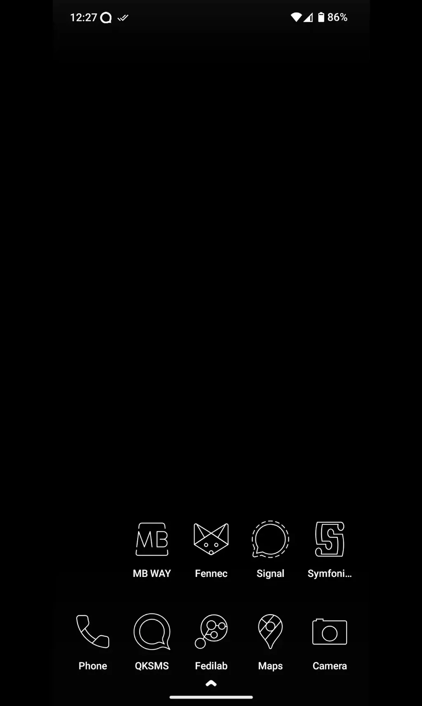

# Divination 3

[Présentation du projet…](https://tcrouzet.com/2025/03/20/mythologies-de-poche/)

Je prends conscience que je suis très laxiste avec mon téléphone, un peu comme avec ma voiture, je n’en prends pas soin, même si je l’utilise à longueur de journée (le téléphone — la voiture, c’est beaucoup moins souvent). Mon degré de personnalisation est quasi nul, et je suis surpris de voir combien les autres utilisent leurs écrans presque comme des tatouages (confidence : je ne suis pas tatoué).

Là, j’ai affaire à un lusophone mélomane. Je suppose qu’il a choisi des icônes blanches sur fond noir non par souci esthétique mais pour économie sa batterie. Sur les écrans de nouvelle génération, les pixels éteints ne consomment presque rien, de quoi économiser de 15 % à 60 % d’énergie.

Le choix des applications, souvent alternatives, connectées au Fediverse, tout comme le degré de personnalisation de l’interface, suggèrent un geek confirmé, soucieux de protéger sa vie privée des ingérences des GAFAM, mais pragmatique puisqu’il conserve Google Map.

Reste ce noir, intrigant, renforcé par les traits blancs des icônes. Est-il le miroir d’une âme sombre ou d’un caractère rigoureux, épris de précision et d’efficacité ? Je penche pour la seconde hypothèse. Je vois quelqu’un de déterminé, de strict, qui cherche à réduire les distractions, peut-être parce qu’il risquerait d’y succomber. Pour lui, tout est une affaire d’équilibre. Il a pris le temps de façonner son environnement numérique comme d’autres arrangent leur intérieur, et peut-être que chez lui règne le plus grand bazar. Je n’en serais pas surpris.

*PS : pas encore de réponse…*

#divination #ecriture #y2025 #2025-3-25-13h00
