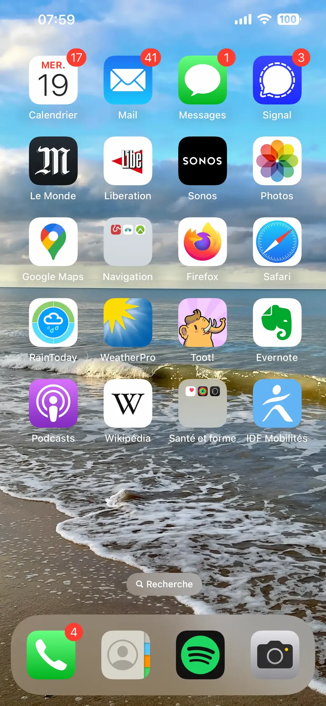

# Divination 4

[Présentation du projet…](https://tcrouzet.com/2025/03/20/mythologies-de-poche/)

« Il est presque 8h et une journée chargée s’annonce. Je me suis levée tard, j’ai pas encore lu mes mails, ni répondu à un SMS, ni écouté mes messages téléphoniques, ni consulté ma messagerie cryptée. Quel stress ! Mais quel pied d’écouter de la musique chez moi en surround 4D, comme si j’étais enveloppée par les notes, transportée au cœur du concert ! Ça me donne la pêche pour la suite de la journée. »

Ou peut-être qu’elle s’en fiche, qu’elle se moque des sollicitations, qu’elle s’abstrait avec stoïcisme des injonctions du temps réel. Pourtant toutes ces pastilles rouges sur l’écran sont alarmantes. Si elle s’en moquait, elle aurait désactivé les alertes. Ou elle n’est pas assez techos pour ça (sinon elle ne chargerait pas sa batterie à 100 %, ce qui réduit son espérance de vie). Elle s’en fiche un peu de son tel, on le lui change tous les ans. Puis le configurer dépasse ses forces. Déjà pas mal d’avoir mis en fond d’écran une image de vacances pour oublier la grisaille parisienne. Un peu de lumière, un peu d’horizon.

Avant de partir bosser, elle consulte la météo, car elle se déplace à vélo plutôt qu’à métro quand il ne pleut pas. C’est aussi une façon de se tenir en forme et de se détendre. Elle aime pédaler. Dès qu’elle trouve le temps, elle part pour de longues balades. Pas aussi souvent qu’elle le voudrait : l’actualité l’absorbe. Mais elle ne se laisse pas prendre par les fakenews : elle vérifie les faits, elle compare les sources et les points de vue. Elle veut savoir, creuser les sujets. Ne pas subir. Alors elle note tout pour y voir clair, plus tard, quand elle se posera. Mais pas tout de suite, tout va s’accélérer jusqu’à tard le soir. 

*PS : « Non, je ne suis pas une femme, mais je vois assez bien ma@part de féminité. J’ai besoin de zénitude, d’où le fond d’écran, là où vit ma famille. De ce fait, j’ai désactivé presque toutes les notifications. Et le peu qui reste passe par ma montre et je ne les remarque pas. J’ai supprimé les applis peu utilisées sur la page d’accueil, aussi pour réduire le « clutter », le bazar, l’envie de choper le téléphone à chaque occasion. L’iPhone est un modèle 13, donc dans sa cinquième année. Niveau applis, de quoi me retrouver dans la ville quand je vais à mes rendez-vous à vélo, écouter de la musique, des podcasts, Masto, de l’actualité (sans notifs). Et Wikipedia, forcément ! La batterie se charge à 100 % juste avant mon réveil. J’y fais attention, elle est d’origine. J’essaye de prendre de la distance avec mon téléphone, de limiter la dépendance. Ça marche bien sauf quand tu me demandes une réponse ! Sauf que le clown orange m’a poussé à la rechute dans ma conso de news. »* 

#divination #ecriture #y2025 #2025-3-26-10h00
