# Février 2025

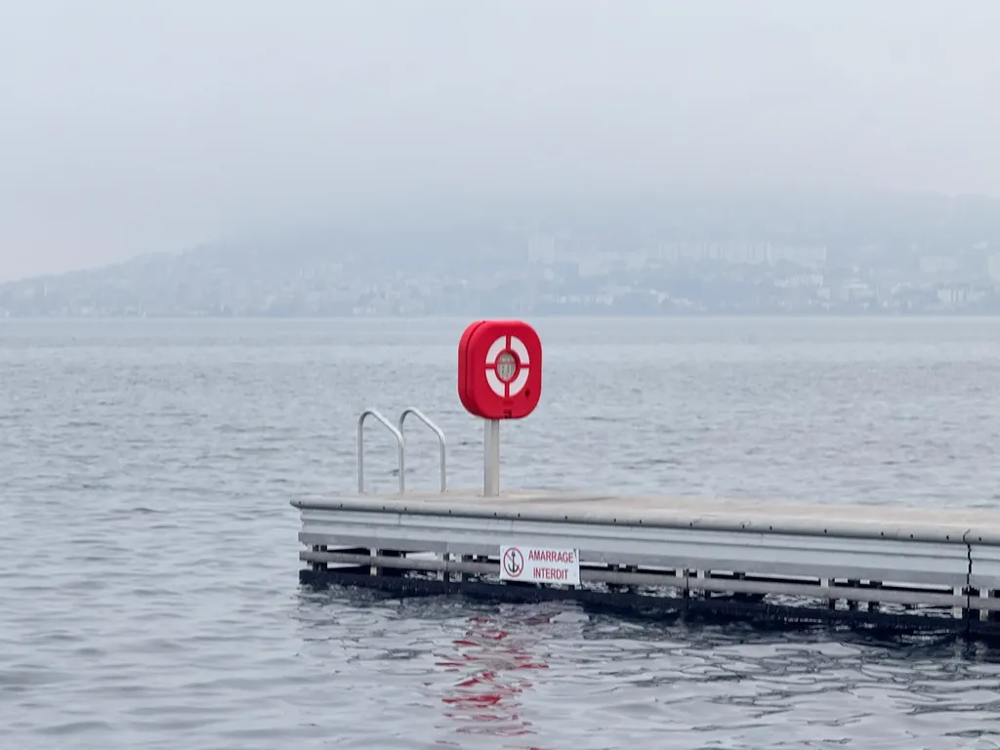

### Samedi 1er

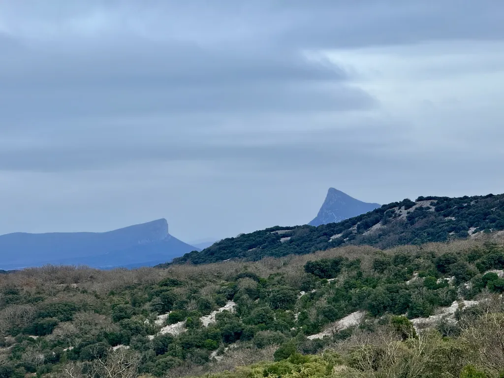

### Dimanche 2, Balaruc

[Microsoft Word est plus complexe en termes de quantité d’information de son code qu’un humain.](https://malmesbury.substack.com/p/mechanisms-too-simple-for-humans) En comparaison, Obsidian est quatre fois moins lourd que Word, voilà pourquoi il est plus fluide, plus optimisé, et pourquoi je le préfère, sans pour autant utiliser [Vim](https://www.vim.org/) qui est presque dix fois plus léger qu’Obsidian.

### Lundi 3, Balaruc

Un peu à cause de Barthes, parce qu’il serait temps, je commence à lire *La Divine Comédie*, c’est un de ces livres dont j’ai tant entendu parler que c’est comme si je l’avais lu, sauf que je n’avais lu que des citations. J’ai choisi la traduction de Danièle Robert, Actes Sud 2021, parce qu’elle est sans doute une des plus récentes.

>Étant à mi-chemin de notre vie,
je me trouvai dans une forêt obscure,
la route droite ayant été gauchie.

Très beau, mais les sonorités en « a » de l’italien ayant été perdues, à quoi bon leur substituer des rimes françaises ? Je me pose toujours cette question quand il s’agit de traduire de la poésie.

>Nel mezzo del cammin di nostra vita,
mi ritrovai per una selva oscura
ché la diritta via era smarrita.

Je comprends mal l’italien, mais assez pour voir que l’essentiel poétique a été perdu. Alors pourquoi tordre le français dans le second tercet ?

>Ah ! combien en parler est chose dure,
de cette forêt rude et âpre et drue
qui à nouveau un effroi me procure !

J’ai vraiment du mal, et plus j’avance, plus ces contorsions m’irritent. « Ah ! Combien il est dur de parler de cette forêt rude et âpre et drue. À nouveau ça me procure de l’effroi ! » Voilà ce que je fais dans ma tête pour tout remettre en ordre. Combien de lecteurs ont encore cette patience ? Plus j’avance dans les chants, plus je souffre.

J’ai demandé à Claude de retraduire le premier tercet.

>Au milieu du chemin de notre vie,  
je me retrouvai dans une forêt obscure,  
car la voie droite était perdue.

Ensuite, je lui ai demandé d’écrire sans respecter la rime pour un lecteur contemporain.

>À mi-parcours de ma vie,  
je me suis retrouvé dans une forêt sombre, 
ayant perdu le droit chemin.

Franchement, tout y est, même le contraste entre « se perdre » et « droit chemin », ce qui a priori est impossible puisqu’on ne se perd pas sur un droit chemin, sauf quand il nous pousse à tourner en rond dans notre vie, et c’est le sujet de *La Divine Comédie*.

Voici le deuxième tercet en Italien :

>Ahi quanto a dir qual era è cosa dura
esta selva selvaggia e aspra e forte
che nel pensier rinova la paura!

Traduction moderne de Claude :

>Ah, comme il est difficile de dire ce qu’était
cette forêt sauvage, impénétrable et hostile,
qui réveille la peur rien que d’y repenser !

En prose : « C’est une tâche difficile de décrire cette forêt — sauvage, impénétrable et hostile. Son souvenir réveille encore la terreur. » Envie de tout réécrire.

La traduction [Lamennais](https://fr.wikisource.org/wiki/La_Divine_Com%C3%A9die_(trad._Lamennais)/L%E2%80%99Enfer/Chant_I) (1910) :

>Au milieu du chemin de notre vie, ayant quitté le chemin droit, je me trouvai dans une forêt obscure (l’idée centrale de perdre le droit chemin a disparu, ce qui est problématique). Ah ! qu’il serait dur de dire combien cette forêt était sauvage, épaisse et âpre, la pensée seule en renouvelle la peur, elle était si amère, que guère plus ne l’est la mort ; mais pour parler du bien que j’y trouvai, je dirai les autres choses qui m’y apparurent.

---

Depuis que je publie mes textes en Gemini, des lecteurs les lisent dans leur terminal, et alors ils se trouvent quasiment face à la même interface que quand j’écris. C’est comme si nous étions très proches les uns des autres, face au même objet, sans intermédiation. C’est comme si je leur envoyais des lettres manuscrites, même mieux parce qu’ils peuvent répondre sur le même papier avec le même stylo. Il ne peut pas exister de numérique plus intime.

---

*Rush* ne me lâche pas. Je viens d’ouvrir le ventre du manuscrit. 

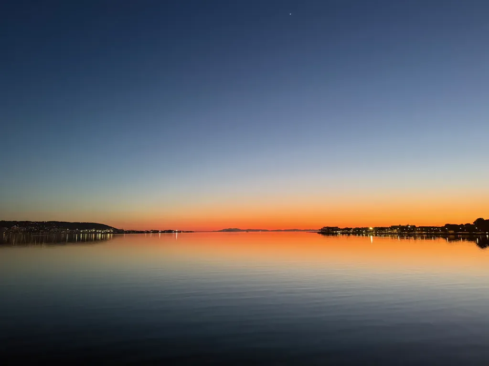

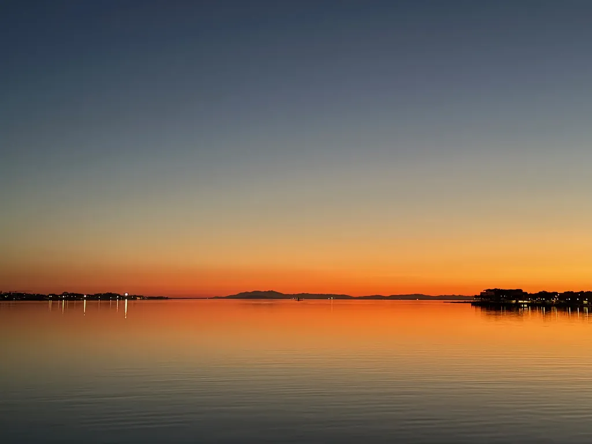

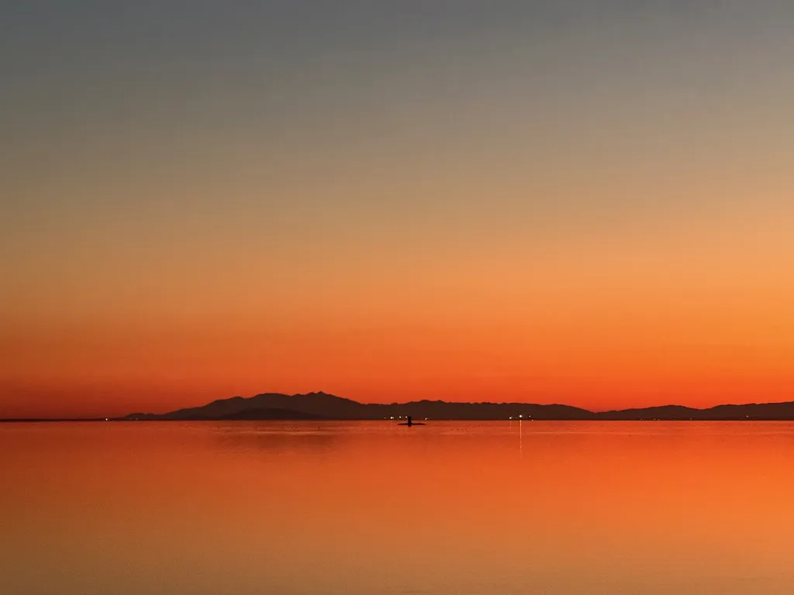

### Mardi 4, Balaruc

Chaque fois que je commence un article critique sur les IA écrit par un sociologue, un politicien, un artiste, je me demande combien de temps ils ont passé à travailler avec elles, à coder avec elles, à dessiner avec elles, à tordre leurs API en tout sens, à explorer le tréfonds de leurs entrailles, à les transformer en agents et à les regarder interagir. Il faudrait mettre en tête de chacun des articles une notice de crédibilité, sinon je me dis « Quel naïf ». Ce n’est pas que les IA sont merveilleuses, mais on ne peut comprendre leurs forces et faiblesses, et s’armer contre leurs dangers qu’en cherchant à les disséquer de l’intérieur, non en se référant à des expériences superficielles.

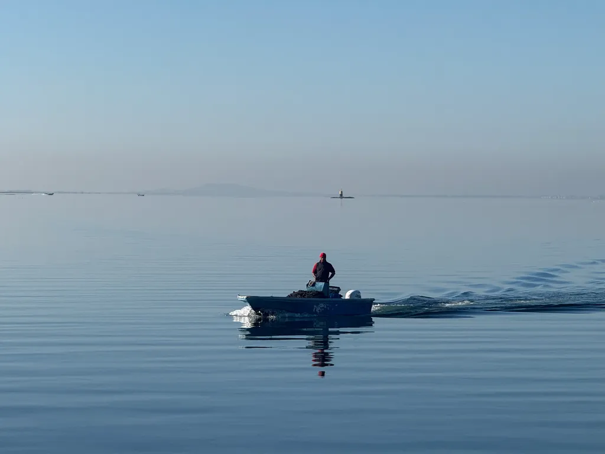

### Mercredi 5, Balaruc

Moment eurêka dans les IA. [Plus besoin de modèles géants.](https://www.youtube.com/watch?v=JldLaCUTZ3k&ab_channel=VisionIA) Faut que je digère tout ça. Le monde technologique change à une vitesse jamais vue.

### Jeudi 6, Balaruc

Je ne vois pas comment la plupart des cryptomonnaies pourraient survivre à l’AGI. J’éprouverais beaucoup de plaisir si ces châteaux de cartes spéculatifs s’effondraient.

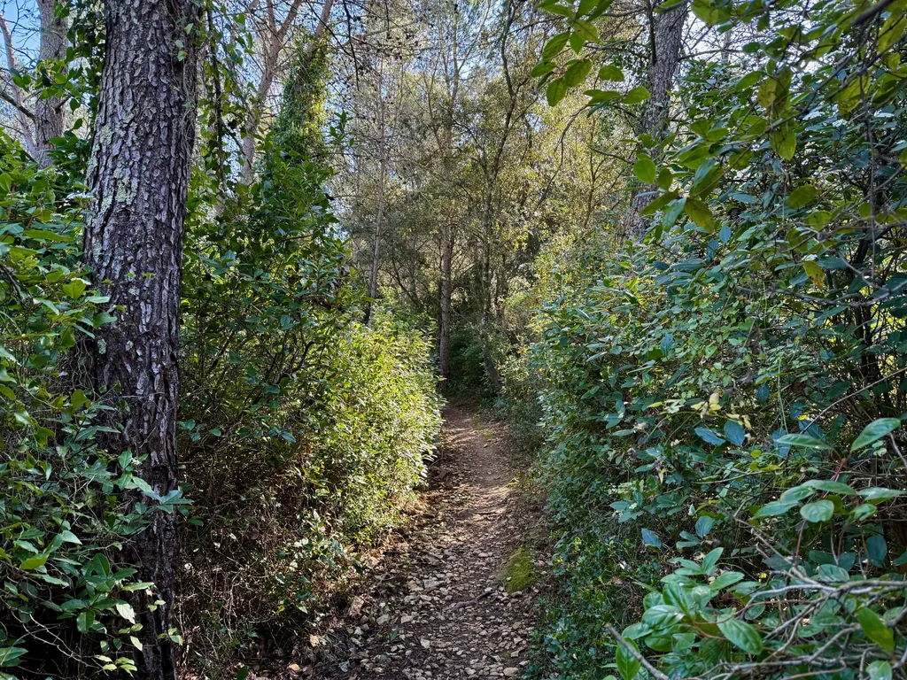

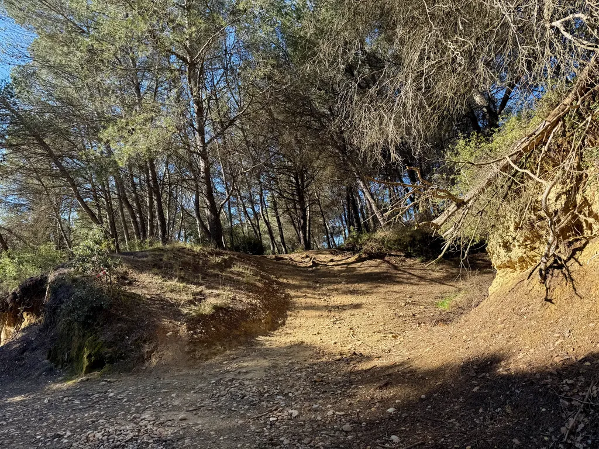

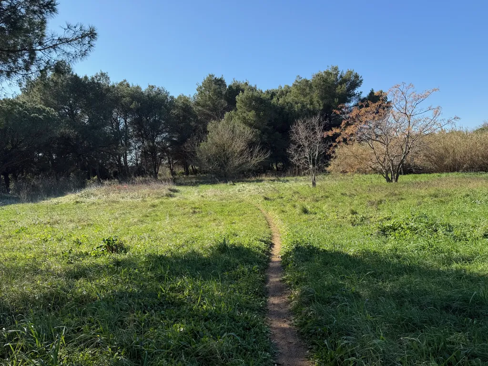

### Vendredi 7, Balaruc

[Arthur Mensch](https://www.youtube.com/watch?v=bzs0wFP_6ck&ab_channel=Underscore_) : « Compresser les connaissances humaines, ça c’est fait. » Peut-être que le style, l’art, l’esthétique et l’émotionnel échappent encore aux LLM. Il ne s’agit justement pas de connaissances.

J’aime l’idée qu’un logiciel contient davantage d’informations que nos œuvres les plus grandes. Mais c’est oublier ce qui se glisse entre les mots, l’importance des non-dits. On sait désormais que l’ADN ne nous décrit pas totalement, loin de là. L’épigénétique est fondamentale (et les LLM ne savent pas encore l’intégrer).

### Samedi 8, Balaruc

On présente l’open source comme un gage de fiabilité et de sécurité. Mais les hackers utilisent souvent des logiciels open source pour mener leurs attaques. Y aurait-il moins d’attaques s’il y avait moins d’open source ? Je ne le pense pas. Les crapules ont toujours existé. Elles auraient développé des outils fermés, plus difficiles à contrer que des outils ouverts. Avec l’open source, tout le monde se bat à armes égales, en quelque sorte. Jusqu’à présent le combat pouvait faire perdre de l’argent mais il était rarement létal.

Est-ce que je préfère que tout le monde possède la bombe atomique ou seulement quelques puissances ? Je préfère la seconde solution, sinon des dictateurs en fin de règne auraient déjà pressé sur le bouton de mise à feu (il s’agit d’une hypothèse dont j’évalue haute la probabilité — et je la crains avec Poutine).

Est-ce que je préfère que certains logiciels restent propriétaires et confidentiels, comme l’arme atomique ? Je ne m’étais jamais posé la question avant l’émergence des IA.

Aux États-Unis les armes à feu sont en vente libre, c’est-à-dire en open source (au moins en open-bar). La prolifération des armes implique la prolifération des crimes. La corrélation a été démontrée : en moyenne, [41 000 Américains sont tués par des armes à feu chaque année](https://major-prepa.com/anglais/armes-feu-etats-unis/), soit 112 personnes par jour. L’open-bar n’est pas nécessairement la meilleure solution (même problématique qu’avec la légalisation ou non des drogues). La réponse la plus sensée paraît la prévention et l’éducation, mais face à l’arme atomique numérique on fait quoi, là, tout de suite ? On la donne à tout le monde ou on la laisse entre les mains de quelques oligarques.

Quand l’arme atomique était étatique, on pouvait espérer des jeux de pouvoir et contre-pouvoir pour en limiter l’usage. Quand son usage ne dépend que du bon vouloir d’un dictateur, ce qu’est souvent un oligarque, c’est une autre affaire. Qu’il devienne dingue et nous en pâtissons tous.

Dans ce cas, je préfère aussi disposer de l’arme pour essayer de me défendre, je préfère que nous la possédions tous. Il y aura des fous, il y en a toujours eu, mais je compte sur la santé mentale du reste de l’humanité pour résister, et cette résistance ne sera possible que si nous disposons nous aussi des technologies potentiellement dangereuses.

Problème : les promoteurs des armes à feu aux USA tiennent le même discours. Je suis très mal à l’aise avec ce que je viens d’écrire, parce que je sais qu’il est philosophiquement difficile d’être contre un comportement dans un domaine et pas dans un autre. Où mettre la limite ? Il s’agit dans les deux cas d’armes. Pourquoi faire une différence entre les armes à feu et les armes numériques ?

Une nuance : une IA, c’est une sorte de marteau. On peut s’en servir comme outil de construction, et exceptionnellement comme arme contondante. On ne va pas privatiser toutes les IA au prétexte qu’elles pourraient parfois être utilisées de travers. Sinon il faudrait interdire les voitures avec lesquelles on peut foncer dans les foules. Dans toute technologie, des risques existent. On ne peut jamais les réduire à zéro. Fermer les yeux en privatisant une technologie, en empêchant tout contrôle sur elle, est sans doute la pire chose à faire. Mieux vaut pouvoir ouvrir le capot pour essayer de mieux se défendre.

L’open source reste dans ce cas de l’IA, et de toutes les technologies potentiellement dangereuses, la moins pire des solutions. Si les formules des pesticides avaient été ouvertes, sans doute l’épidémie de cancer serait moins vive.

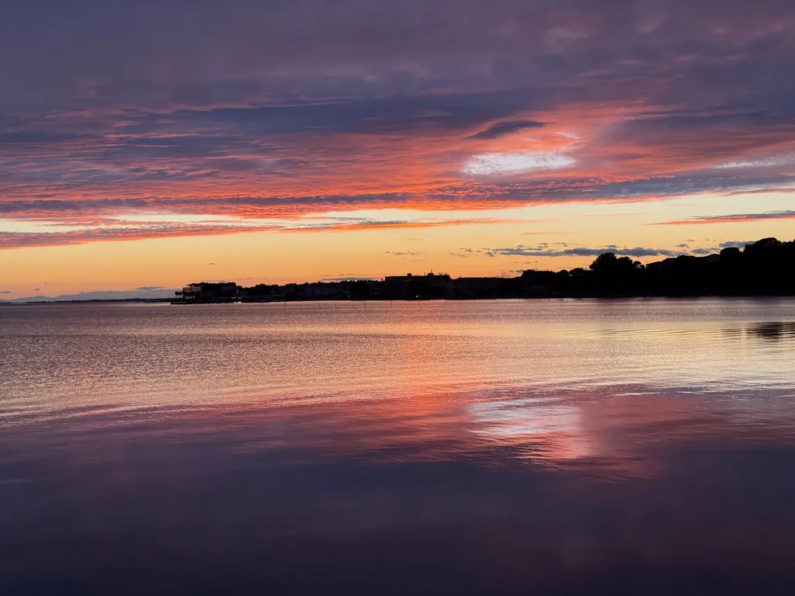

### Lundi 10, Paris

Stéphanie Dupays, *Un puma dans le cœur* : « Sur les conseils d’une amie analyste, je lis un texte de Nicolas Abraham et Maria Torok, les deux psychanalystes qui ont inventé la notion de crypte intérieure pour désigner ces secrets si bien gardés qu’ils ne laissent aucune trace, pas même sous forme de symptômes. La douleur est tue et oubliée, confinée dans une partie du moi de façon totalement hermétique. » J’ai longtemps encrypté l’histoire racontée dans *Mon père, ce tueur*, puis l’écriture m’a libéré, faisant ressurgir toutes ces choses enterrées. « La crypte se dissout dans les mots. » écrit Stéphanie. Au moins, je n’ai plus de secret à cacher (à moins que je les ignore encore).

Autre similitude. « Il faut dire que des mots, il n’y en avait pas beaucoup. Dans ma famille on parle peu. C’est peut-être pour cela que j’ai très tôt et voracement cherché dans les livres à combler ce déficit de langage. »

---

Tout ce que j’arrive à faire dans Paris, c’est marcher, marcher, revoir des amis, marcher, tout le reste me fatigue. En même temps, mes pas me ramènent toujours vers les mêmes quartiers, un peu chic, bourgeois, touristiques.

---

Ce matin S me dit que même lui ne peut pas tout suivre dans le développement des IA, pourtant il a participé au développement des premières versions de ChatGPT. Est-ce que les IA atteindront très vite un palier ou la croissance se poursuivra-t-elle jusqu’à devenir inintelligible pour nous ? Dans *One Minute*, j’ai postulé un maximum de complexité, parce que s’il n’existait pas, les IA extraterrestres auraient déjà colonisé l’univers et nous le saurions (mais dans *One Minute*, elles nous surveillent pour copier notre art et ne se montrent pas). J’aime dire une chose et son contraire.

---

Qui publierait aujourd’hui Barthes, le Barthes d’avant la gloire ? Aucun nom ne vient à Pierre. Lui : Pourquoi tu veux encore publier des livres puisque tu as des lecteurs en ligne ? Réponse fourbe : pour en toucher d’autres. En vérité, j’écris des livres parce que j’aime l’exercice. Je crois simplement que mes livres ressembleront de plus en plus à mon carnet. Il me suffit souvent de noter une telle chose pour faire le contraire. *Épicènes* ne ressemble à rien que j’ai déjà écrit ou publié. Le carnet-livre implique une autre pratique du carnet, plus réflexive, plus thématique, et quand je me lance dans un tel livre, j’assèche le carnet. Il m’est difficile d’écrire deux textes en même temps.

---

Sophie me dit pourquoi tu n’écrirais pas un essai pour [la collection Tracts](https://www.gallimard.fr/collections/tracts) ?

### Vendredi 13, Balaruc

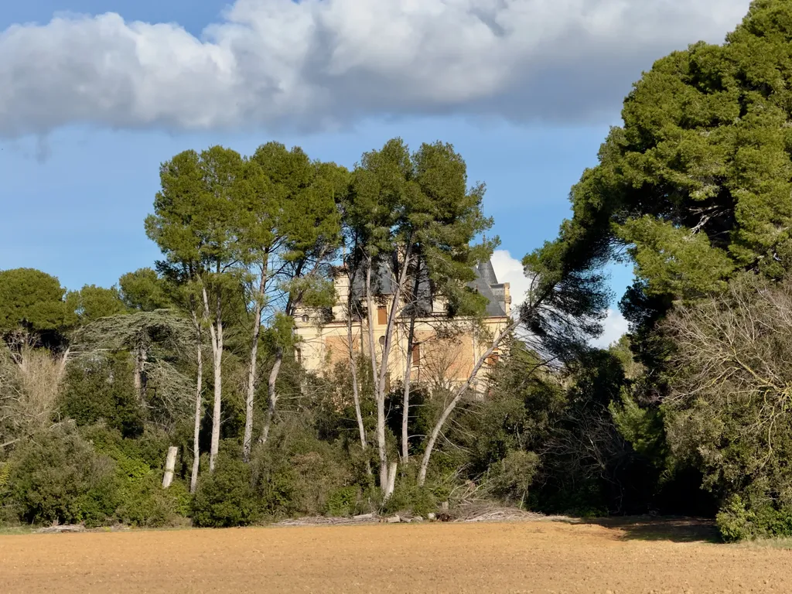

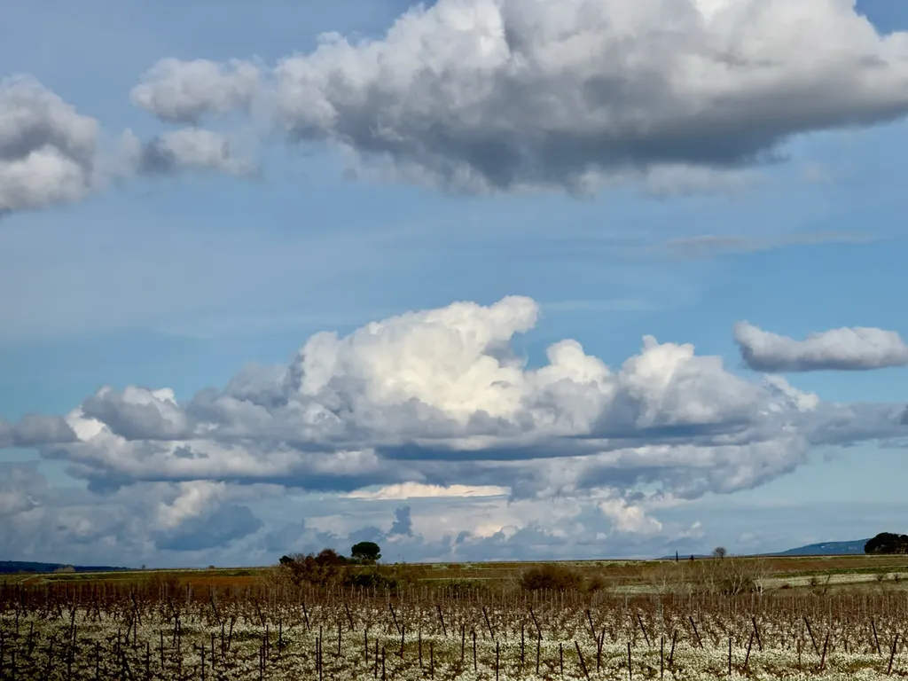

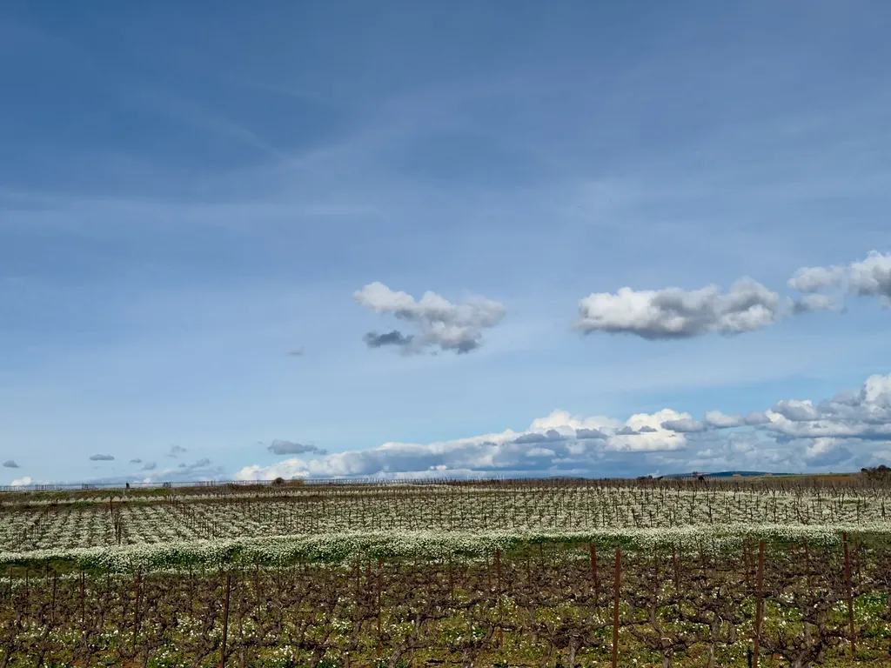

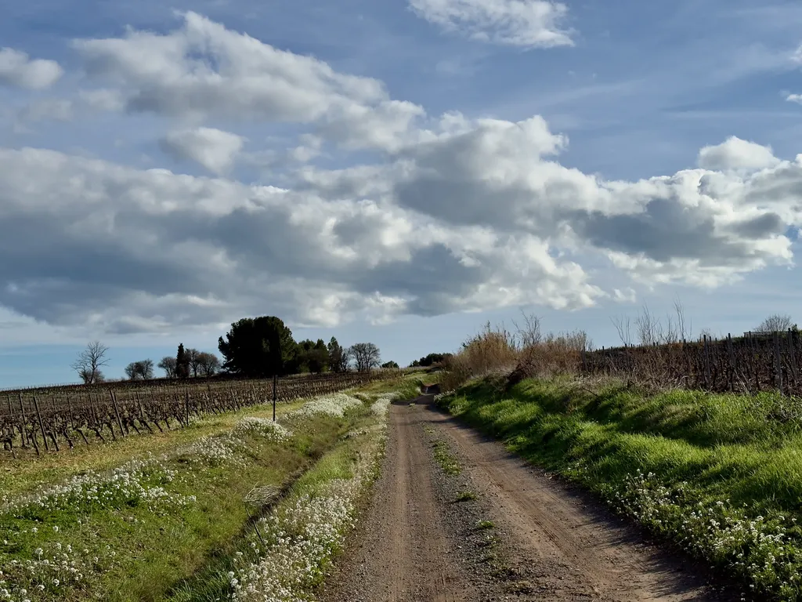

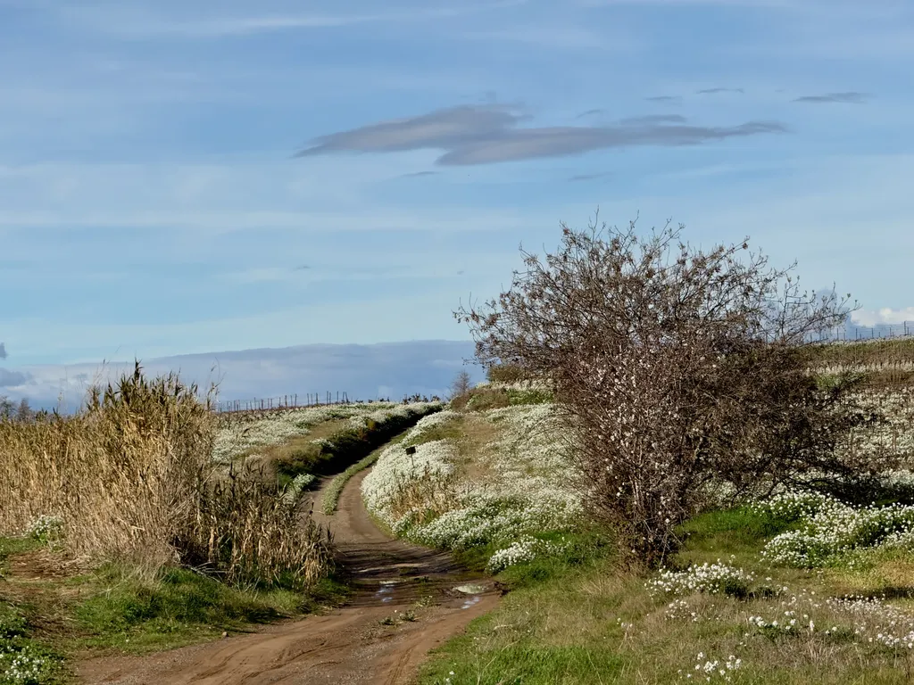

### Vendredi 14, Balaruc

Une spécialiste IA explique que [les productions des machines sont aujourd’hui d’une qualité moyenne supérieure à celle de nos productions humaines](https://www.youtube.com/watch?v=AfgAEIK9F8c&ab_channel=Underscore_). « Il y a tant d’horreurs sur internet. » En conséquence, les IA sont désormais capables de s’éduquer elles-mêmes, de fabriquer leur propre dataset. C’est un peu comme si après leur avoir donné naissance on pouvait se retirer de la scène.

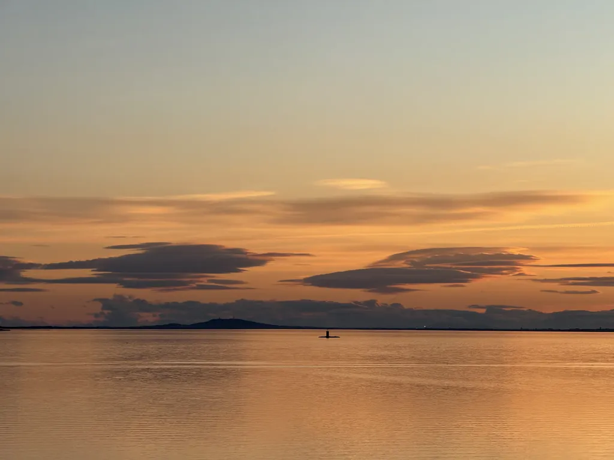

### Samedi 15, Balaruc

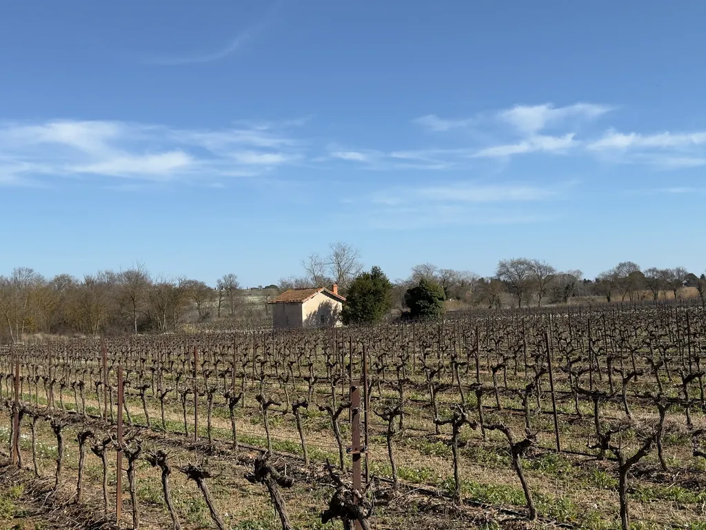

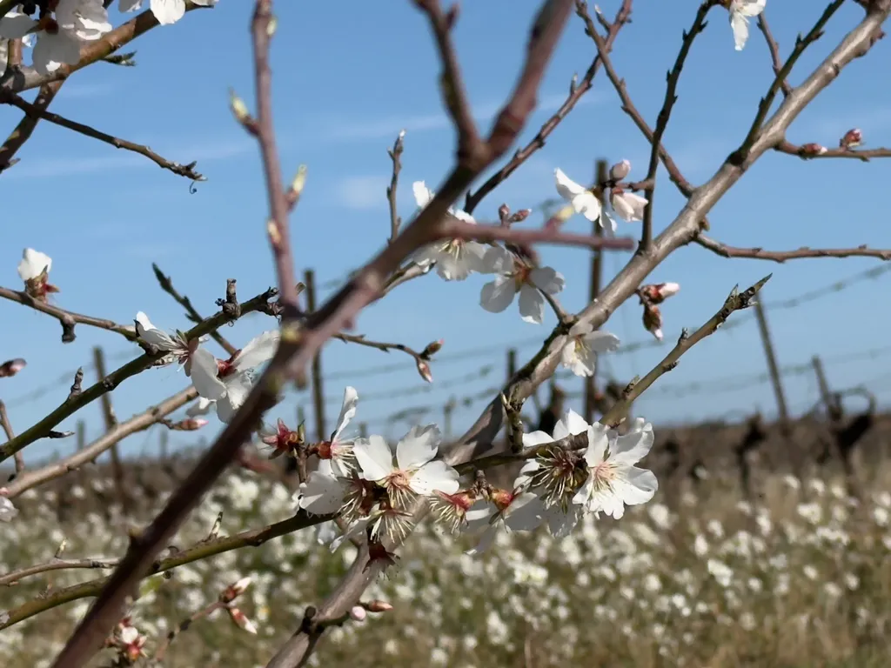

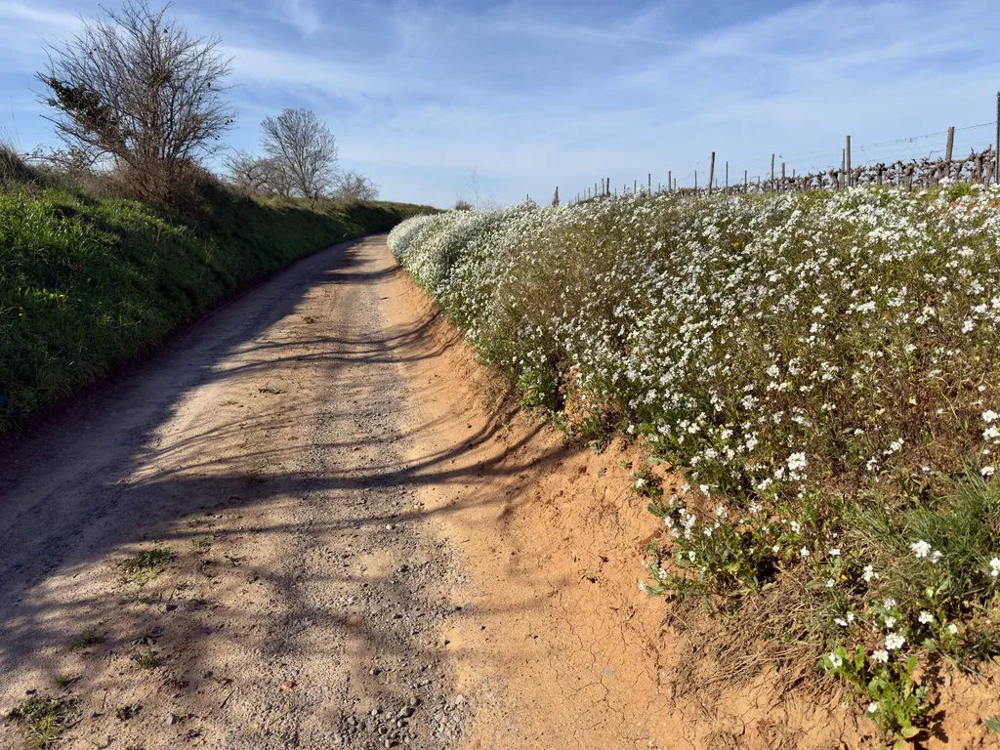

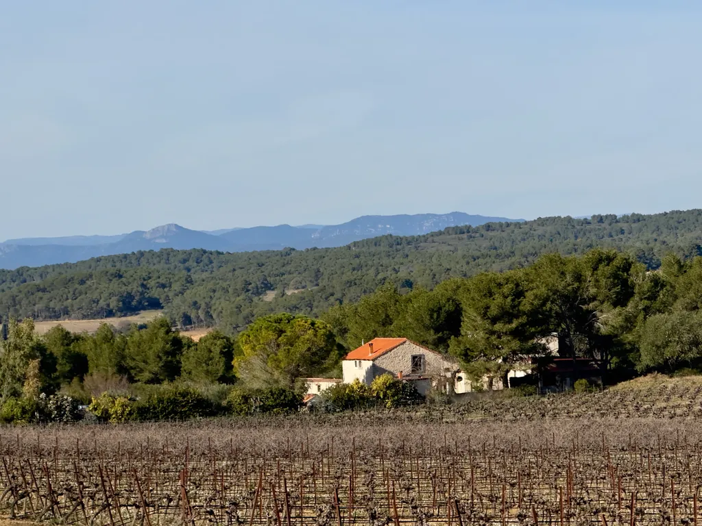

### Mardi 18, Balaruc

[Ploum se demande si le succès existe.](https://ploum.net/2025-02-18-le-succes.html) Mais oui. Faire du vélo quand je veux, écrire ce que je veux, avoir du temps pour mes lubies et ma famille et les copains, c’est ça le succès pour moi.

---

En six jours, j’ai écrit un petit livre politique, qui reprend et met au clair des idées éparpillées sur le blog depuis 2019. Suis un peu rincé, mais c’était nécessaire.

## Mercredi 19, Balaruc

Depuis des années, je me préoccupais plus de qui me lisait et Substack me remet sous les yeux des statistiques, et je vais devoir faire un effort pour ne pas en tenir compte, pour ne pas écrire seulement ce que les lecteurs aiment mais ce qui me paraît important. Je ne sais pas si je vais y réussir. Le capitalisme de la mesure est insidieux. Il nous pousse vers les goûts communs, un peu comme les IA.

### Jeudi 20, Balaruc

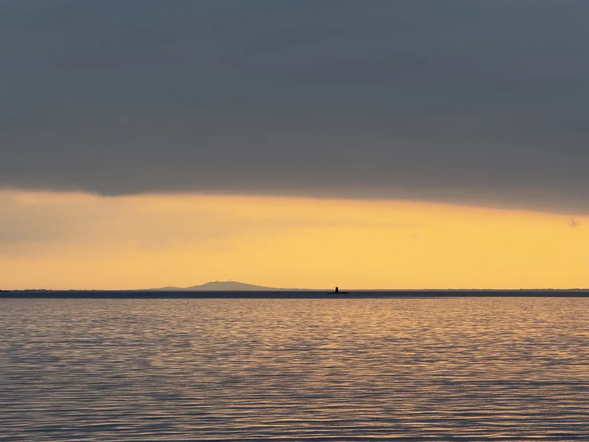

### Vendredi 21, Balaruc

Barthes : « Il y a *rivalité* entre le monde au sens de mondain, intramondain et l’œuvre. » J’ai réglé le problème depuis longtemps (surtout celui du Bureau qui tourmentait Kafka). Le mondain se résume pour moi à mes sorties à vélo.

---

Quand on a du succès sur un réseau social, même décentralisé, c’est parce qu’on alimente la communauté créée par le réseau avec des idées qu’elle accepte majoritairement, quitte à mentir. La malhonnêteté intellectuelle me saute partout aux yeux. Un tel qui pour étayer sa thèse cite un tel qui abonde en son sens mais passe sous silence les milliers d’autres qui disent le contraire. J’ai peur d’être malhonnête. De me laisser prendre au jeu. J’ai plutôt tendance à me retirer des réseaux sociaux, pour éviter qu’ils ne me poussent à dire des choses que pour gagner des likes.

### Dimanche 23, Balaruc

Pluie, pluie, pas de vélo et l’enfermement déjà après trois jours me pèse, et Barthes qui parle du fantasme d’un Paris avec des quartiers secrets, de sa répulsion de la campagne, mais qui la cherche dans Paris, et moi, quand je suis à Paris, c’est l’horizon que je cherche, comme aujourd’hui où même Sète est invisible dans la brume. J’ai besoin de voir loin pour me sentir vivre, et j’en prends conscience ce matin, parce que j’ai dormi en bas, dans la pièce aquarium, ouverte sur l’extérieur, mais je dois tourner la tête pour apercevoir l’étang, absolument terne il est vrai, alors que d’habitude il encadre mon écran.

Je suis sous le coup de toutes les écritures des jours passés, de ce petit texte politique de soixante pages, un peu vanné, et comme toujours désolé après un travail dont j’ignore s’il plaira. Du mal à replonger dans *Rush*, que j’encapsule une nouvelle fois par des commentaires sur lui-même. Le livre sortira en novembre, chez [PVH](https://pvh-editions.com/). Reste encore à tout régler. Mais là, dans la pénombre matinale, je ne parviens pas à m’enthousiasmer. Tout me révolte. Le monde est révoltant.

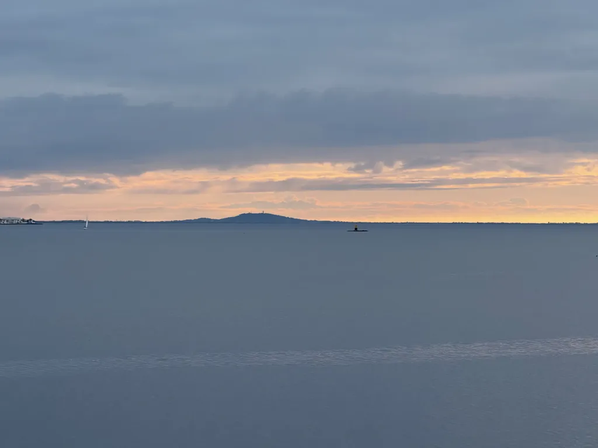

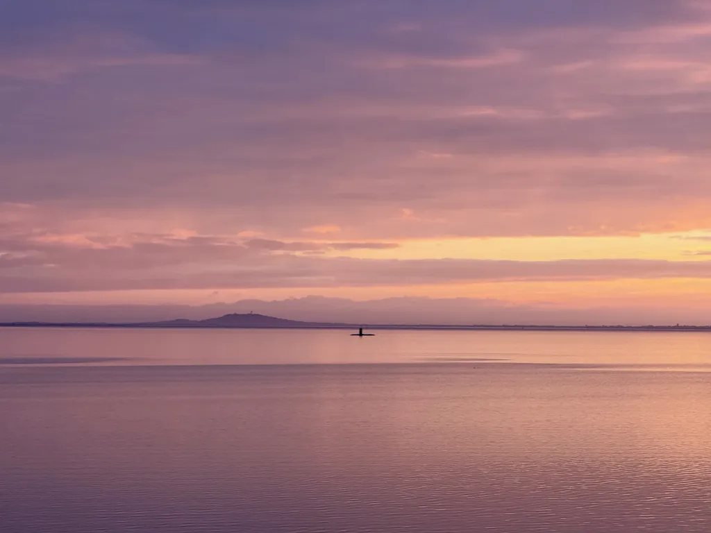

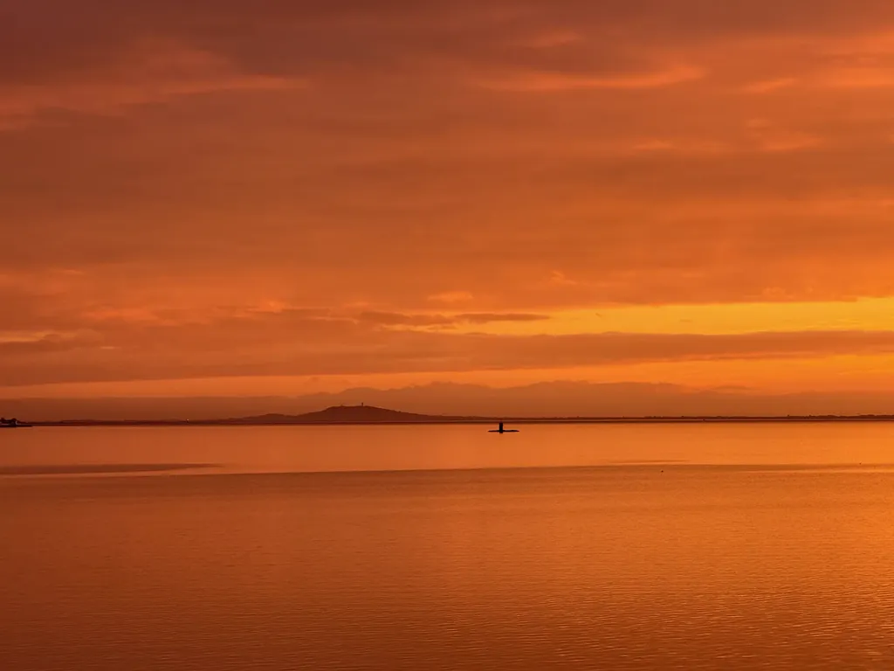

### Lundi 24, Balaruc

Pour beaucoup, la retraite implique un changement de vie. Un de mes oncles l’attendait avec impatience et il est mort peu de temps après. Barthes parle de *Vita Nova*, de quand Proust dit adieu à ses amis pour se dédier exclusivement à *La Recherche*. J’ai rêvé d’une *Vita Nova* au début de ma carrière professionnelle et elle a commencé quand j’ai quitté la presse, peu avant mes 31 ans, et que je n’ai plus fait qu’écrire et n’en faire qu’à ma tête. Peut-on traverser plusieurs *Vita Nova* ?

---

Barthes : « Pour celui qui écrit, l’œuvre qui est faite et publiée devient inessentielle. » Je l’ai souvent dit, j’ai du mal avec les lectures, les signatures, tout ce tralala autour des livres puisqu’il s’agit pour moi d’ouvrir un cercueil et de me pencher sur un cadavre. Je ne me passionne pour un texte que quand j’y travaille ou l’envisage, pas une fois que je l’ai refermé. Publier vite est la seule solution pour que je reste connecté. Voilà peut-être pourquoi je ne suis devenu « auteur » qu’avec internet, même si j’ai commencé à écrire bien avant.

J’entrevois une solution. Publier un texte par épisodes, avant qu’il ne soit achevé, alors qu’il est encore en gestation. C’est un peu ça le carnet. Je le donne au fur et à mesure, même s’il m’arrive d’y revenir. Mais le carnet ne finit pas en librairie, il n’entraîne aucune dédicace, aucun salon, même s’il est plus lu que mes livres.

### Mardi 25, Balaruc

En deux soirs, j’ai regardé *The Brutalist* sur mon ordi. Première deux heures prenantes, puis la suite devient trop psychologisante et ça m’ennuie, et je zappe pour m’arrêter sur de belles puissances visuelles. Dans un ciné, je serais resté à ma place, sans doute.

### Mercredi 25, Balaruc

Envie d’écrire un petit essai intitulé *Le dernier écrivain* et qui commencerait par « Le dernier écrivain est peut-être déjà né. »

### Mercredi 26, Balaruc

Jeff Bezos interdit aux éditorialistes du *Washington post* de critiquer la libre entreprise et de la liberté d’expression. Si je comprends bien : « Je brime ta liberté d’expression et t’ordonne de la défendre. » C’est schizophrénique.

### Jeudi 27, Balaruc

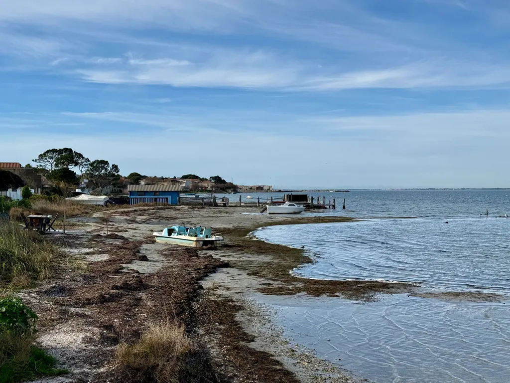

### Vendredi 28, Balaruc

Travail d’arrache-pied sur *Rush* maintenant que je sais qu’il sortira en novembre. Étrange texte qui pourrait ne jamais finir et qui ne cesse de se contenir lui-même. Pendant ce temps, le monde s’écroule. C’est le règne des fous. Je suis persuadé que les réseaux sociaux ont plus que leur responsabilité dans la catastrophe. Tout le monde prêt aux pires atrocités pour attirer l’attention.

#carnets #y2025 #2025-3-7-18h00
