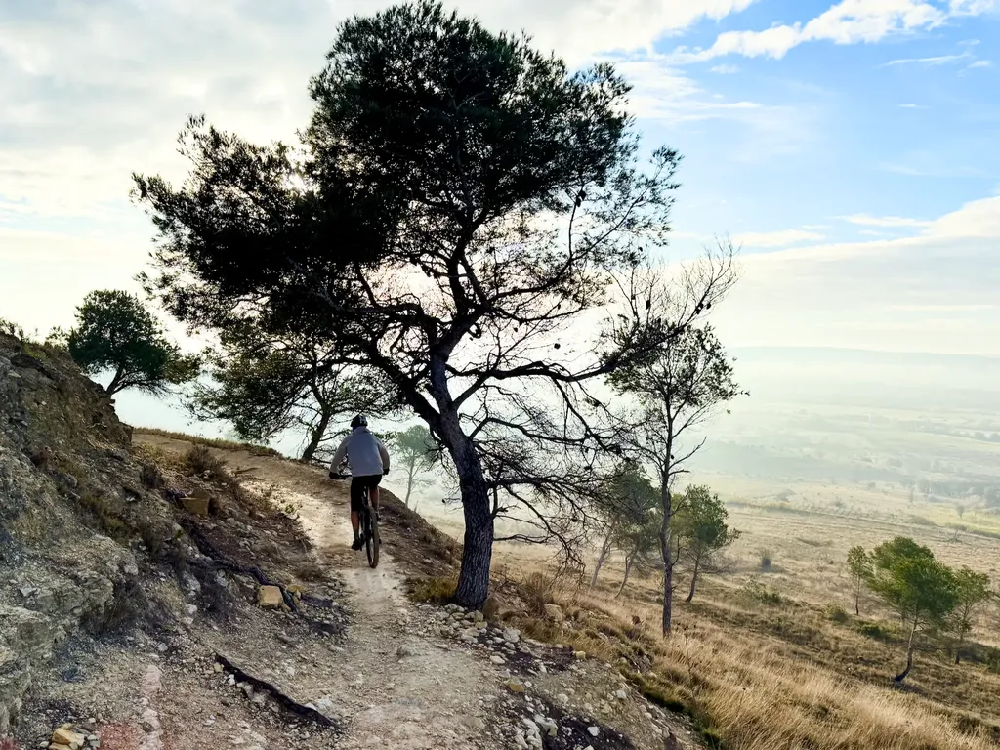
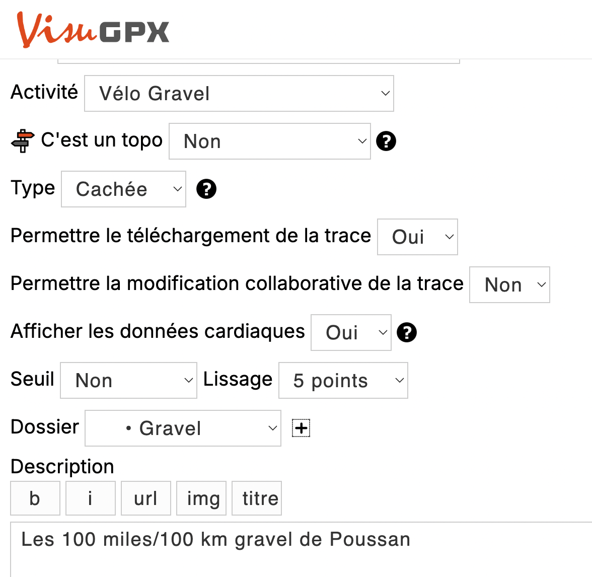
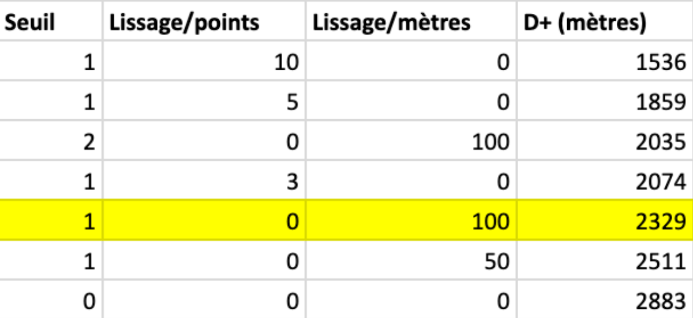
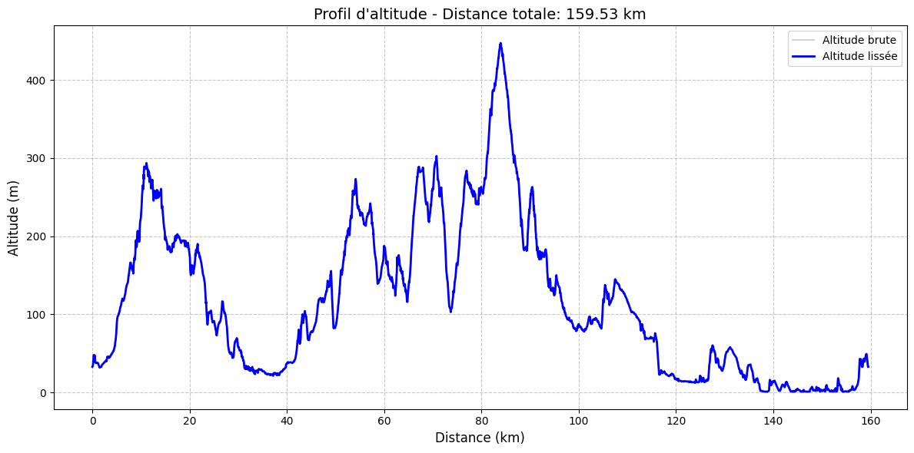

# Quel est le d+ réel d’une trace

Nous l’avons tous constaté : après une sortie, aucun GPS n’affiche le même dénivelé, aucune application n’a anticipé la bonne valeur. C’est quoi qui cloche ? Vous allez pouvoir faire dire presque ce que vous voulez à vos traces.

### Pourquoi ça varie d’un GPS à l’autre

Il existe trois grandes techniques pour mesurer l’altitude avec un GPX :

* Le relevée sur la carte. Dans ce cas, une erreur de position de vingt mètres peut suffire à fausser la mesure, surtout dans les secteurs très escarpés (sur un chemin de montagne, on peut vite se retrouver plus haut ou plus bas de cent mètres). La plupart des GPS modernes ne se contentent plus de cette méthode.
* Les altimètres barométriques déterminent l’attitude à l’aide des variations de pression atmosphérique. Cette technique est la plus précise, sauf quand la météo est changeante (lors d’un orage, je suis rentrée d’une sortie autour de l’étang de Thau avec plus de 700 m de D+). Et dans un groupe, on continue d’avoir des écarts souvent de l’ordre à 15 % (parce que les GPS ne sont pas tous calibrés de la même façon, n’ont pas la même ancienneté, parce qu’un pilote est plus agressif qu’un autre ce qui peut affecter le baromètre…).
* Le mix des deux méthodes, ce qui permet notamment aux GPS barométriques de se recalibrer en temps réel. Deux appareils identiques avec les logiciels différents peuvent donc donner des mesures différentes.

Conclusion : difficile de connaître le d+ réel d’une trace. Mais alors pourquoi ne pas avoir une approche plus théorique.

### Le D+ théorique

La plupart des GPS et des services de partage de traces reposent sur [la carte OSM](https://www.openstreetmap.org/) (Open Street Map), qui utilise différentes sources altimétriques, elles-mêmes sujettes à erreurs et approximations. Reste qu’avec la même carte et les mêmes données, des services différents anticipent des dénivelés potentiellement très différents, tout ça parce que leurs algorithmes de calcul du d+ ne travaillent pas avec les mêmes paramètres.

* **Seuil minimal de prise en compte d’une variation d’altitude.** Si le seuil est à 0, une variation de 10 cm entre deux points sur la carte sera comptabilisée. Une route quasi plate d’un kilomètre peut alors donner une D+ non négligeable. Pour éviter ces effets, on augmente généralement le seuil à 1 m, voire à 5 m.
* **Lissage par points.** Plutôt que de prendre le d+ entre deux points consécutifs, on le moyenne sur plusieurs points. Par exemple, dans une grande descente, on ne verra pas les moments où on remonte sur un mètre.
* **Lissage par distance.** On lisse tous les x mètres plutôt que le x points, ce qui paraît plus rigoureux. En effet, une trace enregistrée par un GPS comporte beaucoup plus de points qu’une trace optimisée à la main, comme celles que je propose sur [les 727](https://727bikepacking.fr/). Sur certaines lignes droites d’un kilomètre, je n’ai aucun point.

À ma connaissance, seul VisuGPX permet d’ajuster le seuil et le nombre de points pour le lissage. Les autres services n’offrent pas cette option.

### La pratique

J’ai créé un [script Python](https://colab.research.google.com/drive/1AW-YGzoylSxDwzfDLOUtPURnwHZFdz5b?usp=sharing) que vous pouvez appliquer à une de vos traces (créé rapidos avec les IA — pour le besoin de la démonstration). Selon les réglages, les variations sont faramineuses. Exemple pour la [POU100](https://727bikepacking.fr/pou100/) (100 miles gravel de Poussan).

Plus les terrains sont accidentés, cas du gravel, et surtout du VTT, plus il faut réduire les seuils et surtout le lissage, sinon on efface de nombreuses montées descentes casses pâtes et qui comptent bel et bien dans le d+ final d’une sortie.

Où est la vérité ? Il faut mixer les données GPS et les données cartographiques, ce que fait Strava quand on lui demande de recalculer le d+. Mais encore une fois des choix algorithmiques décident du résultat final.

Le non lissage donne à coup sûr le dénivelé maximal, mais il ne correspond pas nécessairement au dénivelé ressenti. Pour la POU100 sur 100 miles, et suites à nos reconnaissances, nous serons entre 2 300 et 2 500 m (et 1 200 m sur le 100 km).

#velo #gps #y2025 #2025-3-24-20h00
