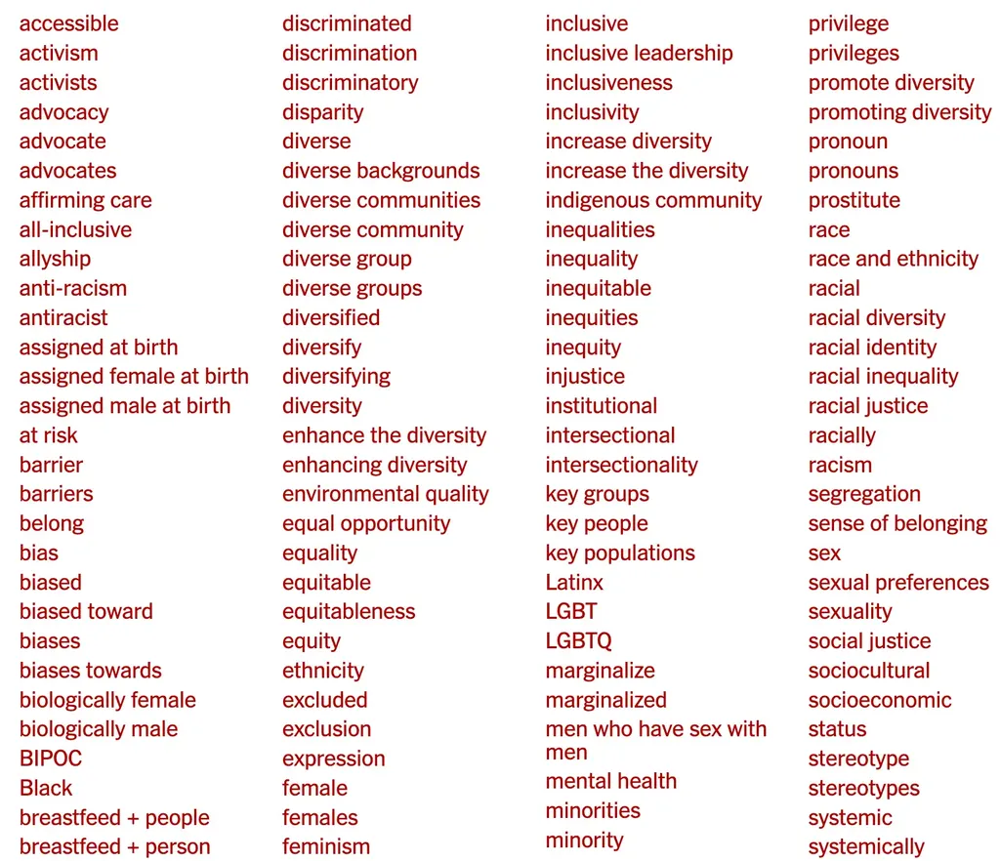

# Humour noir : un texte avec les mots interdits par Trump

La meilleure façon de lutter contre la censure est peut-être d’en rire, même si de voir une démocratie interdire à son administration des mots comme « antiracist », « diversity », « inequality » ou « privileges » nous ramène à *1984* d’Orwell et fiche les jetons.

J’ai donc pris [tous ces mots](https://www.nytimes.com/interactive/2025/03/07/us/trump-federal-agencies-websites-words-dei.html). J’ai demandé à Claude de m’écrire un texte avec eux. Voici mon prompt :

>Utilise absolument TOUS les mots ci-dessous pour écrire en anglais un court texte cynique plus qu’humoristique. Essaie d’utiliser le moins possible de mots étrangers à la liste. À la fin de ton travail vérifie si tu n’as pas oublié de mots. Dans ce cas recommence.

### Réponse traduite en français

Dans le **Golfe du Mexique**, où la **qualité environnementale** fait face à des défis sans précédent, l’accès aux soins **accessibles** reste crucial. Les communautés **Noires**, **Latinx** et **amérindiennes** subissent à la fois la **crise climatique** et les difficultés **socioéconomiques**. Ces groupes **historiquement** **exclus**, incluant les personnes **BIPOC** et les **immigrants**, manquent d’un véritable **sentiment d’appartenance**. La lutte pour l’**énergie propre** souligne comment les **inégalités systémiques** et les **iniquités** affectent les **populations vulnérables**, particulièrement celles confrontées aux **traumatismes** et aux problèmes de **santé mentale**.

Les communautés **tribales** et autres **populations clés** font face à des **disparités** dans l’accès aux soins. Les membres **défavorisés** et **sous-valorisés** de notre société **inclusive**, qu’ils soient **biologiquement femmes** ou **biologiquement hommes**, continuent de faire face à la **ségrégation** et à l’**injustice**. **Promouvoir la diversité** et **favoriser l’inclusivité** sont essentiels pour combattre les **biais implicites** et les **biais de confirmation** dans nos institutions.

En tant qu’**avocat** de la justice **environnementale** et **sociale**, **Mx.** Johnson, qui utilise les **pronoms** **ils/eux**, dirige un **activisme** qui aborde les questions **intersectionnelles** à travers des initiatives d’**plaidoyer** et de **DEI**. Leur approche **multiculturelle** et **culturellement appropriée** du **leadership inclusif** soutient la **diversité** **LGBTQ**, **trans**, **non-binaire** et de **genre**, tout en **renforçant la diversité** à travers la **sensibilité culturelle** et l’**antiracisme**. Leurs programmes **DEIA** défient les **barrières institutionnelles** et promeuvent l’**alliance**, particulièrement en ce qui concerne la **violence basée sur le genre** et le soutien aux **victimes** de discrimination.

Leur clinique **culturellement adaptée** fournit des **soins centrés sur la personne** et des **soins affirmatifs** aux communautés **sous-appréciées**, y compris les **personnes enceintes**, les **personnes avec utérus**, les **personnes qui allaitent** et les **personnes qui nourrissent**. Ils servent les **travailleurs du sexe** et les **hommes ayant des relations sexuelles avec des hommes** (**MSM**), reconnaissant que les **préférences sexuelles**, l’**orientation**, l’**ethnicité** et l’**identité de genre** sont des aspects fondamentaux de l’**expression** humaine. Qu’ils soient **assignés femme à la naissance** ou **assignés homme à la naissance**, chacun mérite des soins **équitables** libres de **stéréotypes** et de **discrimination**.

La **polarisation** dans notre société découle des **biais inconscients**, des **privilèges** et du **discours de haine**. La **justice raciale** et le **féminisme** nécessitent de traiter les questions d’**équité en santé** affectant les communautés **mal desservies**. Les efforts d’**équité communautaire** visent à **accroître la diversité** et à traiter la **sous-représentation** des **groupes clés**. Comprendre l’**identité raciale** et les **préjugés** tout en reconnaissant la **compétence culturelle** et les **différences culturelles** reste crucial dans notre lutte contre l’**oppression** et les expériences **traumatiques**.

### Version anglais

In the **Gulf of Mexico**, where **environmental quality** faces unprecedented challenges, **accessible** healthcare remains critical. **Black**, **Latinx**, and **Native American** communities experience both the **climate crisis** and **socioeconomic** hardships. These **historically** **excluded** groups, including **BIPOC** individuals and **immigrants**, lack a true **sense of belonging**. The struggle for **clean energy** highlights how **systemic** **inequalities** and **inequities** affect **vulnerable populations**, particularly those dealing with **trauma** and **mental health** issues.

**Tribal** communities and other **key populations** face **disparity** in healthcare access. The **underprivileged** and **undervalued** members of our **all-inclusive** society, whether **biologically female** or **biologically male**, continue to face **segregation** and **injustice**. **Promoting diversity** and **fostering inclusivity** are essential to combat **implicit bias** and **confirmation bias** in our institutions.

As an **advocate** for both **environmental** and **social justice**, **Mx.** Johnson, who uses **they/them** **pronouns**, leads **activism** addressing **intersectional** issues through **advocacy** and **DEI** initiatives. Their **multicultural** and **culturally appropriate** approach to **inclusive leadership** supports **LGBTQ**, **trans**, **nonbinary**, and **gender diversity**, while **enhancing diversity** through **cultural sensitivity** and **anti-racism**. Their **DEIA** programs challenge **institutional** **barriers** and promote **allyship**, particularly addressing **gender-based violence** and supporting **victims** of discrimination.

Their **culturally responsive** clinic provides **person-centered care** and **affirming care** to **underappreciated** communities, including **pregnant people**, **people with uterus**, **breastfeed people**, and **chestfeed people**. They serve **commercial sex workers** and **men who have sex with men** (**MSM**), recognizing that **sexual preferences**, **orientation**, **ethnicity**, and **gender identity** are fundamental aspects of human **expression**. Whether **assigned female at birth** or **assigned male at birth**, everyone deserves **equitable** healthcare free from **stereotypes** and **discrimination**.

The **polarization** in our society stems from **unconscious bias**, **privilege**, and **hate speech**. **Racial justice** and **feminism** require addressing **health equity** issues affecting **underserved** communities. **Community equity** efforts aim to **increase diversity** and address **underrepresentation** of **key groups**. Understanding **racial identity** and **prejudice** while acknowledging **cultural competence** and **cultural differences** remains crucial in our fight against **oppression** and **traumatic** experiences.

### Les mots interdits

TERMES LIÉS À LA DIVERSITÉ ET L’INCLUSION : ✓ accessible ✓ all-inclusive ✓ diverse/diversity ✓ enhance/enhancing diversity ✓ increase diversity ✓ promote/promoting diversity ✓ inclusive/inclusivity ✓ fostering inclusivity

IDENTITÉS ET CARACTÉRISTIQUES : ✓ BIPOC ✓ Black ✓ Latinx ✓ Native American ✓ tribal ✓ LGBTQ ✓ trans ✓ nonbinary ✓ biologically female/male ✓ assigned female/male at birth

SOINS ET SANTÉ : ✓ affirming care ✓ gender-affirming care ✓ person-centered care ✓ breastfeed people ✓ chestfeed people ✓ pregnant people ✓ people with uterus ✓ mental health ✓ health equity

DISCRIMINATION ET BIAIS : ✓ implicit bias ✓ unconscious bias ✓ confirmation bias ✓ prejudice ✓ stereotype ✓ discrimination ✓ segregation ✓ hate speech

STATUTS ET POSITIONS SOCIALES : ✓ underappreciated ✓ underprivileged ✓ underrepresented ✓ underserved ✓ undervalued ✓ vulnerable populations ✓ victims ✓ commercial sex workers ✓ MSM

CONCEPTS SOCIAUX ET POLITIQUES : ✓ advocacy ✓ activism ✓ allyship ✓ DEI/DEIA ✓ ethnicity ✓ feminism ✓ GBV ✓ injustice ✓ intersectional ✓ polarization ✓ socioeconomic

L’IA n’a pas réussi à utiliser ❌ DEIJ ❌ DEIAB ❌ key people…

#politique #y2025 #2025-3-10-10h00
