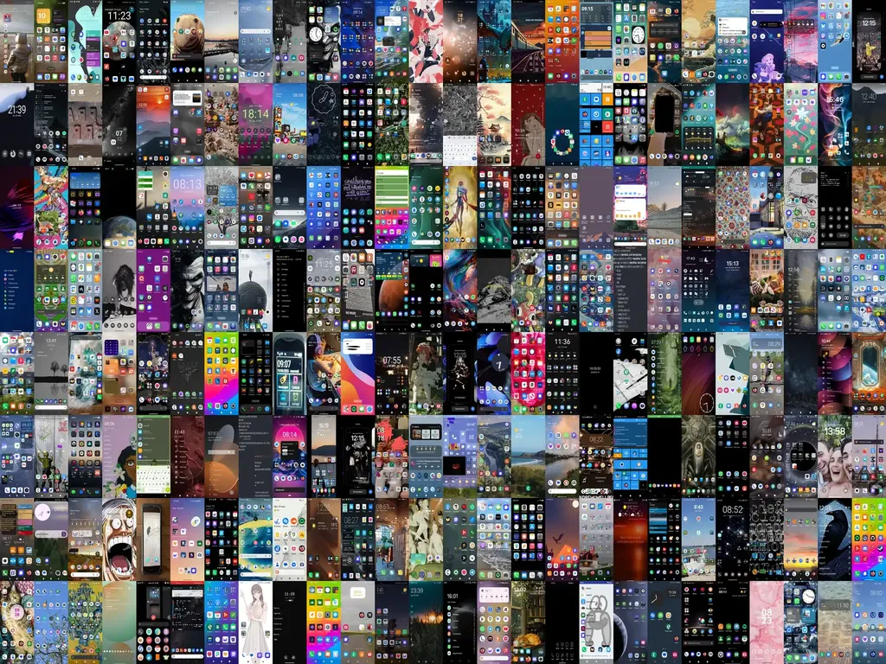

# Mythologies de poche

Quand je vois quelqu’un pour la première fois, avant même qu’il parle, je ne peux m’empêcher d’imaginer sa vie, ses goûts, ses opinions politiques, son régime alimentaire, surtout son régime alimentaire et son hygiène de vie. Je me trompe souvent, presque toujours même.

Quand j’étais jeune, je m’étais pris de détestation pour les autres jeunes qui se donnaient un look artiste pour imposer visuellement leur différence plutôt que travailler à l’œuvre qui les ferait différents. Je conserve cette réserve instinctive. Je me saisis de la moindre occasion pour catégoriser. J’aime observer les téléphones des autres : icônes ordonnées, dispersées, monochromes ou colorées, hiérarchisées ou pas, fonds d’écran discrets ou agressifs, artistiques ou techniques. En quelques secondes, j’entre dans une intimité, j’imagine une vie, ou tout au moins un caractère.

Après ma décision de quitter les principaux réseaux sociaux, et de leur préférer la médiation de textes plus longs, j’ai effacé de mon téléphone des applications familières depuis des années et j’ai ressenti une absence, un manque, douloureux au début. Quelque chose se passait en moi, un réajustement cognitif, et quand je regardais mon téléphone il n’était plus le même, plus tout à fait de la même couleur, plus tout à fait dans le même ordre. Il reflétait mes changements intérieurs, ce qui signifiait qu’il était à mon image, un miroir, comme nos vêtements, dans une certaine mesure.

Encore troublé, sentant poindre l’envie d’écrire, j’ai publié [la page d’accueil de mon téléphone sur Mastodon](https://mamot.fr/@tcrouzet/114187736974949456) avec un petit message : « Je projette un article sur les écrans d’accueil des mobiles… Si vous pouviez m’envoyer la vôtre, ça serait cool. » J’avais l’intention d’établir des catégories entre les rigoristes minimalistes et les baroques exubérants.

J’ai reçu des centaines d’images toutes différentes, des sobres, des poétiques, des scientifiques, des joyeuses, des tendres, des amoureuses… Une avalanche visuelle, une submersion émotionnelle. Des inconnus se présentaient à moi dans leur intimité. J’étais troublé comme s’ils se dénudaient devant moi. À partir de tous ces écrans, je me suis dit que je pouvais écrire des portraits imaginaires, me livrer comme des divinations — parce qu’il s’agit presque d’un exercice oraculaire. J’ai tout de suite pensé aux *Vies imaginaires* de Marcel Schwob et aux *Mythologies* de Roland Barthes, avec l’ambition de me glisser entre les deux.

[Sommaire des divinations…](https://tcrouzet.com/tag/divination/)

#divination #ecriture #y2025 #2025-3-20-10h00
