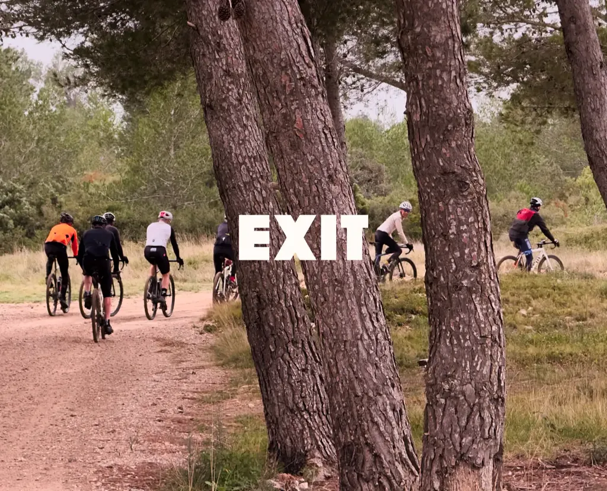
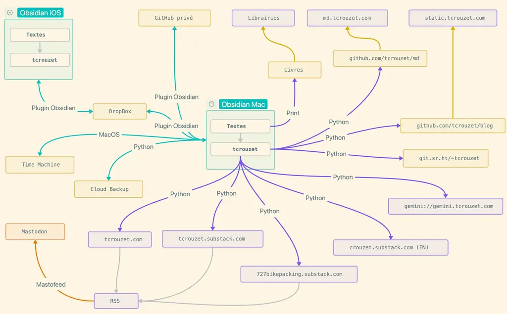

# Mon dernier message, les amis

Rassurez-vous, je ne vais pas me suicider, quoi que pour certains ce que je m’apprête à faire puisse paraître comme un suicide numérique. Je suis coutumier du fait.

En 2007, j’ai renoncé à parler de web et politique électorale, alors que j’étais invité un peu partout comme spécialiste.

En 2011, j’ai débranché, puis quand je suis revenu j’ai diminué drastiquement ma présence en ligne (perdant ma position de proto influenceur).

En 2023, j’ai quitté Twitter avant qu’il ne devienne X.

Quand la vie ronronne, il est temps de changer de direction pour éviter de tourner en rond et commencer une *Vita Nova*. Je cite Dante :

>Au milieu du chemin de notre vie  
je me retrouvai par une forêt obscure  
car la voie droite était perdue

La route droite était celle de Facebook, Messenger, LinkedIn, Instagram, puis BlueSky, celle qui ressemblait à une ligne de chemin de fer sans aiguillage. Dans une autre traduction de *La Divine Comédie*, moins élégante mais plus précise, on peut lire :

>Étant à mi-chemin de notre vie,  
je me trouvai dans une forêt obscure,  
la route droite ayant été gauchie.

La route droite gauchie, dénaturée, dévoyée, biaisée, c’est exactement ce que je ressens par rapport à la promesse initiale des réseaux sociaux les plus connus. J’ai donc décidé de les quitter et de concentrer ma présence en ligne sur [mon blog](https://tcrouzet.com/), [Mastodon](https://mamot.fr/@tcrouzet) et [Substack](https://tcrouzet.substack.com/).

Depuis quelques jours, j’ai supprimé les applications de mon téléphone et les icônes de mon navigateur. J’ai immédiatement ressenti un effet de manque, accompagné d’une légère souffrance. Je prenais mon téléphone et j’étais perdu, presque paniqué, des gestes automatiques devenaient soudain impossibles. Ne croyez pas que c’est facile. J’ai commencé à me reprogrammer. Ça fait mal comme reprendre le vélo après des mois d’arrêt.

Quand je fais une pause dans mon travail, mes choix de distraction sont moins nombreux, mais déjà je ressens un calme que mes lectures sociales interdisaient. Ce choix de quitter les réseaux sociaux populaires aura des conséquences pour ceux qui ont l’habitude de me lire et d’interagir avec moi quand je parle de technologie, de politique, de littérature ou de vélo, surtout de vélo car j’utilisais beaucoup Facebook pour organiser mes [727](https://727bikepacking.fr/). Pas de panique, je vais vous proposer des solutions de repli.

### Mes raisons de quitter

Au fil des années, ma présence sur les réseaux sociaux centralisés, privatifs, propriétaires m’a posé de plus en plus de problèmes éthiques : je me contentais de déposer des liens vers l’extérieur, mais ma présence servait de caution à un système devenu inacceptable. Depuis le début de l’année, et les secousses politiques provoquées par Trump/Musk, cette forme de défaitisme n’est plus soutenable.

Durant la Seconde Guerre mondiale, en France, il y avait environ 3 % de résistants et 3 % de collaborateurs et de nazis. Je n’ai plus envie de rester parmi les silencieux et de continuer ma vie comme si de rien n’était. J’avais un pied dans la résistance, j’ai décidé d’y basculer pleinement.

Cette décision demande moins de courage qu’en 1940, mais sans doute pas moins de lucidité, car l’ennemi est sournois. C’est sur Facebook que je passais le plus de temps, c’est donc Facebook qu’il m’est difficile de quitter pour gagner le maquis.

* Pour commencer, je ne supporte plus que Facebook m’impose des contenus indésirables.
* Je ne vois plus les messages de mes amis mais ceux d’inconnus dont en général je n’ai rien à faire (racistes, révisionnistes, homophobes, climatosceptiques, conspirationnistes…). À l’inverse, la plupart de mes amis ne voient jamais mes messages.
* De nombreux messages et commentaires me sont toxiques et affectent mon moral durant des heures. Au-delà des idées déplaisantes, je subis des exhibitions répugnantes à longueur de journée. J’ai mieux à faire que d’être exposé à ces insanités. Je préfère être au mieux de moi-même pour aider Isa à combattre son cancer. 
* Je n’utilisais plus Facebook que comme une plateforme promotionnelle, mais j’ai fini par comprendre que [les liens postés sont peu suivis](https://tcrouzet.com/2025/03/11/the-good-social-network/), voire oblitérés par l’algorithme qui favorise la passivité, autrement dit le lavage de cerveau.
* Facebook est une plateforme opaque, centralisée, emprisonnante, [technofasciste](https://tcrouzet.com/2025/01/24/technofascisme/), autant de points inacceptables à mes yeux. Je n’ai plus aucune raison de nourrir la bête de Zuckerberg par ma présence.
* Je quitte pour mon bien-être et par conviction politique. Je quitte parce qu’une autre vie en ligne est possible, en accord avec mes valeurs. Sous prétexte d’avoir mes amis à portée de clic, je ne reste pas dans cette prison idéologique.
* Facebook a fini par me prendre beaucoup plus qu’il ne m’apporte. C’est devenu perdant presque à tous les coups.
* Je quitte parce qu’il me paraît urgent de se rabattre sur des solutions techniques plus robustes en cas de crise politique majeure.
* Rester sur Facebook et consorts, c’est cautionner les technofascistes, c’est enrichir les oligarques, leur donner davantage de pouvoir.

### Pour aller où ?

Je fais une différence entre le technocapitaliste et le technofasciste. Le premier utilise la technologie pour s’enrichir, souvent au-delà du raisonnable, le second l’utilise aussi pour influencer mon espace mental. Je tolère les outils technocapitalistes, me tenant prêt à les quitter à tout moment. Par exemple, j’utilise du matériel Apple, mais je pourrais du jour au lendemain basculer sur d’autres systèmes (je ne suis pas prisonnier d’Apple — j’utilise des logiciels multi-plateformes). En revanche, je ne tolère plus les outils technofascistes parce qu’ils tentent de m’utiliser plus que je ne les utilise. Je n’accepte plus d’être le rouage passif d’une vaste machinerie à la *Matrix*.

Heureusement, je n’ai jamais offert toute ma présence en ligne aux technofascistes, ce qui facilite ma prise de distance.

* [Mon blog](https://tcrouzet.com/) reste ma maison numérique de prédilection, j’y publie la plupart de mes articles. Il est possible de commenter et de me contacter.
* Pour ne pas manquer mes articles, les geeks peuvent suivre [mes flux RSS](https://tcrouzet.com/page/abonnement-par-mail/), les autres peuvent s’abonner à ma [newsletter hébergée chez Substack](https://tcrouzet.substack.com/about). J’y republie tous mes articles, plus [De ma terrasse](https://tcrouzet.substack.com/s/de-ma-terrasse) tous les dimanches. Contrairement à un post social, une newsletter ne disparaît pas immédiatement et attend que nous soyons disponibles pour la lire (c’est une bonne manière de lutter contre le stress du temps réel). Pour vous, c’est une façon de ne rien manquer, pour moi c’est un moyen de créer une communauté, que je pourrai éventuellement déplacer ailleurs puisque je dispose de vos contacts (Substack est technocapitaliste mais ne m’emprisonne pas contrairement aux services technofascistes qui construisent des murs autour de nous).
* Substack étant aussi un réseau social, vous pouvez commenter et discuter ([Substack est le meilleur réseau social du moment parce qu’il se structure autour des textes](https://tcrouzet.com/2025/03/11/the-good-social-network/)). J’invite tous ceux qui publient des chroniques sur Facebook à basculer sur Substack, vous y gagnerez des lecteurs et des échanges plus denses.
* Le reste de mon activité sociale numérique se jouera sur [Mastodon](https://mamot.fr/@tcrouzet), un réseau social décentralisé, qui utilise un logiciel libre. Là encore, je vous invite à me rejoindre.
* J’en profite pour ouvrir un [Substack dédié à mon activité vélo](https://727bikepacking.substack.com/about), j’y republierai mes articles, mais aussi les photos de mes reconnaissances et j’y parlerai des évènements que j’organise.
* [Mon groupe 727 sur Facebook](https://www.facebook.com/groups/727tour) ne ferme pas, Cyril en devient l’administrateur, mais là encore je vous invite [à rejoindre mon Substack vélo pour plus de convivialité](https://727bikepacking.substack.com/about). Je vais vous adresser un dernier message sur le groupe en ce sens.
* Pour les contacts directs, j’utiliserai la messagerie Signal, soutenue par un logiciel libre développé par la [Signal Foundation](https://fr.wikipedia.org/wiki/Signal_Foundation). WhatsApp appartient à Facebook, mais comme il n’affecte pas mon espace mental, je vais le tolérer le temps de faire bouger mes proches.

En résumé, je ne quitte pas internet, j’effectue un repli vers des solutions libres ou qui me paraissent pour le moment éthiquement acceptables, et surtout qui ne m’emprisonnent pas.

J’espère très vite discuter avec vous, ici ou là. Dans quelques heures, je ne serai plus sur Facebook et consorts. Je rejoins définitivement le monde libre. Écrivez-moi ! Les lettres à l’ancienne avaient du bon (même si je leur préfère le mail — je ne sais plus écrire à la main).

*PS1 : Je ne lirai pas les commentaires sur Facebook et ailleurs, donc lâchez-vous, c’est pour ne plus assister à ce genre de spectacle encouragé par des algorithmes toxiques que j’émigre.*

*PS2 : Pour aller plus loin, [suivre ce guide pour réussir une migration pas à pas](https://www.optoutproject.net/the-cyber-cleanse-take-back-your-digital-footprint/).*

*PS3 : Pour récupérer mes données Facebook et Instagram, j’ai dû aller sur l’app Instagram Paramètres et activité / Espace Comptes / Vos informations et autorisations / Télécharger vos informations. Là, il est difficile de remonter dans le temps au-delà de trois ans. Tout est fait pour cacher cette possibilité. Encore une raison de fuir. J’ai récupéré mes données après 48 h. [La fermeture des comptes semble plus immédiate](https://accountscenter.instagram.com/accounts/-).*

#netculture #y2025 #2025-3-19-14h00
