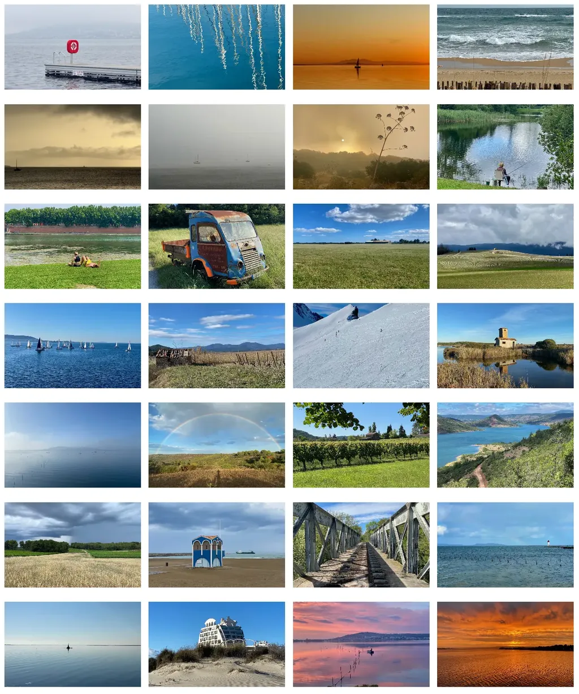
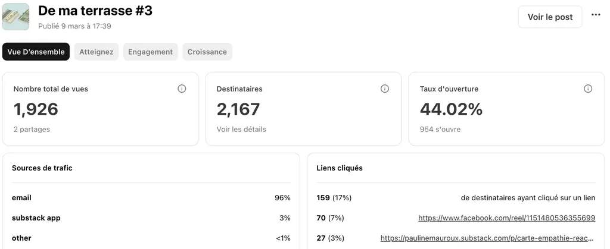

# Pourquoi Substack est en train de tuer les réseaux sociaux traditionnels

Depuis des années, je ne m’intéresse plus à combien vous êtes, mes lecteurs, ni d’où vous venez pour me lire. J’écris en priorité pour mon plaisir, et le vôtre ne peut qu’être un effet collatéral de mon égoïsme.

Je comprendrais que vous vous sentiez mal à l’aise, prêts à cesser de me lire, mais je vous dois un peu de franchise. Peut-être parce que la franchise est aujourd’hui rare quand tout le monde cherche à manipuler tout le monde sur les réseaux sociaux.

Même publier une photo de chat est une tentative de manipulation : je t’attendris, je te fais sourire, je t’énerve et au final je te détourne de choses plus graves, plus belles, plus profondes, souvent plus exigeantes. Manipulation par sédation progressive de l’esprit critique. Qui n’a pas subi cette stratégie, qui n’y a pas collaboré avec des reposts ou des likes ?

Longtemps j’ai publié sur Instagram mes photos de coucher de soleil dans ce seul but : mettre un peu de baume au cœur chez mes amis de la grisaille. Hors du contexte de mes carnets, ces photos n’étaient que des photos de chats déguisées. J’ai cessé d’utiliser Instagram quand j’ai compris sa fonction soporifique.

### Écrire pour ne pas être lu

Quand j’étais journaliste, on nous expliquait comment écrire pour être lu. Comment saisir un lecteur et le garder jusqu’au point final. J’ai vite pris l’habitude de faire le contraire. Plutôt que de proposer des chapôs accrocheurs, j’aime commencer par des anecdotes, comme en ce moment. Je me fiche de l’efficacité d’un texte. Je veux simplement que son écriture m’aide à y voir plus clair en moi et à jouir du monde, soit dans l’instant, soit pour des heures, soit pour la suite de ma vie. Et peut-être que cet article, attaqué sans savoir où il me mènera, aura des conséquences durables et profondes, bien qu’anecdotiques par rapport aux soubresauts du monde (avec lesquels il entretient néanmoins des liens).

Il y a un peu plus d’un mois, j’ai déménagé mes newsletters sur [Substack](https://tcrouzet.substack.com/), et depuis la plateforme m’affiche des statistiques simples mais éclairantes. J’ai commencé par fermer les yeux, par me dire que voir le nombre de lectures me forcerait à écrire plutôt telle chose qui marche que telle autre qui ne marche pas (je ne suis pas imperméable aux influences extérieures — ce qui démontre que je n’écris pas pour mon seul plaisir, sinon je ne publierais pas — j’aime me contredire). Puis j’ai constaté avec surprise que mes carnets étaient davantage lus que mes autres articles, ce qui m’a fait plaisir, parce que c’est dans mes carnets que je me sens le mieux à ma place.

J’ai déjà utilisé une citation de Barthes très éclairante pour moi, mais je vous la redonne : « Je pense que la progression d’une œuvre le long de la vie d’un écrivain ça n’est pas par développement d’une force en soi (c’est-à-dire l’affirmation d’un talent positif), c’est simplement que peu à peu l’écrivain sait de mieux en mieux là où il doit appliquer ses forces, mais pas au-delà de ses forces. » J’applique au mieux mes forces littéraires dans les carnets, forme que je pratique depuis mes 17 ans et à laquelle je reviens toujours.

Les statistiques de [Substack](https://tcrouzet.substack.com/) m’ont conforté dans mon travers plutôt que de me pousser à me remettre en question. Elles m’ont aussi enseigné que les réseaux sociaux comme les moteurs de recherche m’apportaient peu de lecteurs. Ce qui ne m’a pas surpris, mais je ne m’attendais pas à une telle inefficacité.

1. Au commencement des blogs, on se faisait connaître par les commentaires qu’on postait sur les autres blogs et peu à peu collectivement nous avons créé la blogosphère. Il s’agissait d’un réseau social décentralisé d’une magnifique efficacité. Il était non algorithmique, non propriétaire. Difficile de souhaiter mieux. C’était un réseau social organisé autour des auteurs et de leurs écrits.
2. Très vite, Google a pesé de plus en plus lourd dans notre trafic, jusqu’à 50 % pour moi. Mon lectorat est devenu moins social et plus algorithmique, donc contrôlé par une puissance extérieure qui a fini par décider que les liens entre sites étaient une mauvaise chose, ce qui était une façon de rendre le trafic moins social (au passage, à partir de 2007, Google a cassé la blogosphère — [j’ai raconté cette évolution plusieurs fois](https://tcrouzet.com/2025/01/24/technofascisme/) et je le ferai plus en détail dans un prochain livre).
3. Ironie de l’histoire, les réseaux sociaux ont explosé au même moment, peut-être comme réponse à l’agression de Google. Les lecteurs ont commencé à provenir de Facebook puis de Twitter, cette part du trafic devenant prépondérante tandis que le référencement naturel sur les moteurs de recherche devenait une affaire d’experts et donc une affaire onéreuse.
4. J’en étais resté à ce stade et j’annonçais avec discipline mes nouveaux articles sur les réseaux sociaux, parce que c’était devenu la seule façon d’être lu, ou presque (et mon activité sociale se limitait à ce geste promotionnel, quasi pavlovien). Faute de consulter mes statistiques de trafic, je ne m’étais plus posé de question jusqu’à ce que je bascule sur Substack.

### La fin des réseaux sociaux privatifs

Nouvelle surprise, Substack, à lui seul, sans que je fasse quoi que soit, m’envoie autant de lecteurs que toutes les autres sources (réseaux sociaux et moteurs de recherche). Je ne parle pas des lecteurs abonnés à ma newsletter, mais des autres lecteurs, les nouveaux, qui quand ils viennent de Substack ont tendance à s’abonner et donc à rejoindre ma communauté, qui s’est remise à grossir alors qu’elle stagnait depuis des années. J’en étais à un stade d’état critique mais stabilisé : les nouveaux compensaient les partants, sans plus.

Le search ne compte presque plus, mince secteur cyan sur le graphique, et parmi les réseaux sociaux, seul Mastodon a un poids non négligeable. J’en conclus que Substack effectue un meilleur travail promotionnel que moi. Je pense même que je sous-estime ce travail. En effet, dans mon graphique, j’associe Mastodon aux liens directs, car les serveurs Mastodon ne s’identifient pas — ce qui me fait exagérer l’importance de Mastodon, et donc celle de tous les réseaux sociaux versus Substack.

> **Leçon** : en tant qu’auteurs, nous avons intérêt à passer davantage de temps sur Substack qu’ailleurs si nous tenons à démultiplier notre audience Substack.

Pléonasme ? Pas si sûr. Pourquoi mon constat serait-il différent hors de Substack ? Il n’y a aucune raison que les réseaux sociaux et les moteurs envoient davantage de trafic sur mon site personnel (mais je ne peux le confirmer, puisque j’ai désactivé les trackers). 

Pour plus de clarté, voici les statistiques de ma nouvelle newsletter dominicale, [De ma terrasse](https://tcrouzet.substack.com/s/de-ma-terrasse), publiée uniquement sur Substack et promue sur Mastodon, Facebook, LinkedIn et BlueSky. Cette fois les sources extérieures comptent pour moins de 1 %, c’est-à-dire que Substack à lui seul est trois fois plus efficace. Il est vrai que j’ai réduit ma présence sociale, mais ces chiffres m’encouragent à la diminuer plus encore.

L’extérieur ne peut plus être moteur, ce qui est logique puisque les réseaux sociaux ont tendance à se refermer sur eux-mêmes pour garder jalousement leur audience. Ce qui est vrai pour Substack ne peut l’être que pour les sites indépendants.

> **Conclusion**. Les réseaux sociaux n’ont de réel intérêt que quand on cherche à mener une vie numérique chez eux. Il ne sert à rien de s’y époumoner quand on veut se faire entendre en dehors. Mieux vaut construire avec patience une audience et la fidéliser par une newsletter.

Depuis des années, j’entendais parler de la nouvelle vogue des newsletters et me contentais de sourire puisque je publie des newsletters depuis 1998 (celle de bonweb.com avait près de 100 000 abonnés à l’époque). Je n’avais juste pas compris que, hors des newsletters, il n’y avait plus guère de salut dans un web devenu purement algorithmique et totalement biaisé.

Quid de Substack ? Il s’agit d’un énième réseau social, à ceci près qu’il est aujourd’hui possible d’en partir avec son audience pour migrer sur des plateformes comme [Ghost](https://ghost.org/), [Patreon](https://www.patreon.com/fr-FR), [Steady](https://steadyhq.com/fr/). [Molly White a raconté sa migration.](https://www.citationneeded.news/substack-to-self-hosted-ghost/) J’attache beaucoup d’importance à cette liberté. Je prendrai soin de télécharger mon audience une fois par mois, au cas où. Je n’oublie pas que Google a soudain décidé de pénaliser les liens, ce qui a condamné la blogosphère.

Quand j’utilise une plateforme privative comme Substack, je suis désormais sur mes gardes. Je n’oublie pas que tous les services ont commencé par être gratuits et non algorithmiques, avant de se remplir de publicités, puis de fermer leur API, puis nous empêcher de les quitter avec nos abonnés, pour enfin proposer de payer pour leurs fonctions avancées (souvent les fonctions initialement gratuites).

N’empêche, malgré mes craintes instinctives, je prends conscience que les fonctions sociales de Substack me font découvrir de nouveaux auteurs. Je reprends peu à peu des conversations numériques, gagne tous les jours de nouveaux abonnés ce qui ne m’était plus arrivé depuis des années parce que je ne m’exprimais plus dans des lieux propices à l’émulation. En tant que lecteur, j’apprécie le push marketing de Substack parce qu’il me fait découvrir des auteurs intéressants.

### Construire une communauté

Après avoir importé mes 1 000 abonnées historiques depuis MailChimp, j’ai vu mon auditoire progresser automatiquement, ce qui m’a donné envie de tenter une expérience. Pour la plupart, les personnes avec qui j’échange par mail ne me lisent pas, parce qu’elles ne vont pas sur les réseaux sociaux ou parce qu’elles ne font pas l’effort de visiter régulièrement mon blog ou n’utilisent pas de feedreaders.

Je me suis dit pourquoi ne pas les abonner moi-même. J’ai extrait de ma messagerie les 300 contacts avec qui j’ai eu le plus d’échanges durant les dernières années et les ai importés dans Substack. J’ai eu peur de me faire insulter, mais au contraire j’ai reçu des messages de personnes heureuses de recevoir de mes nouvelles et de reprendre le fil de mes articles. Les autres se sont désabonnées d’un simple clic. J’ai fini par importer 1 000 contacts et je n’ai reçu qu’un message m’accusant d’être un spammeur (de la part d’une personne dont j’ignorais même le nom et dont je me demande encore comment l’adresse a terminé dans ma liste).

Un mécontent pour mille me fait comprendre que Substack s’efforce de ne pas emprisonner les abonnés et leur facilite la désinscription. Je ne trouve pas de mauvaise guerre ma tactique : « Vous m’avez écrit plusieurs fois durant les dernières années, je vous écris aussi, et m’excuse par avance si je vous importune. »

Avec ma stratégie, je tente de montrer qu’il existe un autre internet que celui bruyant des réseaux sociaux classiques, où on est obligé de crier plus fort que les autres. Le mail devient un des derniers domaines de liberté numérique, parce que notre email nous appartient, surtout parce que notre carnet d’adresses nous appartient (à condition de disposer d’une copie en local).

C’est une façon de revenir à un mode de communication plus communautaire, plus centré, moins bruyant. C’est aussi combattre les grands réseaux sociaux centralisés et s’opposer à leur propension à propager les deepfakes, les théories complotistes, les idéologies extrémistes, le tout saupoudré de publicités et de vidéos stupides mais addictives. Le mail a donc un rôle politique à jouer. Nos adresses nous permettent de nous relier les uns aux autres et d’échanger des informations sans crainte d’être censurés. J’ai envie de dire : peu importe la technologie utilisée pour envoyer nos mails.

Substack réinvente le réseau social autour de personnes qui écrivent, là où Instagram c’était autour des photos, avant de devenir autour de publicités, là où Twitter c’était autour de fulgurances et de liens instructifs, avant de devenir autour de publicités, là où Facebook n’a jamais été qu’un recueil de témoignages souvent insignifiants.

Qu’on se retrouve autour de textes, d’images dans ces textes, et même de musiques ou de vidéos dans ces textes, je trouve ça rassurant. On réinvente la blogosphère. On pourrait croire qu’on s’enferme sur une énième plateforme, mais non, on remet au goût du jour les conversations autour des lettres, on revient à quelque chose de plus ancien, de plus humain. Je vous écris, vous me répondez si vous le désirez, par un petit mot ou par une longue lettre. Le canal de communication a été rétabli, dans un certain calme, à l’écart d’un monde trop bruyant. Vous n’avez même pas besoin d’aller sur Substack pour lire les textes que je vous envoie avec Substack et si demain je change de prestataire ça ne changera rien pour vous. Je ne dépends en rien de Substack comme s’il s’agissait d’un service décentralisé (à une nuance : Substack analyse nos échanges pour pousser vers nous de nouveaux contenus, mais pour l’instant je trouve intéressant leur boulot).

Tout en écrivant cet article, j’ai pensé aux *Lettres* de Madame de Sévigné.

>*3 mars 1671.* C’est que je me soucie beaucoup de vous, que j’aime à vous entretenir à toute heure, et que c’est la seule consolation que je puisse avoir présentement.

>*15 juillet 1671.* Je me contente de ce qui peut s’écrire, et je rêve tout ce qui peut se rêver : j’en ai le temps et le lieu.

>*15 juin 1680.* Mon Dieu, que je plains ma fille de lire tout ce fatras de bagatelles ! Quelquefois même je me repens de tant écrire, je crois que cela vous jette trop de pensées, et vous fait peut-être une sorte d’obligation de me faire réponse. Ah ! laissez-moi causer avec vous, cela me divertit ; mais ne me répondez point, il vous en coûte trop cher.

>*15 juin 1680.* Je jouis ainsi de cet art ingénieux de peindre la parole et de parler aux yeux.

Peut-être écrire plus intime, partager les troubles de l’existence, sans en même temps raconter sa vie, répondre à un besoin de communion…

Ma prochaine étape : quitter tous les réseaux sociaux algorithmiques. Mes groupes vélos me retiennent encore sur Facebook, parce que je les utilise pour organiser mes randonnées. Je réfléchis à créer un Substack vélo, et puis je dirai bye bye à Facebook.

#netculture #y2025 #2025-3-11-17h00
