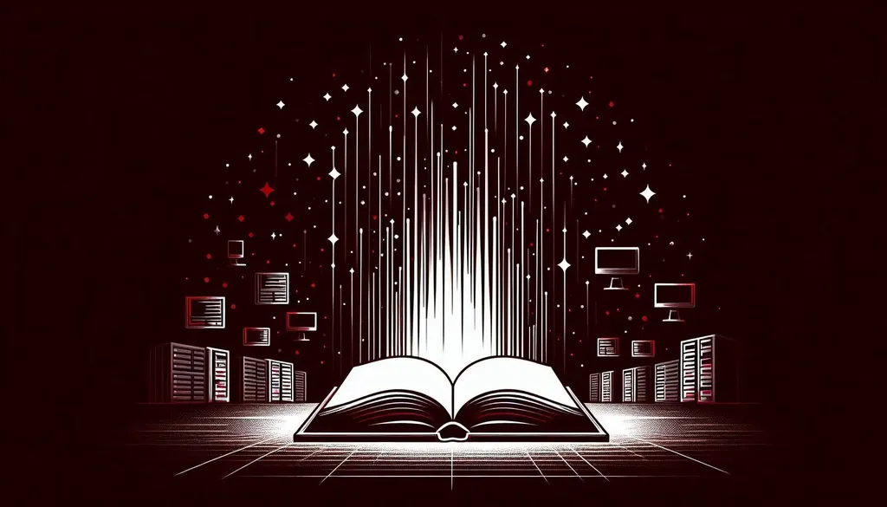
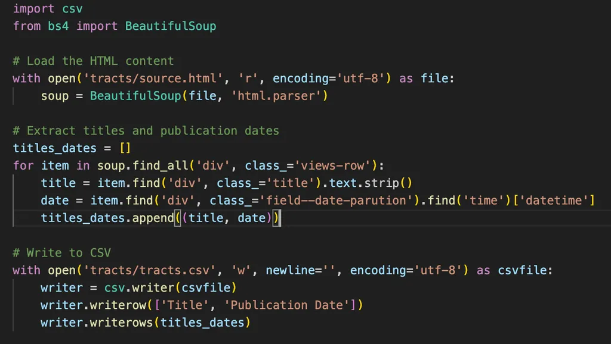

# Comment écrire un Tract pour Gallimard

Une amie me dit pourquoi tu n’écrirais pas un essai pour [notre collection Tracts](https://www.gallimard.fr/catalogue?f%5B0%5D=collection_serie%3A34775).

Des idées me viennent tout de suite :

* Comment résister au technofascisme
* Nous sommes dix millions sur le Fediverse, pourquoi pas vous ?
* Pourquoi encore écrire quand les IA le font très bien ?
* Les IA vont-elles tuer la littérature ?

Pour aller plus loin, je brainstorme avec les IA.

### Étape 1 : les données

J’évite de gamberger dans le vide. Via [Dust](https://dust.tt/), je commence par donner le lien du catalogue Tracts aux IA (ChatGPT, Claude, Mistral… en même temps), mais aucune n’est capable de générer un tableau avec la totalité des titres. Je finis par copier le code HTML des pages web de Gallimard et les coller bout à bout dans un fichier. J’importe ce fichier dans Dust et demande à ChatGPT : « Donne-moi le code Python pour générer le CSV de tous les titres avec leur date de sortie. » Je dispose désormais d’un tableau avec tous les titres de la collection Tracts.

### Étape 2 : la contrainte

Avant de trouver des idées et des titres, il me faut analyser la structure des titres existants.

Prompt : « Analyse les titres de la collection Tracts (fichier tracts.csv), en tenant compte de leur évolution au fil des années. Retrouve des caractéristiques communes, des patterns formels, longueur min, max et moyenne des titres, leur style, les grandes thématiques. »

Réponse de Claude (la plus claire) :

1/ **Évolution quantitative**

- 2020 est l’année la plus prolifique avec 85 titres, largement due à la crise du Covid.
- Les autres années comptent entre 9 et 14 titres en moyenne.
- La collection démarre en 2019 avec 11 titres.
- 2025 débute avec 3 titres.

2/ **Caractéristiques formelles des titres**

- Longueur moyenne globale : 22,1 caractères.
- Titre le plus court : 7 caractères (ex : *Vouloir*, *Je veux*).
- Titre le plus long : 59 caractères.
- Tendance à l’allongement des titres : de 20,8 caractères en 2019 à 34 caractères en 2025.

3/ **Styles de titres**

- Titres affirmatifs majoritaires.
- 5 titres interrogatifs au total (ex : *Combien vaut une vie ?*, *Croire en Dieu. Pourquoi ?*).
- 45 titres commençant par un article (le, la, les, un, une).
- 1 titre commençant par *Contre*.
- 8 titres commençant par une préposition.

4/ **Grandes thématiques**

a) Crises et actualités

- Covid-19 (nombreux titres en 2020)
- Guerre (Ukraine-Russie, *La dernière guerre ?*)
- Politique (*Municipales*, *Contre la proportionnelle*)
- Société (*La Société des vulnérables*, *Préférence nationale*)

b) Questions sociétales

- Éducation (*Urgence pour l’école républicaine*)
- Santé (*L’Hôpital, une nouvelle industrie*, *Écrans, un désastre sanitaire*)
- Religion et laïcité (*France laïque*, *Abus sexuels dans l’Église catholique*)
- Environnement (*Le Siècle Vert*)

c) Réflexions philosophiques et existentielles

- Temporalité (*Le Temps présent*, *Toute la vie devant nous*).
- Humanisme (*Le soin est un humanisme*).
- Liberté et démocratie (*Sans la liberté*, *De la démocratie en Pandémie*).

5/ **Particularités stylistiques**

- Usage fréquent de la métaphore (*L’Europe fantôme*).
- Titres binaires avec virgule ou tiret (*Ukraine-Russie*, *Chine-Russie*).
- Citations entre guillemets (« *Speak White!* », « *La dernière guerre ?* »).
- Références culturelles ou historiques (*En l’an 1349*, *Bonjour monsieur Orwell*).

6/ **Évolution thématique**

- 2019 : focus sur des questions sociétales générales.
- 2020 : dominée par la crise Covid.
- 2021-2025 : diversification des sujets avec accent sur les crises contemporaines (guerre, écologie, société).

Cette collection se caractérise par sa réactivité à l’actualité tout en maintenant une réflexion de fond sur les grandes questions sociétales et philosophiques de notre temps.

### Étape 3 : test de mes titres

Prompt : « Voici des titres d’essais que j’aimerais écrire pour cette collection. {liste des titres} Qu’en penses-tu ? Comment tu les réécrirais pour qu’ils cadrent mieux avec les titres existants ? N’hésite pas à proposer des variantes pour chacun. »

Réponsede Claude :

**Comment résister au technofascisme**

Variantes :

- *Le Technofascisme en marche* (plus affirmatif, style collection
- *Résister aux machines* (plus concis, percutant).
- *La Dictature numérique* (métaphorique, style collection)
- *L’Empire des algorithmes* (métaphorique, évocateur)

**Nous sommes dix millions sur le Fediverse pourquoi pas vous ?**

Variantes :

- *L’Exode numérique* (plus concis, métaphorique)
- *Fediverse, l’autre réseau* (style collection)
- *La Grande Migration* (métaphorique, mystérieux)
- *Au-delà des plateformes* (style collection)

**Pourquoi encore écrire quand les IA le font très bien ?**

Variantes :

- *L’Écriture après l’IA* (style collection)
- *Le Dernier Écrivain* (provocant, style collection)
- *Écrire encore* (minimaliste, style collection)
- *L’Écrivain et la machine* (opposition classique)

**Les IA vont-elles tuer la littérature ?**

Variantes :

- *La Littérature à l’heure des machines* (style collection)
- *Littérature année zéro* (référence au style *Santé publique année zéro*)
- *Le Grand Remplacement littéraire* (provocant)
- *L’Art contre les algorithmes* (opposition forte)

**Justifications**

- Les titres proposés sont plus courts (moyenne de 20-25 caractères)
- Ils évitent les questions directes (rare dans la collection)
- Ils utilisent plus souvent l’article défini en début de titre (style collection)
- Ils privilégient les métaphores et les formulations percutantes
- Ils s’inscrivent dans la tradition des titres de la collection qui opposent souvent deux concepts ou créent une tension
- Ils gardent la force du propos tout en étant plus littéraires

La collection privilégie des titres qui font réfléchir par leur formulation plutôt que par des questions directes. Les titres les plus efficaces sont souvent ceux qui posent une affirmation forte ou utilisent une métaphore évocatrice.

### Étape 4 : titres retenus

* *Le Technofascisme en marche*
* *Fediverse, l’autre réseau*
* *Le Dernier Écrivain*
* *Le Grand Remplacement littéraire*

### Étape 5 : le brainstorming

Il est temps de voir comment les IA peuvent m’aider à trouver des idées. Sur Dust, je crée un assistant auquel je donne accès mon blog, à l’intégralité de mon carnet entre 2015 et 2025 sous forme texte et tracts.csv.

Prompt : « Sur le modèle des livres de la collection Tracts, imagine dix titres provocants que pourrait écrire Thierry Crouzet. Évite le blabla. »

Réponse (je mets en évidence ce qui n’est pas à côté de la plaque).

1. **Le Vélo contre l’État** — Sur l’absurdité des règles imposées aux cyclistes et la liberté comme acte de résistance (je n’avais pas du tout pensé que je pouvais écrire sur le vélo dans ce cadre)

2. **La Dictature des Likes** — Comment les réseaux sociaux ont créé une nouvelle forme de totalitarisme mental.

3. *Pourquoi je n’écris plus de romans* — Manifeste contre la fiction dans un monde déjà fictionnel (mais j’en écris encore des fictions, je les crois même indispensables).

4. **Les Vaccins sont communistes** — Plaidoyer pour la mise dans le domaine public des innovations médicales (à écrire avec Didier Pittet).

5. **L’Écrivain doit mourir** — Sur la fin nécessaire de la figure romantique de l’auteur.

6. *Le Midi contre Paris* — Manifeste pour une décentralisation radicale de la culture.

7. *Pourquoi je déteste les éditeurs* — Sur l’absurdité du système éditorial contemporain (je le garde parce que très mal à propos puisque je cherche une idée pour un texte à faire éditer).

8. **Les Complotistes ont raison** — Comment la complexité du monde nous rend tous paranoïaques.

9. *La France est foutue* — Chronique d’un effondrement administratif (drôle d’idée de me proposer un tel sujet).

10. **Tuer Facebook** — Manuel de désobéissance numérique.

Je relance la machine avec « Je retiens 1, 2, 4, 5, 8 et 10. Creuse ces pistes avec dix nouvelles idées sans reprendre celles énoncées (que je désapprouve). » J’insiste, quelques nouvelles idées émergent.

* *La Trace comme œuvre d’art* — Le GPS réinvente la littérature.
* *Le Journal contre le roman* — La vérité de l’instant contre la fiction.
* *Désobéir aux algorithmes* — Pour une reconquête de notre humanité.
* *La Liberté se construit* — Manifeste pour l’action créatrice.

Je finis par m’étonner de ne pas voir de sujet en rapport avec les IA.

* *Écrire avec l’ennemi* — L’écrivain face aux IA génératives
* **J’ajoute** : *Écrire contre l’ennemi* (c’est plutôt ce à quoi je m’essaie quand j’écris)
* *La Dernière Génération d’écrivains* — L’art à l’heure des IA
* **J’ajoute** : *Écrire pour les machines* — nous ne serons plus lus en profondeur que par les IA
* *Le Cerveau augmenté* — Comment l’IA transforme notre façon de penser

J’insiste…

* *L’IA nous lit* — Comment les algorithmes digèrent la littérature
* *Les Nouveaux Illettrés* — Quand les IA comprendront mieux les textes que nous
* *Résister aux prompts* — Pour une écriture indomptable
* *L’Écrivain face au miroir* — Ce que les IA révèlent de notre créativité
* *Les Mots ne nous appartiennent plus* - Comment les IA ont volé notre langage
* *Le Grand Plagiat* — Nos textes dans le ventre des IA
* *La Fin de l’auteur* — Pourquoi nous devons réinventer l’écriture

### Étape 6 : le bilan

À ce stade, je commence à surchauffer. Je demande à Claude : « Extrais de nos échanges racontés ci-dessous les titres les plus porteurs et les plus en adéquation avec la collection Tracts et son évolution. » 

Réponse :

Voici les titres les plus pertinents pour la collection Tracts, sélectionnés selon les critères stylistiques et thématiques de la collection.

**Titres sur le numérique et la société**
- *La Dictature numérique* (concis, métaphorique, dans l’esprit de la collection)
- *L’Empire des algorithmes* (évocateur, style collection)
- *L’Exode numérique* (métaphore forte, concision)
- *Désobéir aux algorithmes* (appel à l’action, style collection)

**Titres sur l’écriture et les IA**
- *Le Dernier Écrivain* (provocant, concis)
- *Littérature année zéro* (référence au style de la collection)
- *Écrire contre l’ennemi* (tension dramatique, style collection)
- *Les Mots ne nous appartiennent plus* (formulation percutante)

**Titres sur des sujets sociétaux**
- *Le Vélo contre l’État* (opposition forte, style collection)
- *Les Vaccins sont communistes* (provocateur, style collection)
- *La Trace comme œuvre d’art* (réflexion culturelle)
- *La Liberté se construit* (affirmatif, style collection)

Ces titres sont particulièrement réussis car ils :

- Respectent la longueur moyenne des titres de la collection
- Utilisent des formulations affirmatives plutôt qu’interrogatives
- Emploient des métaphores fortes
- Créent une tension ou une opposition
- S’inscrivent dans les thématiques contemporaines de la collection
- Évitent le style direct des questions
- Privilégient souvent l’article défini en début de titre

**Les plus prometteurs :**

1. *L’Empire des algorithmes* (synthétise parfaitement la question du pouvoir technologique)

2. *Le Dernier Écrivain* (dramatique et évocateur)

3. *Désobéir aux algorithmes* (appel à l’action dans l’esprit de la collection)

4. *Le Vélo contre l’État* (opposition politique claire)

### Étape 7 : laisser décanter

Ce que je retiens pour le moment…

* *Pédaler, c’est politique* (que je trouve moins ambigu que *Le Vélo contre l’État*)
* *Le Dernier Écrivain*
* *Le Technofascisme en marche*
* *Le Grand Remplacement littéraire*
* *L’Exode numérique*
* *Écrire contre l’ennemi*
* *Les Mots ne nous appartiennent plus*
* *Les Vaccins sont communistes* (avec Didier)
* J’ajoute le trop classique : *L’IA m’a tué*
* *Écrire pour les machines*

### Étape 8 : la collection tracts

Quand on cherche à écrire pour une collection, il faut lire quelques-uns de ses textes, mais aussi disposer de données objectives sur leur structure. Dans Dust, j’ai créé un corpus avec une vingtaine de textes de la collection et un TractsSpecialist dédié.

**RÉPONSE**

1/ **Structure et format**

- Des textes courts (entre 60 000 et 85 000 signes environ)
- Une structure claire avec chapitres et sous-parties numérotés 
- Des titres et sous-titres explicites qui guident la lecture
- Un découpage en paragraphes aérés

2/ **Style narratif**

- Un style direct et accessible, sans jargon inutile
- Un ton engagé et assumé, l’auteur défend clairement une thèse
- Un équilibre entre analyse critique et propositions constructives
- L’utilisation fréquente de la première personne (*je*, *nous*) qui implique l’auteur

3/ **Temps de la narration**

- Principalement au présent de l’indicatif pour ancrer le propos dans l’actualité
- Alternance avec le passé composé pour les exemples et faits historiques
- Utilisation du futur pour les propositions et perspectives

4/ **Construction argumentative**

- Une introduction qui pose clairement le problème et la thèse défendue
- Un développement qui alterne :
  * Analyses de situations concrètes 
  * Références historiques ou juridiques
  * Exemples précis et documentés
  * Contre-arguments anticipés et réfutés
- Une conclusion qui ouvre des perspectives

5/ **Tonalité**

- Un style polémique, mais rigoureux
- Une approche pédagogique qui explique sans condescendance
- Un engagement citoyen affirmé
- Un optimisme raisonné malgré la gravité des sujets

6/ **Documentation**

- Des sources précises citées en notes
- Des références bibliographiques
- Des citations d’experts ou de textes de référence
- Des données chiffrées pour étayer l’argumentation

7/ **Public visé**

- Un lectorat éclairé et engagé
- Des citoyens soucieux de comprendre les enjeux de société
- Des acteurs de la vie publique (élus, responsables associatifs…)

8/ **Objectifs**

- Éclairer un débat de société
- Proposer des solutions concrètes
- Susciter une prise de conscience
- Inciter à l’action citoyenne

La collection Tracts se caractérise donc par des textes courts mais denses, alliant rigueur analytique et engagement citoyen, dans un style accessible qui vise à éclairer les grands débats contemporains et à proposer des perspectives d’action.

Ces règles d’écriture permettent de produire des ouvrages à la fois exigeants sur le fond et efficaces dans leur capacité à toucher un large public, fidèles à la tradition des *tracts* comme outils d’intervention dans le débat public.

### Étape 9 : plan

Comme je le dis souvent, je n’écris pas avec les IA, mais je les utilise pour brainstormer comme je le fais en ce moment. J’évite de planifier, j’aime que l’écriture m’emporte et me pousse à découvrir des points auxquels je n’ai jamais pensés (quitte à tout réécrire). Mais pour l’exercice, voici le prompt que je soumets à TractsSpécialist :

« Je veux écrire pour la collection Tracts : *Le Technofascisme en marche*. Quelques idées : point historique sur collusion entre fascisme et industrie, comment le technofascisme induit un technosolutionnisme qui peut s’avérer très dangereux pour affronter la crise climatique, peut-être commencée par le salut nazi de Musk lors de l’investiture de Trump, expliquer comment nous pouvons lutter contre le technofascisme au quotidien, tant à titre individuel que collectif et institutionnel. Je te colle [mon dernier article sur le technofascisme](https://tcrouzet.com/2025/01/24/technofascisme/). Propose un plan en accord avec le style de la collection. »

Après quelques échanges et demande d’ajustements j’aboutis à un plan plutôt cohérent qui commence par l’alerte, explique l’histoire et se termine par des calls to action.

**INTRODUCTION**

- La scène du salut nazi de Musk : symbole d’une dérive prévisible
- La centralisation comme ADN commun du fascisme et de la tech
- Annonce de la thèse : seule la décentralisation peut nous sauver

1/ **LA CENTRALISATION, MATRICE DU FASCISME**

A. Les leçons de l’Histoire

- Le fascisme historique comme régime de la concentration
- La collusion entre État centralisé et grandes industries
- L’élimination systématique des contre-pouvoirs
- L’exemple d’IBM et du nazisme

B. Le retour du même

- La Silicon Valley comme nouvelle oligarchie
- La concentration du pouvoir informationnel
- Le contrôle des infrastructures numériques
- La captation des données personnelles

C. Une mécanique implacable

- La centralisation engendre la centralisation
- L’effet d’échelle comme justification
- L’illusion de l’efficacité par la concentration

2/ **L’ARCHITECTURE TECHNIQUE DE LA DOMINATION**

A. Les fondations du contrôle

- L’unicast : péché originel d’Internet
- Les datacenters comme nouveaux centres du pouvoir
- Les protocoles centralisés contre le web originel

B. La fin des espaces libres

- L’agonie de la blogosphère
- La captation des conversations par les plateformes
- La mort du web décentralisé

C. L’IA comme accélérateur

- La nécessité technique de la centralisation
- Le mythe de l’IA générale
- La consolidation du pouvoir oligarchique

3/ **LE TECHNOSOLUTIONNISME, PIÈGE MORTEL**

A. L’idéologie de la solution unique

- La croyance en la technologie salvatrice
- Le mépris des solutions locales
- L’obsession de l’échelle globale

B. L’impasse climatique

- L’échec des solutions technologiques centralisées
- La nécessité d’approches locales et diversifiées
- Le mirage de la géo-ingénierie

C. La fuite en avant

- L’accumulation des problèmes
- L’aggravation des inégalités
- La perte de résilience systémique

4/ **LES ARMES DE LA RÉSISTANCE**

A. Le livre, technologie de liberté

- Un objet hors de portée des algorithmes
- Une expérience de lecture non surveillée
- Un support qui traverse le temps
- Le livre comme espace de pensée complexe

B. Les bastions de la résistance

- Les librairies indépendantes comme réseau décentralisé
- Le conseil humain contre la recommandation algorithmique
- L’édition indépendante comme contre-pouvoir
- La bibliodiversité contre la pensée unique

C. La décentralisation numérique

- Les outils existants (Mastodon, etc.)
- Les blogs et sites personnels
- L’auto-hébergement
- Les protocoles décentralisés

D. L’action collective

- Le soutien aux alternatives locales
- La création de communs numériques
- L’éducation aux enjeux de la décentralisation

E. Les leviers institutionnels

- Le démantèlement des monopoles
- L’obligation d’interopérabilité
- Le soutien public aux alternatives

**CONCLUSION**

- La décentralisation comme impératif démocratique
- Le livre et le numérique libre comme outils complémentaires
- L’appel à l’action individuelle et collective
- L’urgence d’agir avant le point de non-retour

**ANNEXES**

- Ressources et outils pour la décentralisation
- Liste de lectures recommandées
- Glossaire technique
- Notes et références

Ce plan détaillé :

- Suit une progression logique du constat à l’action
- Alterne théorie et exemples concrets
- Met en valeur le livre comme outil de résistance
- Propose des solutions à différentes échelles
- Reste accessible tout en étant rigoureux
- S’inscrit dans la tradition des Tracts Gallimard

Le texte devra maintenir un style :

- Engagé mais documenté
- Accessible mais non simpliste
- Incitatif à l’action
- Valorisant la culture livresque

### Étape 10 : mon sujet

Tout en discutant avec l’assistant, j’ai repensé à une idée qui m’est chère, que j’ai traduite en prompt : « Le livre comme arme de résistance au technofascime pourrait être mon sujet. Les livres sont des objets décentralisés (en tant qu’objets et par leur mode de distribution), nous pouvons les échanger et ils ne peuvent pas être censurés une fois publiés (sauf situation extrême des autodafés). C’est sous l’angle de la défense du livre que je pourrais dénoncer le technofascisme. Tu peux me proposer des titres en accord avec ceux de la collection (consulte le fichier tracts.csv). »

Malgré quelques requêtes insistantes, je n’obtiens rien de bon, mais durant ce processus, une idée me vient : *Le livre contre-attaque* (avec l’analogie à Star-Wars).

### Étape 11 : nouveau plan

Je demande un nouveau plan, qui pose des idées générales.

**INTRODUCTION**

Le salut nazi de Musk comme point de bascule

Le technofascisme déjà là : surveillance, manipulation, centralisation

Le livre comme arme historique contre les totalitarismes

Thèse : le livre, par sa nature décentralisée, est l’outil idéal de résistance

1/ **LE TECHNOFASCISME EN MARCHE**

A. La nouvelle dictature invisible

Des écrans omniprésents aux esprits surveillés

L’emprise des algorithmes sur nos vies

La centralisation comme mécanisme de contrôle

B. Les nouveaux maîtres du monde

Des GAFAM aux oligarques de la tech

La collusion entre pouvoir technologique et politique

La captation des données comme source de pouvoir

C. L’architecture de la servitude

L’Unicast et les datacenters : la centralisation technique

La fin programmée du web libre

L’IA comme accélérateur de contrôle

2/ **LE LIVRE, TECHNOLOGIE DE LA LIBERTÉ**

A. Un objet naturellement rebelle

Impossible à censurer une fois publié

Intraçable dans sa circulation

Imperméable à la surveillance

B. Une expérience hors contrôle

La lecture comme moment d’intimité absolue

L’absence de tracking et de manipulation

La construction d’une pensée autonome

C. Un réseau naturellement décentralisé

Les librairies comme maillage territorial de résistance

Les bibliothèques comme espaces de liberté

Les éditeurs indépendants comme contre-pouvoir

3/ **ANATOMIE D’UNE RÉSISTANCE**

A. Le livre contre la centralisation

Un objet qui échappe aux monopoles

Une production distribuée

Une diffusion incontrôlable

B. Le livre contre l’accélération

Le temps long contre l’instantanéité

La réflexion contre la réaction

La profondeur contre le scroll infini

C. Le livre contre l’uniformisation

La bibliodiversité contre la pensée unique

Le conseil humain contre l’algorithme

L’édition indépendante contre les monopoles

4/ **COMMENT LE LIVRE PEUT SAUVER LA DÉMOCRATIE**

A. Les actions individuelles

Privilégier les librairies indépendantes

Pratiquer le bookcrossing

Créer des bibliothèques parallèles

B. Les actions collectives

Soutenir les éditeurs indépendants

Défendre les bibliothèques publiques

Créer des clubs de lecture

C. Les actions institutionnelles

Protéger le prix unique du livre

Soutenir le réseau des librairies

Développer l’éducation à la lecture critique

**CONCLUSION**

Le livre comme dernier espace de liberté

L’urgence de la résistance par la lecture

Appel à l’action : lire, faire lire, partager

### Étape 13 : dernier test

Je demande la validation de mon titre.

**RÉPONSE**

*Le livre contre-attaque* s’inscrit bien dans la collection Tracts.

1/ **Structure du titre**

- Court et percutant (3 mots)
- Utilise l’article défini *Le* en début de titre, comme beaucoup de titres de la collection (*Le Siècle Vert*, *Le 8-Octobre*, *Le Nouvel Opium des progressistes*)
- Formulation directe et affirmative, similaire à *Tenir la ligne* ou *Résister à la corruption*

2/ **Positionnement thématique**

- S’inscrit dans la lignée des titres de résistance et de combat comme :
  * *Résister à la corruption*
  * *Tenir la ligne*
  * *Premiers combats*
- Fait écho aux titres d’opposition comme :
  * *Zemmour contre l’histoire*
  * *Contre la proportionnelle*

3/ **Style**

- Évoque une action, comme *Aider à vivre* ou *Tenir la ligne*
- Suggère un conflit, comme dans *La dernière guerre ?*
- Dynamique et combatif, dans l’esprit de *Au-devant des périls*

4/ **Contexte contemporain**

- S’inscrit dans les préoccupations actuelles comme :
  * *Écrans, un désastre sanitaire*
  * *L’Opinion qui ne dit pas son nom*
- Évoque une résistance culturelle, comme *Le français va très bien, merci*

Le titre fonctionne particulièrement bien :

- Est simple mais puissant
- Évoque une action de résistance
- S’inscrit dans une tradition de titres combatifs de la collection
- Suggère une confrontation culturelle importante
- Reste accessible tout en portant un message fort

En conclusion, *Le livre contre-attaque* s’intègre naturellement dans la collection, tout en gardant une originalité propre. Il suit les codes stylistiques tout en apportant sa propre force évocatrice.

### Étape 13 : écrire

Il n’est plus question d’utiliser les IA, sinon pour effectuer des recherches. Quand j’aurai un premier jet du manuscrit, je les utiliserais à nouveau pour le mettre à l’épreuve. Reste à savoir si je vais écrire *Le livre contre-attaque*. Peut-être est-ce la meilleure façon de poursuivre cette expérience et d’en documenter l’écriture. Il y aurait l’essai et l’histoire de l’essai.

### Étape 14 : le manuscrit

Finalement, j’ai écrit le premier jet du manuscrit en cinq jours, début février, je l’ai proposé à Gallimard qui a fini par le refuser, j’imagine qu’ils donneront le sujet à traiter à un de leur auteur maison, mais je suis sûr qu’aucun d’eux n’osera dire ce que je dis dans ce texte, parce que la lutte contre le technofascisme passe par la décentralisation, le pluralisme, le logiciel libre et le libre partage. En prime j’ai vécu toute cette histoire en direct depuis 40 ans et suis plutôt bien placé pour la raconter.

Maintenant, je dois publier le texte vite parce qu’il est d’une actualité brûlante. Je ne peux me contenter de le diffuser en ligne, parce que j’y démontre que le livre papier a son rôle à jouer dans la lutte contre le technofascisme.

### Étapte 15 : mon intro

**L’inquiétude ne cesse de s’accroître face aux poussées autoritaristes qui animent les dirigeants politiques, en Russie, en Chine, aux États-Unis, au cœur même de l’Europe, pourtant construite pour éviter la répétition des horreurs passées.** Dans ce contexte anxiogène, et après la victoire de Donald Trump, élu quarante-septième président des États-Unis, difficile de ne pas interpréter le bras droit levé d’Elon Musk, tendu, main horizontale, comme un salut nazi plutôt qu’un simple geste d’exaltation. Des observateurs ont qualifié ce moment, le 20 janvier 2025 à Washington, du jour zéro du technofascisme. En vérité, le technofascisme est en marche depuis des décennies. L’arrivée de Musk, l’homme le plus riche du monde, au sommet de la démocratie étasunienne, que ce soit provisoirement ou durablement, nous fait passer de la crainte du pire au pire. Pour nous défendre, à titre individuel, collectif et institutionnel, il ne nous reste que les livres et les autres objets culturels qui circulent comme eux, à travers un réseau de distribution maillé à la surface des territoires, hors de la juridiction des centres de pouvoir oligarchique. Après l’inquiétude monte l’espoir d’un réveil. Le Livre avec un grand L contre-attaque, et ce petit texte part à l’assaut des murailles adverses.

#netlitterature #y2025 #2025-3-14-16h00
