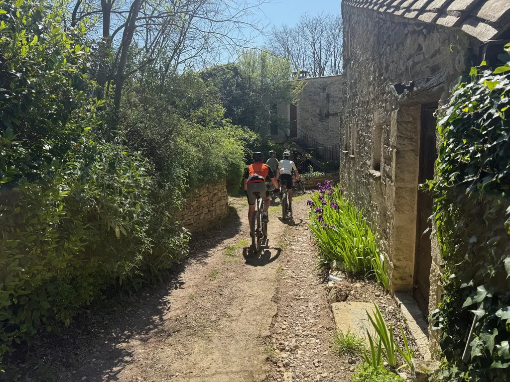
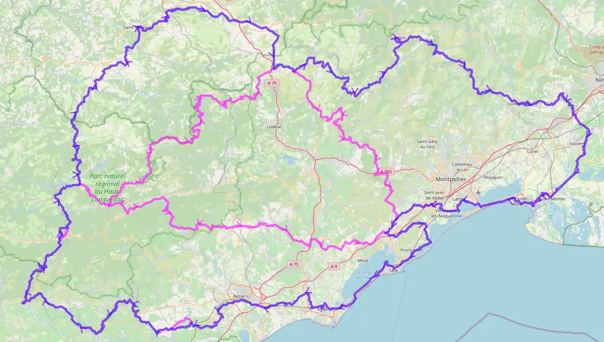
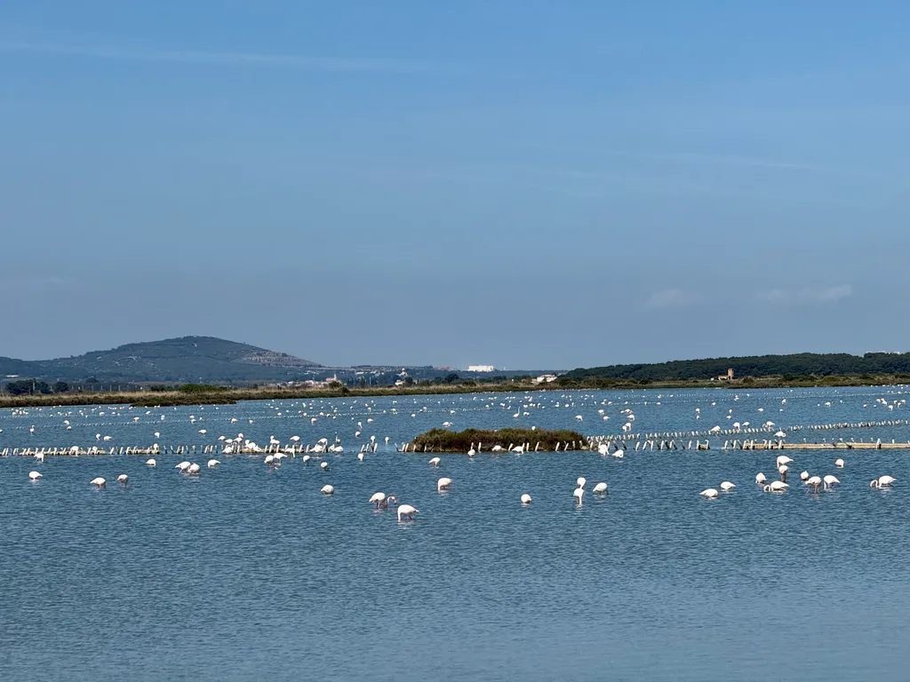
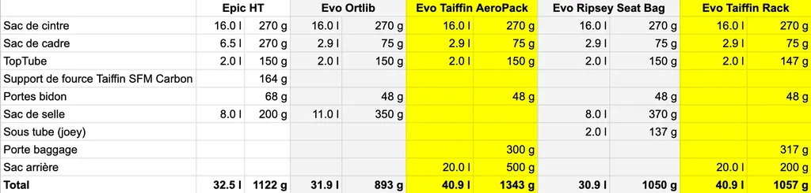

# Bikepacking : 727 VTT 2025 - Grand Départ le 8 mai

Maintenant que j’ai quitté les réseaux sociaux centralisés, je n’ai plus que mon blog et mes newsletters pour vous donner des nouvelles. Je suis passé sur un mode promotionnel aussi minimaliste que mes 727. Et je me sens beaucoup mieux, en accord avec moi-même et les valeurs que je défends tant dans le vélo qu’en dehors.

Et donc, [le 727 VTT](https://727bikepacking.fr/727/) approche : départ le jeudi 8 mai, [inscriptions possibles jusqu’au dimanche 4](https://www.helloasso.com/associations/ec-poussan/evenements/o727-2025). Nous sommes pour l’instant 25 partants. Je fignolerai la trace jusqu’au dernier moment, sachant que cette année je reviens au format des premiers 727 VTT : certains secteurs seront « aventure », c’est-à-dire non reconnus.

Pas de panique : une trace 100 % reconnue sera disponible, mais ceux qui le souhaitent pourront m’accompagner dans la reco d’un nouvel itinéraire entre La Salvetat sur Agout et La Couvertoirade, boucle nord de la trace. En magenta, vous voyez les différents shortcuts. Possible de faire un trois ou quatre jours avec retour depuis Labastide-Rouairoux.

Cette année, avec les copains, on a décidé d’effectuer la trace sur six jours plutôt que sur cinq, question de ne pas finir rincés, d’autant que si le dénivelé est toujours autour de 10 000 m, le kilométrage a augmenté.

Pas mal de nouveautés un peu partout sur la trace. On part par la Gardiole, on continue par le lido, puis remonte jusqu’à Béziers avant d’enchaîner les mamelons de l’Aude jusqu’à Bize Minervois. Bon point de bivouac pour le J1 après 150 km et environ 1 000 de d+. Le lendemain, le but : remonter la montage Noire jusqu’à Labastide-Rouairoux, environ 90 km et 2 000 de D+. Garder des forces pour le J3 qui sera le plus rude avec une centaine de kilomètres et plus de 2 500 m de d+ pour atteindre idéalement Montlaur ou Saint-Afrique. J4 : redescente à travers le Larzac pour sans doute bivouaquer dans la vallée de la Buèges. En J5, le pays des Garrigues selon l’itinéraire classique avant d’enchaîner des singles de folie après Sommières dans le Gard. J6 : retour plus paisible par la plaine littorale.

On se retrouve le 7 mai en fin d’après-midi [au Grand Café](https://727bikepacking.fr/access/) pour refaire le monde.

[Toutes les infos sur le site 727…](https://727bikepacking.fr/)

J’en profite pour partager un comparatif bagagerie. J’hésite encore à monter [un porte-bagages Tailfin](https://www.tailfin.cc/pannier-rack/?v=82a9e4d26595), avec sac Lucy Rujdan fixé par des Voile Straps. Pénalité poids : 200 g environ pour un bonus volume de 10 litres et utilisation plus efficacement la tige de selle télescopique. Ma config standard est Evo Ortlib.

### Autres news

[Le 727 gravel du 27 septembre se remplit gentiment](https://727bikepacking.fr/g727-Grand-Depart/) (l’année dernière : 87 partants — suis curieux de voir comment fonctionnera le bouche-à-oreille cette année).

Vous êtes toujours les bienvenus pour une escapade VTT Paris-Bretagne-Paris du 13 au 23 juillet (contactez-moi en direct). Pourquoi VTT ? Parce que difficile d’assurer que la trace sera gravel puisqu’elle ne sera pas reconnue.

Faites passer le mot.

#velo #727bikepacking #y2025 #2025-4-18-21h00
