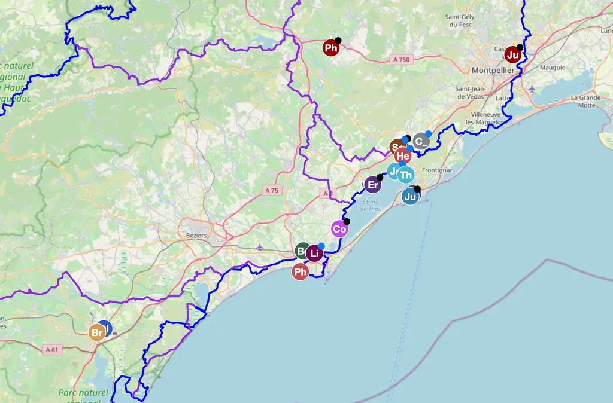
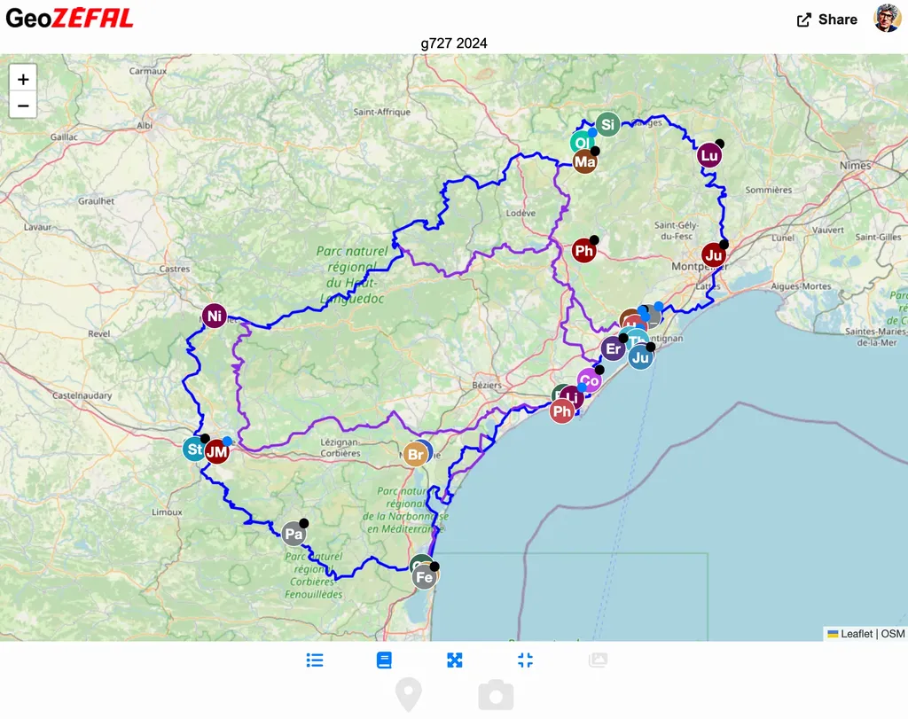
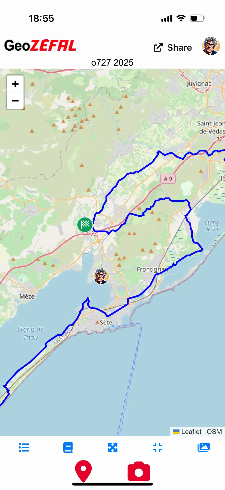

# Géolocalisez vos aventures avec GeoZéfal

Pour partager sa progression sur une trace, rassurer la famille, savoir où en sont les autres cyclistes, il existe pas mal de solutions, la plupart payantes, et parmi les gratuites aucune qui ne faisait exactement ce dont j’avais besoin pour [les 727](https://727bikepacking.fr/). C’est ainsi que je me suis mis à développer [Geogram, un solution gratuite et libre](https://github.com/tcrouzet/geogram).

Depuis l’automne 2024, Zéfal est devenu partenaire en finançant l’hébergement de l’application, désormais accessible à l’adresse [geo.zefal.com](https://geo.zefal.com/). Durant l’hiver, j’ai repris le code pour transformer Geogram en une web app, c’est-à-dire une application à part entière qui peut-être [appelée depuis une icône sur l’écran d’un mobile](https://geo.zefal.com/help) (solution adoptée, par [VisuGPX](https://www.visugpx.com/) par exemple)

Une web app ne nécessite pas de passer par les stores, de payer une contribution aux opérateurs et permet un développement ouvert. C’était pour une offre gratuite le meilleur choix, même si les possibilités d’accéder aux ressources système sont plus limitées qu’avec des app natives.

J’en ai profité pour rendre Geogram indépendant de la messagerie Telegram. On peut directement créer des routes ou en rejoindre tout en invitant des amis partagés nos aventures, mais rien n’empêche d’associer un canal Telegram à une route Geogram. J’ai tenté de proposer le meilleur des deux mondes.

Si vous utilisez la web app, n’hésitez pas à me signaler les bugs ou à me suggérer des améliorations. [Si des fonctions vous paraissent obscures, j’essaierais de mieux les expliquer dans l’aide.](https://geo.zefal.com/help).

Le 8 mai, nous partons sur [le o727 2025](https://727bikepacking.fr/727/) et vous pourrez nous suivre sur [la page dédiée de Geogram](https://geo.zefal.com/o727-2025). De même, Zéfal organise tout au long de l’année le [Challenge Tour Magne](https://tourmagne.bike/), [aussi sur Geogram](https://geo.zefal.com/tourmagne-live). À vous d’ajouter vos voyages, de les rendre publics ou de les garder privés.

#velo #y2025 #2025-4-30-20h00
