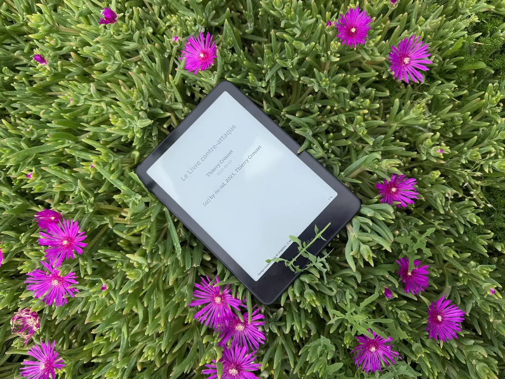
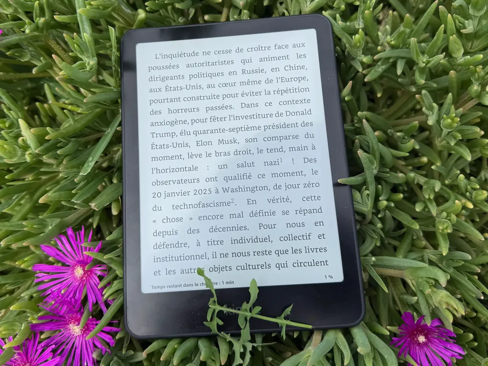
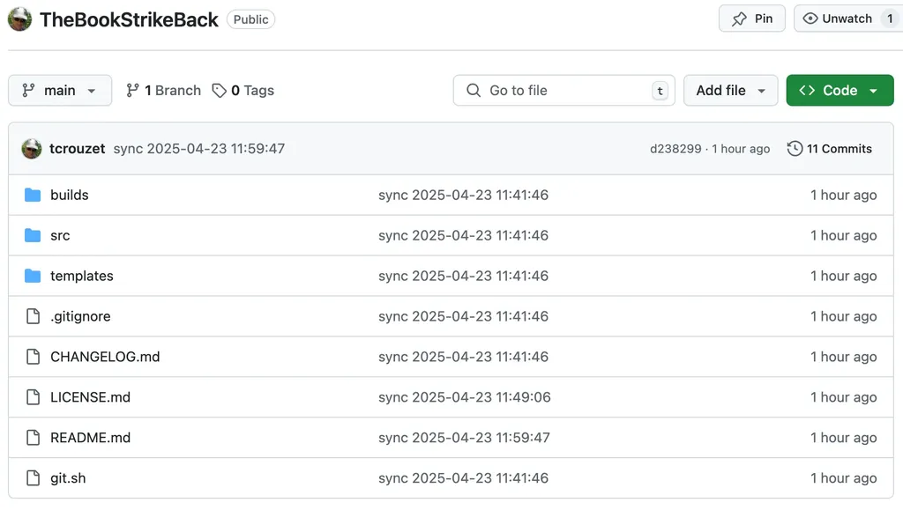

# Du technofascisme au Livre contre-attaque

Durant ces quatre derniers mois, j’ai effectué un grand réalignement de mes priorités qui m’a conduit [à quitter définitivement les réseaux sociaux centralisés](https://tcrouzet.com/2025/03/19/quitter-facebook/). Après avoir [dénoncé comme beaucoup l’avènement du technofascisme](https://tcrouzet.com/2025/01/24/technofascisme/), je me suis demandé comment le combattre. Peu à peu, j’ai compris que nous n’avions pas affaire à un véritable fascisme mais à une chose nouvelle, encore mal comprise, que je n’ai toujours pas réussi à nommer.

Pour moi, l’arme de lutte ne fait pas de doute : le livre et tous les objets culturels qui circulent comme lui de la main à la main (selon une logique Multicast). La cause du mal : en grande partie, le modèle Unicast d’internet. En cinq jours fin février, j’ai écrit le premier jet d’un petit essai, *Le Livre contre-attaque*. Mon éditeur [PVH](https://pvh-editions.com/) était prêt à le publier, mais depuis je ne cesse d’y revenir, tentant de mieux comprendre la chose.

Dans le texte, j’en suis venu à démontrer que les livres, pour participer à la lutte contre la chose, devaient être libres de circuler de la main à la main. C’est le cas des livres papier, mais souvent pas des livres électroniques, en France notamment, où beaucoup d’éditeurs limitent juridiquement notre droit de partager les textes achetés.

Leur raison : protéger les auteurs et leurs rémunérations. J’ai toujours pensé que c’était un argument fallacieux, qui d’ailleurs n’a jamais empêché la copie des ebooks. Mais si le livre est bien l’arme de défense contre la chose, il n’est pas question d’en limiter la puissance de frappe. La priorité, c’est combattre. Et donc les livres doivent être libres, et pour commencer le texte où j’effectue cette démonstration.

PVH distribue ses titres en licence libre, donc pas de problème philosophique à ce que nous bossions ensemble sur ce texte en particulier. Mais le processus éditorial reste lent, et la chose ne perd pas de temps, elle se propage à la vitesse des nouvelles technologies. Je me sentais mal, impuissant face à elle, à ruminer dans mon coin jusqu’à lui trouver un nom. J’ai décidé de diffuser le livre quand mon ami [Benjamin Rassat](https://fr.wikipedia.org/wiki/Benjamin_Rassat) m’a expliqué que Claude Lanzmann appelait la chose le film qui devait devenir *Shoah*, des années plus tard. Je n’avais plus d’autre choix que publier mon projet avec en son cœur la chose innommée, mais bien réelle.

J’aurais pu me contenter de diffuser des fichiers, mais j’ai voulu pousser la logique du libre plus loin. J’ai créé [un dépôt avec la dernière version du manuscrit et un ensemble de métadonnées pour générer les versions PDF, ePub, Docx](https://github.com/tcrouzet/TheBookStrikeBack/), en n’utilisant que des outils libres, dans le but de faciliter la circulation des fichiers de la main à la main, mais aussi de permettre la coopération avec ceux qui voudraient annoter le texte et l’enrichir.

Par ailleurs, ce dépôt esquisse une chaîne de production de livres libres. J’ai partagé tous mes codes et commandes. Il m’aura fallu presque une semaine de travail acharné pour obtenir des PDF de belle qualité, tout en gardant le processus automatique, ce qui est indispensable pour un texte destiné à évoluer en même temps que la chose.

Liens directs :

- [Dépôts](https://github.com/tcrouzet/TheBookStrikeBack/)
- [Markdown](https://github.com/tcrouzet/TheBookStrikeBack/blob/main/src/LivreContreAttaque.md)
- [PDF](https://github.com/tcrouzet/TheBookStrikeBack/blob/main/builds/LivreContreAttaque.pdf)
- [EPUB](https://github.com/tcrouzet/TheBookStrikeBack/blob/main/builds/LivreContreAttaque.epub)
- [DOCX](https://github.com/tcrouzet/TheBookStrikeBack/blob/main/builds/LivreContreAttaque.docx)
- [TEX](https://github.com/tcrouzet/TheBookStrikeBack/blob/main/builds/LivreContreAttaque.tex)

Je sais que beaucoup de mes amis auteurs se sentent froissés par ma position plus radicale que par le passé, mais les circonstances poussent à la radicalité. [Comme l’a écrit Ploum](https://ploum.net/2025-01-20-vous-etiez-prevenus.html), vous ne pourrez pas dire que vous n’étiez pas prévenus. Dans mon texte, je parle des technocollabos, tous ceux qui pactisent avec la chose, soit du côté du capitalisme, soit du côté des usagers. Vous ne pouvez pas continuer à fermer les yeux, au nom de votre gagne-pain, de votre renommée, de votre communauté. Vous imitez ceux qui durant la Seconde Guerre mondiale ont collaboré avec l’ennemi, souvent pour les mêmes raisons que vous. Il est temps de se réveiller. J’ai écrit mon petit livre pour essayer de raconter l’histoire de la chose et comment éviter de la nourrir. Depuis le début de l’année, [les ventes de Tesla ont baissé de 70 %](https://futurism.com/tesla-earnings-brutal-elon-musk), preuve que les citoyens ont des moyens de pression.

Pour parfaire ma démonstration, il sera important que ce livre, un jour ou l’autre, se retrouve en librairie, parce qu’elles constituent avec les bibliothèques et les festivals un réseau décentralisé propice à la lutte. Il manque encore donc un lien dans mon article vers des points de vente physiques.

#edition #y2025 #2025-4-23-14h00
