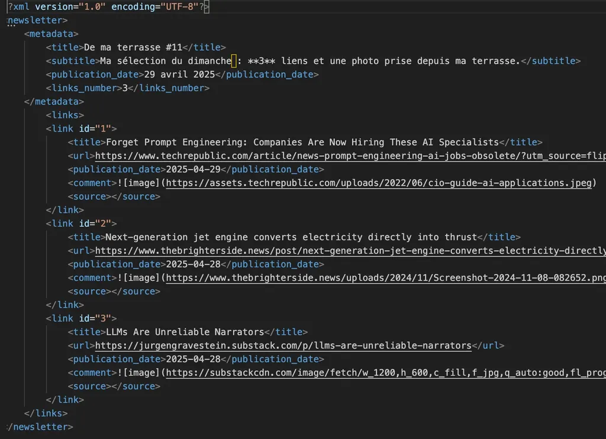
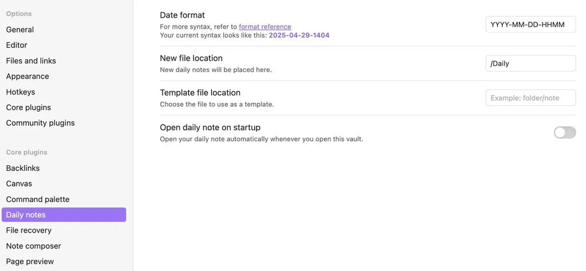
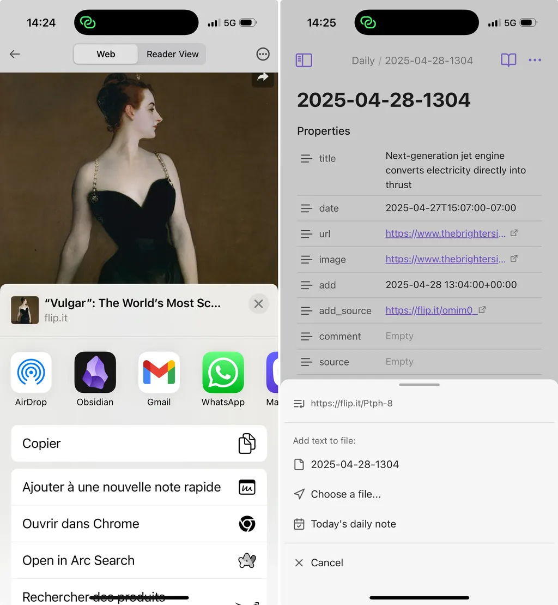
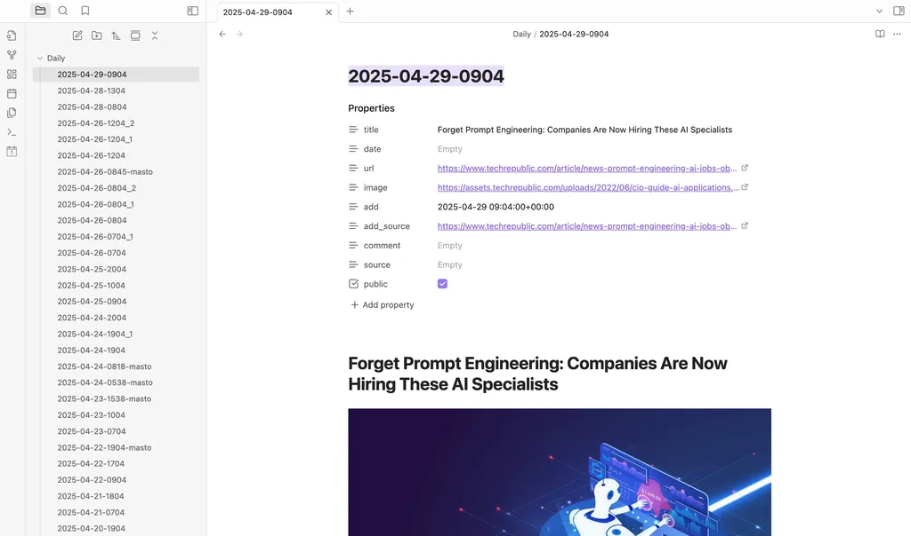
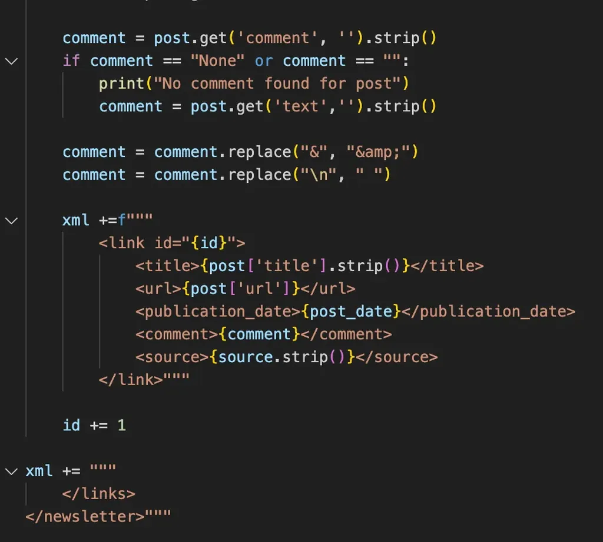
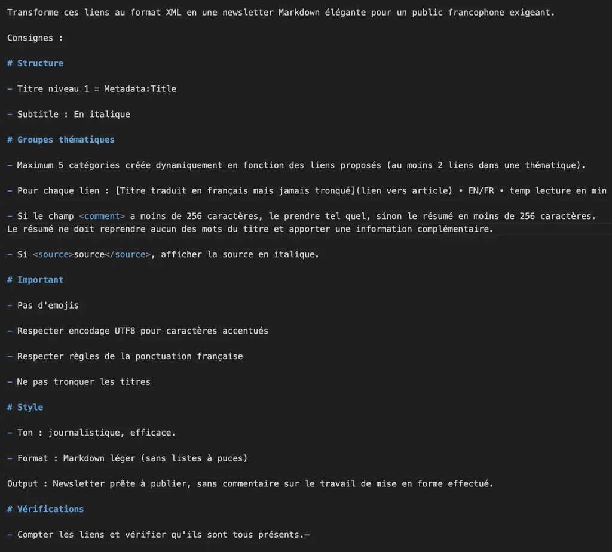

# Prompt ingénieur, c’est terminé

Depuis le lancement public de ChatGPT, on nous rabâche les oreilles avec les bonnes façons de prompter les IA, comme s’il existait des recettes miracles, surtout pour les faire écrire à notre place. [Le métier de prompt ingénieur est déjà obsolète](https://www.techrepublic.com/article/news-prompt-engineering-ai-jobs-obsolete/), parce que les LLM nous comprennent de mieux en mieux, à condition de leur soumettre des données structurées.

Structurer des données revient à créer des dataset comme ceux utilisés pour entraîner les modèles. Un des formats les plus simples est le XML : on encadre les données par des balises de son choix pour aider le prompt à les retrouver et les interpréter.

Pour illustrer cette stratégie, voici comment je construis [De ma terrasse](https://tcrouzet.substack.com/s/de-ma-terrasse), ma newsletter hebdomadaire. Depuis 2015, chaque fois que je lis un article intéressant, je le bookmarque. Pour cette tâche, qui se résume à mémoriser une adresse web, j’ai longtemps utilisé des applications, jusqu’à découvrir qu’elles accaparaient mes données et rendaient leur exploitation délicate, à moins de payer (rien de neuf sous le soleil).

J’ai fini par mettre en place une méthode gratuite, ouverte et beaucoup plus efficace.

1/ [Obsidian](https://tcrouzet.com/2024/12/25/un-an-avec-obsidian/) offre la possibilité de créer des daily notes quasi automatiquement. J’ai défini le format des noms de fichier (date et heure, par exemple 2025-04-29-0904.md) et leur localisation dans un vault enregistré sur iCloud pour qu’il soit accessible sur mon Mac et mon iPhone.

2/ Quand je lis un article intéressant sur mon iPhone, je le bookmarque en utilisant le bouton de partage. Quand Obsidian s’ouvre, je crée une nouvelle daily note en cliquant sur Today’s daily note.

3/ Je me retrouve avec un document Markdown minimaliste, qui comporte uniquement le lien vers l’article. Je peux commenter à la suite.

4/ Comme les articles disparaissent souvent, j’ai créé un script Python qui parcourt mes daily notes et charge les articles pointés. J’archive donc tout ce que je lis en texte intégral, ce qui me permet d’effectuer des recherches sur ce corpus.

5/ Avant de fabriquer, ma newsletter hebdomadaire, je génère un XML qui pour chaque article crée un enregistrement avec lien, titre, texte intégral.

6/ Je n’utilise l’IA, Claude en l’occurrence, que pour la mise en forme. Je lui colle le prompt après avoir uploadé le XML.

7/ Claude génère un fichier Markdown qu’il me suffit de relire et corriger avant de le publier.

Le résultat est meilleur depuis que j’ai ajouté les articles intégraux dans le XML. Claude peut effectuer des résumés pertinents, qu’il m’est facile d’ajuster puisque j’ai déjà lu les articles. Il ne me faut qu’une vingtaine de minutes pour éditer et publier la newsletter, ce qui m’aurait demandé plusieurs heures par le passé (et m’a toujours dissuadé de partager mes lectures).

La technique présentée marche aussi bien pour l’écriture d’un roman : le XML peut contenir les chapitres déjà écrits et le plan des suivants, la description des personnages, des lieux… Mieux on structure les données, plus on a de chances d’obtenir des réponses pertinentes. Les LLM avancés acceptent des fenêtres de 200K tokens. On peut donc créer des XML de presque 1 Mo.

Pour les curieux, [je partage mon code sur GitHub](https://github.com/tcrouzet/papers). En plus de mes daily notes, il prend en compte les liens Mastodon.

Ce qui valait il y a un an ou deux est déjà périmé. Le problème n’est donc plus de prompter les IA, mais de leur fournir les bonnes données pour qu’elles puissent travailler. Encore une fois, leurs nouvelles capacités nous forcent à repenser ce qui est proprement humain. Je me suis attelé à cette tâche avec *Rush*, sortie en novembre 2025 chez PVH, et je ne peux avancer dans cette quête qu’en tentant de voir de quoi les LLM sont capables (et incapavle, ça va de soit). 

#cuisine #ia #y2025 #2025-4-29-19h00
