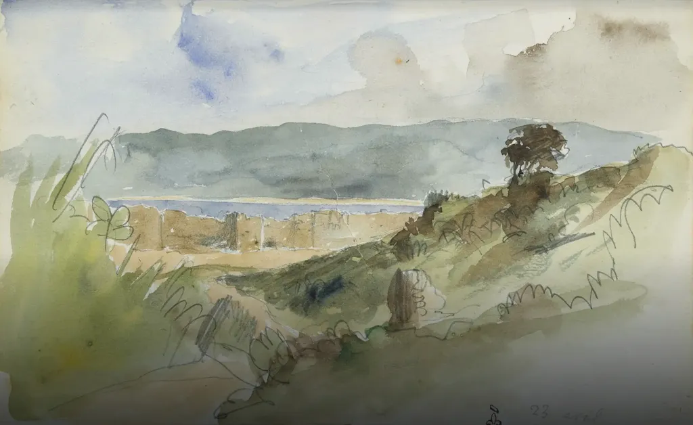

# Il n’est jamais trop tard pour apprendre le traitement de texte

Un article que je ne pensais pas devoir écrire en 2025. Ces dernières semaines, on m’a envoyé plusieurs manuscrits avant publication. Aucun des auteurs ne maîtrisait le b.a.-ba de l’écriture numérique. Ils utilisaient leur traitement de texte comme une machine à écrire.

[Quand Delacroix peignait des aquarelles dans ses carnets](https://artsandculture.google.com/story/8wWxRHM4S4Go9w?hl=fr), il n’employait ni les mêmes outils ni les mêmes techniques que sur ses tableaux à l’huile. L’outil de l’artiste influence son œuvre. Utiliser un traitement de texte comme une machine à écrire revient à peindre à l’aquarelle avec les techniques de l’huile. Ça ne marche pas.

J’ai discuté du côté non essentialiste de la littérature dans *La mécanique du texte*. Pas plus qu’un autre art, elle ne peut ignorer ses techniques de production. Cette question devient prégnante avec l’arrivée des IA. Et c’est à cause d’elles que je reviens sur le sujet, parce que je dois soumettre les manuscrits envoyés à leur scrutation (je vais finir par ouvrir une officine).

> **Règle 1** : chaque fois que vous tapez deux espaces consécutives dans un texte, vous perdez du temps et n’utilisez pas les ressources de votre outil d’écriture.

Idem quand vous utilisez des tabulations et autres artifices pour mettre en forme votre texte (les boutons d’alignement, par exemple). Les feuilles de styles sont apparues en 1983 avec la première version de Word. Il y a plus de quarante ans.

1. les ignorer, c’est avoir du mépris pour ceux qui travailleront sur votre texte. Vous leur transmettez un torchon numérique, à eux de se débrouiller avec. Vous ne montrez aucun goût pour leur profession, aucun goût pour le livre, pour la façon dont on le fabrique, aucun goût pour un outil avec lequel vous travaillez durant des heures sans avoir pris la peine de l’apprendre. Vous vous comportez comme un architecte qui n’a aucun respect pour les maçons. Si vous voulez qu’un maquettiste travaille bien, facilitez-lui la tâche. Le texte n’est pas que de la langue. C’est aussi un objet graphique.
2. Sans style, un texte n’est qu’un flot déstructuré, difficile à manipuler, à modifier, à réviser, à convertir… Il manque d’homogénéité. Vous compliquez non seulement le travail de vos collaborateurs mais votre propre travail. Styler un texte, c’est gagner du temps et de la précision. Je m’énerve quand on me répond : « Je fais de la littérature ». J’ai envie de répliquer : « Tu la connais mal l’histoire de la littérature. » En prime, et ça devient souvent vital, mieux un texte est stylé, plus il est facile d’en parler avec les IA.

> **Règle 2** : les doigts ne devraient jamais quitter le clavier lors de l’écriture, tout geste hors du clavier fait perdre du temps et risque d’arracher au flot.

Voilà pourquoi depuis longtemps j’ai abandonné Word pour des éditeurs de texte [Markdown](https://fr.wikipedia.org/wiki/Markdown) sans bouton, [par exemple Obsidian](https://tcrouzet.com/2024/12/25/un-an-avec-obsidian/) : on style avec des dièses et des étoiles et d’autres caractères directement accessibles au clavier.

Essayez le truc suivant :

1. [Convertissez un de vos manuscrits Word en Markdown.](https://products.aspose.app/words/conversion/docx-to-md)
2. Ouvrez-le avec un éditeur de texte. Logiquement, la plupart des scories typographiques auront disparu.
3. Faites précéder les titres par des dièses+espace (# titre niveau 1, ## titre niveau 2…).
4. [Convertissez le Markdown en Word.](https://products.aspose.app/words/conversion/md-to-docx) Vous retrouverez un document un peu plus propre.

Pour un texte littéraire, ou même universitaire, travailler avec Word n’a aucun sens. Il nous pousse à introduire des scories, il nous fait perdre de vue la structure d’ensemble, il nous distrait… Markdown pousse à simplifier et à homogénéiser.

>**Règle 3** : si vous aimez l’approche machine à écrire, travaillez avec une machine à écrire ou un émulateur de machine à écrire, mais pas avec Word.

Pour ma part, j’utilise les outils de mon temps, parce que je suis persuadé qu’en eux-mêmes ils disent quelque chose du style de l’époque. Mais peut-être qu’un jour j’écrirai à nouveau au stylo ou à la machine à écrire pour retrouver des sensations perdues.

> **Règle 4** : choisir son outil plutôt qu’être choisi par lui.

Vu l’attention portée par les auteurs du passé à leurs outils d’écriture, j’ai du mal à comprendre le laxisme contemporain. Word s’impose sans que presque personne s’interroge (comme Facebook ou X s’imposent pour la promotion). En tant qu’écrivains, nous sommes d’abord des artisans. J’ai beaucoup d’amis artisans et tous prennent soin de leurs outils (comme les cyclistes prennent soin de leurs vélos). Que des écrivains se moquent de leurs outils me fait douter de leurs écrits. 

#cuisine #y2025 #2025-4-7-13h00
