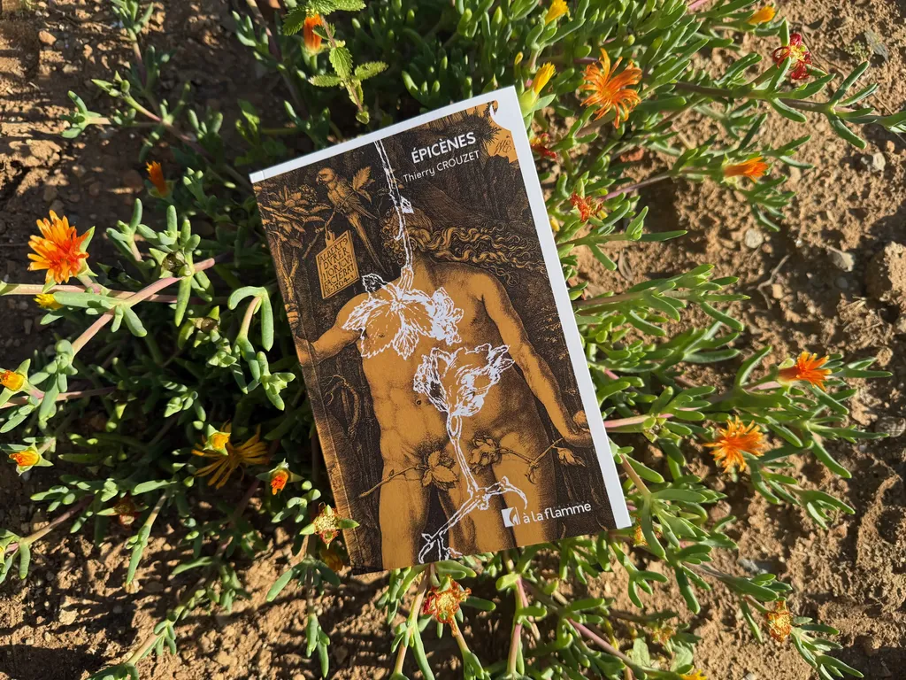
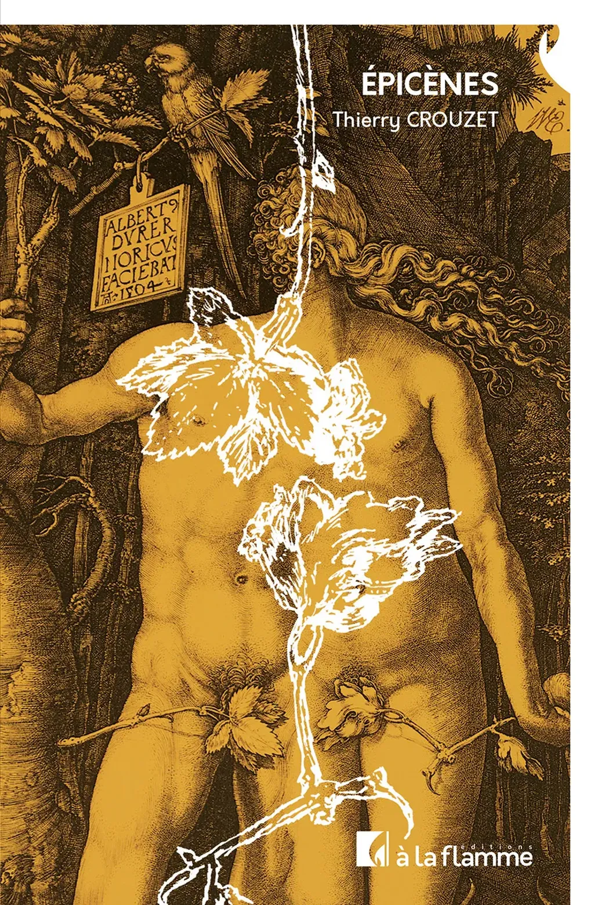

# J’ai besoin de vous tous

Je suis heureux et angoissé. Je déteste demander de l’aide, du soutien, je cherche à faire le dur, à me débrouiller seul, comme si j’étais entouré de dangers. J’ai surtout la frousse des autres. Je préfère me soustraire à vous que me tendre vers vous. C’est bien pratique de rester derrière mon écran, mais il me faut prendre des risques parfois, comme publier un nouveau livre et accepter que vous me jugiez : publier, c’est tendre une joue, puis l’autre, puis recommencer, processus des plus pervers auquel je m’adonne avec masochisme et plus ou moins de régularité.

Le délit cette fois : un petit roman de 140 pages. Son titre : *Épicènes*. Qui commence par une définition :

> *Épicènes*, adjectif et nom masculin. Se dit d’un mot dont la forme est identique au masculin et au féminin. Exemple : un élève, une élève. Élève est un nom épicène. Il existe des prénoms épicènes que portent invariablement les filles et les garçons : Charlie, Alix, Louison… Désigne également un phénomène mal expliqué de superposition entre deux ou plusieurs individus. Étymologie : du latin *epicoenus*, emprunté au grec ancien *ἐπίκοινος* (*epikoinos*), composé de *ἐπί* (*epi* « sur, à ») + *κοινός* (*koinos*, « commun »). Le terme « épicène » a été introduit durant l’époque hellénistique par les grammairiens grecs de l’école philologique alexandrine d’Aristarque de Samothrace (215-143 av. J.-C.) pour désigner un éventuel genre grammatical distinct des trois genres traditionnels : le masculin, le féminin et le neutre. En français, l’usage du terme « épicène » est attesté depuis la seconde moitié du XIVe siècle. Il était utilisé en grammaire pour désigner, sous une seule forme, l’un et l’autre genre.

Un roman donc, composé de six textes interconnectés, qui racontent chacun des épicènes dans diverses époques et divers lieux non localisés. J’aimerais que vous le lisiez, que vous m’en parliez, que vous en parliez autour de vous, parce que si ce livre se vend, mon éditeur qui a le courage de se lancer dans la profession pourra en publier d’autres, les miens et ceux d’autres auteurs, chose essentielle par les temps troublés que nous traversons, temps surtout pressés où de moins en moins de gens prennent le temps de lire à tête reposée. Achetez donc ce livre pour que je puisse en écrire d’autres, pour que j’aie l’énergie de continuer à publier des articles et à partager mes cogitations.

Je donne beaucoup, parfois ça ne suffit pas, et même jamais. Acheter un livre, c’est faire un don à toute une équipe qui va du libraire à l’auteur en passant par l’éditeur, les correcteurs, les graphistes… C’est important. C’est plus que jamais un acte de résistance. Alors résistez avec *Épicènes*.

C’est un texte étrange, venu de je ne sais où, sans même que je m’en rende compte. Mon ami Jean-Hugues, maintenant aussi mon éditeur avec ses deux comparses, Jérôme et Fred, m’a demandé en juillet 2022 une nouvelle pour le festival d’Angers. Le thème : double-je. J’ai rigolé. Je lui ai dit que les trucs psy n’étaient pas mon affaire. Je ne lui ai rien promis, mais dans la nuit un paragraphe est venu, que j’ai noté, qui maintenant ouvre le roman.

>Tout commença par une blague.
>Ils étaient à la plage. Elle attendait qu’il lui dise « Je t’aime », il parlait des voiliers au large, du château de sable construit par les enfants de la grosse femme, des filles bronzées qui jouaient au volley, mais il ne lui disait pas « Je t’aime ». Alors, quand il dit : « On se baigne ? » Elle dit : « On se baigne ? »
>Il la regarda, fronçant les sourcils. « Tu te moques de moi ? » Elle l’imita et dit : « Tu te moques de moi ? » Il éclata de rire et elle éclata de rire. Il dit : « Non, tu ne vas pas jouer à ce jeu de gamin. » Elle lui dit : « Non, tu ne vas pas jouer à ce jeu de gamin. » Il finit par s’énerver et elle s’énerva, puis quand il se tut, elle se tut ; et quand il se leva pour se baigner, elle se leva pour se baigner.
>Ils sautèrent par-dessus les premières vagues, dépassèrent les autres baigneurs, nagèrent jusqu’au banc de sable, où l’eau leur arrivait aux épaules. Quand il tendit les bras vers le ciel immaculé, elle se plaça en face de lui, debout, les bras tendus vers le ciel immaculé. Il avança d’un pas vers elle, elle d’un pas vers lui, et son visage se retrouva à quelques millimètres du sien. Quand une vague les rapprocha, il replia ses bras autour d’elle, et elle replia ses bras autour de lui. Il glissa une main vers le creux de ses reins, elle glissa une main vers le creux de ses reins. Il l’embrassa, elle l’embrassa, longtemps, indéfiniment. Ils se perdirent l’un dans l’autre et s’oublièrent.

Le surlendemain, j’avais écrit une première nouvelle qui a surpris Isa, puis Jean-Hugues. J’ai senti que je n’avais fait que commencer une plus longue histoire. J’ai écrit cinq autres nouvelles, chacune en deux jours, toutes liées entre elles. J’ai donc écrit ce petit roman en douze jours. Je l’ai retravaillé par la suite, mais moins que mes autres textes. J’ai voulu le garder à distance, pour qu’il conserve pour moi son étrangeté, aussi son inévitable imperfection. Il a la forme répétitive du Boléro de Ravel, avec des variations et j’espère des surprises.

Je n’y ai défendu aucune thèse, sinon peut-être la difficulté d’être au monde, parce que nous sommes nécessairement différents des autres et des idées préconçues auxquelles la société voudrait que nous adhérions, et auxquelles nous aimerions adhérer pour être moins en rupture. Oui, j’aimerais être normal, sauf que la normalité n’existe pas. Alors j’ai écrit *Épicènes*, en douze jours, durant l’été 2022. Il diffère de mes autres textes parce que je ne l’ai pas réfléchi. C’est un roman non réflexif, non analysé. Il s’est imposé à moi (je ne vais pas dire dicté par la main de Dieu, mais pas loin — j’aime ce texte pour son côté miraculeux, je n’ai pas eu le temps d’y penser qu’il était là, je n’ai donc pas eu le temps de le détester).

Si vous êtes intrigués, désireux de m’aider, de booster ma créativité, de peut-être vous plonger dans une fiction dépaysante, à la frontière du noir et du fantastique, alors offrez-vous un *Épicènes* ou offrez-le.

Le livre sera disponible dans toutes les librairies le 10 juin, 16 €, mais **vous pouvez le commander tout de suite**, [chez mon éditeur](https://alaflamme.fr/livre/epicenes/) ou [dans toutes les librairies en ligne ou non](https://tcrouzet.com/books/epicenes/). Les précommandes, c’est important : le jour de la sortie du texte, elles provoquent un pic sur les systèmes de tracking des diffuseurs.

Si vous n’êtes pas loin de Balaruc, je serai à [La Librairie Nomade](https://www.facebook.com/p/La-librairie-nomade-100067427163808/), chez Katia, le 5 juin, à 18h. On parlera de ce bouquin, de mes projets, de vos envies, de nos vulnérabilités, aussi de nos forces.

#buzz #epicenes #y2025 #2025-5-14-20h00
