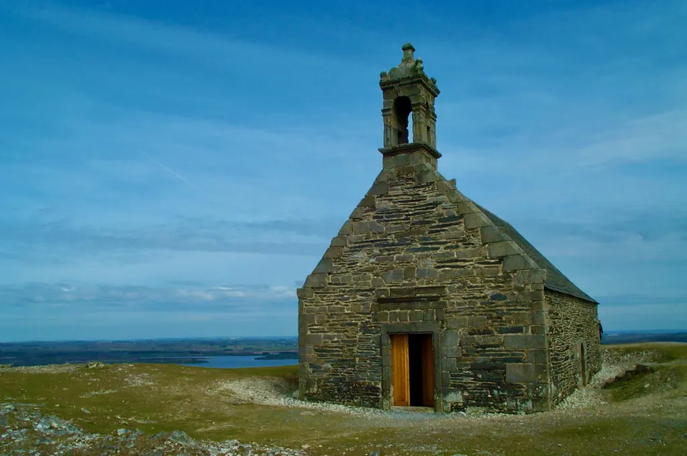
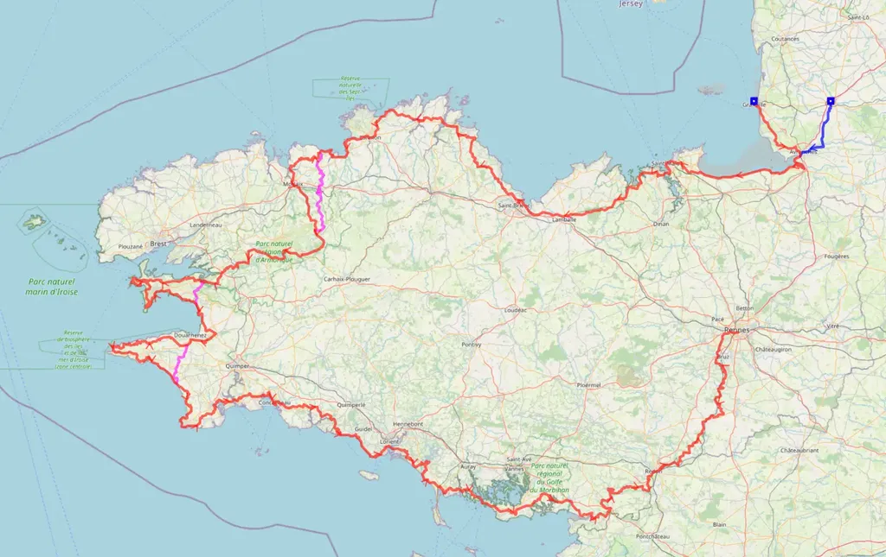

# Bikepacking en Bretagne

Du 13 au 23 juillet 2025, on se fait un petit bikepacking en Bretagne, sur un mode estival cool. Je suis en train de construire la trace en combinant des [GTB](https://erminig.cc/epreuves/la-gravel-tro-breizh/) et la heatmap Strave. Je vous en parle parce qu’on n’est pas sectaires et qu’on adore se faire de nouveaux copains de bikepacking (envoyez un mail ou commentez en laissant vos coordonnées).

Le programme est assez simple. En début d’après-midi le 13 juillet, on prend un TER de Paris direction le Mont Saint-Michel. On se fait une grande boucle de 1 000/1 100 km avec moins de 9 000 d+, puis on prend un TER le 23 à Rennes, changement au Mans, direction Paris, où on arrivera en début d’après-midi.

Si vous avez des idées de variantes, de hauts lieux indispensables, je suis preneur de tous les conseils, sachant que la Bretagne est grande et que nous ne nous pourrons qu’en parcourir une petite partie. Il faut faire des choix. Par exemple, la trace saute par-dessus les estuaires du sud Finistère et du golfe du Morbihan par les bacs, tandis que GTB les contourne (ce qui est logique pour épreuve compétitive).

[Le projet de trace est dispo sur VisuGPX.](https://www.visugpx.com/IpFgBmDgrC) Je prends des libertés avec les traces des GTB, et j’en prendrai davantage au fil des évolutions de la trace. Nous partons avec nos VTT, même si je pense que l’essentiel du parcours passera à gravel (je ne peux rien garantir et ne veux rien garantir — nous partons à VTT parce que nous préférons voyager à VTT).

[En parallèle, les inscriptions pour le g727 commencent à s’empiler. Nous sommes déjà une quarantaine.](https://727bikepacking.fr/g727-Grand-Depart/) 

#velo #bikepacking #y2025 #2025-5-22-20h00
