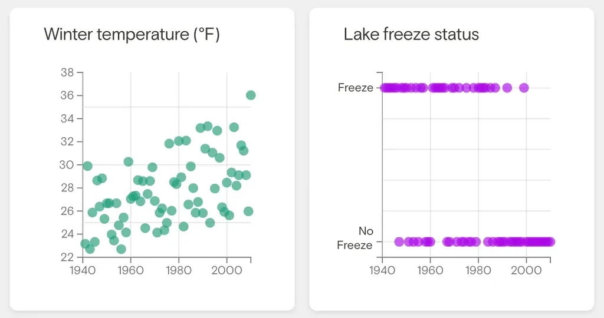

# De ma terrasse #12

_Ma sélection du dimanche : **13** liens et une photo prise depuis ma terrasse._

## Intelligence artificielle et technologie

[Nous allons définitivement construire un bunker avant de lancer l’AGI](https://www.theatlantic.com/technology/archive/2025/05/karen-hao-empire-of-ai-excerpt/682798/) • EN • 12 min  
L’article explore les préoccupations d’Ilya Sutskever, cofondateur d’OpenAI, concernant l’arrivée imminente de l’AGI et les transformations civilisationnelles qu’elle pourrait engendrer, révélant les tensions internes qui ont mené à l’éviction temporaire de Sam Altman.

[Comment créer des agents d’IA personnalisés en quelques minutes grâce à Chai](https://aiagent.marktechpost.com/post/how-to-build-custom-ai-agents-in-minutes-using-chai-vibe-code) • EN • 8 min  
Langbase propose une solution permettant aux non-techniciens de créer des agents d’IA fonctionnels en quelques minutes, transformant une simple description textuelle en un outil opérationnel sans nécessiter de connaissances techniques approfondies.

[La méthode du prompt maître pour libérer le plein potentiel de l’IA](https://www.geeky-gadgets.com/the-master-prompt-method-unlock-ais-full-potential/) • EN • 8 min  
Cette approche structurée transforme l’IA d’un simple outil réactif en une force proactive, en fournissant des instructions détaillées et contextualisées qui permettent d’obtenir des résultats plus précis et adaptés aux besoins spécifiques des entreprises.

[Découvrez Fellou : un navigateur d’IA agentique capable de penser et d’agir pour vous](https://aiagent.marktechpost.com/post/meet-fellou-an-agentic-ai-browser-that-can-think-and-act-for-you) • EN • 6 min  
Ce navigateur innovant ne se contente pas d’afficher des pages web mais exécute activement des tâches complexes, recherchant et compilant des informations de manière autonome grâce à son mode « Deep Action » qui permet aux agents virtuels de travailler en arrière-plan.

## Climat et environnement

[Des scientifiques viennent de découvrir les responsables du réchauffement climatique](https://futurism.com/scientists-wealthy-global-warming) • EN • 5 min  
Une étude publiée dans Nature Climate Change révèle que les 10 % les plus riches de la population mondiale sont responsables de deux tiers du réchauffement climatique observable depuis 1990, contribuant près de sept fois plus que les 90 % restants.

[Des scientifiques ont trouvé une solution pour surmonter l’apathie climatique](https://grist.org/science/break-through-climate-apathy-data-visualization-lake-freezing-study/) • EN • 5 min  
Des chercheurs ont découvert qu’une représentation binaire des données climatiques (comme le gel ou non d’un lac) a un impact psychologique plus fort que des graphiques montrant une augmentation graduelle des températures, permettant de mieux sensibiliser le public.

## Politique et société

[Nous étudions le fascisme à Yale. Nous quittons les États-Unis](https://www.nytimes.com/2025/05/14/opinion/yale-canada-fascism.html) • EN • 6 min  
Trois professeurs de Yale, experts en autoritarisme, expliquent pourquoi ils quittent les États-Unis pour l’Université de Toronto, alarmés par la régression démocratique et les atteintes aux libertés civiles sous l’administration Trump. _[Karl Dubost](https://mastodon.cloud/@karlcow)_

[Ce que « Bolloré » fait au livre, aux éditeurs et aux auteurs](https://blog.mondediplo.net/ce-que-bollore-fait-au-livre-aux-editeurs-et-aux) • FR • 6 min  
L’article analyse l’impact du groupe Bolloré sur l’édition française, tout en questionnant pourquoi d’autres groupes éditoriaux diffusant des idéologies d’extrême droite ne suscitent pas la même indignation que lorsque ces idées sont promues par Vincent Bolloré. _[Le Monde diplomatique](https://mamot.fr/@mdiplo)_

[IA : La nouvelle esthétique du fascisme](https://newsocialist.org.uk/transmissions/ai-the-new-aesthetics-of-fascism/) • EN • 7 min  
L’article examine comment l’extrême droite s’est approprié l’imagerie générée par IA, reflétant à la fois leur mépris pour le travail créatif humain et leur alliance avec l’industrie technologique, dans une tentative de normaliser l’utilisation de ces outils.

## Science et conscience

[Les scientifiques ignorent pourquoi la conscience existe, et une nouvelle étude le démontre](https://www.sciencealert.com/scientists-dont-know-why-consciousness-exists-and-a-new-study-proves-it) • EN • 7 min  
Une collaboration entre chercheurs rivaux a testé deux théories majeures de la conscience (théorie de l’espace de travail neuronal global et théorie de l’information intégrée), sans résultats décisifs, démontrant la difficulté d’étudier scientifiquement l’expérience subjective.

## Culture et arts

[Paperolles et fiches Bristol](https://philippe-castelneau.com/2025/05/11/paperolles-et-fiches-bristol/) • FR • 7 min  
L’auteur s’inspire des méthodes de travail de Proust et Nabokov pour trouver sa propre approche créative, entre les paperolles (ajouts collés sur les pages) et les fiches cartonnées, pour avancer simultanément sur deux projets d’écriture. _[Philippe Castelneau](https://mastodon.social/@castelneau)_

[Les peintures les plus profondes jamais réalisées ? Un artiste consacre 518 heures à créer une œuvre à défilement infini](https://www.creativebloq.com/art/digital-art/the-deepest-paintings-ever-artist-spends-518-hours-creating-mind-blowing-infinite-scroll-artwork) • EN • 6 min  
Jesse Martin crée des œuvres numériques extraordinaires utilisant la fonction de zoom pour révéler des images dans des images, certaines contenant jusqu’à six couches de détails, chacune racontant une histoire différente et nécessitant des centaines d’heures de travail.

#digest #y2025 #2025-5-18-17h00 
