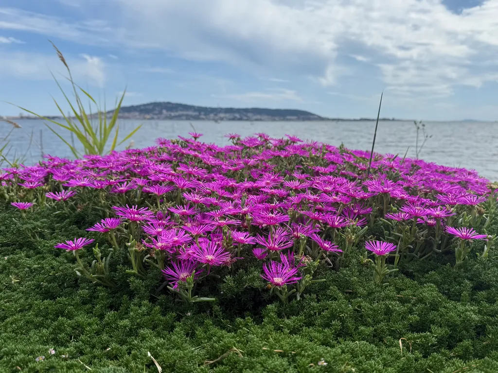

# De ma terrasse #13

_Ma sélection du dimanche : **11** liens et une photo prise depuis ma terrasse._ Je lis peu d’articles en ce moment (le bruit extérieur me fatigue — concentré sur des projets persos). Petit Rappel : le 5/6 18h recontre à Balaruc, Librairie Nomade pour [la sortie d’*Épicènes*](https://tcrouzet.com/books/epicenes/), puis piquenique à la maison. Ça explose dans le jardin.

## Technologies d’intelligence artificielle

[Les batteries capturant le carbone : une avancée prometteuse](https://www.fastcompany.com/91339843/carbon-capturing-batteries-research) • EN • 12 min  
Ces batteries pourraient offrir une double solution aux problèmes actuels de stockage d’énergie renouvelable et d’élimination des émissions de carbone, en absorbant le CO₂ tout en produisant de l’énergie.

[Encodeurs et décodeurs dans les modèles Transformer](https://flip.it/1URSdb) • EN • 15 min  
Une exploration détaillée des différentes architectures de transformers. J’ai pas tout compris, mais important parce que c’est une brique essentielle de la révolution IA.

[Le nouveau générateur vidéo de Google pourrait marquer la fin de la réalité telle que nous la connaissons](https://futurism.com/google-ai-video-generator-realistic) • EN • 5 min  
Le modèle Veo 3 de Google DeepMind excelle dans la physique, le réalisme et le respect des instructions, produisant des vidéos d’une qualité impressionnante avec audio, effets sonores, musique et même parole humaine.

[Gemini 2.5 Pro contre Claude 4 Sonnet avec les mêmes 7 prompts — voici qui l’a emporté](https://www.tomsguide.com/ai/i-tested-gemini-2-5-pro-vs-claude-4-sonnet-with-the-same-7-prompts-heres-who-came-out-on-top) • EN • 8 min  
Une comparaison approfondie des deux modèles sur des tâches variées, de la narration créative à la résolution de problèmes techniques, révélant que Claude 4 Sonnet se distingue par son intelligence émotionnelle et sa profondeur technique. J’ai effectué mes propres tests de créativité, beaucoup moins concluants sur Gemini, surtout que Claude 4 est dispo depuis la fin de la semaine.

[Un tutoriel étape par étape pour construire des flux de travail IA modulaires utilisant Claude Sonnet 3.7 via API et LangGraph](https://www.marktechpost.com/2025/05/21/a-step-by-step-implementation-tutorial-for-building-modular-ai-workflows-using-anthropics-claude-sonnet-3-7-through-api-and-langgraph/) • EN • 20 min  
Guide pratique pour implémenter LangGraph, un framework d’orchestration IA basé sur les graphes, intégré avec l’API Claude d’Anthropic pour créer des workflows complexes de traitement du langage naturel.

## Environnement et climat

[Une hausse alarmante du niveau des mers attendue même avec une limite de réchauffement à 1,5°C](https://www.sciencealert.com/alarming-sea-level-rise-expected-even-with-1-5c-warming-limit) • EN • 6 min  
Le rythme de l’élévation des océans a doublé en trois décennies et, selon les tendances actuelles, doublera à nouveau d’ici 2100 pour atteindre environ un centimètre par an, mettant à rude épreuve la résilience humaine.

[Une famille suédoise entoure sa maison entière de verre de serre pour créer une chaleur toute l’année](https://mymodernmet.com/greenhouse-marie-granmar-charles-sacilotto/) • EN • 5 min  
Au lieu de déménager vers des climats plus chauds, ce couple de Stockholm a créé son propre climat méditerranéen en enfermant leur maison dans une serre géante, leur permettant de cultiver des figues et des tomates malgré les hivers rigoureux.

[Les scientifiques ne croient pas aux affirmations selon lesquelles les arbres se parlent pendant les éclipses](https://bgr.com/science/scientists-arent-buying-claims-that-trees-talk-to-each-other-during-eclipses/) • EN • 4 min  
Une étude controversée suggère que les épicéas communiquent entre eux pendant les éclipses solaires, mais de nombreux scientifiques remettent en question ces conclusions en raison de la petite taille de l’échantillon et de l’absence de comparaisons avec les transitions normales jour-nuit.

[Atlas de l’Anthropocène](https://www.ign.fr/publications-de-l-ign/institut/kiosque/publications/atlas_anthropocene/2023/atlas_anthropocene_2023_light.pdf) • FR  
Magnifique PDF créé par l’IGN. _Partagé par [Karl Dubost](https://mastodon.cloud/@karlcow)_

## Santé et biologie

[Comment les éléphants ont évolué pour vaincre le cancer, et comment nous pourrions faire de même](https://newatlas.com/biology/elephants-beat-evolution-cancer-p53-gene-petos-paradox/) • EN • 7 min  
Les éléphants possèdent 20 copies différentes du gène suppresseur de tumeur p53, leur permettant d’éviter le cancer malgré leur taille imposante et leur longévité, une découverte qui pourrait inspirer de nouvelles thérapies anticancéreuses pour les humains.

[Un dérivé de la vitamine B1 stimule la dopamine et améliore l’éveil](https://neurosciencenews.com/vitamin-b1-dopamine-wakefulness-28967/) • EN • 5 min  
Le TTFD, un dérivé de la thiamine, augmente les niveaux de dopamine dans le cortex préfrontal médian du cerveau, entraînant une amélioration de l’éveil et de l’activité physique chez les rats, suggérant son potentiel pour stimuler la vigilance et la vitalité.

#digest #y2025 #2025-5-25-17h00 
