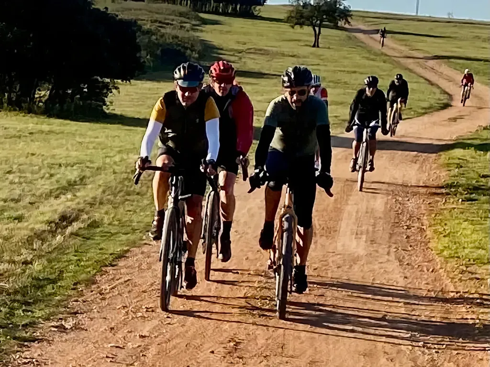
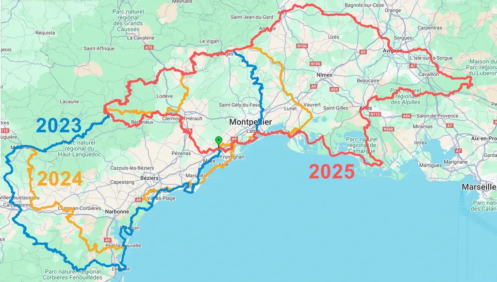
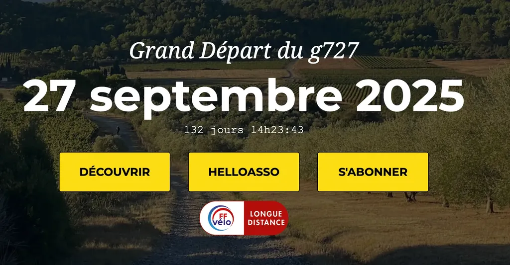

# g727 2025 : nouveau parcours, moins exigeant, non moins dépaysant - inscrivez-vous

Le g727 2025 se réinvente : plus accessible, plus gravel, toujours aussi dépaysant. Notre événement de bikepacking non-compétitif revient le 27 septembre avec un nouveau parcours de 727 km traversant Camargue, Alpilles et Larzac, pour moins de 8000 m de dénivelé. [Inscriptions limitées à 99 participants, déjà ouvertes !](https://www.helloasso.com/associations/ec-poussan/evenements/g727-2025)

L’idée : les [727 VTT](https://727bikepacking.fr/#top), sont très VTT, les [g727](https://727bikepacking.fr/g727/) sont très gravel, et de plus en plus gravel. Nous tenons à différencier les deux pratiques. Comment nous définissons le gravel avec les copains ? On doit pouvoir rouler à plus de 20 km/h de moyenne sans trop de difficulté (bien sûr, pas nécessairement en bikepacking quand on a des centaines de kilomètres dans les jambes et le vélo chargé, mais c’est l’idée). Sur les 727 VTT beaucoup de singles interdisent de rouler aussi vite (vraiment beaucoup, même à vide).

De nombreuses voix nous ont aussi demandé un parcours avec moins de dénivelé, plus accessible. Le g727 2025 sera donc très différent des éditions précédentes. L’objectif est double : rester sous les 8 000 m de d+ pour 727 km tout en gardant un parcours roulant sans difficulté technique.

Il ne s’agit pas de faire le concours de celui qui souffre le plus sur le vélo. La Desertus Bikus réserve 40 % des places aux femmes. On ne va pas encore aller jusque là, mais c’est l’idée. Le g727 aimerait promouvoir la mixité dans le bikepacking hors asphalte.

Le parcours, en rouge sur la carte, sera très différent des deux éditions précédentes. Après le massif de la Gardiole, nous rejoindrons le Grau-du-Roi, puis Les Saintes-Maries-de-la-Mer et la Camargue, pour remonter vers Arles. Départ en douceur donc le long du littoral. Nous traverserons les Alpilles, le Lubéron, puis Rejoindrons Avignon et Alès. De là, nous gagnerons Ganges via Anduze, retrouvant la trace 2024 qui nous conduira au cirque de Navacelles et au Larzac, puis à Lespinouse, avant de nous faire plonger vers le lac du Salagou et de regagner Poussan, notre point de départ.

La trace 2025 sera disponible quelques jours avant [le grand départ](https://727bikepacking.fr/g727-Grand-Depart/). Comme en 2023 et 2024, de nombreux shorcuts vous permettrons d’adapter la trace et d’en réduire la distance à moins de 400 km. Si d’ici là, vous roulez un g727 en ITT, optez pour [la trace 2024](https://www.visugpx.com/CUblYBm7Li), avec une traversée des Corbières moins éprouvante qu’en [2023](https://www.visugpx.com/dgozECS1G4). C’est aussi parce que les Corbières sont âpres, malgré leur beauté, que cette année la trace penchera vers l’est.

Beaucoup de reconnaissances nous attendent d’ici [le grand départ du 27 septembre](https://727bikepacking.fr/g727-Grand-Depart/) (si vous roulez dans les coins où la trace passera n’hésitez pas à nous contacter et à nous tuyauter). Nous espérons vous retrouver nombreux pour rouler avec nous.

Nous organisons nos évènements toujours dans le même état d’esprit : pas de compétition mais de la coopération, pas de médaille en chocolat, pas de goodies, pas de tracker intrusif, juste la possibilité de rassurer ses proches avec [Geogram](https://geo.zefal.com), pas de tarif exorbitant, 35 € avec hébergement avant le départ, petit-déj et pot à l’arrivée.

[Inscrivez-vous vite](https://www.helloasso.com/associations/ec-poussan/evenements/g727-2025), nous étions 87 l’année dernière sur un maximum possible de 99. Cette année il n’y aura pas de place pour tout le monde (OK, je suis plus sur les réseaux sociaux, donc c’est à vous de faire la promo).

#velo #bikepacking #y2025 #2025-5-18-19h00
