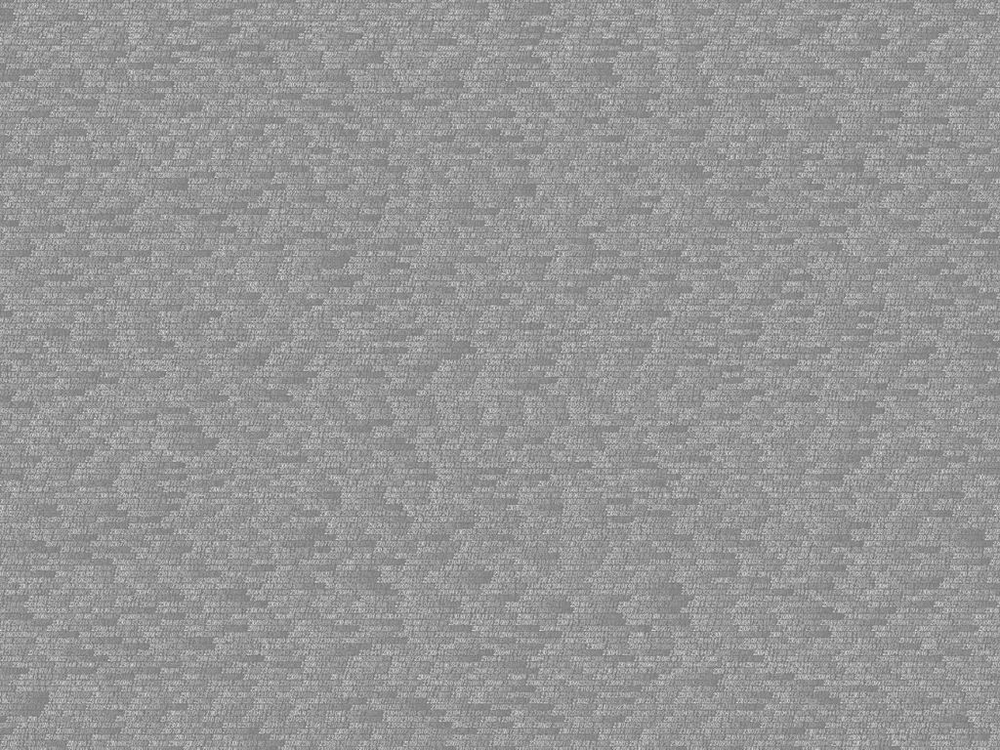
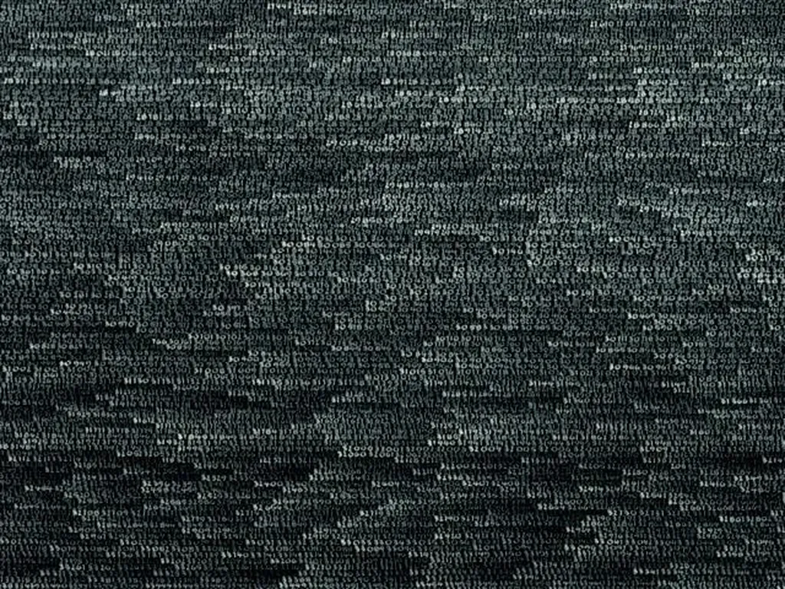
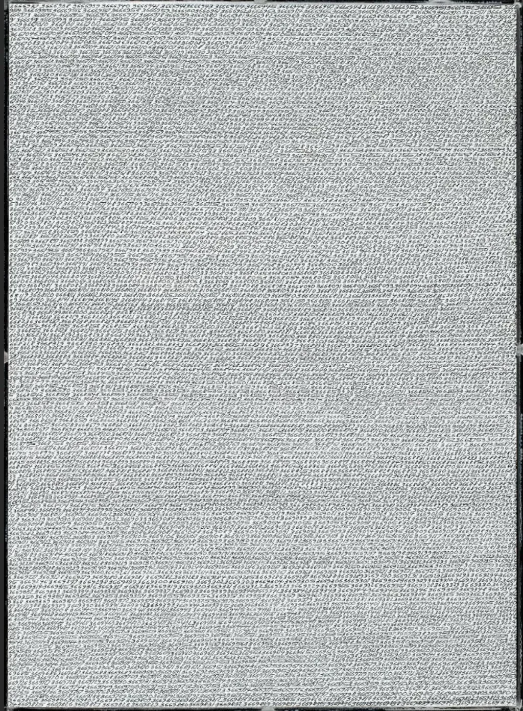
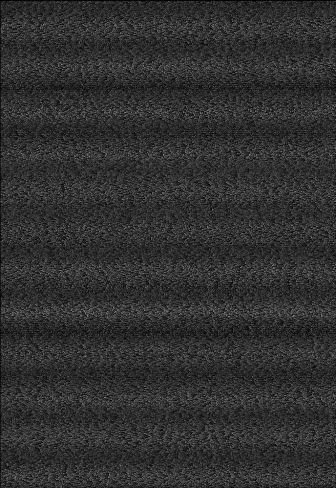
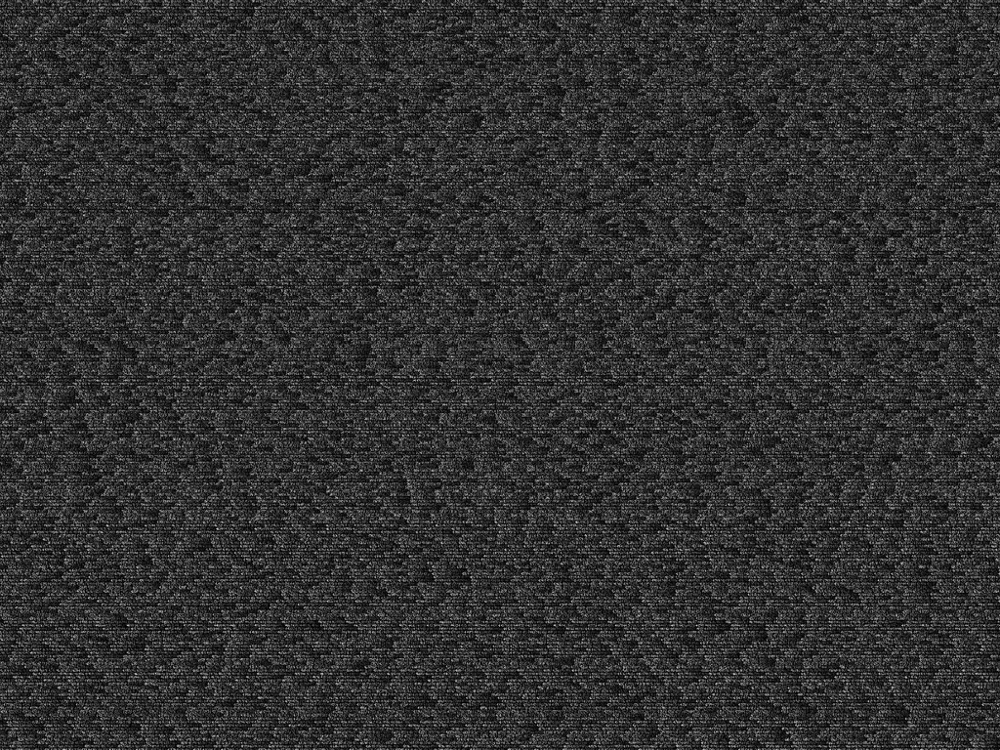
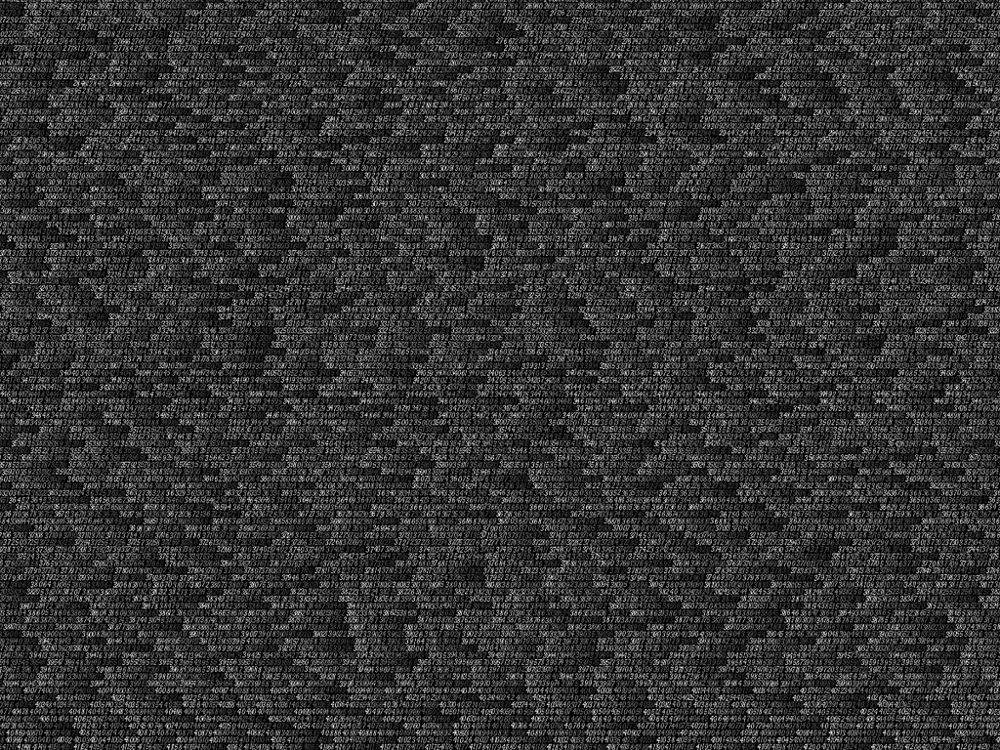
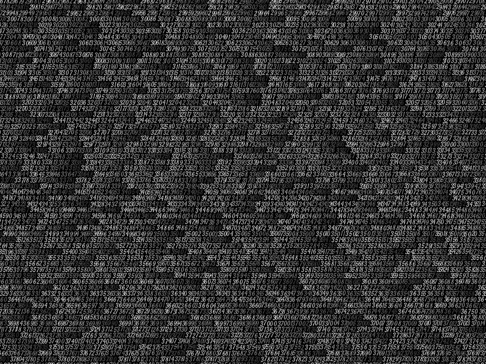
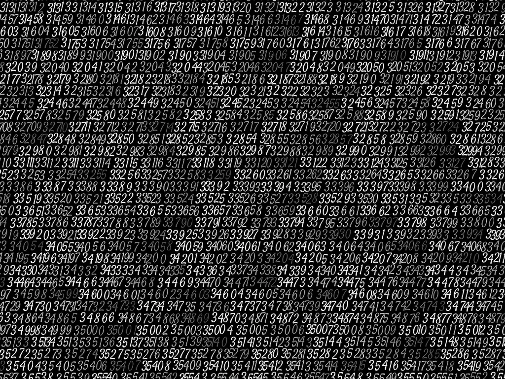
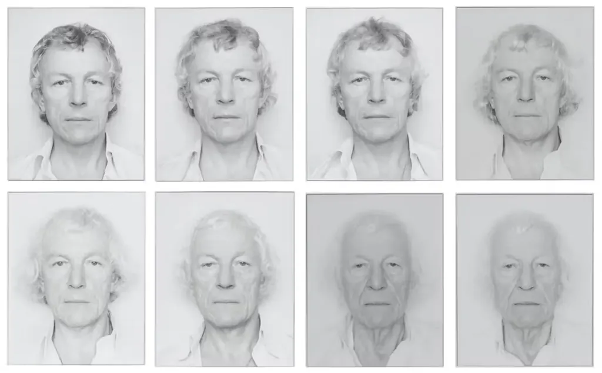
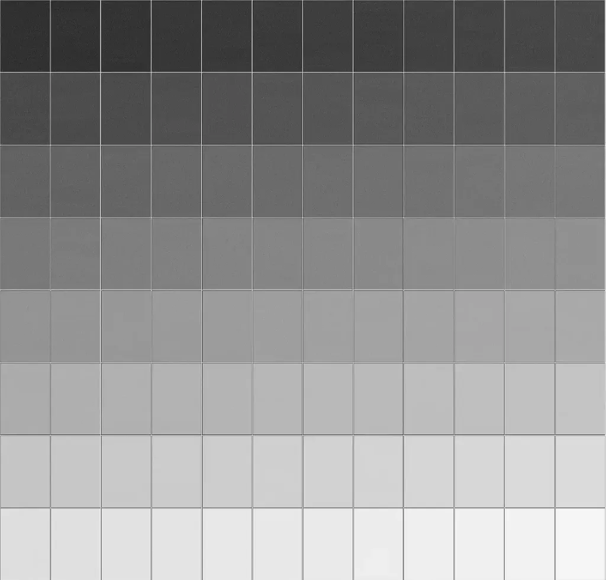

# Quand une œuvre d’art peut rendre fou

Un ami me dit « Tu connais l’art infini d’Opalka ». Jamais entendu parler. [Il me donne un lien.](https://ap.chroniques.it/roman-opalka/) Je commence à me renseigner, je suis vite subjugué. Mon ami me dit « Selon moi, c’est l’œuvre conceptuelle la plus aboutie du XXe siècle. » J’en viens à penser la même chose. Il y aurait au début du siècle l’urinoir de Duchamp (1917), et à son terme, et même au-delà, la série de Opalka de 1 à ∞ (1965-2011).

Tout commence en 1965. Roman Opalka, 35 ans, artiste francopolonais, attend sa femme quand il a l’idée de fixer l’écoulement du temps dans une œuvre d’art : il compte de 1 jusqu’au jour de sa mort en 2011, remplissant 233 toiles ainsi que [des feuilles blanches](https://www.centrepompidou.fr/fr/ressources/oeuvre/cAep4d), où il égraine des nombres jusqu’à 5 607 249.

Dans [The Conversation](https://theconversation.com/avec-roman-opalka-la-peinture-explore-le-temps-qui-passe-a-la-main-126871), on peut lire : « Tracer 5 607 249 nombres, c’est-à-dire 38 139 612 chiffres, requiert quelque chose comme 80 millions de secondes, si on considère qu’il faut deux secondes pour peindre chaque chiffre. Cela demande donc entre deux et trois ans, en travaillant chaque seconde de ces années. Ce calcul évidemment insensé n’est là que pour souligner l’ampleur de la tâche. »

Dans [Wikipédia](https://fr.wikipedia.org/wiki/Roman_Opa%C5%82ka) : « Ma proposition fondamentale, programme de toute ma vie, se traduit dans un processus de travail enregistrant une progression qui est à la fois un document sur le temps et sa définition. Une seule date, 1965, celle à laquelle j’ai entrepris mon premier Détail. »

Mon ami me dit que les toiles d’Opalka sont impressionnantes : haute de 196x135 cm. Je les imagine comme des pyramides pour célébrer le génie humain, son abnégation, sa persévérance, sa folie, sa démesure, sa dimension tragique, chaque nombre rapprochant de la mort. Je me demande à quel point ce travail monumental a façonné le cerveau d’Opalka. La nuit, il devait compter comme il m’arrive d’écrire à la limite de la conscience.

Peut-être que cette idée fole ne lui est pas venue en 1965 par hasard : c’est une date charnière dans le développement de l’informatique, avec la sortie du premier mini-ordinateur, le PDP-8 de Dec, et la création du BASIC. Et que fait Opalka ? Une œuvre qui déjà aurait pu être programmée, ou qui aurait bientôt pu l’être. Par ricochet, j’ai pensé à Kerouac qui tape *On the Road* sur un rouleau, anticipant le traitement de texte et son scrolling infini. Il y a souvent chez les artistes une anticipation des technologies, ce qu’elles s’apprêtent à changer, comme si elles provoquaient une tension latente.

Pour rendre hommage à l’œuvre monumentale d’Opalka, je me suis amusé à vibe coder [un petit script Python pour régénérer ses images](https://github.com/tcrouzet/opalka). Leur exploration est vertigineuse, d’autant qu’à partir de 1 000 000, Opalka éclaircit le fond originellement noir de ses toiles de 0,1 % quand il en commence une nouvelle. À partir de 2008, il finit par ne plus peindre qu’en blanc sur blanc, avec deux pigments de blanc différents pour que les nombres restent lisibles sous une lumière rasante.

<iframe width="560" height="315" src="https://www.youtube.com/embed/p5I0rDF_xpQ?si=0uX8ds7Mx6JFw-HJ" title="YouTube video player" frameborder="0" allow="accelerometer; autoplay; clipboard-write; encrypted-media; gyroscope; picture-in-picture; web-share" referrerpolicy="strict-origin-when-cross-origin" allowfullscreen></iframe>

Dans mon code, j’ai simulé le tremblé avec un peu d’aléatoire. J’ai aussi simulé le pinceau qui se décharge peu à peu de blanc au fur et à mesure que les chiffres se succèdent, puis qui à nouveau se charge de blanc. On retrouve des vagues, des jeux de lumière. Impossible de ne pas penser au générique de *Matrix*.

Plonger dans les images générées a quelque chose d’hypnotique, qui me met dans un état entre apaisement et folie. Cette œuvre est obsessionnelle (bien sûr, elle reste encore trop mécanique par rapport à son modèle — mais je peux ainsi l’explorer, avec la même gourmandise que [l’ensemble de Mandelbrot](https://mandel.gart.nz/)).

Je crois être dans le même état d’esprit qu’Opalka peignant ses nombres quand je m’occupe de mon jardin, quand je ne pense à rien, que je sens le temps s’écouler physiquement, sans que cela me procure de souffrance. Il y a au contraire une profonde satisfaction à arracher les herbes qui systématiquement repoussent.

Opalka se photographiait tous les jours pour raconter le temps avec son visage. Je me suis amusé à créer un tableau composé de mes simulations. J’ai ainsi fabriqué une extension de 1965 de 1 à ∞, ce qu’autorise et suscite même l’art conceptuel. Le résultat, à moins de me placer à une résolution vertigineuse, n’est qu’un dégradé de gris. Une insignifiance absolue.

J’ai la sensation, sans doute erronée, que cette petite investigation numérique de l’œuvre d’Opalka se traduira dans mon écriture. Peut-être pour créer un personnage au bord de la folie. Je n’en sais rien. Une intuition. Rien ne se perd quand il s’agit d’écriture et d’art en général. Toute expérience est métabolisée avant d’être transformée.

#cuisine #y2025 #2025-5-20-11h00
