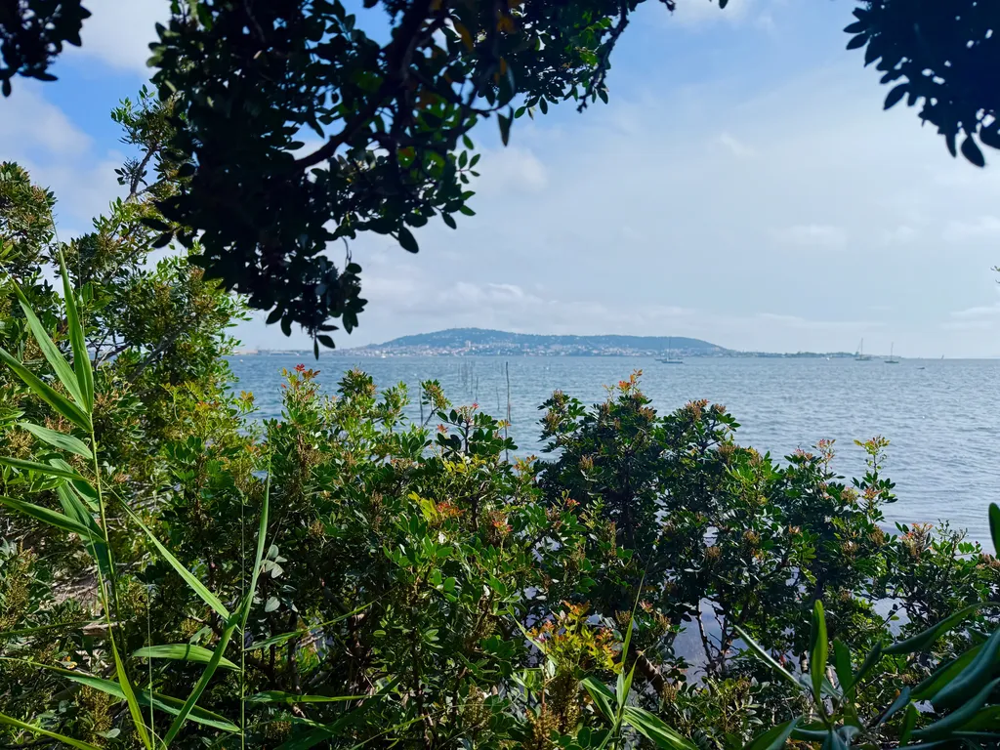

# De ma terrasse #17

_Ma sélection du dimanche : **14** liens et une photo prise depuis ma terrasse._

## Sciences et découvertes

[Les scientifiques découvrent un paradoxe dans l’évolution qui pourrait devenir la prochaine règle de la biologie](https://www.popularmechanics.com/science/animals/a65104271/biology-evolution-paradox/) • EN • 8 min  
Des chercheurs de l’USC proposent une nouvelle règle appelée « instabilité sélectivement avantageuse » qui explore comment l’instabilité peut en réalité bénéficier à une cellule et à un organisme cellulaire, remettant en question l’hypothèse que la vie recherche toujours la stabilité.

[La tension de Hubble est-elle un vrai problème ?](https://flip.it/MPmVpJ) • EN • 12 min

L’expansion de l’Univers mesurée à 67 km/s/Mpc par les reliques primordiales contre 73 km/s/Mpc par l’échelle de distance cosmique. Cette tension de 5-sigma persiste malgré les améliorations techniques, soulevant des questions fondamentales sur notre compréhension cosmologique.

[Comment les nuages obtiennent-ils leurs formes ?](https://flip.it/CV5ovM) • EN • 4 min  
De la formation des gouttelettes d’eau aux cristaux de glace en altitude, les facteurs qui déterminent l’apparence des nuages incluent la température, l’altitude, les mouvements d’air et même la topographie locale qui crée des ondulations atmosphériques.

[La plus grande caméra du monde va changer l’astronomie pour toujours](https://www.zmescience.com/science/news-science/the-worlds-largest-camera-is-about-to-change-astronomy-forever/) • EN • 6 min  
L’observatoire Vera C. Rubin dévoile sa caméra LSST de 3 200 mégapixels, capable de photographier l’hémisphère sud chaque nuit pendant dix ans pour cartographier plus de 20 milliards de galaxies et éclairer les mystères de la matière et de l’énergie noires.

[Une cinquième force de la nature pourrait avoir été découverte à l’intérieur des atomes](https://flip.it/hpQHKE) • EN • 3 min  
Des physiciens allemands, suisses et australiens ont identifié des restrictions sur l’emplacement possible d’une force hypothétique médiée par une particule de Yukawa, qui pourrait opérer entre neutrons et électrons dans les noyaux atomiques.

## Intelligence artificielle et technologie

[Des chercheurs scannent les cerveaux d’utilisateurs de ChatGPT et découvrent quelque chose de profondément alarmant](https://futurism.com/neoscope/brain-eeg-chatgpt) • EN • 2 min  
Une étude révèle des modifications préoccupantes dans l’activité cérébrale des utilisateurs réguliers de ChatGPT, soulevant des questions sur l’impact neurologique de l’interaction prolongée avec l’intelligence artificielle.

[Quelle quantité d’énergie l’IA utilise-t-elle ? Ceux qui le savent ne le disent pas](https://www.wired.com/story/ai-carbon-emissions-energy-unknown-mystery-research/) • EN • 7 min  
Malgré les 800 millions d’utilisateurs hebdomadaires d’OpenAI, les entreprises d’IA gardent secrètes leurs émissions carbone. Les chercheurs tentent de quantifier l’impact environnemental alors que 84 % des modèles utilisés n’offrent aucune transparence environnementale.

[Que se passe-t-il avec la lecture ?](https://flip.it/JfGqXM) • EN • 15 min  
L’IA transforme fondamentalement notre rapport au texte, permettant de résumer, modifier et adapter les écrits à la demande. Cette révolution pourrait marquer la fin de l’ère du texte traditionnel et redéfinir ce que signifie « être cultivé ».

## Psychologie et société

[Les « otroverts » et pourquoi les non-conformistes voient souvent ce que les autres ne peuvent pas voir](https://flip.it/MNgS5R) • EN • 6 min  
Rami Kaminski explore comment les individus qui résistent à l’identité de groupe et au conformisme social peuvent offrir des perspectives originales qui font progresser la société, à l’image d’Ignaz Semmelweis et de sa découverte révolutionnaire sur l’hygiène des mains.

[Alors que le SEO s’effondre, l’économie de l’attention vous rattrape](https://www.inc.com/joe-procopio/as-seo-falls-apart-the-attention-economy-is-coming-for-you/91203424) • EN • 5 min  
Avec la mort du référencement naturel, les entreprises se tournent vers un leadership de pensée authentique pour se démarquer dans un monde où l’IA amplifie le bruit et noie le signal, transformant LinkedIn en réseau social axé sur l’attention.

[J’ai supprimé mon second cerveau](https://www.joanwestenberg.com/p/i-deleted-my-second-brain) • EN • 8 min  
Après six ans de sobriété, l’auteur détruit son système de gestion des connaissances personnelles, réalisant que l’accumulation d’informations avait remplacé la réflexion véritable et que la suppression peut être un acte de libération intellectuelle.

## Innovation et environnement

[Ce simple cube en bois pourrait résoudre la crise mondiale de l’eau](https://flip.it/-Fbl8D) • FR • 4 min  
Des chercheurs australiens développent un dispositif révolutionnaire à base de bois modifié et de sel, capable de récolter l’humidité ambiante et de la transformer en eau potable grâce à l’énergie solaire, sans électricité ni infrastructure complexe.

## Culture

[Les 31 meilleurs documentaires de tous les temps](https://www.harpersbazaar.com/culture/film-tv/g65078021/best-documentaries/) • EN • 10 min  
Une sélection de films documentaires qui repoussent les limites de la narration non-fictionnelle, de *Time* de Garrett Bradley à *13th* d’Ava DuVernay, rappelant que le monde réel reste le terrain le plus riche du cinéma.

#digest #y2025 #2025-6-22-17h00 
