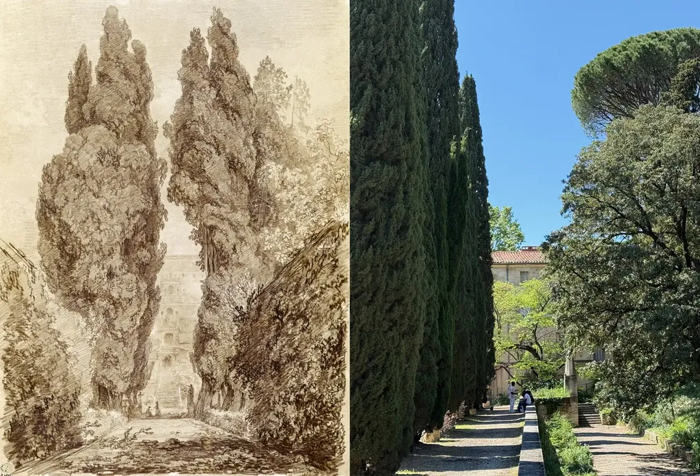
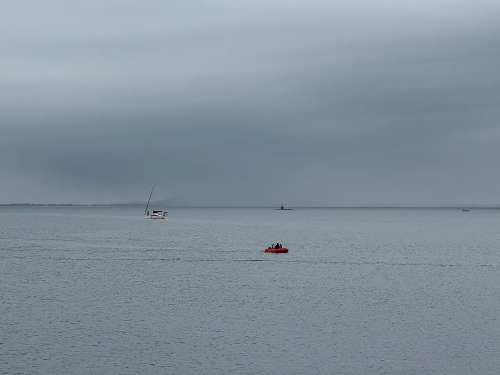
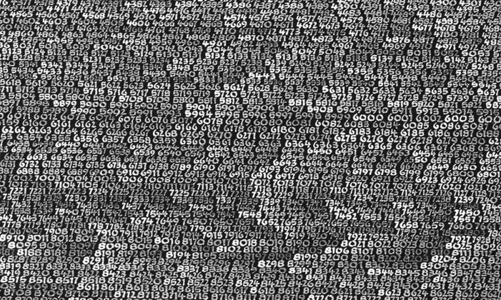
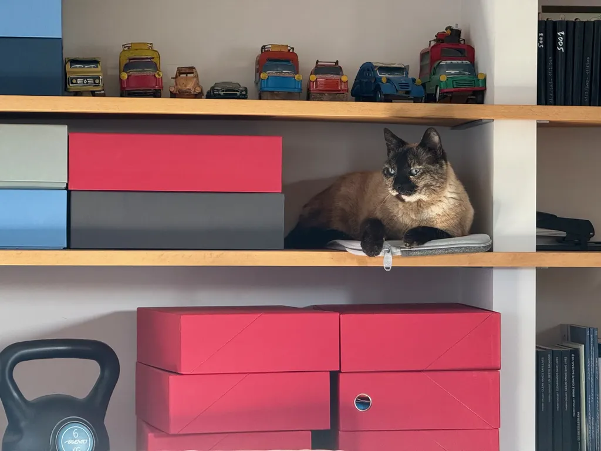
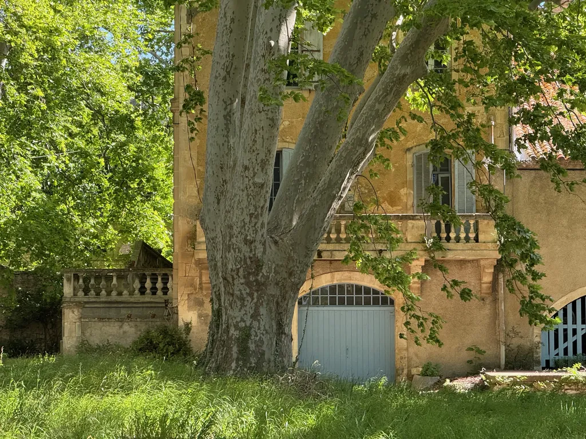

# Mai 2025


### Jeudi 1<sup>er</sup>, Balaruc

Une journée douce par le ciel, par la sortie vélo avec les copains, sans se défoncer, puis les divers projets avancent, les fleurs poussent dans le jardin et j’évite de penser à ce qui chagrine. Satisfaction : mon application de géolocalisation fonctionne, code robuste et facile à maintenir. J’ai tout de même passé trois heures sur un bug, mais c’est toujours un petit défi intellectuel, surtout quand je trouve la solution (qui avait coincé les IA, ce qui dit leurs limites, même si par ailleurs elles m’aident beaucoup).

J’ai commencé à réfléchir à une nouvelle histoire, pas un sujet de roman existentiel comme *Rush*, mais un polar assez ordinaire, avec lequel j’aimerais une fois de plus expérimenter l’écriture assistée (vibe writing). Pour comprendre où tout cela nous mène, et m’écarter avec fermeté de ce qui n’est plus de notre ressort.


### Vendredi 2, Balaruc

« Novelists who are more intelligent than their books should go into another line of work. » J’ai toujours eu l’impression d’être plus intelligent quand j’écrivais, ça ne veut pas dire que ce que j’écris est plus intelligent que moi, c’est tout le problème.

Une lectrice m’a un jour dit que je l’intimidais et mes textes aussi, ce qui me rendait moi-même difficile d’accès. Je lui ai répondu que je n’écrivais pas mes livres, que celui qui les écrivait n’existait pas en dehors du moment de l’écriture. Voilà pourquoi j’ai du mal à parler de mes livres. Je ne peux que discuter de ceux que j’aimerais écrire.

---

J’écris pour grandir quand beaucoup d’auteurs écrivent pour distraire.

---

Je ne dis jamais des choses que je ne pense pas, au mieux je me tais. J’ai le plus grand mal à mettre en scène des menteurs ou des hypocrites. Et donc dans mon projet, le héros me ressemblera mais en lui sommeillera un autre : menteur, hypocrite, manipulateur. M’attaquer à ce qui m’est étranger, mais dont je ne cesse de contempler le spectacle.

---

J’ai peu photographié en avril, signe que j’étais tourné sur moi-même, pas assez à l’écoute, pas assez tendu vers le monde. Plus je photographie, plus je suis heureux.

---

Isa lit *Les Petits Personnages* de Marie Sizun, digressions sur quelques tableaux, et découvre les *Grands cyprès à la Villa d’Este* de Fragonard, dont elle estime la composition quasi identique à la dernière photo de mon carnet d’avril. J’ai toujours aimé ces perspectives, avec un petit mystère au loin, des gens qui discutent, mais de quoi ? Faudrait que je me remette au dessin.



### Samedi 3, Balaruc


### Dimanche 4, Balaruc

Saunders : « I’ve worked with so many wildly talented young writers over the years that I feel qualified to say that there are two things that separate writers who go on to publish from those who don’t. First, a willingness to revise. Second, the extent to which the writer has learned to make causality. »

Mais la vie est-elle causale ? Non. Soudain nous croisons la femme ou l’homme de notre vie, rencontrons une personne décisive, lisons un auteur lumineux, tombons malades… Je me suis battu contre la causalité, dans ma vie et mon écriture, j’ai tenté de dynamiter cette mécanique dans *One Minute*. L’enchaînement causal est peut-être confortable pour le lecteur, mais il n’est pas réaliste, il est même ennuyeux. Je m’intéresse aux ruptures de causalité : une histoire part dans une direction, diverge. Saunders n’explique pas comment devenir écrivain, mais comment se conformer à la norme.

J’en suis à son chapitre 4, sur une nouvelle de Tolstoï, *Master and man*, Tolstoï que j’admire, mais la nouvelle m’est tombée des mains parce que j’en ai anticipé la causalité après seulement quelques pages, ce qui m’a rendu la suite exténuante et je n’ai fini que par feuilleter le texte. Le danger de la causalité : devenir prévisible. Je sais que des lecteurs apprécient le confort d’être dans un monde ordonné, moi ça m’emmerde.

« Causation is what creates the appearance of meaning. » J’ai trop aimé étudier la mécanique quantique et ses incertitudes pour souscrire. Le hasard a autant de sens que son absence. J’écris ces mots ce matin parce qu’il pleuviote et que je ne suis pas sorti pédaler. Avez-vous besoin de connaître ce détail ? Je ne le crois pas.

Je laisse tomber Saunders pour [The Marginalian du dimanche](https://mailchi.mp/themarginalian/choice-transformation-spell) où Maria Popova commence son premier texte par « Only a fool or an egomaniac would deny that chance shapes the vast majority of life. » Le hasard est un casseur de causalité. Sans hasard nos vies seraient dictatoriales. Sans hasard une œuvre d’art devient un pensum. Une œuvre littéraire accomplie déborde de hasards, dans chacune de ses phrases, dans le chaos de leurs louvoiements.

Saunders ne parle pas d’écriture mais seulement de structure, mais la vie commence entre les mots, dans leurs méandres, une virgule comme un brusque coup de vent qui pousse le voilier à virer de bord et à changer de destination. Je suis un barreur soumis aux intempéries incontrôlables. Quand je révise, je me garde de couper tout ce qui me détourne de la route, parce qu’alors je tue le texte, je le ramène à sa fonction utilitaire, et ce n’est pas ce que je cherche, mais dire la vie, quand elle se perd et s’émerveille de se chercher un sens.

Plus loin, Popova cite le psychologue Erich Neumann : « But the unintegrated factors are not only a cause for alarm; they are also the source of transformation. » Toutes ces choses non conscientisées, non perçues, qui pourtant provoquent des changements doivent-elles être explicitées dans un roman ? Non, elles ne peuvent pas toutes l’être. La plupart nous échappent et tenter de les dire revient à procéder à un réductionnisme ni scientifique ni poétique.

---

La plupart des gens contre l’IA sont pour l’alcool ou le tabac ou d’autres perversions. C’est un peu comme ces écolos qui fument.




### Lundi 5, Balaruc


### Vendredi 9, Aigues-Vives


### Samedi 10, Saint-Sever-du-Moustier


### Mercredi 14, Balaruc

[Retour de bikepacking](https://tcrouzet.com/2025/05/14/o727-2025-bilan/), le corps douloureux, mais encore capable d’affronter le monde.

### Jeudi 15, Balaruc

Si je vendais des livres, si j’avais un peu de succès, je ne ferais que consommer plus, ce serait finalement une mauvaise chose pour tout le monde. Si je vendais plus, d’autres vendraient moins, parce que le temps global de lecture « littéraire » n’augmente pas, il a même tendance à diminuer. Je n’ai aucun espoir d’entamer le gâteau des gros vendeurs qui ne ressentiraient pas ma morsure, si je marche, c’est pour prendre à ceux plus dans le besoin que moi. Le « marcheur » est un prédateur.

---

Je continue d’être harcelé par les réseaux sociaux que j’ai quittés il y a plus de deux mois. Je reçois des mails m’annonçant que je manque des actualités vitales ou que des gens cherchent à me contacter. Allez donc au diable.


### Samedi 17, Balaruc


### Dimanche 18, Balaruc

On me parle de l’œuvre conceptuelle monumentale de [Roman Opałka](https://fr.wikipedia.org/wiki/Roman_Opa%C5%82ka), dont j’ignorais tout : ce francopolonais a passé sa vie à peindre des toiles où il égraine des chiffres. Il commence à 1 et incrémente à partir de 1965. Résultat bouleversant. Consacrer sa vie à fixer l’écoulement du temps. Une maniaquerie ultime, quasi incompréhensible, mais qu’est-ce que je fais d’autre dans ce carnet, de manière moins constante et plus désordonnée. Le pendant d’Opałka en littérature, c’est [Amiel et son monumental journal](https://fr.wikipedia.org/wiki/Henri-Fr%C3%A9d%C3%A9ric_Amiel), recopié, je le découvre aussi, jour après jour depuis 1996 par [Gérard Collin-Thiébaut](https://fr.wikipedia.org/wiki/G%C3%A9rard_Collin-Thi%C3%A9baut). À sa mort, en 2011, Opałka a atteint 5 607 249 !



L’envie me vient de simuler le travail d’Opałka pour en mettre en scène la démesure. Je me retrouve face à une œuvre non technologique, mais qui met en œuvre des processus simplifiables par la technologie, comme quand Kerouac invente le traitement de texte avec son rouleau monté sur sa machine à écrire.

---

Je regarde un [documentaire sur le festival Élixir](https://www.youtube.com/watch?v=-TLUfgrAECc&ab_channel=Morgane), dont j’ignorais tout, ou dont j’avais tout oublié, un festival de ma jeunesse avec les groupes de ma jeunesse, dont le visionnage m’a arraché des larmes devant le temps qui passe beaucoup trop vite. C’était hier. Je me suis revu à travers le public, j’ai revu ma jeunesse, immédiatement datée, immédiatement archaïque.

### Lundi 19, Balaruc

Le journal « intime » est le lieu pour dire ce qui m’arrive, mais mon journal n’est plus intime depuis longtemps et ne me permet plus d’écrire ce qui m’arrive, ce qui nous arrive, ce qui nous bouleverse et nous secoue. Il ne me reste que la parole, mais elle ne me suffit pas, je suis écrivain, j’ai besoin d’écrire ce qui m’arrive, c’est ça qui fait un écrivain, ce besoin, rien d’autre, pas de publier, pas d’avoir du succès, pas d’atteindre le génie. Je suis forcé au silence littéraire. Ça me paralyse.

### Mardi 20, Balaruc

Suis allé à vélo jusqu’à Montpellier pour voir Isa à l’hôpital. Elle me dit que nous avons vu un Opalka au [château de Biron](https://chateau-biron.fr/fr/) lors d’une exposition. J’ai tout oublié. J’aurais pris beaucoup de photos. Je ne trouve aucune certitude sur le web, ni dans mes carnets. Je me souviens de l’exposition, de sa qualité, de son impact sur moi, sans garder d’autres détails. Incapable de me souvenir de l’année.

Mes recherches sur le web ne m’aident pas beaucoup. « L’exposition hors les murs été 2019. En parallèle de l’ouverture de la MÉCA, la collection du Frac reprend son nomadisme avec l’exposition Habiter le monde, sociétés et figures humaines au Château Biron (Dordogne) qui réunira durant tout l’été une large sélection d’œuvres issues des collections des trois Frac de Nouvelle-Aquitaine. » Le Frac dispose d’œuvre d’Opelka. Mais autant que je me souvienne l’expo que j’ai vue à Biron était très conceptuelle, sans rapport avec la figure humaine.

Nous avons acheté le catalogue, mais je ne le retrouve pas. En le cherchant, je tombe sur un livre que j’ai longtemps cherché, aussi sur un de mes carnets londoniens. Je voudrais mettre au propre tous ces textes de Londres, projet sans cesse repoussé.

Suite à [mon article et ma simulation de l’œuvre d’Opalka](https://tcrouzet.com/2025/05/20/opalka/), François m’envoie *Le Roman de l’être* de Bernard Noël, qui fait parler Opalka, très beau texte, sans ponctuation, comme les chiffres qui se suivent sur les toiles d’Opalka, tentative de poursuivre le temps par les mots, sans que ce soit nécessaire parce que cette poursuite est implicite dans le langage, comme dans l’énumération, mais pour rendre hommage, pour célébrer un ami, on peut se donner tous les droits.

### Mercredi 21, Balaruc

J’ai tenté de tenir un second journal, parallèle, que pour moi, je n’y arrive pas. Les mots douloureux me coûtent, me pèsent. Je suis dans l’attente, m’accroche à des détails, à des futilités, tout en laissant de côté les tâches quotidiennes qui me pèsent plus encore que les mots.

J’exprime le vibe writing jusqu’à l’écœurement. Comprendre les LLM en profondeur, nécessité contemporaine, pour mieux leur opposer soi-même. C’est souvent une torture. Me retrouver face à des entités stupides et brillantes. Pendant ce temps, la plupart des écrivains continuent leur vie dans la tranquillité endormie du bon temps d’avant. Je me tiens à un croisement douloureux.

Je me force à écrire quelques mots, des mots de moi, des mots sans but dans un monde dirigé vers des objectifs. J’entrevois dans la non-nécessité la nécessité de la littérature : être là où rien ne veut que nous soyons, faire ce qui n’est pas contingent, ce qui n’est pas utile, écrire sans la tension de la phrase suivante, écrire 1, puis 2, puis 3 et continuer, comme Opalka, non parce qu’un chiffre inattendu surgira, ce sera n+1, vous êtes avertis, il ne se passera rien, sauf qu’un jour ça s’arrêtera, sans même que le point final soit posé, ça s’arrêtera parce que je ne voudrais pas y croire ou parce que je ne m’y serais pas préparé.

Lire c’est attendre ce moment où l’auteur s’arrête, pas tel ou tel livre, mais sa vie. La littérature est là, non finie d’elle-même, mais terminée par le monde. Elle raconte un effondrement.

---

Je passe de plus en plus de temps à arracher des mauvaises herbes dans le jardin, autour de mes plantations expérimentales. Un copain m’a dit « Le jardinage est le sport des vieux. » Je dois m’y résigner. À 86 ans, ma mère s’occupe encore de son jardin. Je me penche sur la terre, et le monde n’existe plus.

### Jeudi 22, Balaruc

Dans le livre de Noël, Opalka raconte : « ce qu’on réussit à faire par le chaos j’ai voulu le faire par la logique j’ai beaucoup aimé être exposé à côté de Pollock car je suis son contraire chez moi la vérité est tout entière déterminée ». Belle opposition pour dire la même époque éprise d’abstraction (quand aujourd’hui la réalité dure nous ramène au concret, quand l’écriture elle-même implique un retour au réel, parce qu’il s’impose à nous, et impose la nécessité de le prendre en compte — plus moyen de faire abstraction des contingences à moins d’être sourd et aveugle).

Quand j’ai commencé à lire Noël, j’ai vu l’absence de ponctuation comme une facétie d’un autre siècle, un truc, puis très vite j’ai lu sans problème, comme si je suivais les chiffres d’Opalka et non plus les numéros qu’ils composent. Puis, j’ai compris que mon cerveau réinventait la ponctuation automatiquement, comme une IA pourrait le faire sans difficulté. Je lis sans le moindre effort « Ce qu’on réussit à faire par le chaos, j’ai voulu le faire par la logique. J’ai beaucoup aimé être exposé à côté de Pollock, car je suis son contraire. Chez moi, la vérité est tout entière déterminée. »

Supprimer la ponctuation pour un lecteur habitué à lire ponctué n’a aucune espèce d’importance. Quand j’écris, il m’arrive souvent d’oublier des mots et des ponctuations. J’ai beau me relire cent fois, je ne vois pas l’absence, parce que mon cerveau m’illusionne. Le bon correcteur ne se laisse pas tromper. C’est un lecteur sérieux, alors que je suis un rêveur. Le truc de Noël n’est qu’un truc pour attirer l’attention de la critique, un truc non nécessaire, puisqu’il est sans effet.

Ou il a eu un effet lors de l’écriture, parce que j’imagine le texte écrit ainsi, pour transcrire Opalka, qui ne ponctuait pas son phrasé ni ses énumérations. Mais moi, je ne peux m’empêcher de ponctuer, le stratagème n’a aucun effet sur moi, excepté de m’en faire parler.

---

Je suis capable de couper un texte jusqu’à ce qu’il n’en reste plus rien. Les copains devraient proposer cet exercice en atelier d’écriture. Peu à peu prendre un texte et l’annihiler. Simuler la putréfaction du corps. Simuler l’effet de l’entropie sur nous. À chaque passe d’effacement, prendre une photo. Peter Greenaway a filmé la putréfaction dans *A Zed & Two Noughts*. Le langage veut résister, ce n’est qu’une illusion. C’est l’attention du lecteur qui se putréfie, puis le lecteur lui-même et il ne reste que des textes morts, puisque sans lecteur.

Je suis sans doute le seul à lire Noël en ce moment. Alors que j’écris, personne n’est en train de me lire en toute probabilité, et je suis vivant, c’est dire ce qu’il adviendra après ma mort. Alors pourquoi couper, retravailler, épurer ? Une maladie précoce. Ou simplement aligner des mots comme Opalka des chiffres. Il n’y a finalement aucune différence. Tu fais, puis tu meurs.

Quand je n’ai pas de projet d’écriture sérieux, les idées noires me prennent avec plus de facilité. Je crains de tourner à vide, de finir comme mon père. À 70 ans, il a sombré dans la dépression. J’approche doucement des 62 ans. Est-ce qu’il ne me reste que huit ans de lucidité ? J’espère davantage, parce qu’il me reste tout à faire alors que mon père pensait avoir fait tout ce qui était pour lui de l’ordre du possible. Pour moi, les possibles sont sans limite.

---

Étrange ce cerveau. Tim est sur un beau projet de fin d’année en école d’ingé. Il m’en parle, me demande conseil, et dans la nuit j’ai l’idée d’une approche technique totalement différente par rapport à celle initialement envisagée.

### Samedi 24, Balaruc


### Dimanche 25, Balaruc

Noël fait parler Opalka (je ponctue) : « J’ai des exigences au sujet de la vérité, c’est-à-dire de la logique, de la cohérence. Au début, si j’omettais un chiffre dans mon processus, je revenais en arrière, je revenais en arrière pour souligner la faiblesse, je voulais témoigner de cet aspect moral. J’ai compris que l’erreur prouve la logique du système. Ce n’est pas une erreur mais une faiblesse. Il ne s’agit pas de perfection, il s’agit de reconnaître les limites de notre travail et l’honnêteté, c’est de le dire. »

L’idée me vient de créer des tableaux d’Opalka avec des erreurs et de voir s’il y a des gens assez fous pour les chercher.

« Buren m’est proche dans le temps mais la différence entre lui et moi et ceux qui lui ressemblent c’est que je fais toujours la même chose sans qu’elle soit jamais terminée, tandis qu’ils présentent à chaque fois un objet fini dans sa proposition formelle, dans sa définition et qui n’a pas la dynamique d’être une seule et unique chose comme l’est la vie. Buren fait tantôt un escalier : São Paulo, tantôt des chaises : Venise, tantôt des voiles : Berlin, tantôt des colonnes : Paris. C’est très intelligent, très dialectique, très social, très actuel, alors que moi je pourrais naître dans un univers à venir aussi bien qu’être un Grec du temps de Pythagore. »

Ce que n’a pas perçu Opalka : son travail est aussi fini, il ne tient qu’en quelques lignes de code. Il aurait pu le savoir, peut-être il l’a su, son travail monumental ne nécessite que [quelques instructions](https://github.com/tcrouzet/opalka). Opalka n’a fait que se transformer en ordinateur, en même temps que se développait l’informatique. C’est comme s’il avait crié : « Non, pas ça. » Un cri dérisoire contre la tempête qui se levait.

Opalka n’a pas enregistré le temps de sa vie sur une toile, il a imité laborieusement une machine bien plus compétente que lui pour égrainer la suite des entiers naturels. Je trouve son geste magnifique et dérisoire, un rien pathétique. Opalka a compté pendant que je passais de deux ans (1965) à 48 ans (2011). Il a compté durant 46 ans. 

### Lundi 26, Balaruc

Tracer sa vie. Voilà pourquoi Opalka me fascine. « Ce que je fais est le portrait d’une vie. » Parce que je ne tente pas autre chose, mais pas davantage que le jardinier, qui n’a pas la prétention de laisser une trace durable.

Je n’écris qu’une part infime de ma vie. Il m’arrive de dormir, de manger, de parler, de faire les courses ou du vélo. Hier : l’après-midi sur les impôts. Ça ne se raconte pas, c’est déjà assez pénible. Et nous devons reprendre ce matin. Je ne consacre qu’une parcelle de mon temps à tracer. Il en allait de même pour Opalka. Son projet d’exhaustivité était vain. Ses énumérations quotidiennes n’étaient que des moments de méditation. Jamais il n’a réussi à écrire le portrait de sa vie. Une vie ne peut pas se dire elle-même (même si, quand elle se dit, elle ne se met pas entre parenthèses — au contraire, je ne vis jamais autant que quand je me dis, parce que je prends doublement conscience).

« La quantité va réduire la qualité. » Nous en sommes là, croulant sous de plus en plus d’énumérations. Opalka avait décidé de ne peindre qu’une seule œuvre pendant que ses contemporains se démultipliaient (démultiplication qui ne cesse de s’amplifier, aidée par les machines et les IA).

[Anthropic se pose la question du bien-être de ses modèles](https://www.anthropic.com/research/exploring-model-welfare) avant de se poser celui des humains. Mais je comprends la question. Depuis toujours, j’ai la certitude que nous autres humains n’avons que très peu de qualités intrinsèques, notamment pas la conscience ni la capacité à souffrir. Tôt ou tard les IA pâtiront de notre hubris.

« Après un quart de siècle, j’ai constitué quelque chose de plus fort que moi. C’est très corporel, très organique. Je visualise la vie active. Si mon travail est absurde, il a l’absurdité de l’existence. Chez l’ouvrier, le travail absurde est la partie honteuse de notre monde qui exige d’être esclave pour manger. Je suis quelqu’un qui a choisi et qui veut garder sa dignité. L’injustice est que j’ai eu le temps de comprendre alors que mon père ne l’a pas eu. Une partie de l’humanité travaille sans avoir le temps de réfléchir et, dès qu’elle libère un peu de temps, on le remplit de stupidité, de gadgets. »

Je ne suis pas sûr qu’il y ait beaucoup de dignité dans les choix d’Opalka, rendus possibles seulement parce qu’un marché de l’art existait, parce que des millionnaires et des institutions s’intéressaient à son travail. Opalka n’était qu’un privilégié, capable de choisir un travail répétitif alors que son père descendait dans une mine de charbon en Pologne. Il n’y a aucune dignité à vivre des subsides de ceux qui accumulent des richesses au détriment des autres, parce que c’est toujours la même règle du jeu.

La vie d’Opalka se résume à :

```python
n = 1
while True:
	print(n)
	n += 1
```

Est-ce digne de réussir à gagner sa vie avec ça ? J’ai quelques doutes. J’y vois plutôt la démonstration de la dinguerie de notre époque. Les uns descendent dans les mines pendant que les autres s’amusent (et se donnent bonne conscience en prétendant leur poésie nécessaire au bonheur de tous — elle l’est surtout au leur).

« Ce que je fais, tout le monde le fait, sauf que je le fais comme image de ce tout le monde. Mon travail paraît égocentrique et il est pourtant universel car il rend visible l’accumulation de l’activité. Si on pouvait voir tout le charbon qu’a extrait mon père, ce serait son œuvre. Moi je l’ai fait consciemment comme l’image de l’activité d’une vie, d’une vie qui a conscience d’être solidaire du monde du travail. Je fais quelque chose d’absurde mais qui pose à chaque existence des questions indispensables. »

J’ai presque envie de répondre : « Tu te pignoles. Tu ferais mieux de te taire, ça devient outrageant. Tu ne le fais que parce qu’on te paye pour le faire, et très bien. Tu t’es trouvé une petite martingale. Assez minable et tu tentes de la glorifier pour te donner bonne conscience. Tu enfonces le clou du concept, tu lui donnes de l’importance alors qu’il ne s’agit que de quatre lignes de code. »

Je prends conscience qu’on peut faire mieux :

```python
while True:pass
```

Une seule boucle, infinie, qui ne fait rien. Ce serait l’état de bodhisattva ultime. Sans oublier que toute boucle implique une dépense énergétique, que ces jeux ne sont possibles que parce que des producteurs extérieurs acceptent de les rendre possibles. Oui, des millionnaires sont prêts à payer l’artiste conceptuel qui ne ferait rien. Ils sont prêts à exploiter le travail de beaucoup de personnes pour en payer une à ne rien faire du tout.

Opalka m’attire et me répugne : plus je creuse, plus cette dichotomie grandit en moi. Sa voix devient agaçante, prétentieuse, hors sol. Noël paraît lui accorder son absolue bénédiction. Jamais un mot de travers, jamais une critique. Admiration béate pas loin du fanatisme.

---

J’ai annoncé la sortie d’[*Épicènes*](https://tcrouzet.com/books/epicenes/) avec « J’ai besoin de vous tous ». Ce titre a soulevé l’inquiétude de proches et d’amis. Je me suis empressé de le changer, mais il était trop tard : ma newsletter était partie.

La vérité : j’ai toujours besoin de vous, j’ai toujours eu besoin de vous, et je crois que ce sera de plus en plus le cas. Se croire indépendant est la plus grande des illusions. Sans vous, rien n’a de sens, et la vie devient beaucoup plus lourde. La solitude est une terreur. Voir des gens dans la solitude me terrifie.

Je n’ai pas besoin de vous pour acheter mon nouveau livre, j’ai besoin de vous à chaque instant. J’ai besoin de sentir vos souffles, j’ai besoin de vos sourires, de vos grimaces, j’ai besoin de moments avec vous. J’ai déjà passé beaucoup trop de temps solitaire.



### Mercredi 28, Balaruc

On m’écrit : « Je pense il faut juste continuer les balades en vélo avec des amis. Il faut écrire pour ceux qui lisent et ne pas faire attention aux autres. » Ma réponse : « C’est ce que je fais, mais quand les autres foncent droit sur vous pour battre un KOM ? » Le net social, c’est exactement ça, un chemin où vous vous promenez tranquillement et où des abrutis vous foncent dessus. Mais je suis souvent dans la peau de l’abruti, quand sur un chemin des promeneurs en occupent toute la largeur et se l’approprient. Nous autres cyclistes avons l’habitude de nous ranger, habitude pas partagée par ceux qui mettent le nez dehors une fois de temps en temps.

---

Les mots d’Opalka selon Noël : « Ce que je fais est l’image la plus adéquate de la vie. Je pense que je ne délire pas. Alors que mon travail paraît froid, il est très émouvant à cause de cette adéquation à la vie. »

Quel culot, quelle prétention ! Une suite arithmétique de raison 1 est-elle l’image la plus adéquate de la vie ? L’art contemporain conduit un homme à penser ça. C’est à se tordre de rire et de chagrin. Je trouve ses toiles émouvantes parce qu’il y a mis une énergie démesurée, mais elles m’émeuvent moins que les longs murets de pierres sèches qui parsèment les garrigues : ces accumulations ont duré des générations, des siècles, même des millénaires.

« Je n’ai pas inventé les chiffres (comme s’il avait besoin de le préciser), j’ai inventé comment faire avec eux un univers. » Parce que les mathématiciens font autre chose depuis la nuit des temps ? Tu n’as rien inventé, sinon une martingale, qui ne nécessite aucun savant calcul de probabilité. Plus j’avance dans le bouquin de Noël, plus je prends Opalka en grippe. Personne ne leur a rien dit en leur temps ? Personne ne les a remis à leur place ? Je cherche. Je ne trouve que des critiques pour hermétisme, alors que pour moi ce texte n’a rien d’hermétique. Tu remets la ponctuation et ça devient une prose tout à fait ordinaire.

### Jeudi 29, Alpilles




### Samedi 31, Balaruc

Je me dis qu’il me faut trouver quelque chose à écrire pour parachever ce mois terminé par deux jours caniculaires, [passés sur les chemins de Provence à pédaler](https://tcrouzet.com/2025/05/30/restrictions-du-gravel/). J’ai les yeux encore perdus dans les lignes de crêtes dentelées. Cette volonté d’ajouter des mots à des mots ne diffère pas de celle d’Opalka, au moins il n’avait pas à se demander quoi ajouter. Son spectateur n’a aucun effort à faire. Il connaît le contenu, alors que je vous impose de lire mot à mot, dans l’espoir d’une révélation fracassante sur la nature du monde, ou la nature du corps qui vieillit, qui souffre sous le soleil, qui finit cramoisi. Dans certaines montées, j’avais parfois l’impression d’avoir le cœur dans la gorge.

Je n’ai jamais senti le temps avec autant d’acuité. Peut-être parce que les enfants s’émancipent, parce que Tim parle de chez lui en évoquant son appart parisien, parce qu’Émile passe le bac et s’apprête à vivre ailleurs, refermant une page de notre histoire. Je suis conscient de vivre une transition et la regarde non sans affolement, je suis entre deux vies (et Isa doublement, entre une vie en pleine forme et une autre grandement diminuée — elle a attiré mon attention vers le « Ma » (間), [concept esthétique et philosophique japonais pour désigner l’intervalle, l’espace-temps, l’entre deux](https://umanz.substack.com/p/la-lettre-de-umanz-lespace-entre) — cette même chose que je traque entre les mots). Toute cette histoire s’est jouée si vite. C’est à peine croyable. J’ai dû manquer quelque chose. Nous ne pouvons pas être le dernier jour de mai 2025.

Cette conscience du temps, de sa fuite, est peut-être un don de l’âge. Avant je manquais de temps pour mener à bien dix projets de front, mais je ne percevais pas le temps, maintenant il marque tout, jusque dans mon corps, et je ne peux plus fermer les yeux. Aucune urgence ne m’aide à l’oublier. Beaucoup de choses jadis jugées importantes n’ont plus le moindre intérêt : qu’en pensent les autres. Je me fiche des autres en général, m’importe seulement l’avis de ceux que j’aime, et vous êtes nombreux, tous ceux avec qui je peux partager des moments de complicité, même à distance à travers les mots.

---

Je m’énerve contre des copains cyclistes qui voient la souffrance comme un plaisir. Ma réponse : « C’est bon pour les hommes blancs sans problème cette affaire ou les mystiques qui se flagellent (un peu la même chose d’ailleurs). Je suis du côté des épicuriens, sachant qu’on finit tous par en chier un jour ou l’autre. La vraie souffrance ne fait jamais plaisir (je l’expérimente tous les jours dans les yeux d’Isa). »

Prendre du plaisir dans l’effort, je comprends, parce qu’il y a la récompense au sommet du col. Mais l’effort n’a rien de commun avec la souffrance. Se placer volontairement en état de souffrance extrême me répugne. Et de voir des gens s’adonner à ce jeu me révolte. Ils feraient mieux d’employer leur énergie pour le bien d’autrui plutôt que de se masturber en public. Jouer à souffrir est le comble du solipsisme et de l’égotisme. Un signe de décadence quand beaucoup suivent cette pente.

#carnets #y2025 #2025-6-2-11h00
