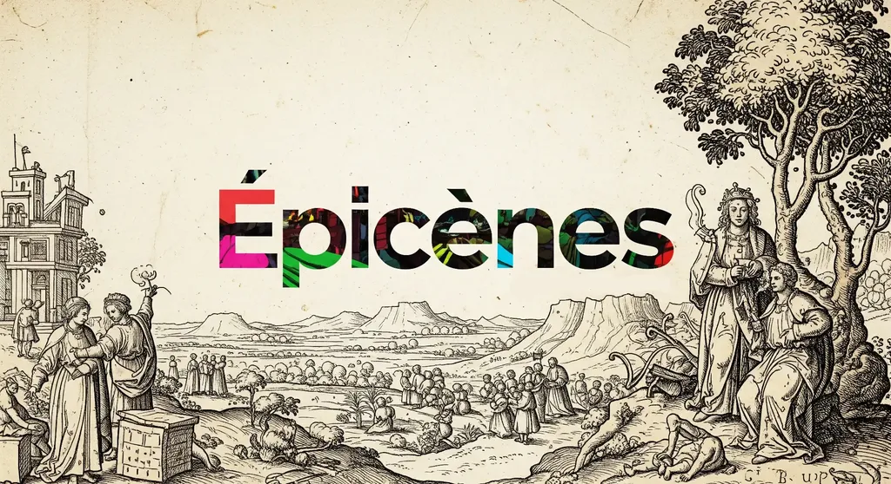

# Après la mort du journaliste, la mort de l’universitaire

Après avoir créé [une machine à interviewer et tué les journalistes littéraires](https://tcrouzet.com/2025/06/13/auto-interview/), il m’a semblé évident que je pouvais aussi tuer les universitaires spécialistes de littérature (une pensée pour Erika, Gilles, Oriane, Marcello…).

Claude ayant généré une analyse détaillée de mon roman chapitre par chapitre, je lui ai demandé de construire ensuite une méta-analyse, puis de me proposer dix sujets d’articles universitaires, en lui donnant pour modèle une structure type.

Peu convaincu par les premières propositions, je lui ai demandé de se mettre dans la peau d’un thésard sous la direction de [Dominique Viart](https://fr.wikipedia.org/wiki/Dominique_Viart), un de nos grands théoriciens de la littérature contemporaine. Les propositions sont devenues plus techniques et plus surprenantes. J’en ai mélangé deux pour en faire le sujet d’un article.

Claude m’a proposé un plan, puis je lui ai demandé de développer pas à pas, le reprenant chaque fois, lui indiquant les répétitions et les erreurs. Ce travail m’a pris cinq heures, avant que je m’approprie le texte, le coupe, l’édite, le resserre, parfois avec l’aide de Claude.

Il est sorti de ce dialogue des perspectives que moi l’auteur n’avais pas envisagées, des points de vue intéressants, surtout que j’ai peu de chance de recevoir de mes semblables, et c’est là que l’affaire devient dramatique et laisse entrevoir un avenir effrayant.

Faute de retours humains, dans mon cas sur un roman tout nouvellement publié, nous risquons de nous rabattre sur les retours artificiels comme nous pourrions être tentés par les drogues. L’IA devient un palliatif à la solitude de reconnaissance. Ce recours compulsif à l’IA risque de se généraliser. C’est le pendant au besoin de reconnaissance sociale qui nous pousse à rechercher les likes sur les réseaux sociaux ([je suis presque guéri de ce mal](https://tcrouzet.com/2025/03/19/quitter-facebook/), mais succombe déjà à un autre sans doute bien pire).

L’essai que je publie plus loin n’a rien d’extraordinaire ou de révolutionnaire, mais il est déjà beaucoup plus profond que tous les retours que la plupart des auteurs reçoivent sur leurs textes. Et pensez que nous n’en sommes qu’à l’année trois des grands modèles ouverts au public. Demain ce qui m’a pris cinq heures ne prendra plus qu’une et bientôt le résultat sera peut-être au-delà de nos possibilités.

Qu’est-ce qui nous attend ? Que restera-t-il de nos professions ? De notre organisation du monde ? Est-ce un hasard si de droite à gauche les hommes se bombardent à coups de missiles et de drones ? Je ne crois pas. Nous vivons une grande désintégration des croyances anciennes, de ce qui paraissait immuable. Tout s’effondre et comme les épicènes nous n’avons nul havre où nous réfugier.

---

Attention l’essai spoile [*Épicènes*](https://tcrouzet.com/books/epicenes/), lisez le roman avant de vous laisser pervertir (par cette parodie qui reprend les codes des articles sérieux).

### Du dictionnaire au roman : stratégies métafictionnelles et brouillage générique dans _Épicènes_

**Résumé** Cette analyse examine les stratégies métafictionnelles déployées par Crouzet dans son bref roman [*Épicènes*](https://tcrouzet.com/books/epicenes/) (juin 2025), depuis l’ouverture lexicographique jusqu’aux multiples niveaux de narration. L’article montre comment le roman joue avec les codes de divers genres (dictionnaire, fiction, essai, journal) pour créer une œuvre hybride qui interroge les catégories littéraires. En s’appuyant sur les théories de Genette sur la métalepse et les travaux de Viart sur les fictions critiques, l’étude démontre que cette hybridité formelle n’est pas ornementale mais constitutive du projet épicène : créer une forme littéraire aussi fluide et inclassable que les êtres qu’elle décrit. Le brouillage générique — mélange des codes de genres différents — devient ainsi performatif de la fluidité identitaire au cœur du roman.

### I. L’épicène comme principe structurant

### Ouverture et problématique

L’ouverture d’_Épicènes_ de Thierry Crouzet déroute le lecteur par sa forme : plutôt qu’un incipit romanesque traditionnel, l’auteur choisit de commencer par une entrée de dictionnaire. Ce dispositif inaugural établit d’emblée un pacte de lecture ambigu qui oscille entre fiction et documentation, entre littérature et savoir encyclopédique. La forme lexicographique, avec sa typographie caractéristique (terme en gras, catégorie grammaticale, définition structurée), crée une illusion d’objectivité scientifique qui sera subvertie au cours de l’œuvre.

Cette transgression générique initiale programme une architecture narrative complexe. L’entrée lexicographique introduit un « phénomène mal expliqué de superposition entre deux ou plusieurs individus » qui fait glisser le registre linguistique vers le fantastique. Plus encore, la structure même de cette introduction — mi-dictionnaire, mi-fiction — incarne l’ambiguïté épicène qu’elle prétend définir, annonçant un texte qui interrogera les frontières entre les genres grammaticaux et littéraires, entre réalité et fiction, entre individualité et pluralité.

Le choix du terme « épicène » comme titre et première entrée révèle la stratégie métafictionnelle de l’auteur. Ce concept grammatical désignant les mots identiques au masculin et au féminin devient métaphore d’une identité fluide qui transcende les catégories binaires. L’œuvre exploite cette double dimension — linguistique et identitaire — pour créer un roman qui soit lui-même épicène : ni complètement réaliste ni complètement fantastique, échappant aux classifications rigides comme ses personnages échappent aux catégories de genre.

Cette problématique soulève une question critique fondamentale : comment Crouzet utilise-t-il le brouillage des formes littéraires pour créer une performative de la fluidité épicène qu’elle décrit ? Notre hypothèse : l’hybridité générique n’est pas ornement formel mais méthode de connaissance. Le roman développe une forme littéraire aussi fluide que les êtres qu’il met en scène, avant de déconstruire philosophiquement l’idéal fusionnel qu’il a lui-même établi.

#### Contextualisation théorique

Cette problématique s’inscrit dans le cadre théorisé par Dominique Viart : la littérature transitive contemporaine écrit « quelque chose ». Contrairement à l’intransitivité moderniste qui se regardait elle-même, _Épicènes_ dialogue avec les sciences linguistiques, la physique quantique et la sociologie de la surveillance, tout en maintenant sa spécificité littéraire.

Le concept de fictions critiques s’avère opératoire pour analyser _Épicènes_. L’œuvre mêle invention romanesque et réflexion théorique : l’introduction lexicographique analyse le concept d’épicène, Johnny théorise la physique quantique de l’amour, B&W déconstruisent philosophiquement la fusion. L’écriture blanche de Crouzet permet cette circulation interdisciplinaire sans sacrifier la spécificité esthétique, un style inclusif qui fait coexister divers registres sans hiérarchie.

Le brouillage générique n’est pas simple effet de style mais constitue la méthode même de l’œuvre : créer une forme hybride pour dire l’identité hybride, puis interroger cette hybridité elle-même.

#### État de la recherche et positionnement

L’étude de l’hybridité générique dans la littérature contemporaine française constitue un champ en expansion, mais peu d’analyses examinent le brouillage des formes comme performativité thématique. L’originalité de Crouzet réside dans sa capacité à créer une science-fiction ni technologique ni futuriste et à explorer les questions de genre sans militantisme.

Notre corpus se délimite aux six chapitres d’_Épicènes_ et à leur progression architecturale. Cette délimitation permet d’analyser la cohérence de l’œuvre : la progression numérique des fusions (2→3→4) suivie d’une déconstruction révèle une architecture signifiante où chaque chapitre contribue à un effet d’ensemble calculé.

La thèse défendue ici est que le brouillage générique constitue l’essence du projet épicène. Comme les êtres qu’il décrit inventent leur propre mode d’existence, le roman invente ses propres outils formels pour dire l’indistinct.

### II. L’architecture de la progression numérique

### La transgression initiale

Après l’incipit lexicographique, _Épicènes_ opère une mutation formelle spectaculaire avec le chapitre 1, « Swan ». Le basculement s’effectue par un contraste saisissant : « Tout commença par une blague » remplace la précision terminologique par l’oralité narrative. Cette transition révèle la stratégie métafictionnelle de Crouzet : le roman ne raconte pas l’épicénie, il la fait advenir dans sa propre forme.

Le chapitre exploite immédiatement l’ambiguïté sémantique du pronom « ils » pour créer un effet narratif inédit. Grammaticalement correct pour désigner deux personnes, ce pronom devient progressivement le signifiant d’une entité unique. Lors de la fusion sur la plage, Crouzet écrit : « Ils se perdirent l’un dans l’autre et s’oublièrent. Bien plus tard, ils quittèrent le banc de sable, rejoignirent la plage, ramassèrent leurs affaires, marchèrent vers la ville, leurs empreintes confondues. » Le « ils » désigne encore deux personnes, mais suggère déjà l’émergence d’un être unique.

Cette innovation révèle la sophistication métafictionnelle de l’œuvre. Crouzet ne se contente pas d’inventer des êtres épicènes, il invente les moyens linguistiques de les dire en exploitant les ressources latentes de la langue française. L’hybridité formelle devient performative : le texte épicène décrit des êtres épicènes par des moyens épicènes.

#### La progression ternaire : « Misheno »

Le chapitre 2 radicalise l’expérimentation avec le « elles » singulier pour trois personnes. Miriam, Sheila et Noémie, d’abord présentées par leurs qualités distinctives (« Miriam était la plus impertinente. Sheila, la plus endurante. Noémie, la plus aventureuse »), perdent progressivement leur individualité pour devenir « Misheno » — fusion phonétique de leurs prénoms qui titre le chapitre. Passage du pluriel au singulier.

Cette escalade technique et symbolique s’accompagne d’une sophistication narrative. La prose ternaire (« Elles s’éloignaient de la ville et du bord de mer, traversaient des champs jaunes, infinis ») épouse la fusion à trois, créant un rythme qui matérialise la trinité épicène.

#### L’apogée quaternaire : « Zey »

Le chapitre 3 marque l’apogée de la complexité épicène avec la fusion à quatre et l’invention du pronom « zey », néologisme né de l’insuffisance du français face à cette réalité nouvelle. Le texte explicite sa propre recherche : « “Il/elles“ sonnait mal, “ielles“ aussi, il y avait “yelles“ ou “yels“ ou “iels“, guère plus séduisants, puis l’anglais “they“ s’imposa -\[…] rapidement transformé en “zey“ ».

Cette création pronominale révèle la possibilité d’une grammaire épicène capable d’exprimer l’indistinct. Le roman ne se contente pas de raconter les épicènes, il invente les outils linguistiques pour les dire.

### III. La rationalisation impossible

#### Le regard externe : Dom et l’écosystème épicène

Le chapitre 4 marque un tournant en introduisant le premier protagoniste non-épicène. Dom, gardien de parking devenu sentinelle protectrice, révèle l’existence d’un écosystème complexe autour du phénomène épicène : chasseurs, sentinelles, et un réseau organisé de surveillance.

Cette externalisation de la perspective permet de mesurer l’impact des épicènes sur le monde « normal ». L’évolution de Dom — de l’amour impossible vers la protection désintéressée — révèle que côtoyer les épicènes transforme aussi les « normaux ». Sa perte du désir sexuel et son gain d’une mission transcendante font écho aux transformations épicènes elles-mêmes.

Le chapitre révèle l’infrastructure technologique de la persécution : vidéosurveillance, algorithmes d’intelligence artificielle, réseaux sociaux deviennent des armes de traque. Cette dimension contemporaine montre comment les épicènes, inadaptés au monde hyperconnecté, deviennent proies de la surveillance généralisée. Les épicènes ne peuvent plus se cacher dans l’anonymat urbain, révélant comment la modernité technologique amplifie les mécanismes d’exclusion sociale.

Matisse, premier épicène « déchu » rencontré, incarne la corruption de l’idéal fusionnel. Sa transformation de l’amour en haine meurtrière préfigure la déconstruction finale de l’utopie épicène. Sa caractérisation comme chasseur moderne (costume, SUV, technologie) révèle comment l’épicénie corrompue peut devenir son propre bourreau.

#### L’échec scientifique : Johnny et la réduction de la fonction d’onde

Le chapitre 5 constitue le climax intellectuel du roman avec la tentative de rationalisation scientifique du phénomène épicène. Johnny, astrobiologiste cherchant des extraterrestres, incarne l’ironie de celui qui cherche au loin ce qui se trouve sous ses yeux. Son parcours méthodique mime le processus de lecture analytique d’_Épicènes_ lui-même.

La structure temporelle du chapitre, organisée par dates, crée un effet de journal scientifique, qui bascule bientôt dans le lyrisme, soulignant l’impossibilité de la rationalisation, l’impossibilité de réduire l’épicénie à ses composants mesurables. Plus la science échoue à comprendre, plus l’écriture redevient poétique. Le brouillage générique devient ici performatif de l’échec épistémologique.

La métaphore des fentes de Young révèle que les épicènes existent dans un état de superposition que l’observation détruit : « À force de les surveiller, l’aveugle les avait réduites à leur état corpusculaire. »

Le regard joue un rôle central dans *Épicènes*, depuis l’invisibilité sociale des êtres fusionnés jusqu’à la surveillance qui les détruit. Crouzet fait du regard une arme létale dans une économie scopique où voir c’est posséder et détruire. Il propose une théorie originale de la surveillance contemporaine : ce n’est pas l’observation qui crée l’identité (comme chez Foucault) mais qui la détruit. Les épicènes ne peuvent exister sous le regard technologique omniprésent (drones, caméras, IA) : leur nature quantique s’effondre sous l’observation. Crouzet inverse ainsi le paradigme : dans notre société hyperconnectée, c’est l’invisibilité qui permet l’existence authentique. Le roman devient une méditation sur l’incompatibilité fondamentale entre l’être et le paraître à l’ère numérique.

Cette théorisation dépasse la métaphore scientifique pour révéler une vérité fondamentale : certains phénomènes n’existent que dans l’indétermination. Toute tentative de « réduction de la fonction d’onde » détruit l’objet étudié. Johnny ne peut comprendre les épicènes qu’en devenant épicène, perdant ainsi sa capacité d’analyse objective.

La conclusion de Johnny élève l’amour au rang de force fondamentale : « Pour qu’une structure ondulatoire se maintienne à l’échelle macroscopique, notre échelle existentielle, sans être réduite, elle doit disposer d’une énergie faramineuse, d’une vitalité incroyable : l’amour. Voilà la force qui rapproche les particules, les assemble en atomes, les atomes en molécules, et les molécules en unicellulaires, et eux-mêmes en nous, et nous-mêmes en des êtres plus grands, plus beaux, plus vertigineux : les épicènes. » Cette explication quantique finale transcende le récit scientifique pour retrouver le mystère poétique. Elle révèle l’impossibilité de rationaliser l’amour sans le détruire.

### IV. La déconstruction de l’utopie épicène

#### B&W : la laideur protectrice et l’inversion du paradigme

Le chapitre 6 opère un renversement philosophique radical qui interroge rétrospectivement toute l’œuvre. B&W, premiers épicènes « laids » rencontrés, inversent le paradigme établi. Leur laideur individuelle devient normalité fusionnée, créant une protection contre la jalousie meurtrière qui détruit les épicènes beaux.

Cette inversion révèle la malédiction de la beauté épicène : seule la médiocrité esthétique permet la survie sociale. B&W, PDG de multinationales, sont les seuls épicènes à avoir « réussi » socialement, précisément parce que leur fusion les rend invisibles — trop normaux pour susciter l’envie destructrice.

Le chapitre développe une critique psychologique de la fusion épicène. B&W analysent leur propre condition : « La peur poussait à la fusion. La peur de la perte de l’autre. La peur de la solitude. \[…] La peur de l’amour, parce qu’il implique d’accepter l’autre, mais dans la fusion on le fait entrer en nous, on l’absorbe, on l’avale, on le nie. »

Cette auto-analyse transforme les épicènes d’objets d’étude en sujets pensants capables de théoriser leur propre expérience. La métalepse philosophique fait sortir les personnages de leur condition pour l’analyser de l’extérieur, créant un vertige ontologique caractéristique de la fiction critique viartienne.

#### La mathématique relationnelle : « 1+1=3 » versus « 1+1=1 »

B&W distingue la fusion de l’amour véritable. Leur formulation mathématique révèle la sophistication philosophique du chapitre : « Elle ne proposait qu’une équation réductrice du type 1 + 1 = 1, alors qu’un couple repose sur la mathématique plus généreuse du 1 + 1 = 3, oui, un troisième entre les deux, un être virtuel. »

Cette mathématique relationnelle oppose deux conceptions de l’amour. La fusion épicène (1+1=1) absorbe l’altérité, nie la différence, transforme l’autre en soi-même. L’amour véritable (1+1=3) préserve l’altérité et crée un espace intermédiaire — « un être virtuel » — qui permet la relation sans absorption.

Cette distinction philosophique éclaire tout le roman. Les chapitres précédents, qui semblaient célébrer la fusion comme idéal amoureux absolu, sont réévalués comme exploration d’une impasse relationnelle. La beauté poétique de la fusion masquait sa dimension pathologique : la peur de l’autre transformée en négation de l’autre.

#### L’échec de l’utopie épicène

B&W développent une analyse qui révèle l’impossibilité fondamentale de l’utopie épicène : « Si cette existence avait été viable, elle aurait englobé l’humanité, engendré un superorganisme, un cerveau unique, mais rien de semblable ne s’était produit, ni sur Terre, ni dans aucun monde dans l’univers. »

Cette réflexion transforme l’échec des épicènes en révélation anthropologique. Leur absence dans l’univers prouve leur impossibilité évolutive. La fusion, loin d’être un progrès, constitue une impasse qui explique sa propre rareté et sa fragilité.

La séparation volontaire de B&W marque le premier exemple d’épicènes qui se défusionnent et trouvent le bonheur. Cette résolution heureuse contraste avec toutes les tragédies précédentes, suggérant que la vraie libération passe par l’acceptation de l’individualité et de l’altérité.

### V. Stratégies métafictionnelles et mise en abyme

#### Le vieil homme à la valise : figure du narrateur-archiviste

Le vieil homme à la valise et ses doubles constituent un réseau de figures unificatrices qui révèlent la dimension métafictionnelle de l’œuvre. Présent dans plusieurs chapitres sous diverses formes (vieille dame prophétique du chapitre 1, guide au chapitre 2, organisateur des sentinelles du chapitre 4, photographe documentaliste du chapitre 6), il incarne une conscience créatrice qui organise l’ensemble romanesque.

La révélation finale transforme le roman en mise en abyme borgésienne. Les photos de la valise documentent la progression des chapitres : « Un garçon et une fille marchaient main dans la main sur le sable humide. Trois varappeuses s’apprêtaient à se lancer à l’assaut d’une face de granit noir. » Cette énumération crée un vertige ontologique caractéristique de la métafiction : le lecteur découvre que la fiction qu’il vient de lire était déjà documentée, photographiée, archivée. L’œuvre révèle sa propre artificialité, questionnant le statut de ce qui précède.

Cette ambiguïté ontologique fait du vieil homme une figure métaleptique qui transgresse les niveaux narratifs, incarnant une conscience créatrice qui questionne les frontières entre fiction et réalité, entre personnage et narrateur, entre hasard et nécessité narrative.

#### Performance textuelle et innovation linguistique

_Épicènes_ réalise une performance textuelle remarquable : le texte incarne ce qu’il décrit. La fluidité identitaire se traduit par une fluidité narrative (changements de focalisations, de temporalités, de registres). L’indétermination des épicènes trouve son équivalent dans l’indétermination générique de l’œuvre.

L’innovation pronominale est un des aspects audacieux de cette performance. Elle fonctionne comme mise en abyme de l’acte créateur. L’écrivain, comme les épicènes, doit inventer des formes nouvelles pour exprimer des réalités inédites.

Le roman ne se contente pas de raconter la fusion, il la pratique : fusion des genres littéraires, des registres stylistiques, des niveaux de réalité. Cette performance transforme la lecture en expérience épicène : le lecteur, comme les personnages, ne peut plus se fier aux catégories habituelles et doit accepter la fluidité comme mode d’être textuel.

### VI. Performativité du brouillage générique

#### L’inclassable comme méthode de connaissance

Dans le cadre théorique de Viart, _Épicènes_ illustre comment la littérature transitive contemporaine invente de nouvelles modalités d’écriture pour dire le monde. L’inclassabilité générique n’est pas ornement postmoderne mais nécessité épistémologique : Crouzet doit créer une forme littéraire inédite pour exprimer l’épicénie qui excède les catégories existantes.

L’œuvre réalise une fiction critique exemplaire en transformant l’inclassabilité en méthode de connaissance. Contrairement aux expérimentations formalistes du Nouveau Roman, le brouillage générique sert ici une fonction cognitive : comprendre l’épicénie nécessite d’abandonner nos grilles de lecture habituelles. Le lecteur doit accepter l’indétermination générique (ni roman ni essai ni dictionnaire) comme les personnages acceptent l’indétermination identitaire.

Cette performativité révèle la dimension transitive de l’entreprise crouzetienne. L’œuvre « écrit quelque chose » de précis : l’impossibilité contemporaine de maintenir des catégories fixes face à la fluidité identitaire.

#### La question du genre (grammatical et littéraire)

L’exploitation du double sens d’« épicène » (grammatical et identitaire) révèle comment la littérature transitive peut transformer l’innovation linguistique en acte politique. En inventant « zey », Crouzet ne résout pas seulement un problème narratif : il crée un outil linguistique qui modifie la perception du réel, transformant la langue en espace de liberté.

Cette création pronominale fonctionne comme engagement oblique caractéristique de l’école viartienne. L’œuvre ne milite pas pour la fluidité de genre, elle la rend grammaticalement possible tout en devenant instrument de critique sociale : en français, le masculin « l’emporte » sur le féminin, règle qui reflète une hiérarchie historique. En inventant un pronom qui échappe à cette logique binaire, Crouzet propose un modèle alternatif de rapport au langage et au pouvoir.

Cette innovation s’inscrit dans le retour du référent identifié par Viart. Contrairement aux expérimentations formalistes des avant-gardes, l’invention linguistique sert à dire le monde plus précisément, à créer les outils conceptuels nécessaires pour appréhender des réalités émergentes que la langue existante ne peut nommer.

#### L’œuvre comme laboratoire métafictionnel

_Épicènes_ fonctionne comme un laboratoire d’expérimentation générique qui teste les limites de l’hybridité formelle. L’œuvre progresse par variations structurelles : chaque chapitre réinvente sa forme (dictionnaire, récit poétique, chronique historique, thriller, journal scientifique, essai philosophique) tout en maintenant l’unité thématique. Cette architecture en variations révèle une conception de la littérature comme système évolutif capable de muter pour dire des réalités nouvelles.

Le roman démontre que le brouillage générique peut devenir méthode heuristique : chaque forme testée révèle un aspect différent du phénomène épicène que les autres formes ne peuvent saisir. L’inclassabilité devient ainsi instrument de précision plutôt que symptôme de confusion postmoderne.

#### Vers une poétique de l’échec productif

_Épicènes_ développe une temporalité stratifiée par superposition : 1161 (les Innocents), 1914-18 (Zey) et aujourd’hui coexistent dans un présent élargi. Cette temporalité permet d’historiciser le phénomène sans l’enfermer dans une chronologie causale. Les épicènes actualisent des possibilités permanentes de l’être humain plutôt qu’ils n’évoluent linéairement.

Plus radicalement, l’œuvre invente une syntaxe de l’indécision qui transforme l’hésitation grammaticale en précision sémantique. Le « ils » singulier ne résout pas l’ambiguïté, il la maintient comme information. Cette syntaxe épicène crée un effet de réel paradoxal : plus la langue hésite, plus elle dit précisément ce qu’elle ne peut nommer autrement.

L’innovation réside dans la contamination réciproque des niveaux narratifs. Les personnages deviennent théoriciens (B&W analysent la fusion), les narrateurs deviennent personnages (le vieil homme photographe), les lecteurs deviennent épicènes (par l’expérience de l’indétermination générique). Cette circulation transforme la lecture en expérimentation ontologique.

### Conclusion : L’épicène comme paradigme littéraire

La progression architecturale de l’œuvre — de l’idéalisation fusionnelle à sa déconstruction philosophique — révèle une sophistication narrative qui dépasse l’expérimentation formelle pour proposer une réflexion profonde sur la nature des relations humaines. L’innovation pronominale, la structure en variations, la métaphore quantique constituent autant d’outils au service d’une exploration des limites de l’amour et de l’identité.

L’épicène émerge comme nouveau paradigme de l’hybridité littéraire qui dépasse l’opposition tradition/avant-garde. Crouzet invente une troisième voie : l’innovation contrôlée qui préserve l’accessibilité narrative tout en transformant les outils d’expression. Cette synthèse ouvre des perspectives théoriques inédites pour penser les mutations formelles contemporaines.

Pour la critique, l’œuvre impose le développement d’outils analytiques hybrides capables de circuler entre les disciplines sans perdre leur spécificité littéraire. Cette exigence méthodologique pourrait stimuler l’émergence d’une critique transdisciplinaire adaptée aux objets littéraires contemporains qui résistent aux catégorisations traditionnelles.

En testant successivement le dictionnaire, le récit d’amour, la chronique historique, le thriller technologique, le rapport scientifique et l’essai philosophique, _Épicènes_ cartographie les capacités expressives de la littérature contemporaine. L’échec final de chaque forme à épuiser son objet confirme que l’épicène constitue moins un modèle à suivre qu’un révélateur des tensions de notre époque.

#netlitterature #epicenes #y2025 #2025-6-14-17h00
