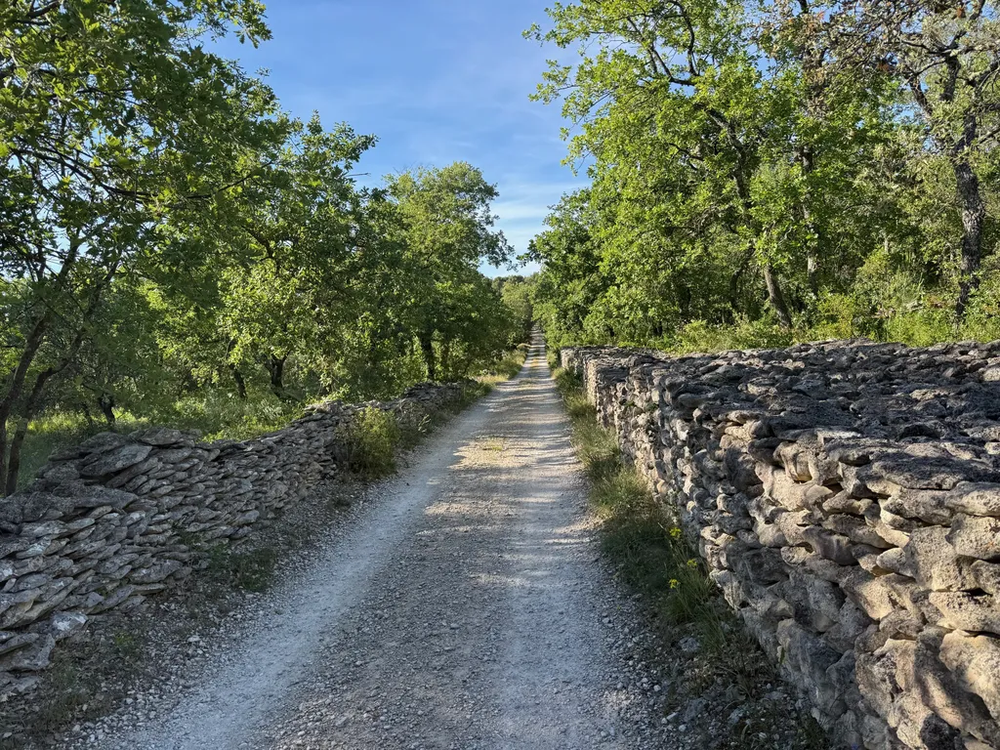
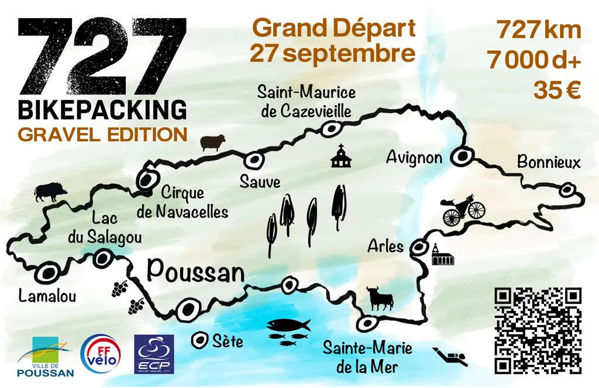
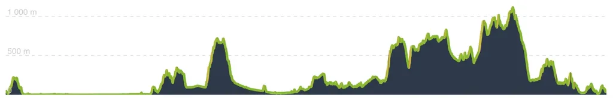
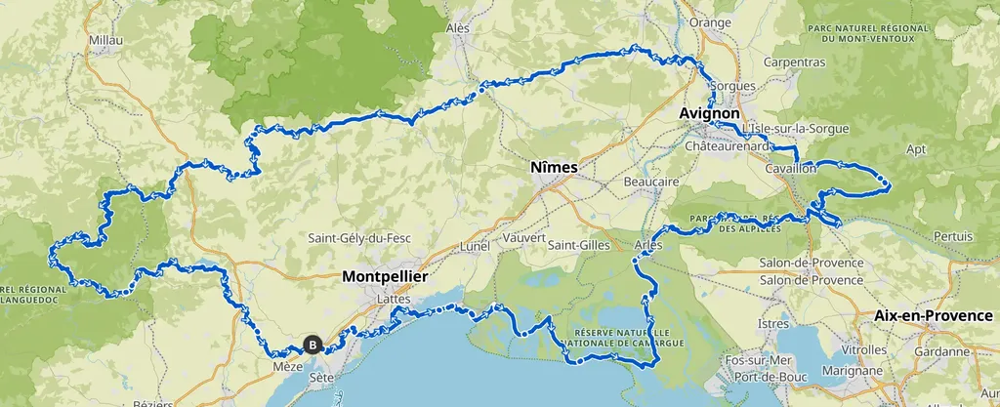
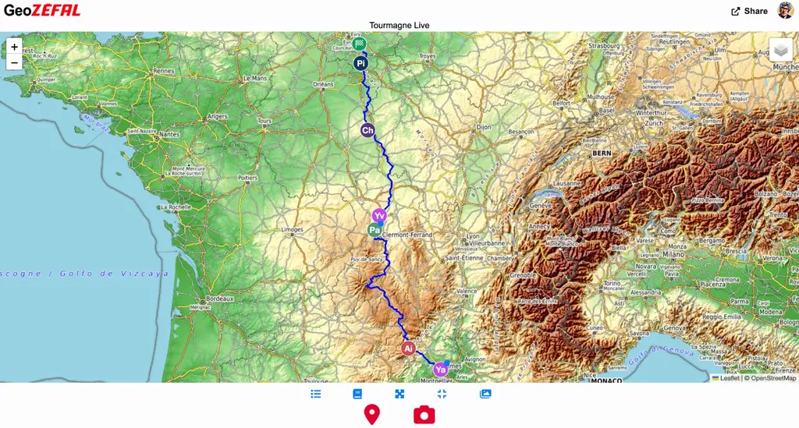
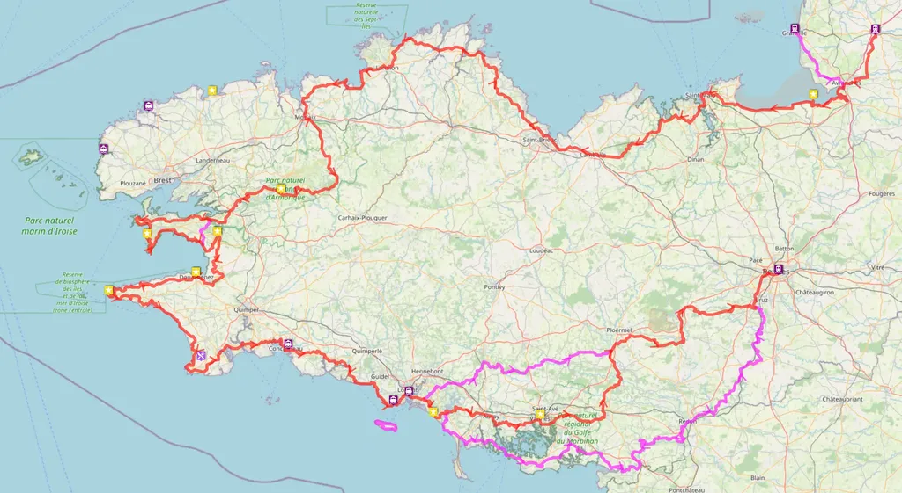

# News : g727, Geogram et Bretagne

Un billet pour maintenir le contact entre nous et vous donner envie d’échanger, de partager et pourquoi pas de venir rouler par chez nous.

### g727 2025 — Invitation à la douceur

Pendant qu’un copain se déchirait sur la French Divide, je n’ai cessé de me dire, pas de ça. Je veux proposer autre chose. Du bikepacking non pour ceux qui rêvent d’exploits en carton-pâte, mais qui ont envie de profiter des paysages, des richesses culinaires et culturelles, et surtout de fraterniser.

Si vous rêvez d’exploits, cherchez des trucs pour arrêter les guerres, pour soigner le cancer, pour lutter contre le réchauffement climatique, pour donner le sourire dans des temps moroses, pour faire réfléchir quand on nous ordonne de nous conformer. Que vous mettiez quatre jours de moins qu’un autre pour effectuer une trace bikepacking tout le monde s’en contre-fiche. Si vous en êtes fier, vous vivez dans une réalité alternative. Un mirage que je suis incapable de concevoir.

Donc, le [g727 2025](https://727bikepacking.fr/g727/) sera avant tout philosophique. Lors de nos recos, nous recherchons les paysages, sans enchaîner les difficultés pour le plaisir de provoquer la sélection. L’envie : que tout le monde aille au bout. Dans le but d’une plus grande accessibilité, j’avais promis un parcours à moins de 8 000 de d+, c’est parti pour 7 000 environ. Je ne peux pas vous promettre que l’été indien sera doux fin septembre dans le Midi, mais au moins la trace sera aussi douce que possible (bon, ça restera du gravel, pneus de 42 mm minimum, 50 mm un idéal selon moi).

Pour le moment nous sommes une bonne quarantaine engagés pour [le grand départ du 27 septembre.](https://727bikepacking.fr/g727-Grand-Depart/) Il nous reste deux ou trois recos pour peaufiner le parcours. On attend que la canicule passe. Parlez de la trace autout ce vous, vous êtes nos seuls influenceurs.

### Geogram — Partagez vos aventures

J’ai pas mal bossé sur mon système open source de partage de géolocalisation, dont [une version est hébergée par Zéfal](https://geo.zefal.com/tourmagne-live). J’espère que l’interface de la web app est plus claire et plus robuste. Vous pouvez partager géolocalisation, photos, commentaires. Idéal pour rester en contact avec vos proches et vous repérer les uns les autres quand vous êtes nombreux sur une trace. Comme par le passé, vous pouvez connecter un groupe Telegram à Geogram, ce que nous faisons sur les 727, mais ce n’est plus obligatoire. [Le Geogram du Tour Magne est très actif.](https://geo.zefal.com/tourmagne-live) Une [story](https://geo.zefal.com/tourmagne-live/story) avec photos et commentaires se construit en temps réel.

### Bretagne — Partager pour le plaisir

J’ai terminé de construire [notre périple breton](https://www.visugpx.com/IpFgBmDgrC) pour cet été, grâce à vos nombreux conseils. J’ai pas mal souffert pour éviter les départementales. La Bregagne m’est apparue très asphaltée, mais la heatmap m’a souvent permis de dénicher des chemins ou des singles. J’ai construit cette trace dans le même esprit que le g727 : nous partons en vacances pour passer un bon moment entre copains. Donc pas question de multiplier ni le d+ ni les km. Je vous raconterai le périple à notre retour.

#velo #bikepacking #y2025 #2025-6-21-13h00
