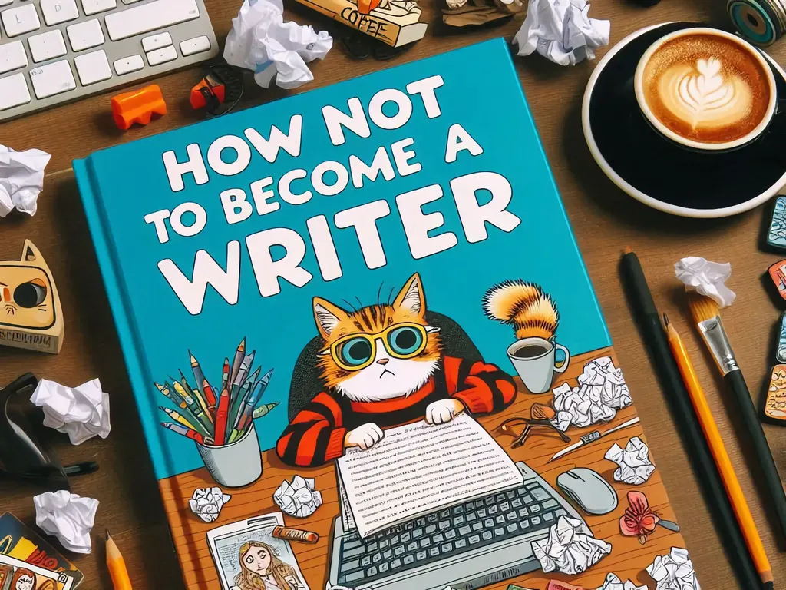

# Anti-guide d’écriture ou comment ne pas devenir écrivain

Je suis fatigué de lire partout des conseils pour mieux écrire, mieux scénariser, mieux captiver, mieux monnayer.

1. Quand j’étais jeune, on disait : « Commence par [lire la correspondance de Flaubert](https://tcrouzet.com/2025/04/10/flaubert/) et les journaux des écrivains. Surtout, lis beaucoup, analyse beaucoup, parcours de A à Z le champ de la littérature. Mange et mange, même les choses qui te déplaisent, au moins pour savoir qu’elles existent. Place-toi dans l’Histoire. » Il ne s’agit pas d’un conseil d’écriture, mais d’un conseil de vie. Apprendre tout, imiter tout, puis tout oublier et faire à sa manière.
2. Quand on commence à « vraiment » écrire, on ne peut écrire que des choses qui ne ressemblent à aucune autre, parce que soi-même on ne ressemble à personne. On ne recherche pas « son style », il advient en même temps que nous-mêmes.
3. Ne suivre aucun des conseils qu’on vous donne, même s’il s’agit de Henry Miller, Ray Bradbury, Ernest Hemingway… Ces conseils ont marché pour eux, ils ont fait d’eux des écrivains, à vous de trouver les vôtres qui ne vaudront que pour vous. De fait, attachez encore moins d’importance aux conseils professés par les gourous de l’écriture qui monnayent leurs connaissances frelatées avec des ateliers d’écriture ou des newsletters payantes. 
4. Pour les mêmes raisons, ne suivez aucune méthode. Écrire n’a rien à voir avec un travail d’ingénierie. Par exemple, certains ont besoin d’un plan, d’autres pas. Certains écrivent tous les jours, d’autres rarement. Certains décomptent le nombre de mots écrits quotidiennement, d’autres se moquent de leur productivité. Certains écrivent le matin, d’autres au café, d’autres au milieu de la nuit.
5. Il n’y a que des règles particulières, aucune loi universelle. Et quand quelqu’un prétend avoir trouvé les lois des récits, c’est à vous de les dynamiter.
6. Les IA connaissent toutes les méthodes, toutes les règles, toutes les techniques, elles ne peuvent que vous ramener dans ce qui a déjà été fait. Elles sont donc de très mauvaises conseillères en littérature.
7. Si vous avez éprouvé du plaisir en écrivant, vous avez atteint votre objectif. Ne vous fiez pas à ce que pensent les autres, surtout pas les éditeurs qui par nécessité se préoccupent de leur équilibre financier. L’écriture est une affliction solitaire qui ambitionne de toucher un public extérieur subsidiaire.
8. Gagner sa vie en tant qu’écrivain, c’est encore plus difficile que gagner sa vie en tant que sportif de haut niveau. D’un point de vue probabiliste, mieux vaut faire autre chose pour s’enrichir.
9. Arrêtez simplement de lire des articles qui vous promettent de devenir écrivain en dix leçons. Écrivez, plantez-vous, recommencez, ou encore une fois faites autre chose.
10. Parce qu’écrire devient vite une malédiction. Quand on a commencé, on ne peut plus s’arrêter. Et quand on s’arrête, cet arrêt nous obsède. On aurait dû ne jamais commencer, mais c’est trop tard. Alors on ne peut s’empêcher de lire les conseils des autres écrivains. Si vous en êtes là, c’est fichu.

#netlitterature #y2025 #2025-7-12-12h00
