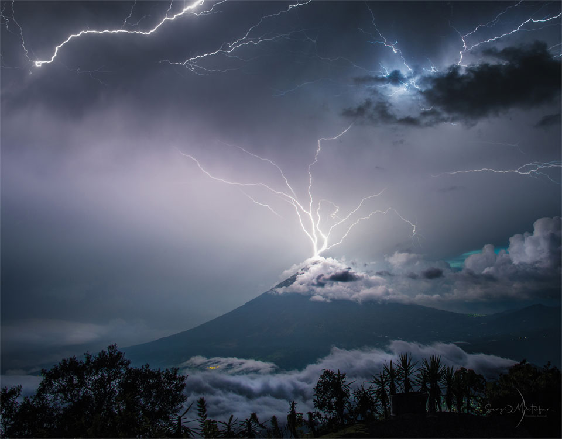

# De ma terrasse #21

_Ma sélection du dimanche : **17** liens et une photo prise depuis ma terrasse._

## Espace et cosmos

[Le télescope spatial James Webb a trouvé la galaxie la plus distante jamais observée, à l’aube du cosmos. Encore une fois.](https://www.skyatnightmagazine.com/news/webb-mom-z14?utm_source=flipboard&utm_content=user/skyatnightmag) • EN • 4 min  
MoM-z14 existait seulement 280 millions d’années après le Big Bang, détrônant le précédent record. Sa découverte révèle une population surprenante de galaxies brillantes dans l’univers primordial.

[La vie sur Terre pourrait en fait avoir commencé dans l’espace](https://www.popularmechanics.com/space/deep-space/a65494937/surprise-life-on-earth-may-have-actually-started-in-space/?utm_source=flipboard&utm_content=topic/atoms) • EN • 6 min  
Des observations du disque protoplanétaire autour de V883 Orionis révèlent des molécules organiques complexes, précurseurs potentiels de la vie, notamment l’éthylène glycol et la glyconitrile.

[La bizarre « Galaxie Infini » pourrait détenir les secrets des trous noirs supermassifs](https://futurism.com/infinity-galaxy-secrets-black-holes?utm_source=flipboard&utm_content=topic/space) • EN • 5 min  
Cette collision galactique spectaculaire abrite trois trous noirs actifs et pourrait révéler comment naissent les trous noirs supermassifs par effondrement direct d’un nuage de gaz.

## Sciences et physique

[Une couche entière de réalité cachée pourrait se tapir juste sous le Modèle Standard de la physique](https://www.popularmechanics.com/science/a65479165/hidden-layer-of-reality/?utm_source=flipboard&utm_content=topic/science) • EN • 7 min  
Le « zeptounivers » pourrait cacher de nouvelles particules à l’échelle de 10⁻²¹ mètres. Les désintégrations ultra-rares de kaons et mésons B offrent une fenêtre indirecte sur cette frontière physique.

[Les scientifiques viennent de trouver un nouvel indice matière-antimatière — et cela pourrait expliquer pourquoi nous existons](https://www.vice.com/en/article/scientists-just-found-a-new-matter-antimatter-clue-and-it-might-explain-why-anything-exists-at-all/) • EN • 3 min  
Observation d’une asymétrie de 2,5 % entre matière et antimatière dans ces particules fondamentales.

[Une étude fascinante de neurosciences montre que le cerveau émet de la lumière à travers le crâne](https://flip.it/NERysr) • EN • 2 min  
Bon, rien de visible à l’œil nu.

[Les scientifiques viennent de percer le code de l’intelligence humaine. Voici ce qu’ils ont trouvé](https://flip.it/Ftgg3i) • EN • 15 min  
L’intelligence émerge de l’architecture globale du cerveau, combinant connexions fortes et faibles. Cette découverte révolutionnaire ouvre la voie à l’amélioration cognitive personnalisée.

## Santé et médecine

[Une vaste étude révèle 2 vaccins qui semblent réduire le risque de démence](https://flip.it/iFyYN8) • EN • 4 min  
Les vaccins contre le zona (Shingrix) et le VRS (Arexyv) réduisent respectivement de 18 % et 29 % le risque de démence, probablement grâce à l’adjuvant AS01.

[La faim aiguise les rythmes du sommeil qui solidifient les mémoires](https://neurosciencenews.com/fasting-sleep-memory-29501/) • EN • 6 min  
Le jeûne avant le sommeil améliore la densité et la synchronisation des oscillations lentes et fuseaux du sommeil chez les rats, optimisant la consolidation mnésique.

## Technologie et intelligence artificielle

[Je viens d’essayer le nouveau navigateur Comet AI de Perplexity — et maintenant je ne pense pas pouvoir revenir à Chrome](https://www.tomsguide.com/ai/i-tried-perplexitys-new-comet-browser-and-now-i-dont-think-i-can-go-back-to-chrome) • EN • 8 min  
Ce navigateur entièrement alimenté par l’IA intègre un assistant capable de réserver des restaurants, acheter des produits et automatiser les tâches répétitives avec supervision humaine.

[De nouveaux détails sur ChatGPT 5 viennent de tout changer](https://www.geeky-gadgets.com/openai-chatgpt-5-multimodal-ai/) • EN • 7 min  
Le modèle unifié combinera raisonnement avancé et capacités multimodales, démocratisant l’accès à l’IA pour les entreprises et particuliers sans expertise technique.

[Les compétences IA dont vous avez besoin pour prendre de l’avance dans la création de contenu cette année](https://www.creativebloq.com/ai/the-ai-skills-you-need-to-get-ahead-in-content-creation-this-year) • EN • 6 min  
Six conseils pratiques pour intégrer l’IA dans les flux créatifs : génération d’idées, transcription automatique, suppression d’arrière-plans et personnalisation des outils.

## Culture et créativité

[Les 25 meilleurs films de SF du XXIème siècle (selon nous)](https://usbeketrica.com/fr/article/les-25-meilleurs-films-de-sf-du-xxieme-siecle-selon-nous) • FR • 8 min  
Si vous les avez pas tous vus…

[5 conseils d’écriture essentiels par Steven Pressfield](https://nofilmschool.com/writing-tips-by-steven-pressfield?utm_source=flipboard&utm_content=topic/writing) • EN • 8 min  
L’auteur de « The War of Art » partage sa philosophie : l’œuvre révèle qui nous sommes, l’ego sabote la créativité, le talent n’est que 10 % du succès. Bon vous savez que je m’en fiche d etout ça, mais ça m’amuse.

[Des réseaux à l’indépendance : pourquoi de plus en plus de créatifs font le grand saut](https://flip.it/Idgejm) • EN • 3 min  
Analyse des tendances poussant les professionnels créatifs à quitter les grandes agences pour l’entrepreneuriat indépendant.

## Environnement

[La Terre semble développer de nouvelles saisons jamais vues auparavant](https://theconversation.com/farewell-to-summer-haze-and-trash-among-earths-new-seasons-as-climate-change-and-pollution-play-havoc-260765) • EN • 8 min  
Émergence de « saisons de brume », « saisons de déchets » et « saisons syncopées » causées par l’activité humaine, bouleversant les cycles naturels traditionnels.

## Pour le plaisir

[Foudre au-dessus du volcan d’eau](https://apod.nasa.gov/apod/ap250727.html#space) 

#digest #y2025 #2025-7-27-17h00 
