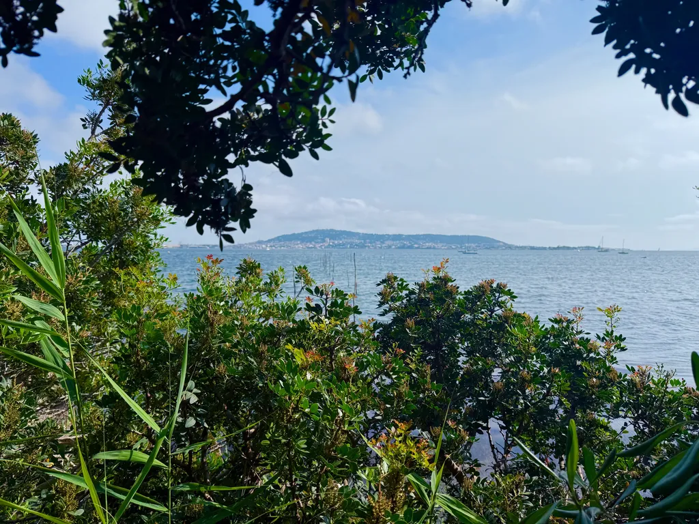

# Juin 2025

### Dimanche 1er, Balaruc

Les pies jacassent. Les goélands hurlent. Les pigeons roucoulent. Dans la nature, loin des villes, la symphonie est plus douce, plus joyeuse, plus exubérante. Les deux premières espèces, voleuses, torves, ne craignent pas notre chat, s’en prennent à lui et vont jusqu’à lui piquer ses croquettes. Il suffit d’observer les animaux pour comprendre que nous ne différons pas d’eux.

---

Un hiver, [une femme découvre un bébé lièvre et sa vie en est changée](https://www.themarginalian.org/2025/05/28/raising-hare-chloe-dalton/). Je n’ai pas envie d’écrire des romans mais ce genre d’histoires. Le seul problème : elles doivent m’arriver (comme *Rush* l’année dernière).

### Mardi 3, Balaruc

J’en viens à oublier de souhaiter un bon anniversaire à Isa tant je suis immergé dans les statistiques Parcoursup pour Émile, après une nuit quasi blanche. Nous passons la matinée à réfléchir à la meilleure stratégie. Tout est clair. Alors Émile commence le nettoyage de la liste et il détruit le vœu qu’il devait valider. Il a bon espoir d’obtenir des réponses positives à des vœux en attente, mais ce petit clic risque potentiellement de changer sa vie.

### Mercredi 4, Balaruc

Olivier me demande si c’est moi ou l’autre qui écrit mes carnets suite à « Je n’écris pas mes livres, celui qui les écrit n’existe pas en dehors du moment de l’écriture. » J’ai répondu en plaisantant que je ne les laissais pas encore aux IA.

Quand je travaille un texte long jour après jour, je me transforme en celui qui l’écrit, je me quitte pour entrer dans ce que j’écris, alors que le carnet consiste à dire celui que je suis, ce que je pense ou ressens dans l’instant. Souvent je me laisse emporter par des idées, enchaîne quelques paragraphes non prémédités, mais toujours pour revenir au présent, là où dans un texte long, c’est le moment de marquer un temps d’arrêt pour attendre de repartir loin. Dans le carnet, je me donne le droit d’atterrir.

---

Je repense à l’histoire du plaisir par la souffrance dans le sport : c’est une souffrance à échéance, avec la certitude qu’elle s’arrêtera bientôt, alors que d’autres souffrances, morales ou causées par la maladie, ne s’arrêtent pas sur commande.

### Samedi 7, Balaruc

David Camus me dit être aussi poussé vers le journal. Ma réponse : « Si le journal est la forme de l’époque, il est logique qu’on soit attiré vers elle, comme agité par une contrainte. »

Je crois qu’à une époque correspond une forme. C’est peut-être un point de vue daté, structuraliste, nombriliste, mais l’histoire de nos arts révèle des convergences transdisciplinaires. Le romantisme par exemple. Ça ne veut pas dire qu’avant le romantisme ou après il n’y avait pas ou plus de romantiques, mais à un moment donné cette idée s’est imposée parce que l’histoire la rendait possible, et même nécessaire.

De la même manière, le roman s’impose au XIXe poussé par l’avènement de la bourgeoisie. Un nouveau besoin narratif surgit. Quand les guerres ravagent le XXe, l’absurde, l’abstraction et l’expérimentation prennent le dessus.

Aujourd’hui, des machines deviennent capables d’écrire des romans dans un monde marchandisé de A à Z, un monde où nous tentons de battre le tambour, d’attirer l’attention, de faire croire que nous menons des vies extraordinaires.

Alors le journal permet de reprendre pied, de s’ancrer, de se regarder, sans chercher à plaire ou à s’abandonner à la mode. Le journal n’est pas une forme neuve, loin de là, mais elle gagne en nécessité, ne serait-ce que pour reconnaître que nous sommes tous des histoires qui méritent d’être racontées, je dis bien racontées : sur les réseaux sociaux, on se montre plus qu’on se raconte.

Assez facile pour moi de dire ça puisque je tiens un journal depuis mes 17 ans, mais ma pratique n’a cessé d’évoluer, jusqu’à ce qu’elle devienne publique depuis 2015, justement comme une réponse à la nécessité par ailleurs du temps réel. Mon hygiène : d’abord écrire pour moi, garder un temps le texte avant de le lâcher.

Le journal deviendra une forme majeure quand les derniers lecteurs les préféreront aux romans. Pour le moment, on ne publie guère que les journaux des morts. On n’en est pas encore à la gloire du journal. Mais si je ne me trompe pas, peu à peu s’imposeront les grands journaux intimes de notre temps. J’anticipe, ou j’espère, qu’ils surpasseront tous les romans présents, ces romans auxquels je crois de moins en moins.

Ces journaux seront textuels, photographiques, vidéo, sonores, tout à la fois. François construit un journal vidéo depuis plus de dix ans maintenant. Peu à peu cette forme du journal s’impose à lui. Dans un mail, il y a quelques jours il m’écrit : « Je ne comprends toujours pas ce qui m’aspire dans ces formes parlées. » Je crois que c’est l’époque, la pression, la tentation du journal, chez lui vidéo, toujours plus forte.

---

On m’oppose la consommation d’énergie démesurée des LLM. Pour écrire, nous avons besoin de modèles simples, de plus en plus portables, et qui donc tournent de mieux en mieux sur nos machines.

---

Quand Flaubert discutait de Bovary avec Bouillet, ça ne réduisait en rien son imaginaire, bien au contraire. Discuter avec une IA ne nous rend pas nécessairement cons, si nous l’utilisons pour nous augmenter plutôt que de bosser à notre place.

### Dimanche 8, Balaruc

À vélo, des champs de plastique à perte de vue, des champs de melons sous serres jetables, nouvelle mode agricole. Pourquoi de telles pratiques sont-elles autorisées ? Tout ça pour finir par labourer les melons, la cueillette revenant plus cher que la vendre. Subsides européens ? Je m’arrête pour photographier. Très vite le conducteur de l’engin de tête me hurle de ne pas photographier, comme s’il n’avait pas l’esprit tranquille. Sans doute il emploie une armée de travailleurs non déclarés.

### Mardi 10, Balaruc

### Mercredi 11, Balaruc

Incapable d’écrire, incapable de dormir, tout tendu par le Parcoursup d’Émile, bloqué depuis cinq jours en position six dans la file d’attente de l’école qu’il aimerait. Ça ne bouge pas ! D’autres choses avancent, mais pas dans la bonne direction. Je me réveille au milieu de la nuit, j’attends 5 h pour regarder l’avancement. Tout ce que je peux faire, c’est du code. Je me lave le cerveau. Je devrais raconter, parler de cette angoisse, ajoutée à d’autres. J’en suis incapable, je manque de force, même le tour à vélo ce matin a été pénible, sous une chaleur de moins en moins supportable. Je devrais faire la sieste, mais je n’y parviens pas. En prime une bestiole m’a piqué la main, plusieurs impacts rapprochés. Des puces ?

### Jeudi 12, Balaruc

L’attente frise l’insupportable. Se sentir sale de ne pas être informé, comme quand on attendait le diagnostic du cancer d’Isa. Tu ne sais pas si c’est terminé, ou s’il faut encore croire au miracle. Parcoursup est une plateforme opaque. Rien ne fonctionne comme il y a trois ans avec Tim. Tout était alors plus prévisible, logique, là on assiste à une brusque immobilisation déprimante qui nous laisse en morceaux.

---

Toute ma vie j’ai rêvé. J’ai toujours cru aux miracles, même si je n’ai jamais été touché par la grâce. Je finis toujours par me persuader que la vie nous sourira, même dans les moments de tensions que nous traversons.

### Samedi 14, Balaruc

Immense fatigue. Je passe des heures à expérimenter avec les IA et me heurte à une sorte de résistance négationniste : « Elles ne seront jamais intelligentes, elles ne sont pas créatives… »

Je pense le contraire : si une IA est capable de voir dans un de mes textes des perspectives auxquelles je n’avais pas pensé, n’est-elle pas créative ? La créativité n’est-ce pas faire jaillir des structures neuves, des rapports nouveaux, des assemblages imprévus ? De cela les IA sont déjà capables et quand je mixe ce pouvoir avec le mien je décuple mon imaginaire. Tout ça me renvoie à *Rush*. Je dois relire le manuscrit avant le début du processus éditorial.

---

Un auteur aujourd’hui ne peut pas être ailleurs que dans le rapport aux machines. Elles nous envahissent, nous gouvernent, nous subvertissent. C’est contre elles ou avec elles qu’il faut écrire, parce qu’elles déterminent l’époque.

### Dimanche 15, Balaruc

Cette nuit, j’ai découvert une nouvelle explication de pourquoi les IA sont créatives. Il faut imaginer un immense delta, avec un grand nombre de ramifications. Le plus souvent, l’eau suit les branches principales selon les chemins renforcés par l’apprentissage (dans ce cas millénaire). Voir l’eau jaillir à l’embouchure des ramifications principales, c’est entendre une idée attendue. Mais parfois l’eau rejoint la mer par des chemins plus tortueux, des ruisseaux moins visibles : l’idée est moins attendue, sans être nouvelle pour autant. En revanche, quand l’eau déborde ou se fraye un nouveau chemin, cette histoire est neuve. En quelque sorte, l’eau peut être créative. N’a-t-elle pas sculpté des paysages merveilleux ? Cette évidence de la nature créative s’impose à moi très souvent. La créativité n’est pas une prérogative humaine, à cela près que nous pouvons créer plus vite que l’érosion ou la tectonique des plaques.

Maintenant imaginez des deltas encore plus immenses, empilés les uns au-dessus des autres en milliers de couches comme dans les systèmes de deep learning : on y trouve des voies pratiquées et d’autres infimes, avec toujours la possibilité d’emprunter les embranchements les moins probables, pour finalement en sortie proposer des choses jamais dites. Il est dangereux de voir ces systèmes comme une simple combinatoire. Ils ressemblent à des rivières qui creusent des paysages à la surface de la planète. Si on leur donne assez de temps (et assez d’énergie), ils finissent par nous surprendre.

J’en viens à être plus souvent surpris par ces machines que par mes semblables. Je n’ai pas encore réussi à canaliser cette créativité, mais après *Le Code Houellebec*, *Rush* est ma seconde tentative en ce sens. Problème : plus je m’hybride, moins je deviens compréhensible pour les non-hybrides.

---

Mais pourquoi attends-tu encore des retours ? me demande François. Parce que sans retour j’ai moins de chance de voir surgir des idées nouvelles. Je préfère le retour des IA à pas de retour du tout. Je suis quasi sûr que tout le monde m’imitera bientôt, quand moi-même je serai guéri.

---

Je lis un journal intime dont j’aime les illustrations mais le texte se résume souvent à « J’ai croisé un tel, parlé avec tel autre, nous avons marché jusqu’au port ». On s’en fiche. Un journal ne me parle que quand il raconte des irruptions intérieures, des éblouissements poétiques, des coups de sang.

---

Les premiers lecteurs d’*Épicènes* qualifient le texte de surprenant, d’original, alors que je n’ai écrit qu’un conte fantastique en faisant que la forme dise l’histoire.

---

Gros coup de blues : demain j’accompagne Émile à son lycée pour la dernière fois, bac de philo (la physique et les maths se déroulent mardi et mercredi après-midi et il prendra le bus). Une histoire s’achève. Depuis qu’il a sept ans un rituel s’était installé, d’abord avec Tim, et depuis deux ans j’avais Émile pour moi seul. Le temps me glisse entre les doigts et l’écrire ici, avec presque la minutie d’Opalka, ne l’arrête pas, ni même ne le ralentit. Après-demain, je n’aurai plus à me lever tôt : je pourrais traîner à écrire au lit. J’imagine que même ma littérature en sera changée.

### Mardi 17, Balaruc

Journée de bac pour Émile, pour nous ICM, pas forcément des nouvelles joyeuses. Se battre : tant qu’il y a de la vie, il y a de l’espoir. Nous en sommes réduits à une métaphysique des plus primitives. La maladie réduit les discours à pas grand-chose. Comme l’impression que le monde nous résiste de plus en plus. Est-ce un sentiment commun chez tous les vieux ? Je rêve d’une douce sérénité, les yeux perdus vers le large de l’étang. Un fantasme de plus.

### Mercredi 18, Balaruc

Dans l’économie de l’attention, nous autres écrivains sommes déjà broyés, face à des machines plus puissantes que nos mots. Nous n’avons pas notre place dans ce monde bruyant puisque nous tentons d’apporter un peu de calme. Les écrivains qui réussissent sont ceux qui attirent l’attention, peu importe la qualité de leurs textes. Ils font leurs preuves dans le combat pour l’attention, non dans un idéal littéraire.

### Jeudi 19, Balaruc

Réveil avec le cerveau paralysé. Toujours la même attente. Parcoursup ne bouge pas, le cancer d’Isa ne bouge pas, ma littérature ne bouge pas. Plus rien ne bouge. Je relis *Rush* et n’y trouve que des scories, aucune idée nouvelle à y injecter. Le projet s’est éteint en moi, ce qui veut dire que je suis prêt à le laisser s’envoler. Dans ces moments, m’imposer au moins quelques mots ici, comme un entraînement minimum, envoyer des bips pour dire que mon cœur bat encore.

### Vendredi 20, Balaruc

Pourquoi en face à face les médecins minimisent, ne disent pas tout, ce que plus tard les comptes rendus des scanners et autres examens révèlent ? Peur de faire peur, peur de devoir gérer l’angoisse et pas envie de s’emmerder avec les états émotionnels des patients ? Ou croyance que nous sommes trop cons pour lire entre les lignes, voire tout simplement pour lire, pas même besoin de demander à une IA de déchiffrer pour nous. Alors ne nous reste qu’à faire confiance. Si un artisan me traitait comme ça ,j’en changerais tout de suite. Là : pour aller où, pour quoi faire, quand on est déjà entre les mains des meilleurs ?

---

Jack me tire de mes pensées et m’entraîne au concert de Magma au théâtre de la mer. Je me décide au dernier moment. J’arrive quelques minutes avant. J’ai eu peur de m’ennuyer, finalement belle expérience, belle énergie, beaucoup d’espoir dans l’enthousiasme de Christian Vander, jeune rocker de 77 ans. Je n’avais pas assisté à un concert depuis des temps immémoriaux.

### Dimanche 22, Balaruc

### Lundi 23, Balaruc

### Mercredi 25, Balaruc

### Jeudi 26, Balaruc

### Vendredi 27, Balaruc

Une semaine envolée, une semaine à coder, pour ne pas penser, dans l’air brûlant qui d’habitude me donne des idées, mais je ne suis pas en état, pas même de photographier ou de prendre des notes qui pourraient avoir un quelconque intérêt. *Épicènes* est sorti, et plus rien déjà. Je suis en attente de quelque chose d’heureux. Tous les matins à 5 h je regarde encore et encore les classements d’Émile. Il faudra que je trouve le courage d’expliquer la manipulation algorithmique qui se joue sur Parcoursup, comment les données sont cachées, altérées, ce qui empêche les jugements objectifs et pousse à commettre des erreurs à cause de promesses mensongères. C’est en soi un scandale. Une maltraitance généralisée, que je n’avais pas vécue avec Tim parce que tout s’était joué vite. Rien de grave pour Émile, il a reçu plus de 70 propositions, il est admis à Polytech Nice, la Polytech la mieux classée. Je devrais m’en satisfaire, sauf que Parcoursup a initialement promis autre chose, ce qui a entraîné des choix peut-être pas idéaux.

#carnets #y2025 #2025-7-2-19h00
