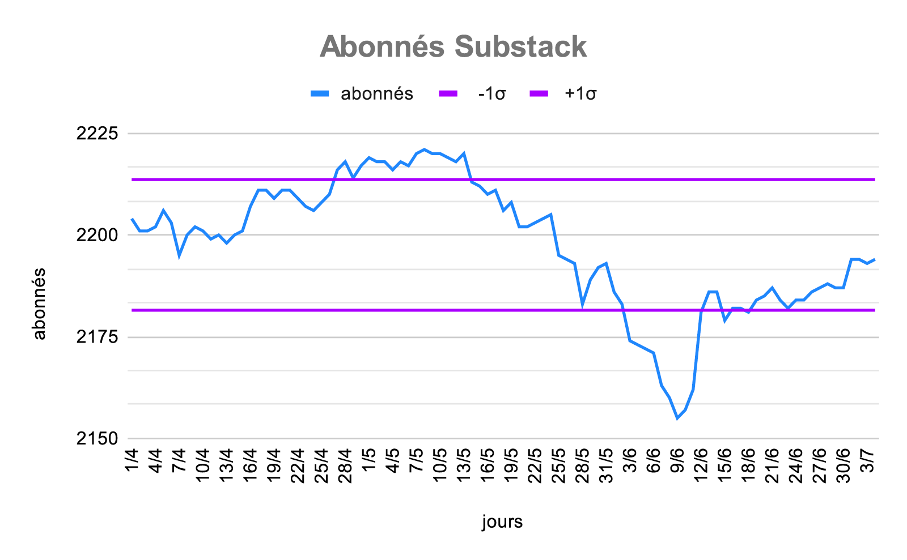
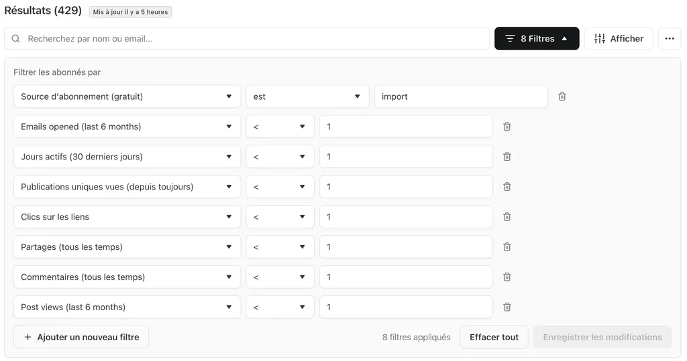
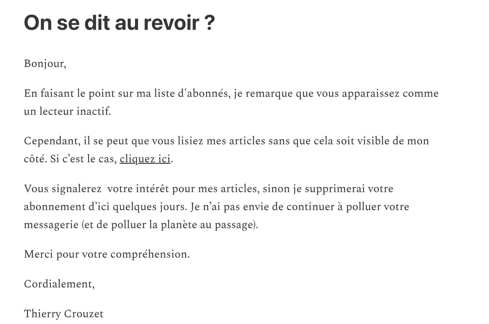
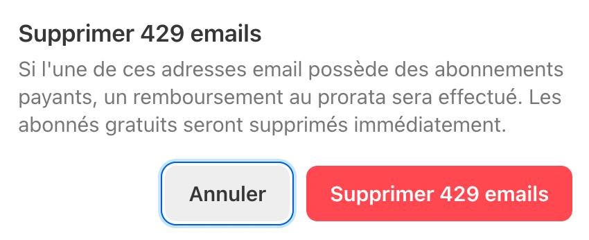

# Comment nettoyer sa base d'abonnés Substack

Après chaque publication sur Substack, je perds des abonnés, puis en regagne grâce à l’algorithme Substack. Ma courbe d’abonnement fait des vagues. C’est comme s’il y avait des abonnés exaspérés de lire mes messages. Est-ce normal ?

Une rapide recherche m’apprend qu’avec les newsletters il faut s’attendre à [un taux de désabonnement par envoi compris entre 0,1 % et 0,4 %, avec une moyenne à 0,1 %](https://www.campaignmonitor.com/resources/guides/email-marketing-benchmarks/). Chez moi, il est de l’ordre de 0,48 % (ce n’est pas encore catastrophique).

### Comment j’arrive à ce résultat

Pour commencer, je reprends le décompte des nouveaux abonnés fournis par Substack depuis que j’ai [ouvert un compte en février 2025](https://tcrouzet.com/2025/02/07/newsletter-mouving/) : 468, soit 3,2/jour ou 10,6 abonnés/newslleter puisque j’en ai envoyé 44.

Comme Substack, nous donne aussi le nombre d’abonnés jour après jour, je peux effectuer quelques autres statistiques sur la période entre le premier avril et le premier juillet 2025.

- **Moyenne** : 2 198 abonnés
- **Écart-type** : 16 abonnés
- **Intervalle ±1σ** : \[2 182 ; 2 214], ce qui signifie que mon nombre d’abonnés est dans 68 % des cas dans cet intervalle très étroit. Mon nombre d’abonnés varie peu et de façon statistiquement normale. Sur la courbe, on ne voit que deux zones hors écart type.
- **Une seule explication pour cette stabilité** : je gagne 10,6 abonnés par envoi et j’en perds autant. C’est comme si ma newsletter bataillait pour écoper l’eau qui menace de la faire couler. Si je mets en rapport mes 2 198 abonnés en moyenne et la perte de 10,6/envoie, ça implique une baisse par envoi 0,48 %/envoi.

>(2198 - 10,6) / 2198 = 0,48 %

Je doute que les désabonnements naturels et les variations d’engagements expliquent à eux seuls ce phénomène. Je pense que le problème tient à la façon dont j’ai initialisé mon Substack, en combinant mes différentes bases d’abonnés Mailchimp, certaines relativement anciennes. Pour y voir plus clair, j’ai identifié les abonnés inactifs.

### Abonnés inactifs

Sur Substack, j’ai créé le filtre ci-dessous et repéré plus de 400 abonnés dormants.

Trois possibilités :

1. Ils voient mes messages arriver et s’en fichent jusqu’au jour où ils craquent et se désabonnent.
2. Les messages arrivent dans leur boîte spam.
3. Ils utilisent une messagerie sécurisée, comme [Proton](https://proton.me/). Mais, dans ce cas, je devrais a minima voir leurs clics apparaître et je n’en vois aucun.

J’ai tenté de donner une dernière chance à ces dormants. Je les ai sélectionnés, puis leur ai envoyé un mail en leur demandant de cliquer sur un lien vers la page d’accueil de mon Substack, pour que Substack puisse détecter une activité.

Après trois jours, deux abonnés sur plus de 400 s’étaient manifestés. J’ai alors supprimé tous les autres.

### À quoi bon ?

Une fois la base nettoyée, j’affiche moins d’abonnés, score généralement utilisé pour déterminer le prestige d’une newsletter. Ça peut donc paraître stupide, sauf que je répugne à envoyer des mails pour rien, ce qui revient à dépenser de l’énergie pour rien, en plus que d’encombrer les boîtes des destinataires jusqu’au moment où ils craquent et se désabonnent. 

Avec une base d’abonnées plus saine, le taux d’ouverture de mes messages s’améliorera, et c’est à mes yeux un des seuls critères d’importance. C’est votre engagement qui m’intéresse, pas votre nombre.

Ma base d’abonnés se renouvelait de 0,48 % à chaque envoi avant ce nettoyage. Reste maintenant à suivre son évolution. Les vagues cesseront-elles ?

#cuisine #y2025 #2025-7-9-17h00
