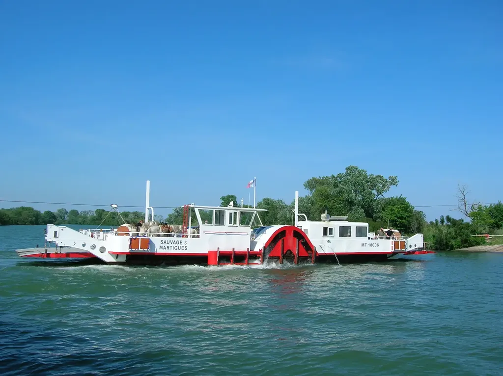
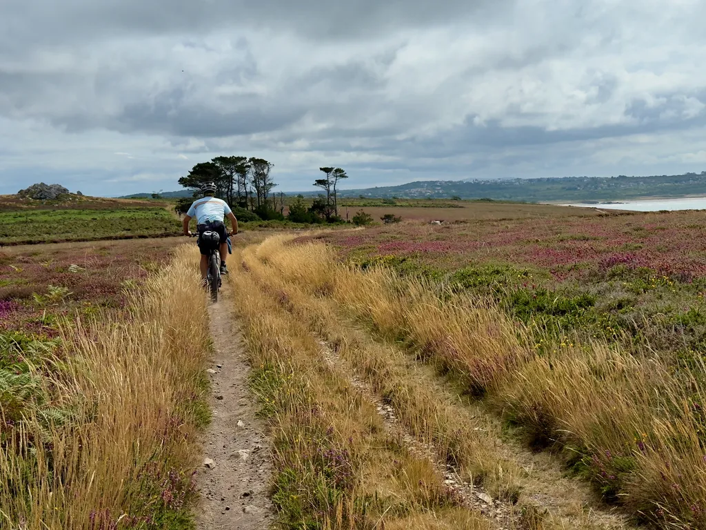
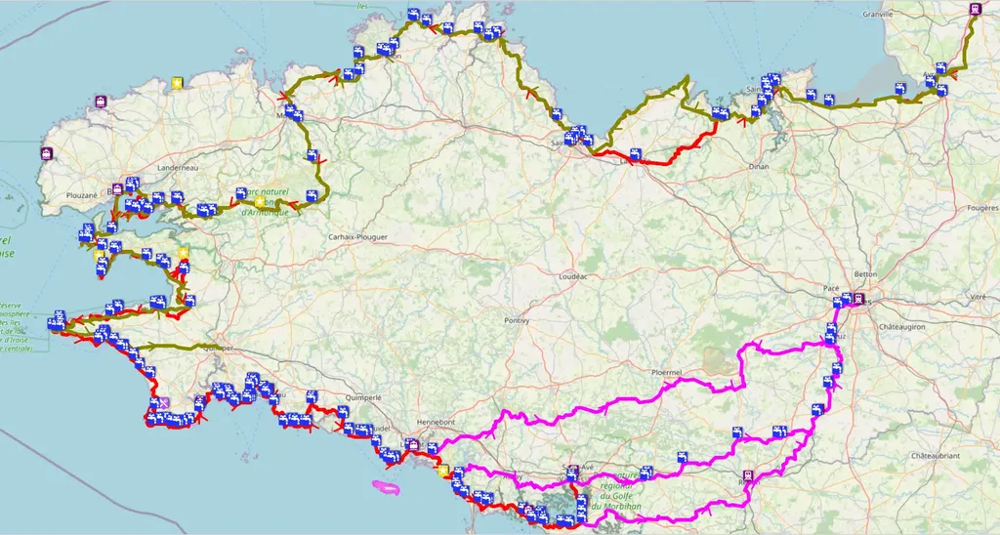
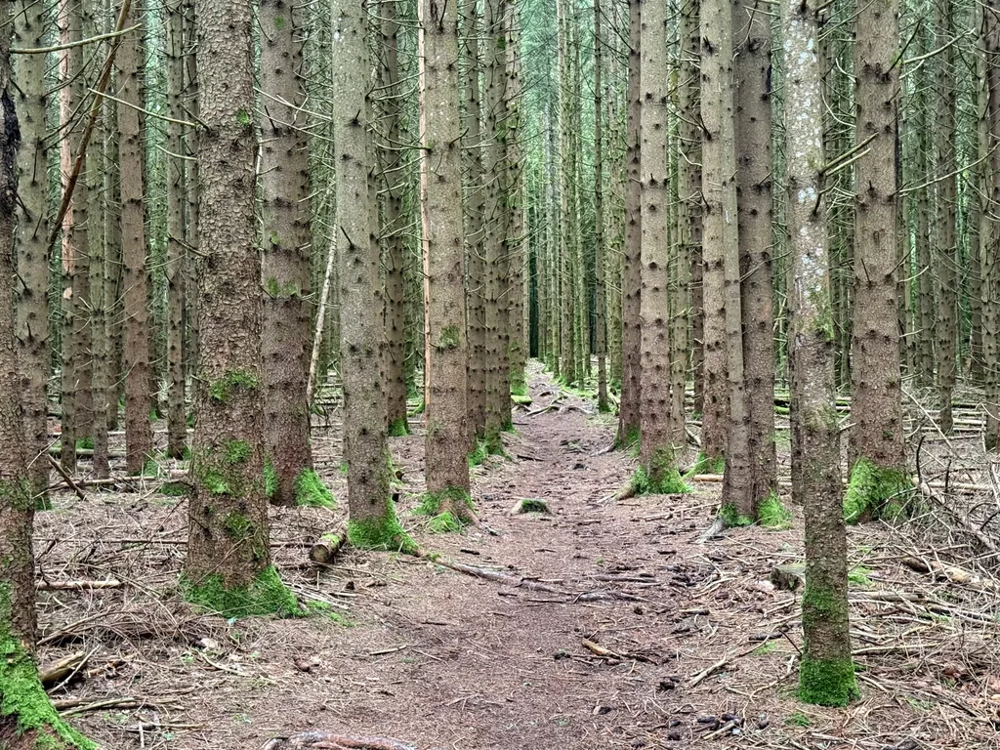
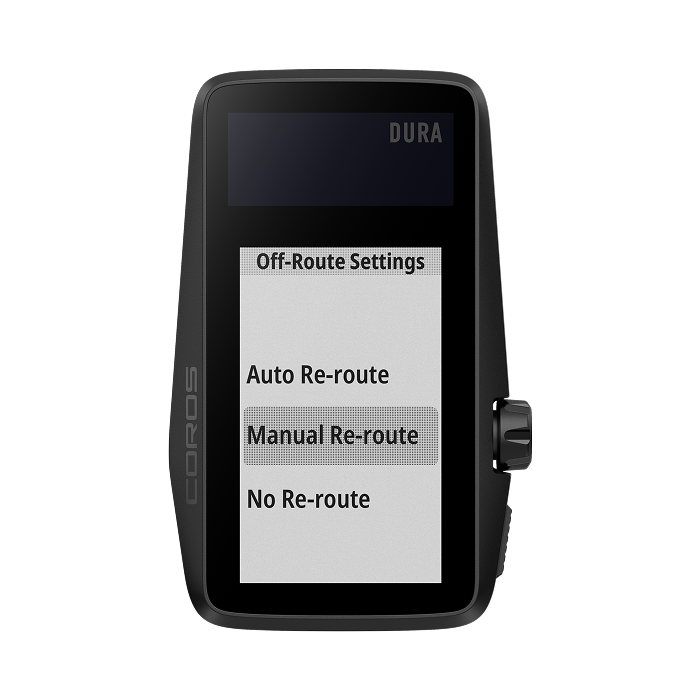
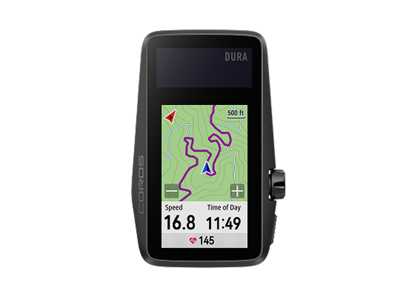

# Bretagne, Auvergne, Coros Dura et g727

Je n’ai plus envie d’écrire sur le vélo, mais seulement de vous donner des nouvelles de quand je fais du vélo et vous inviter à rouler avec nous. Je me fiche des tendances, des nouveautés, des polémiques et du marketing. Donc quelques news.

### g727 2025

Nous sommes une soixantaine de partants désormais, il reste moins d’une quarantaine de places pour le Grand Départ du 27 septembre. Nous terminerons les reconnaissances en août et début septembre pour vous proposer un parcours dépaysant et roulant (oui gravel et surtout pas VTT, même si les VTT seront bien sûr adaptés). Cette année, la trace penchera à l’est avec Carmargue, Alpilles, Lubéron, Avignon et bas des Cévennes au programme, avant de culminer au sommet de l’Hérault et de regagner Poussan via le lac du Salagou. Pas de surenchère de d+, puisque nous devrions être autour de 7 000 mètres.

[Tous les renseignements sur le site 727.](https://727bikepacking.fr/g727-Grand-Depart/) La nouvelle trace sera disponible une semaine avant le départ.

### Bretagne 2025

Avec les copains, on a effectué [une boucle bretonne](https://www.visugpx.com/IpFgBmDgrC), interrompue par le mauvais temps. J’ai raconté et publié des photos dans [mon journal de juillet](https://tcrouzet.com/2025/08/01/juillet-2025/). Nous étions à VTT, mais ça passe presque partout sans difficulté à gravel, à de rares exceptions comme la descente après la chapelle Saint-Michel dans les monts d’Arrée. 

### Auvergne 2025

J’ai tellement aimé l’Auvergne lors de mes différents voyages que nous y sommes retournés trois jours. J’ai encore une fois [raconté et publié des photos dans le journal](https://tcrouzet.com/2025/08/01/juillet-2025/). Je vous [recommande cette trace 2025](https://www.visugpx.com/8K7KWVZ1c5), plus compacte que l’édition 2024, davantage de singles dans les volcans et transition par la route entre les massifs.

### Coros Dura 4.0

Nous avons attendu plus de neuf mois la [version 4.0 de l’app et du firmware](https://coros.com/stories/latest-news/c/DURA-app-4-feature-update). J’avais fait [quelques suggestions dans mes précédents articles](https://tcrouzet.com/tag/gps/), mais une seule a été retenue : il est désormais possible de désactiver le reroutage, ce qui est indispensable en bikepacking quand on sort et revient souvent sur une trace.

Je ne vois guère d’autres améliorations, sinon la possibilité d’afficher les courbes de niveau. Le rendu cartographique est toujours aussi indigent, avec un traitement indifférencié de la plupart des routes, chemins et même single, ce qui parfois nous induit en erreur, sans que ce soit rédhibitoire. Et toujours un gros défaut : quand on zoome, on zoome en même temps le trait de la trace, qui bientôt recouvre les détails de la carte.

Il subsiste des bugs, mais aucun qui rendrait le GPS inutilisable. J’ai roulé avec la 4.0 bêta en Bretagne et 4.0 finale en Auvergne sans que le GPS ne se bloque (ce qui m’était arrivé en Espagne en mars). Il a toujours tendance à perdre les pédales quand on remonte une trace à l’envers. Il n’affiche pas toujours le profil des montées. Son mode de calcul du D+ est fautif, notamment à l’initialisation d’une trace : en Auvergne, il a ajouté 1 000 mètres à ma première journée (l’altitude du point de départ !).

Reste que le Dura est le GPS idéal pour le bikepacking. J’ai effectué le 727 2025 en six jours assez maussades côté météo en terminant avec 50 % de charge, après huit jours la Bretagne il restait encore 25 % de charge et j’ai dépensé moins de 20 % la charge pour la boucle en Auvergne. Vu le prix de ce GPS, et malgré ses défauts, je ne suis pas prêt de revenir à un Garmin (ce que j’avais craint initialement).

*PS : J’apprécierais que tous mes réglages soient préservés de trace en trace (niveau de zoom, désactivation du routage, choix du mode cartographique… ce n’est jamais le cas pour le zoom, pour sûr, pour les deux autres options j’ai encore des doutes).*
#velo #bikepacking #gps #y2025 #2025-8-1-20h00
