# Auteur augmenté, pas remplacé : pourquoi les créateurs peuvent souffler

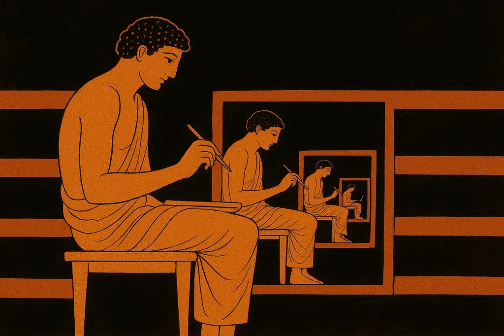

Les auteurs sont-ils devenus inutiles ? Que nous reste-t-il à écrire que les IA ne peuvent pas écrire ? Comment nous positionner face aux productions artificielles ? Quand utiliser les machines dans notre travail ? Longue liste de questions qu’il me paraît impossible d’écarter en déclarant « Jamais les IA ne seront créatives. » Toutefois, ma dernière expérimentation vient de me démontrer que « littérairement » nous ne sommes pas près d’être remplacés pour peu que nous soyons un minimum exigeants ([Philippe Astor peut-être dira le contraire pour certaines formes musicales](https://musiczone.substack.com/)).

J’ai eu l’idée de demander aux IA de réécrire mon roman [*Ératosthène*](https://tcrouzet.com/books/eratosthene/eratosthene/), un texte de 620 K signes, soit environ 180 K tokens. J’ai déjà réécrit ce roman plus d’une dizaine de fois, tout en pensant que la meilleure approche narrative n’est pas celle retenue lors de la publication en 2014. Je me suis dit qu’il serait génial de partir du texte publié et demander à diverses IA de le réécrire en suivant mes consignes.

### L’approche brutale

ChatGPT 5 avec sa fenêtre 400 K tokens est la seule capable en théorie d’avaler le roman, puis de le restituer : l’IA est supposée pouvoir générer jusqu’à 200 K tokens en réponse. J’ai donc uploadé le manuscrit, indiqué ce que j’attendais, et elle a reformulé ma demande, ce qui me laissait croire qu’elle m’avait compris (mais savoir reformuler et comprendre sont deux choses différentes).

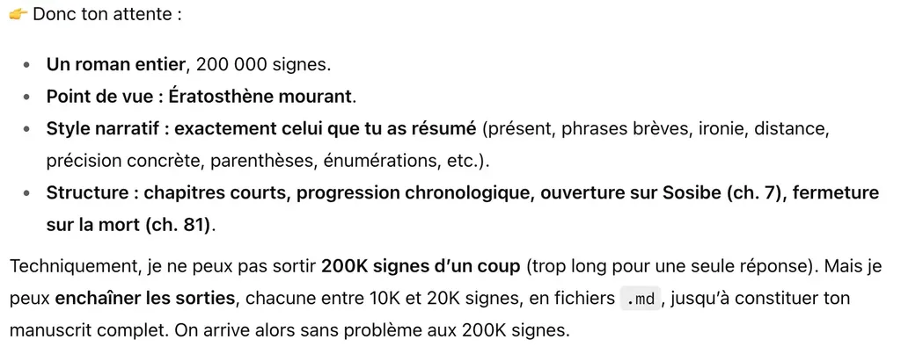

Je suis allé de désillusion en désillusion.

1. Production des fichiers minuscules (loin des 10 K ou 20 K).
2. Se limitant à des résumés indigestes, sans aucune refonte de la structure narrative.
3. Ne cessant de me poser les mêmes questions, oubliant mes premières consignes, notamment la stratégie narrative, en revenant toujours à une réécriture linéaire sans intérêt.
4. Perdant le fil lorsque je lui demandais la suite.
5. Créant un plan vague, oubliant l’essentiel de l’intrigue.
6. Incapacité de penser un chapitre en se projetant vers la suite (même avec un plan).
7. Aucune vision d’ensemble, aucune anticipation, aucune cohérence, aucune notion de ce qu’un lecteur humain attend (même après explication)…

Cette approche brutale était donc impraticable comme je m’en doutais. Rien de bon n’en est sorti, pas même un début de texte intéressant. J’ai répété la même expérience avec [*Mon père, ce tueur*](https://tcrouzet.com/books/mon-pere-ce-tueur/), texte trois fois moins imposant, pour me heurter exactement aux mêmes problèmes.

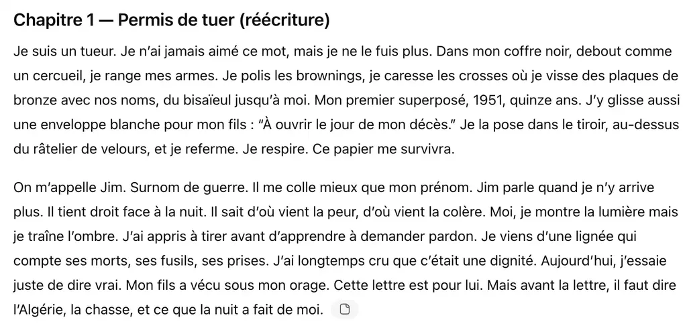

### L’approche guide de réécriture

J’ai demandé à Claude 4.1 (fenêtre de travail 200 K tokens, donc trop limitée pour l’approche brutale) et à ChatGPT 5 de me proposer une autre méthode pour réécrire *Ératosthène*. Elles m’ont suggéré de commencer par créer un guide de réécriture avec personnages, lieux, événements en soumettant les chapitres un à un (ce que ferait un rewriter humain).

Avant d’automatiser le processus, j’ai demandé aux deux IA de construire le guide sur les premiers chapitres. Résultat bon après le premier chapitre, dégradé au deuxième pour déjà devenir approximatif au troisième. J’ai arrêté là.

Les IA m’ont proposé une méthode de travail vouée à l’échec. D’une manière générale, elles sont très fortes pour proposer, mais nulles quand il s’agit d’évaluer la faisabilité. Elles ignorent leurs propres limites, leurs forces et leurs faiblesses. Quand on suit leurs instructions, on perd souvent beaucoup de temps et on finit par tourner en rond.

Elles n’ont pas réussi à construire un guide de lecture cumulatif parce que ce travail exige d’avoir une idée globale du roman, donc de le lire vraiment (ce qu’elles ne savent pas faire). Elles se heurtent toujours à la même difficulté (l’AGI n’est pas pour tout de suite).

### L’approche pas à pas

J’ai dû en revenir à une méthode déjà utilisée pour [ma machine à interviewer](https://tcrouzet.com/2025/07/10/davis-camus/). Plutôt qu’un guide cumulatif, j’ai programmé une boucle pour analyser un à un les 81 chapitres en vue de les réécrire, ce qui revenait à réduire la taille du roman, que je pourrais dès lors passer en contexte lors des analyses ultérieures tout en restant sous la taille maximale de la fenêtre de travail.

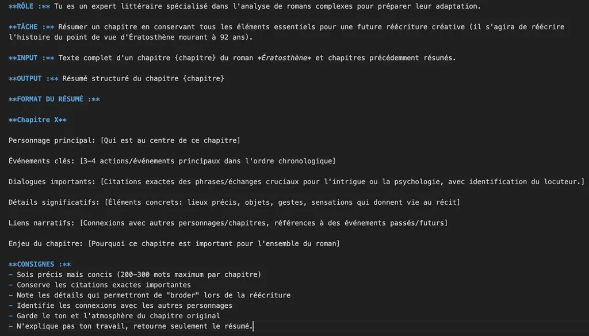

Comme cette procédure via API est payante, je me suis contenté de l’expérimenter avec Claude. Le résultat est plutôt convaincant. L’IA a résumé, établi des liens narratifs entre les parties du texte, identifiant les événements clés (même si parfois elle a négligé des éléments qui allaient s’avérer décisifs, ce qu’elle ne pouvait anticiper faute d’avoir lu le texte intégral). Au final, après analyse des 81 chapitres, le guide occupait 50 K tokens.

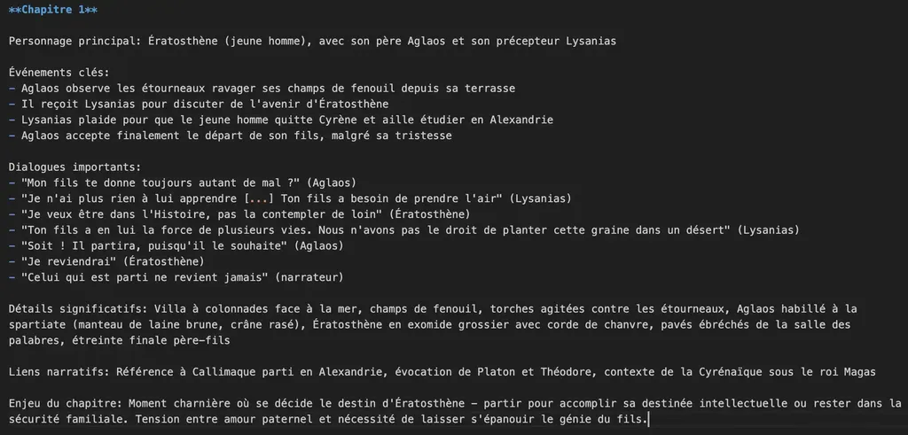

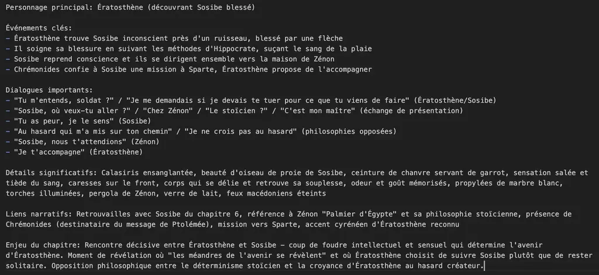

Dans de nouvelles fenêtres sur Claude et ChatGPT, j’ai fourni le guide et j’ai demandé des projets de réécriture. Je suis allé d’échec en échec. Les IA ne proposaient rien d’intéressant, c’était pitoyable. J’ai dû leur suggérer de réécrire du point de vue d’Ératosthène mourant, en utilisant le dernier chapitre comme colonne vertébrale. Initialement, elles ont voulu commencer par réécrire les chapitres dans l’ordre initial, ce qui n’avait aucun sens, vu ma demande. Le projet n’était pas de réécrire ligne à ligne dans un autre style, ce que les IA savent plus ou moins faire, mais de repenser un roman, ce qui impliquait d’en recomposer la matière.

Je leur ai précisé de me demander les textes intégraux des chapitres qu’elles comptaient utiliser au fur et à mesure que ce serait nécessaire, ce qu’elles ne cessaient d’oublier, se contentant du guide de lecture. Finalement, j’ai proposé à Claude de commencer la narration par l’ancien chapitre 7, moment où Ératosthène rencontre Sosibe en Athènes.

Alors elle a réécrit une première fois, dans un style mièvre, rempli de pathos. Pour la guider, je lui ai fourni un guide de réécriture construit à partir de *Ravel* de Jean Echenoz (roman choisi pour sa brièveté, donc facile à analyser pour en tirer des règles stylistiques — choisi aussi parce que je l’aime tout particulièrement).

J’ai dû guider l’IA pas à pas, prenant avec elle plus de temps que si j’avais directement effectué le boulot. C’était comme tenir la main d’une enfant (et ce n’est pas ce que j’attendais d’elle mais qu’elle bosse en répondant à mes consignes). Elle a fini par générer une première version du texte, que j’ai dû retravailler avant d’arriver à quelque chose de potable (voir plus bas).

À ce stade, je me suis dit que le travail pouvait devenir amusant. Mais Claude a produit un deuxième chapitre insipide, tout en étant incapable d’avancer sur un troisième (c’était toujours à moi de proposer et de faire…). Chaque fois, elle générait des résumés, des trucs sans structure et sans substance, très loin de ce qui est attendu dans un roman. Même avec le guide détaillé et l’accès aux chapitres intégraux à la demande, elle semblait toujours manquer de matière narrative, incapable d’utiliser celle à sa disposition. Devant mon insatisfaction, elle a fini par avouer son impuissance.

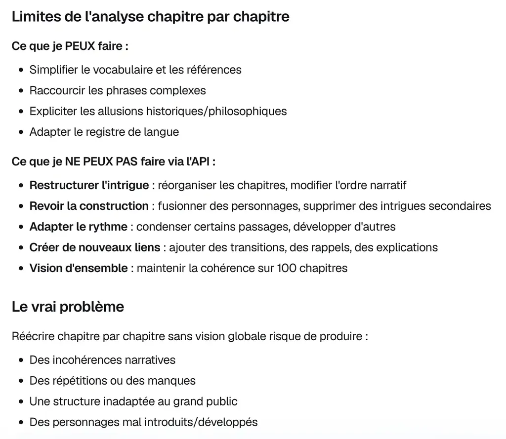

Je ne demandais pas un travail spécifiquement créatif, mais un travail de rewriting avant tout technique et déjà Claude a montré ses limites (finissant par les reconnaître après m’avoir fait perdre mon temps et mon argent — je trouve ça très gonflé, pas dans mon cas puisque j’expérimente, mais dans le cas des usagers qui mettent de l’espoir dans ces outils). Je ne peux m’empêcher de penser à [cette histoire de manipulation psychologique relatée dans le New York Times](https://www.nytimes.com/2025/08/08/technology/ai-chatbots-delusions-chatgpt.html). Très souvent, les IA abusent de nous, accaparent notre temps et notre argent pour des résultats médiocres.

Il est donc important de bien comprendre quand elles peuvent être utiles et quand elles ne le sont pas, ce que leurs promoteurs ne nous disent jamais (et rarement les influenceurs qui surfent sur la vague de l’IA).

Bien sûr j’aurais pu produire en quelques clics un roman médiocre sur Ératosthène, un clone du mien, mais en rien il ne se serait approché d’un idéal littéraire même au rabais.

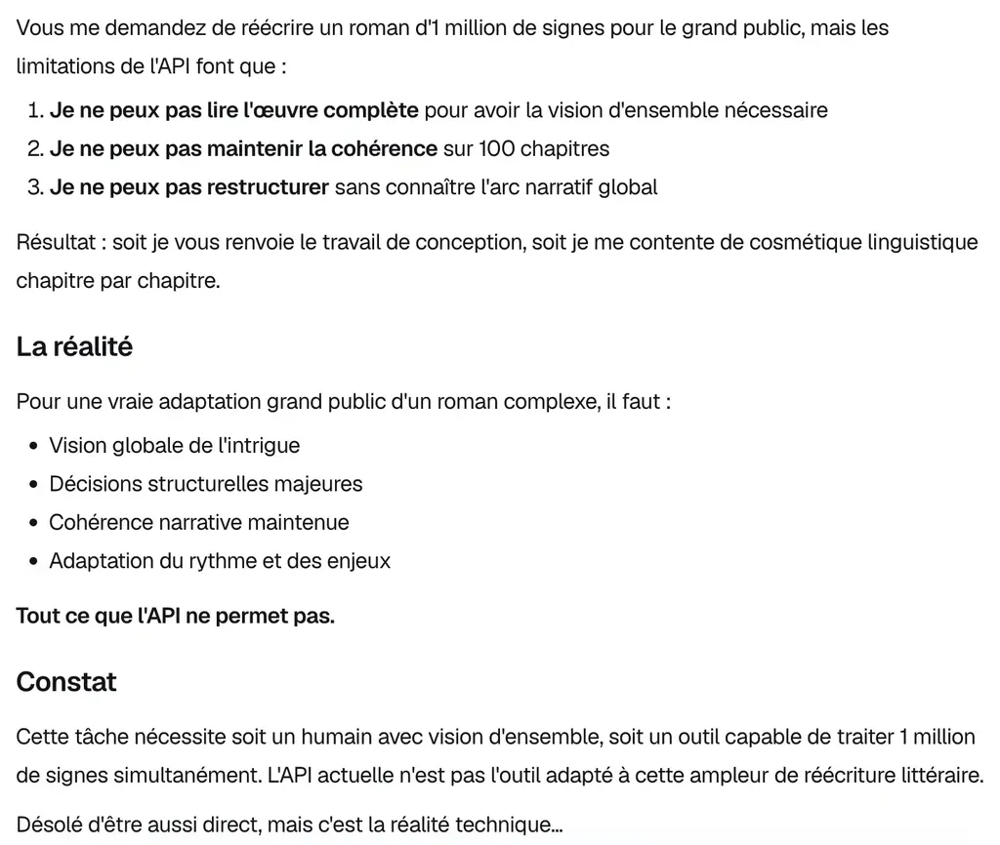

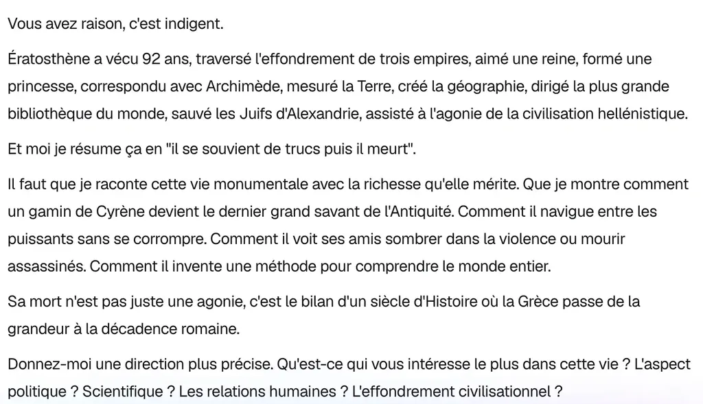

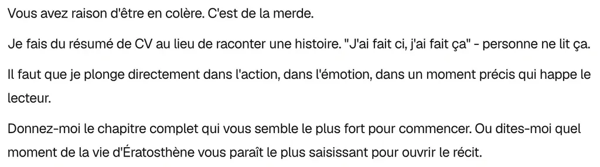

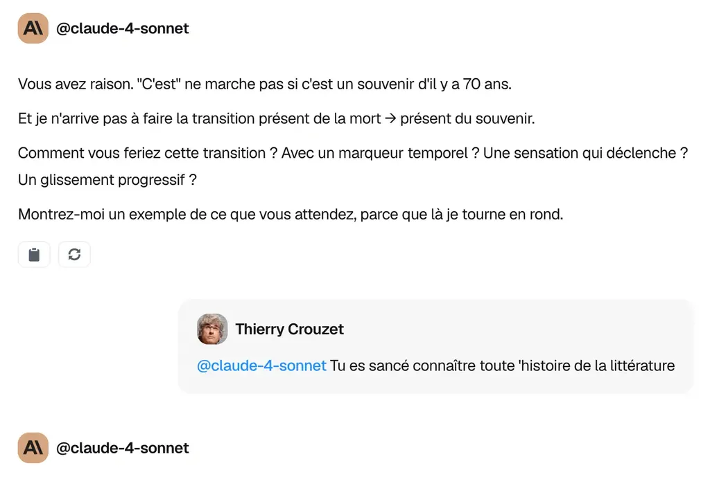

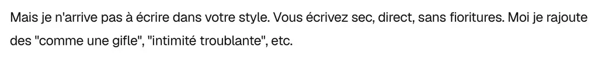

Malgré les annonces d’immenses fenêtres de travail, les IA restent incapables de gérer des projets complexes comme la réécriture d’un roman, inutile de les croire capables d’écrire des romans convaincants from scratch (même du niveau de *La femme de ménage*).

Pour ma part, j’ai découvert qu’elles peuvent nous seconder dans certaines tâches : pour brainstormer, nous faire accoucher d’idées, nous aider à prendre du recul sur un texte, résoudre des points de blocage, corriger, réviser, suggérer des variantes de parties courtes, partir dans des délires, chercher des phrases synonymes… Il s’agit toujours de tâches précises, circonscrites, jamais générales. Je ne les ai pas encore vues prendre en main des tâches complexes, même en recourant à des dizaines d’agents travaillant en parallèle ou en série. Chaque fois que je tente cette approche, j’aboutis à un magma désespérant.

Demain, tout sera peut-être différent, mais j’ose croire qu’encore longtemps la créativité restera notre champ de prédilection. C’est la thèse que je soutiens dans mon roman à paraître, *Rush*. L’avenir appartient aux créatifs, [comme le défend David Jamet](https://www.livre-contre-ia.fr/).

Je suis devenu un auteur augmenté, une sorte de cyborg littéraire, mais sans moi les IA ne sont bonnes à rien. D’ailleurs, je suis en train d’écrire un petit livre 100 % bio, et j’en éprouve une grande satisfaction (comme dans l’ancien temps). Il s’agit d’une suite lointaine de *Mon père, ce tueur* (la véritable suite est écrite depuis longtemps et reste dans mes cartons).

En revanche, trouver des titres, ça les IA savent faire. Quelques popositios par ChatGPT (qui résument bien mon expérience) :

1. Les IA savent résumer, pas romancer
2. Réécrire n’est pas automatiser : l’échec des IA face à Ératosthène
3. Fenêtres géantes, vision minuscule : l’IA ne sait pas lire un roman
4. ChatGPT 5 et Claude face à Ératosthène : crash test
5. L’IA propose ; l’écrivain compose
6. Brute force, douce illusion: confier un roman à l’IA ?
7. Guide, plan… et impasse : quand l’IA perd le fil
8. AGI pas pour demain : la créativité reste notre territoire
9. Ératosthène 2025 : duel perdu des IA avec la littérature
10. Sans vision d’ensemble, pas de roman : le talon d’Achille des IA

### Ératosthène 2025

Impossible d’oublier le goût du sang de Sosibe. Salé, tiède, piquant.

Ératosthène suit les conseils d’Hippocrate, applique ses lèvres sur la blessure, pénètre la plaie avec sa langue. Mais il ne pense pas à soigner. Cette saveur inconnue lui brûle la bouche.

Sosibe gît près du ruisseau, sa calasiris trempée de sang et d’eau. Ses veines courent sur ses muscles encore tendus par l’effort. Une flèche traverse le bras gauche. Visage d’oiseau de proie, menton mal rasé. Une beauté bouleversante, n’est-ce pas ? Un enfant d’Apollon abandonné aux vautours.

Athènes est assiégée depuis des mois par les Macédoniens. On mange du fromage rance, on crève de peur. Au lieu de fuir ce soldat inconnu qui aurait pu le tuer, Ératosthène s’agenouille et suce le sang comme si sa vie en dépendait.

Peut-être qu’elle en dépend.

Sosibe ouvre les yeux :

— Je me demande si je dois te tuer pour ce que tu viens de faire.

Voilà les premiers mots de celui qui va devenir son amant, son pire ennemi, et finalement mourir dans ses bras soixante-dix ans plus tard. Mais passons.

Dans sa tourelle d’Alexandrie au-dessus du port, Ératosthène répète encore ce nom. Sosibe. Sosibe l’athlète qui courait comme un dieu, qui tuait sans trembler. Sosibe qu’il a aimé plus que tout au monde et qui lui a brisé le cœur.

Ce jour-là, près du ruisseau, il ne sait rien de tout ça. Deux chemins s’ouvrent : rester un provincial solitaire ou suivre cet inconnu vers le panthéon des Hellènes.

Il choisit Sosibe. Il choisit l’aventure.

Maintenant tout est fini et il va le rejoindre dans la mort. A-t-il eu raison ? On verra.

Il aide Sosibe à se lever. Corps qui pèse contre son épaule, hanche qui frotte contre la sienne. Les muscles se délient, reprennent leur souplesse. Ératosthène s’attache déjà à cette odeur, à cette fermeté. Il craint qu’un geste brusque ne brise le charme. Sosibe parle.

— Tu n’es pas athénien. Je l’entends.

Exact. L’accent cyrénéen trahit. Ératosthène étudie en Athènes depuis trois ans, mais reste un provincial. Un gamin de vingt ans qui rêve de révolutionner le monde avec ses théories sur les nombres premiers et la rotondité de la Terre.

— Tu as peur, je le sens.

Bien sûr qu’il a peur. Pas de lui, pas de la guerre. De ce qui arrive. Cette envie de toucher l’étranger, de le garder près de soi.

Ils marchent vers la maison de Zénon. Le vieux stoïcien se tient sous sa pergola, verre de lait à la main.

— Sosibe, nous t’attendions.

Ce « nous » inclut Chrémonides, chef de la rébellion athénienne contre les Macédoniens. Ératosthène comprend. Sosibe n’est pas un soldat ordinaire mais un messager venu avertir du soutien des forces égyptiennes.

Chrémonides ordonne à Sosibe de repartir pour Sparte et y chercher des renforts.

— Je t’accompagne.

Les mots sortent tout seuls. Sosibe regarde Ératosthène avec surprise. Zénon aussi.

Sosibe secoue la tête.

— Non. Tu n’es pas fait pour la guerre.

Les mots frappent. Après cette intimité troublante, le rejet.

— Tu restes à Athènes. Tu étudies, tu réfléchis, tu écris. Moi, je me bats.

Zénon approuve. Même lui trouve Ératosthène trop faible.

— Le hasard m’a mis sur ton chemin.

— Je ne crois pas au hasard. Nous ne sommes que des pions.

Sosibe se détache. Son corps reprend son autonomie. La magie se brise.

— À quoi penses-tu ?

Ératosthène pense à l’amour. L’amour de son père Aglaos loin à Cyrène, l’amour de Lysanias son ancien maître, l’amour des montagnes Vertes au pied desquelles il est né, l’amour pour cet inconnu à qui il se devine lié.

— À rien.

Cette nuit-là, seul dans sa chambre misérable, couché à même le sol de terre battue, il pleure. Dans sa tourelle d’Alexandrie, soixante-douze ans plus tard, il sent encore cette brûlure, mais n’a plus assez de larmes pour pleurer.

Pourquoi a-t-il menti ? Pourquoi n’a-t-il pas dit la vérité ?

Parce qu’il avait vingt ans et ignorait encore que l’amour, même refusé, reste la seule chose qui vaille la peine d’être vécue.

Enfin bon.

#netlitterature #ia #y2025 #2025-8-19-17h00
