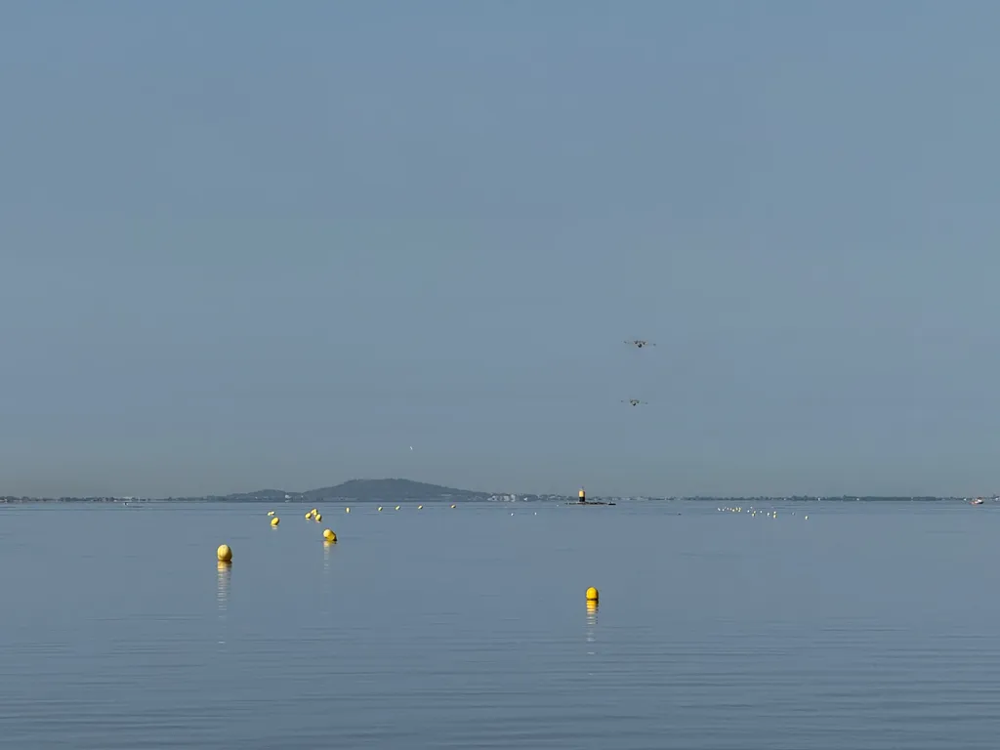

# De ma terrasse #23

_Ma sélection du dimanche : **9** liens et une photo prise depuis ma terrasse. Envoyé au pic de canicule (je lis peu d’articles et me concentre sur mon livre en cours)._

## Intelligence artificielle et ses dérives

[Luc Julia au Sénat : autopsie d’un grand N’IMPORTE QUOI](https://www.youtube.com/watch?v=e5kDHL-nnh4&t=3292s&ab_channel=MonsieurPhi) • FR • 55 min  
Indispensable : le démontage d’un imposteur, et à travers lui de tous les grands médias et de nos politiques (on m’avait envoyé il y a peu son portrait sur *Libé*).

[Une étudiante du MIT abandonne ses études par peur de l’AGI](https://futurism.com/mit-student-drops-out-ai-extinction?utm_source=flipboard&utm_content=Futurism/magazine/All+About+Artificial+Intelligence) • EN • 4 min  
Alice Blair quitte le MIT par crainte que l’intelligence artificielle générale ne provoque l’extinction humaine avant qu’elle n’obtienne son diplôme. Une décision qui illustre l’anxiété croissante autour des développements de l’IA.

[Les chatbots peuvent pousser à la psychose.](https://www.nytimes.com/2025/08/08/technology/ai-chatbots-delusions-chatgpt.html) • EN • 6 min  
Une plongée troublante dans les mécanismes psychologiques qui peuvent pousser les utilisateurs de chatbots vers des états délirants, révélant les dangers cachés de l’interaction prolongée avec l’IA.

[GPT-5 tourne au désastre](https://futurism.com/gpt-5-disaster?utm_source=flipboard&utm_content=other) • EN • 5 min  
Le lancement très attendu de GPT-5 d’OpenAI se révèle décevant avec des hallucinations accrues, des problèmes de sécurité et une instabilité qui force l’entreprise à restaurer l’accès aux versions précédentes.

[Microsoft lance POML (Prompt Orchestration Markup Language) : apporter modularité et évolutivité aux prompts LLM](https://www.marktechpost.com/2025/08/13/microsoft-releases-poml-prompt-orchestration-markup-language/) • EN • 7 min  
Microsoft présente un langage de balisage inspiré d’HTML/XML pour structurer et organiser les prompts d’IA, promettant une approche plus systématique du prompt engineering.

## Écriture et créativité

[Cet écrivain dit que vous devriez ignorer ses conseils](https://nofilmschool.com/lee-child-writing-advice?utm_source=flipboard&utm_content=user/NoFilmSchool) • EN • 4 min  
Lee Child, créateur de Jack Reacher, prône l’autonomie créative en encourageant les écrivains à faire confiance à leur instinct plutôt qu’aux conseils extérieurs. Une approche paradoxale mais libératrice (qui me fait penser à [un de mes derniers articles](https://tcrouzet.com/2025/07/12/anti-guide-ecrivain/)).

## Sciences et environnement

[Des scientifiques créent des cellules solaires d’intérieur qui pourraient éliminer des milliards de batteries](https://www.thebrighterside.news/post/scientists-create-indoor-solar-cells-that-could-eliminate-billions-of-batteries/?utm_source=flipboard&utm_content=topic/climate) • EN • 6 min  
Des chercheurs développent des cellules photovoltaïques pérovskites optimisées pour l’éclairage intérieur, atteignant un rendement record de 37,6 %. Elles pourraient révolutionner l’alimentation des objets connectés.

[Un minuscule « corail » découvert dans un cratère martien](https://www.sciencealert.com/tiny-coral-discovered-by-rover-in-martian-crater) • EN • 3 min  
Curiosity découvre une formation rocheuse ressemblant étonnamment à du corail, résultat de l’érosion éolienne sur des dépôts minéraux anciens témoignant d’un passé aquatique martien.

[« Comme une moisissure rampante qui s’étend sur le paysage » : des zones sèches séparées dans le monde fusionnent en régions de « méga-assèchement » à un rythme alarmant, révèle une étude](https://www.livescience.com/planet-earth/climate-change/like-a-creeping-mold-thats-spreading-across-the-landscape-separate-dry-areas-around-the-world-are-merging-into-mega-drying-regions-at-an-alarming-rate-study-finds) • EN • 8 min  
Les continents perdent tellement d’eau qu’ils dépassent désormais les calottes glaciaires comme principal contributeur à l’élévation du niveau des mers, créant quatre mégarégions d’assèchement dans l’hémisphère nord.

## Chez moi

[Pourquoi les réseaux sociaux sont-ils moribonds ?](https://tcrouzet.com/2025/08/11/mort-des-r%C3%A9seaux-sociaux/) • FR • 10 min 

J’essaie de montrer que nous avons tout intérêt à fuir ces endroits et inventer de nouveaux modes de socialisation numériques et IRL (projet de rencontres dans les cafés suite à cet article). 

#digest #y2025 #2025-8-17-17h00 
