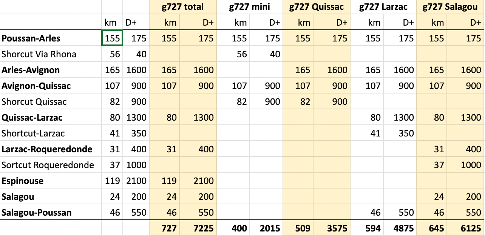

# La trace g727 2025 en détail

Dans un mois, nous roulerons [le g727 2025](https://727bikepacking.fr/g727/) avec nos gravels, VTT et autres monsters. Nous avons finalisé le parcours et les variantes de 400 à 727 km, de 2 200 m à 7 200 m de D+. La trace sera disponible une dizaine de jours avant le départ, après d’ultimes vérifications.

<iframe width="560" height="315" src="https://www.youtube.com/embed/b_joc4BJRXA?si=K6qfWKqceL99ySPA" title="YouTube video player" frameborder="0" allow="accelerometer; autoplay; clipboard-write; encrypted-media; gyroscope; picture-in-picture; web-share" referrerpolicy="strict-origin-when-cross-origin" allowfullscreen></iframe>

Dès à présent, vous pouvez choisir votre menu. Cinq distances sont possibles en fonction des shortcuts choisis. La version mini conviendra aux bikepackeurs débutants, mais elle évite les Alpilles et le petit Lubéron, deux massifs magnifiques (le shortcut suit la via Rhôna).

Bref récit de la dernière grosse reco. Partis de la gare de Cavaillon, nous retrouvons la trace plus au nord. Majoritairement par des petites routes nous traversons la plaine Comtadine avec ses vergers et vignobles. Nous grimpons à Chateau-Neuf-de-Gadagne, mais le Ventoux est malheureusement dans la brume, avant de glisser vers Avignon.

Une petite boucle touristique dans la ville, puis nous sautons sur l’île de Piot pour avoir une vue panoramique sur le palais des Papes et le pont où « on y danse ». Par le barrage de la centrale hydroélectrique, nous passons sur l’île des Pages, puis gagnons la rive droite du Rhône pour le remonter sur une vingtaine de kilomètres. Soleil lourd, 36°C, humidité poisseuse dans les vignobles gardois. On saute de fontaine en fontaine, mais tous les bars, épiceries et boulangeries fermés en ce début d’après-midi et même jusqu’à 17h (mieux vaut faire des courses à Avignon).

Après les vignobles, c’est les garrigues avec des pistes parfois interminables comme sur le chemin d’Uzès, une longue tôle ondulée rectiligne (et une en descente bien trop dangereuse à gravel où je me ramasse — nous l’éviterons au prix d’un bout de route). Nous ne trouvons à manger qu’à Moussac, sous la passerelle du Gardon.

La nuit tombe quand nous arrivons à Mauressargues. Comme de la pluie est annoncée pour la nuit, nous nous réfugions sous une grande tonnelle, avec une longue table pour les banquets. Nuit de merde. La première fois, je crois que quelqu’un a tiré un coup de fusil ou lancé une fusée de détresse, puis ça se répète de temps à autre. C’était probablement [canon effaroucheur](https://www.agri53.fr/effarouchement-des-oiseaux-quels-droits-pour-les-agriculteurs).

Réveil à l’aube. Il ne pleut plus. Très vite nous arrivons à Quissac. Plutôt que continuer sur la trace déjà reconnue, en partie identique à celle de 2023 à ce niveau, nous rentrons vers Poussan en suivant un magnifique shortcut sur les contreforts du pic Saint Loup.

Il reste une trentaine de places…

### Note sur la vidéo

J’ai demandé à ChatGPT d’écrire une chanson (que j’ai un poil ajustée).

[Intro]

[Verse]

Aube sur le port salé,  
Mont Saint‑Clair allumé,  
Deux bidons, sacoches serrées,  
Je pars sans me retourner.

[Chorus] 

Sète to Sète, poussière et vent,  
Bike qui chante, je vais devant.  
Étangs, vignes, rubans mouvants,  
Les copains murmurent: “tiens bon.”

[Verse] 

Canal à gauche, flamants pour témoins,

La Tram gifle mes mains.  
J’avale les bosses, le grain,  
Ma boussole dit: “plus loin.”

[Chorus]  
Sète to Sète, boucle des étangs,  
Je reviens au sel battant.  
Dans les yeux, un trait d’argent,  
La route me prend — je suis vivant.

[Outro]

J’ai collé le tout dans [Suno](https://suno.com/) pour qu’il compose la musique (une minute en mode gratuit). J’ai récupéré les deux séquences de drones tournées par [Patrick Lamare](https://www.youtube.com/@PaTVenture34) [et voilà](https://youtu.be/b_joc4BJRXA).

#velo #bikepacking #y2025 #2025-8-28-12h00
