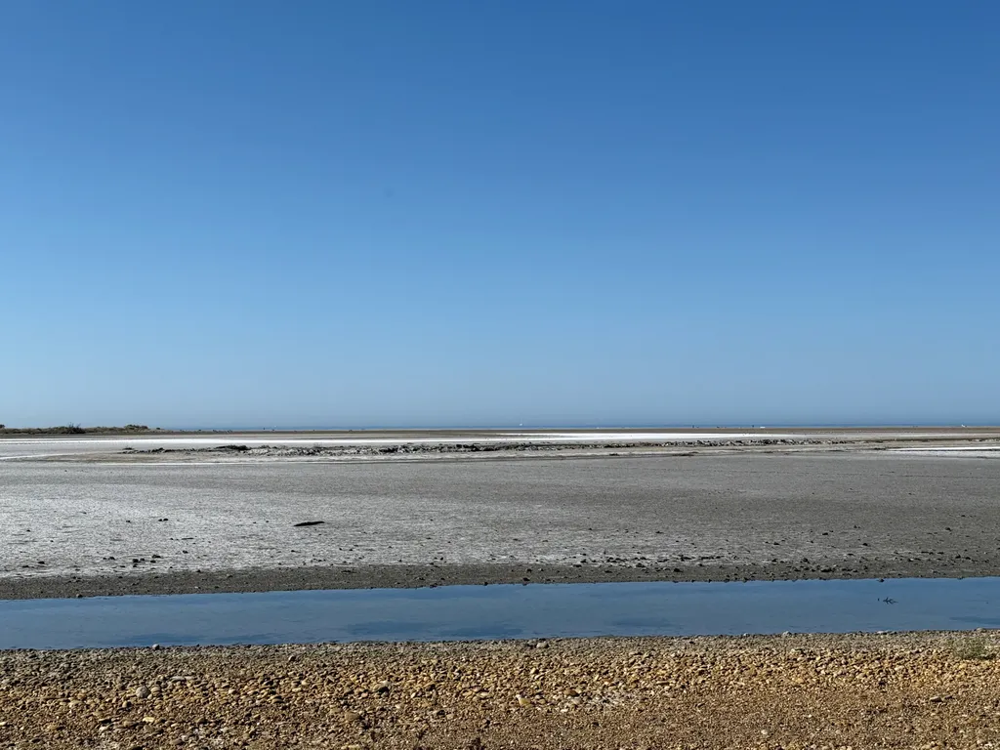

# Le g727 2025 passera pas la Camargue - photos

Pour relier Aigues-Mortes aux Alpilles, le [g727 2025](https://727bikepacking.fr/g727-Grand-Depart/) traversera la Camargue. Voici quelques photos après notre dernière reconnaissance, entre étangs et mer, dans un plat pays sans cesse changeant et aux couleurs éblouissantes. Petites routes, digues le long du petit et grand Rhône (interdites aux véhicules motorisés mais pas au vélos), pistes, un ou deux brefs secteurs sableux, avant de se retrouver au cœur d’Arles.

La première journée sera peu exigente côté dénivelé, avec pour seule difficulté le classique départ à travers la Gardiole. 

[Reste moins de 40 places pour le Grand Départ du 27 septembre.](https://727bikepacking.fr/g727-Grand-Depart/)

#velo #bikepacking #y2025 #2025-8-5-20h00
