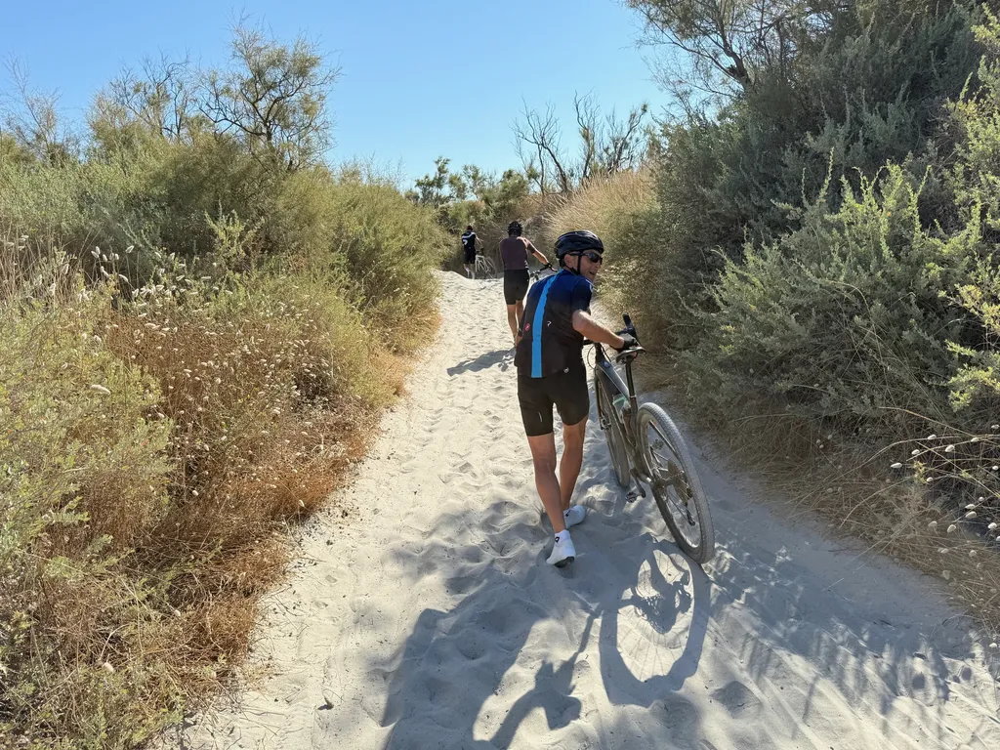
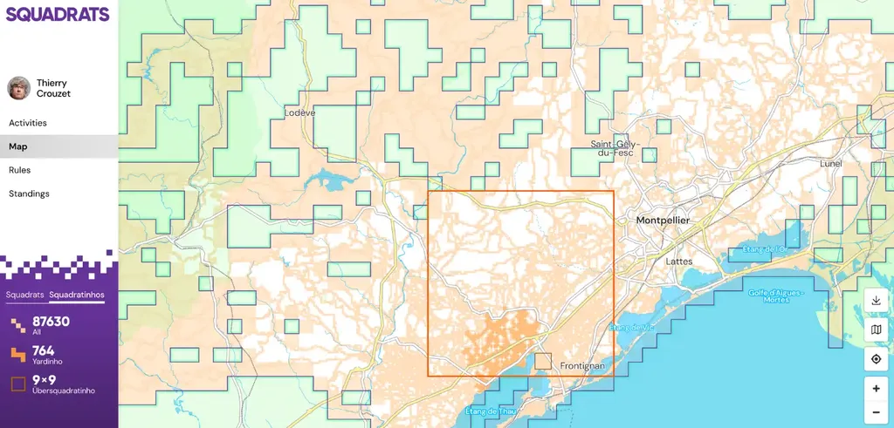
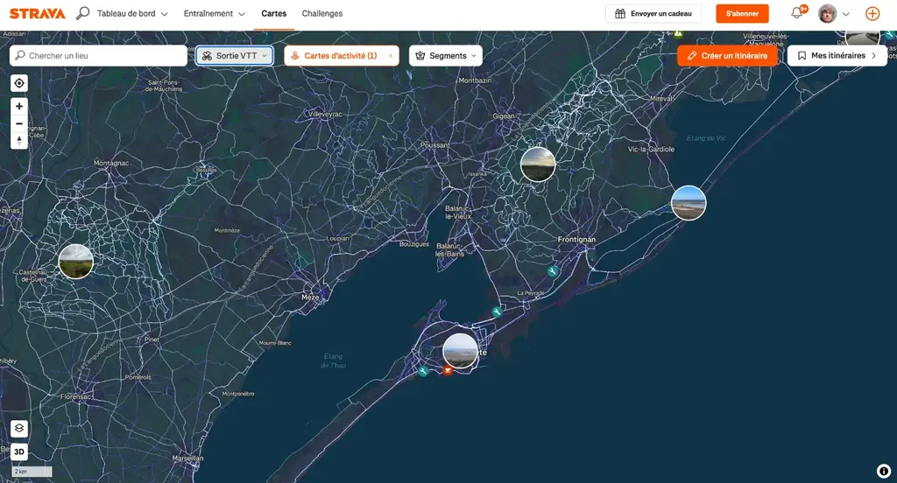

# Le GPS à vélo pour les nuls

Le GPS a révolutionné ma façon de faire du vélo. Il y a un avant et un après. Je serais incapable de revenir en arrière et vais tenter d’expliquer pourquoi.

Je commence par un mini historique.

* 1978, lancement du premier satellite GPS (initialement à usage militaire).
* 1983, annonce de l’ouverture progressive du réseau au public.
* 1990, Mazda sort la première voiture équipée d’un GPS.
* 1995, première couverture mondiale du réseau GPS avec 24 satellites.
* 2000, sortie du Garmin eTrex qui offre pour la première fois la possibilité de suivre une trace GPX. Jusque là, les GPS permettaient de relier un point A à un point B en un minimum de temps et sans se perdre. L’eTrex permet de suivre des itinéraires préparés en amont.
* 2002, sortie du Garmin Street Pilot pour les motos.
* 2007, premier Garmin Edge, spécialement vélo.
* 2009, lancement de Strava, et donc possibilité de partager les itinéraires et d’en discuter.

C’est une courte et déjà longue histoire. Comme souvent avec les outils technologiques, de nouveaux usages se sont ajoutés à ceux initialement envisagés : suivre une trace, gérer des programmes d’entraînement, se géolocaliser en temps réel, partager des itinéraires, transformant le GPS en outil de socialisation à travers des plateformes comme Strava ou Komoot. Les GPS ne sont donc plus seulement des outils cartographiques. Ils excèdent les possibilités des cartes et présentent d’innombrables avantages (mises à jour, légèreté, compacité, connexion…).

Les GPS ont réussi ce que n’ont pas réussi les liseuses de type Kindle. Majoritairement, nous lisons toujours des livres papier parce qu’aucun système électronique n’a réussi à les supplanter (il manque aux ebooks l’épaisseur, la 3D propre au livre, qui autorise de feuilleter rapidement et de naviguer de mémoire dans un corpus important). Les liseuses n’ont pas tué les livres, contrairement aux GPS qui ont marginalisé les cartes papier (que désormais nous achetons souvent davantage par nostalgie que réelle utilité).

### Le GPS comme fonction

Le GPS pour relier deux points ou améliorer les performances ne m’intéresse guère, contrairement au suivi d’itinéraires et son extension sociale.

Sur route, une road map et une carte grossière suffisent éventuellement à se repérer et à suivre un itinéraire grâce aux panneaux, mais c’est impossible hors asphalte dès qu’on allonge les distances : il n’y a plus de panneaux et souvent personne à qui demander son chemin. Pour se répérer, il faut alors des cartes type IGN TOP25.

Un exemple : [ma trace P27](https://www.visugpx.com/e2IuwWIfeI), reliant Paris à Sète couvre 55 cartes IGN TOP25, les seules avec assez de détails, cartes d’ailleurs incomplètes, puisque la trace emprunte souvent des singles non cartographiés. Poids total des 55 cartes environ 4 kg pour un volume de 4,5 litres (en voyage je transporte 5,5 kg de matos). Transporter autant de cartes n’est guère envisageable, pas plus que de s’arrêter à chaque embranchement pour se repérer (jeu passionnant à l’échelle réduite d’une course d’orientation — mais il s’agit d’une autre pratique). Précision : 55 cartes IGN, c’est 775 €, donc beaucoup plus que la plupart des GPS du marché (tout ça pour des cartes incomplètes et non mises à jour).

Suivre une trace hors asphalte ou en improviser une avec des cartes n’est donc pas infaisable, mais guère réaliste pour un bikepacker (qui a besoin de voyager léger pour que son vélo reste maniable dans les sentiers techniques).

Mais pourquoi suivre une trace plutôt qu’improviser sur le terrain ? Une métaphore : j’aime lire, je prends plaisir à découvrir des univers, à emboîter le pas des auteurs en territoires inconnus ou pour redécouvrir des territoires familiers sous de nouvelles perspectives. J’éprouve ce plaisir de la lecture quand je suis un itinéraire vélo, parce que le traceur a un style, des manies, des façons originales d’aborder les difficultés, de créer du suspens. Une trace est une œuvre d’art à découvrir en pédalant ou en marchant. Il en existe des monotones, des tristes, des tortueuses, des ludiques, des joyeuses, des rafraîchissantes, des éblouissantes, des éprouvantes, des sportives, des culturelles, des culinaires…

Je ne pourrais plus me passer de cette façon de lire le territoire à travers les yeux des traceurs. J’aime récupérer des traces, les analyser, souvent les remixer. Peu à peu, je suis devenu un traceur (ce que je considère comme une variante de mon travail d’écriture).

Même si je connais presque tous les chemins à 50 km autour de chez moi, je continue d’y écrire des traces, même pour les copains qui connaissent aussi bien que moi le territoire. Une trace déroule le familier pour en faire une expérience neuve. Nous ne suivons pas des traces pour éviter de nous perdre ou pour gagner du temps, mais pour vivre des histoires. Avec le GPS, nous avons inventé un nouvel art narratif.

Il existe depuis longtemps des itinéraires balisés, mais ils exigent des signalisations coûteuses, ne peuvent être démultipliés à l’infini, nécessitent des évolutions constantes. Une trace GPS est non invasive, non restreinte à un seul imaginaire. J’ai peu à peu pris goût à allonger les distances. Sans les GPS, le bikepacking moderne, hors asphalte, le plus loin possible des infrastructures, n’existerait pas. Je ne pourrais pas organiser [mes 727](https://727bikepacking.fr/), ni même les construire, si je n’avais pas accès en partage aux itinéraires de milliers de cyclistes dans ma région.

La socialisation a permis la création de [heatmaps](https://www.strava.com/maps/global-heatmap?sport=MountainBikeRide&style=dark&terrain=false&labels=true&poi=true&cPhotos=true&gColor=blue&gOpacity=100#11/43.4415/3.6789), qui à leur tour donnent des idées des endroits roulables méritant le détour. Comment savoir qu’il existe un merveilleux chemin VTT près d’un village ? C’est impossible à moins d’y passer par hasard. Même en explorant durant des années, même en étudiant les cartes, j’en ai manqué beaucoup avant de disposer d’une heatmap. Cet édifice social cartographique n’existerait pas sans les GPS et les services associés.

Bien sûr, on peut rouler au hasard, je le fais, mais force est de constater que le réseau routier ressemble à un bassin versant qui nous attire irrémédiablement vers les grands axes. Quand on déteste les voitures, quand on aime la nature et prendre de la distance avec la suractivité, les traces nous évitent de finir sur les routes.

Je reviens à la métaphore de la lecture. Se priver d’un GPS, c’est un peu comme refuser de lire les textes écrits par les autres, c’est se croire capable de faire mieux en improvisant. Je ne dis pas que des trouvailles sont impossibles, elles ne le seront d’ailleurs que par ignorance de ceux qui ont l’habitude de passer par là, mais l’exploration hasardeuse est fastidieuse quand on se lance dans de longs périples, à moins d’aller de déconvenue en déconvenue. La plupart des chemins finissent en cul-de-sac. La plupart de mes traces exigent de nombreuses reconnaissances, qui toutes commencent par un travail préparatoire sur carte électronique doublée d’une heatmap. Si je devais tracer au hasard, je n’arriverais à rien.

Je précise que j’aime le vélo, j’aime prendre du plaisir à le piloter. Mon vélo n’est pas seulement un moyen de transport, c’est un jeu hyperludique pour peu que je déniche des chemins adaptés. J’aime que mes traces offrent ce genre de récompense. J’aime en provoquer l’attente dans mes créations.

Pour résumer : grâce aux GPS, on a inventé une nouvelle écriture et une nouvelle lecture. Elles nous font vivre des expériences géographiques qui étaient quasi impossibles il y a vingt ans. C’est une chance extraordinaire.

### Le GPS en tant qu’outil

Pour suivre des traces, nous avons le choix entre un téléphone ou un GPS dédié. Le téléphone semble le choix le plus évident puisqu’il n’implique aucun investissement particulier, sinon un support de guidon pour le garder sous les yeux, mais ce n’est pas sans poser de problèmes.

* La plupart des téléphones sont incapables de maintenir le guidage durant de très longues journées sans être rechargés (ce qui arrive souvent en voyage hors asphalte).
* Les appareils photo de beaucoup de modèles, notamment les iPhone, n’aiment pas être secoués par les VTT et les gravel (souvent les garanties ne s’appliquent pas).
* Fixés sur le guidon, ils sont exposés aux éléments (poussière, pluie, boue, branches…).
* Quand on veut les utiliser pour photographier ou téléphoner, on doit les séparer du support (ce qui est impraticable… quand j’ai envie de photographier c’est tout de suite). En prime, les objectifs sont vite crades.
* Si le téléphone tombe en panne, on n’a plus de système de guidage en backup.

Les GPS dédiés ont des avantages décisifs, voilà pourquoi la plupart des cyclistes les utilisent.

* Autonomie sans commune mesure avec les téléphones (dix jours de bikepacking sans la moindre recharge avec mon Coros Dura).
* Plus grande solidité et résistance aux intempéries.
* Ne mobilise pas le téléphone.
* Quand ils tombent en panne, le téléphone sert de backup.
* Poids inférieur à 100 g et non nécessité d’emporter d’énormes powerbank.

Comment je choisis mon GPS ? Comment je les utilise ?

1. Ma priorité est l’autonomie pour le bikepacking. J’ai choisi [le Coros Dura](https://tcrouzet.com/tag/gps/) parce qu’il me dispense souvent d’emporter une powerbank ou d’installer une dynamo.

2. Je n’utilise quasiment que les fonctions de suivi de traces, donc les raffinements des Garmin haut de gamme ne m’intéressent pas. Je me tourne vers les GPS les moins chers et les plus autonomes, le Coros Dura.
3. Je déteste les écrans tactiles, inutilisables quand il pleut et avec certains gants. Le Coros Dura est tactile mais fonctionne aussi avec boutons et molette latérale.
4. Je me fiche de la qualité de la cartographie du moment que j’arrive à suivre une trace. Le Coros Dura a un système de rendu de la carte OSM perfectible, c’est son gros point faible, mais je ne commets pas plus d’erreurs de navigation qu’avec mon ancien Garmin 530.
5. Je n’utilise jamais les fonctions de routage qui sont assez lamentables et nous envoient souvent sur des routes trop passantes. Pour les changements d’itinéraires ou l’exploration cartographique, j’utilise des applis embarquées sur mon téléphone (notamment [VisuGPX](https://www.visugpx.com/)), avec les cartes préchargées pour être utilisées en mode avion.
6. J’apprécie la personnalisation, domaine où les Garmin sont imbattables, notamment pour les fonds cartographiques.
7. J’apprécie les applications simples et rapides, et celle de Coros fait le job avec une plus grande simplicité et immédiateté que celle de Garmin.
8. J’aime que le GPS réagisse vite à mes changements de direction, là encore les Garmin sont les meilleurs.
9. Je déteste les bugs. Le Coros Dura a fait beaucoup de progrès depuis la version 4.0 de l’application et du firmware.
10. Je n’utilise jamais les modes économies d’énergie car ils éteignent la carte et ne la raffichent pas nécessairement quand des embranchements hors asphalte se présentent (surtout quand ils sont non cartographiés).
11. Je désactive toutes les options de guidage. Quand on suit un itinéraire, on a besoin d’une carte, de la trace et de notre position dessus. Tout le reste distrait et consomme de l’énergie pour rien.
12. J’ai tellement l’habitude de suivre des traces que je scanne le GPS de temps en temps. Jamais je ne passe mon temps les yeux rivés dessus.
13. Avant se s’aventurer sur une trace de source douteuse ou ancienne, il vaut mieux la vérifier, par exemple en la suivant sur une heatmap pour voir si elle passe par des endroits pratiqués. En général quand la heatmap est chaude, ça passe sans problème, même à travers les propriétés privées (les panneaux d’interdiction se multiplient par les temps qui courent).
14. Une trace, c’est une partition à interpréter, quitte à improviser de temps à autre (comme sauter certaines parties d’un livre).
15. Voyager à vélo reste une aventure même quand on suit une trace. Il y a toujours nécessité d’improviser, ne serait-ce qu’au moment de choisir un spot de bivouac.
16. Mon expérience : les errants à vélo finissent au bord des routes (je les vois autour de chez moi). Je passe beaucoup de temps sur les chemins, j’y croise presque jamais de cyclistes sans GPS, sinon exceptionnellement les gars du voisinage. Souvent, les locaux ne connaissent pas les recoins de leurs territoires et sont de mauvais conseillers pour l’orientation, surtout si on veut rester dans la nature.
17. Refuser le GPS parce que ce serait technologique, c’est oublier que les vélos sont aujourd’hui de la très haute technologie.
18. Ne pas faire confiance aux routeurs automatiques. Aucun ne prend en compte les heatmaps (mon fils en a développé une app mais il traîne pour la finaliser).
19. Le problème n’est pas de se perdre, j’adore, c’est de se faire chier sur des chemins sans intérêt (quand je trace, je paye les pots cassés lors des reconnaissances).
20. Le GPS permet de vivre les territoires avec une intimité nouvelle, tant près de chez nous qu’à l’autre bout du monde. Avant de rejeter le GPS, ça vaut la peine de suivre une trace de qualité et de se mettre à lire les nouvelles aventures qu’écrivent pour vous les traceurs. C’est une forme de jeu de rôle grandeur nature.

#velo #bikepacking #gps #y2025 #2025-8-1-20h00
