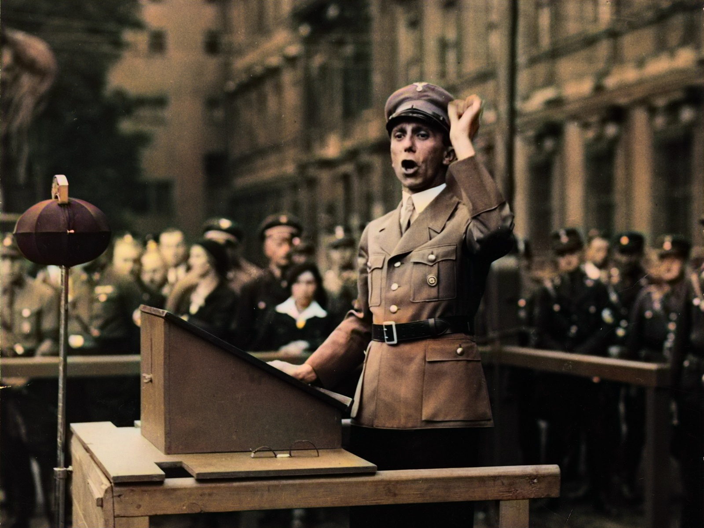
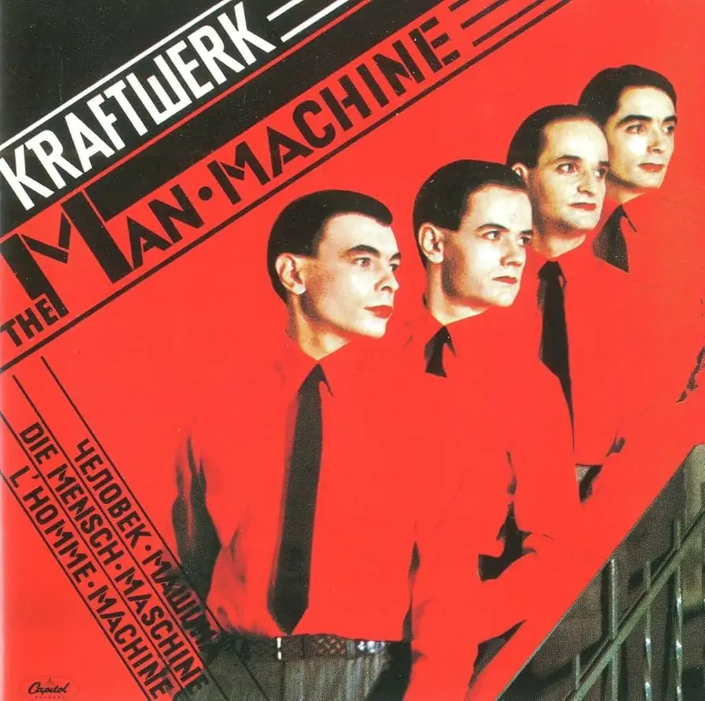

# Je ne suis pas un influenceur

Tout gamin, instinctivement, je me suis méfié des modes. Quand tout le monde s’est mis à écouter du disco, j’ai trouvé ça louche. J’ai cherché ce que je pourrais écouter que les autres n’écoutaient pas. Mon premier disque acheté a été *Man Machine* de Kraftwerk. Mon destin était tout tracé. Je m’intéresserais au marginal, au border line, au non-commercial, à l’underground, et c’est tout naturellement que je suis devenu codeur et scénariste de jeu de rôle.

Quand j’ai commencé à écrire, je n’ai pas réussi à inverser cette attitude. J’ai appris par imitation, mais imitation des auteurs dits classiques, souvent difficiles pour les non-initiés, et j’ai continué dans cette direction, attaché à définir ce que pourrait être « classique » pour notre époque : j’ai cherché ce que je pourrais dire qui intéresserait quelques-uns de mes contemporains avec une chance d’intéresser les générations futures. Un projet dingue, démesuré, mais aucun autre ne me paraissait intéressant. J’étais heureux du moment que j’avais du temps pour m’abandonner à cette lubie.

Et puis internet arrive, et j’y cours, j’y bricole, je commence à y publier des textes dès 1996, puis ça devient une habitude quotidienne à partir de 2005. Alors que j’écris *Le Cinquième pouvoir* en 2006, je me retrouve classé dans les influenceurs politiques. On croit que nous sommes capables d’influencer les élections présidentielles 2007 (et nous y croyons un peu). Tous les candidats viennent à nos soirées.

Tout ça me dégoûte assez vite. Je cesse de parler de politique, je refuse les invitations médiatiques, je me replie dans mon jardin pour écrire une énième version d’*Ératosthène*. En même temps, les réseaux sociaux se multiplient, tout le monde fonce vers eux, moi aussi. Je fais la promotion de Facebook, de Twitter. Je suis au top. Ce que je dis influence. Mais encore une fois je débranche, je coupe tout, parce que cela me fait du mal et je devine que ça ne peut que faire du mal aux autres.

Silence durant six mois, et quand je reprends fin 2011, c’est à bas bruit, et depuis je suis resté à bas bruit, pendant que de nouvelles générations d’influenceurs apparaissaient, des influenceurs qui se définissent en tant que tels, sans même réfléchir à ce que ça veut dire.

Quand j’écris, je cherche à éveiller l’esprit critique, à provoquer des réactions, quitte à ce qu’elles soient de rejet. Je ne veux pas influencer, mais libérer. Je ne veux pas vous dire ce que vous devez faire, mais je vous implore de faire ce qui est bon pour vous et pour nul autre.

Un influenceur est un briseur d’originalité, un hypnotiseur, un manipulateur, un publiciste qui se cache pour être plus efficace. Que notre société accepte que des gens se définissent eux-mêmes influenceurs est assez dramatique (dans un autre domaine, plus politique et plus feutré, on les appelle lobbyistes). Leur métier : nous détourner de ce que nous dicte notre raison, nous ramener vers un fleuve qu’ils souhaitent le plus grand possible, alors que les artistes et les intellectuels nous ont toujours poussés vers nos ruisseaux personnels.

Je ne veux ni être influencé ni influencer personne. Même avec mes enfants je me garde de leur dire ce qu’ils doivent faire pour réussir leur vie (bon, je leur répète à longueur de journée que passer des heures sur Overcraft a peu de chance de les aider à creuser leur chemin). Mais leur route ne sera pas la mienne et j’espère qu’elle ne sera tracée par aucun influenceur à la con.

Je ne veux influencer personne.

Personne ne devrait avoir envie d’influencer quiconque.

Au contraire, nous devrions nous arrêter, réfléchir, dès que quelqu’un fait ce que nous lui avons dit de faire ou nous imite, même si nos neurones miroirs tentent de reproduire en nous les processus des personnes avec qui nous interagissons.

Si je fais ce qu’on me dit de faire, je renonce à une partie de ma liberté. Si j’achète le même produit que les autres, je suis une copie, je ne suis plus un humain un et irréductible. Cette idée de moi en tant que clone m’a toujours dégoûté.

Bien sûr je suis traversé d’influences, bien sûr je vous influence quand vous me lisez, mais j’espère que vous cueillez des fruits à beaucoup d’autres arbres pour vous concocter un cocktail qui ne vaut que pour vous.

Vous pouvez prendre une idée que je vous balance, en rejeter dix, c’est comme ça qu’on fait son marché. On ne va pas tous s’agglutiner en une longue file d’attente pour acheter les mêmes tomates au prétexte qu’elles seraient les meilleures. Les files d’attente me dépriment, elles m’inquiètent même. Avez-vous envie d’être un de ceux dans la longue file comme si vous étiez enchaînés, ce que de fait sont tous ceux qui s’y trouvent sans même le savoir, d’autant plus prisonniers qu’ils ignorent l’être et se croient malins ?

C’est le tour de force des influenceurs : nous faire croire que nous sommes originaux alors que nous faisons comme tous les autres. C’est le syndrome du fumeur qui se croit émancipé avec sa cigarette au bec alors qu’il est l’esclave des cigarettiers. Les libres sont ceux qui ne fument pas, pas ceux qui obéissent aux injonctions marchandes.

J’ai traversé Paris à vélo à la mi-juillet, j’ai aussi voyagé en train, et j’ai vu un nombre invraissemblable de jeunes femmes en mini-jupe portant des bottes. À la première, je me suis dit qu’elle avait du chien, une belle allure. Puis à la deuxième, je me suis dit celle-là aussi sait se faire remarquer. Puis, à la troisième, j’ai commencé à froncer les sourcils. À la dixième, je me suis mis à les plaindre. Comment peut-on se sentir bien en imitant les autres et répondant aux injonctions des modes ?

C’est au-delà de mon entendement. Je comprends le désir d’imitation qui nous anime dans la jeunesse, mécanisme d’apprentissage et aussi d’intégration sociale, mais après il est plus que temps de s’émanciper. Toutes les jeunes femmes que je voyais avaient pour moi dépassé l’âge de l’émancipation. Elles me provoquaient de la pitié plus que du désir. 

Je vis avec une ancienne responsable marketing internationale, qui a passé une partie de sa vie à influencer les autres à grande échelle, qui a fini par être dégoûtée de son métier. Il ne lui apportait aucune satisfaction à part un gros salaire. Tous les jours elle se répétait la même question et y répondait de la même façon. « Qu’ai-je fait d’utile pour la société ? Rien. » Elle a démissionné avant de devenir dingue.

Alors oui, influençons-nous avec douceur, conseillons-nous des livres, des films, des musiques, des articles, des idées de sorties ou de voyages, mais gardons-nous d’utiliser les technologies numériques propagandistes pour démultiplier notre influence et la transformer en injonction de masse. Pratiquons l’influence douce, au détour de nos conversations, ne faisons pas profession de la manipulation. Toujours méfions-nous des modes et de leurs apôtres.

J’ai la sensation que notre époque a besoin de discrétion. De silence. Je me suis [retiré de tous les réseaux sociaux il y a quelques mois](https://tcrouzet.com/2025/03/19/quitter-facebook/). Je ne suis plus que sur Mastodon où j’ai même décidé de ne plus annoncer mes articles. J’écris, mais je ne veux plus faire la promotion de mes écrits. Je publie sur mon blog, sur ma newsletter. Que ceux que ça intéresse tombent sur moi par hasard et s’abonnent. Je n’ai pas besoin de crier que j’existe et d’envoyer des signaux de fumée pour attirer l’attention. Le fait que j’écrive, que j’en sois là de ce texte, me prouve que j’existe, je n’ai besoin de rien d’autre pour m’en persuader.

Si demain des centaines d’influenceurs fermaient leurs comptes à cause de moi, j’en serais plus triste qu’heureux parce que je les aurais influencés. J’espère plutôt que par eux-mêmes ils prendront conscience de l’horrible profession qu’ils pratiquent. Un jour ils finiront par se demander ce qu’ils apportent aux autres et alors j’espère qu’ils changeront de voie.

Mais ils ne sont pas les plus fautifs, nous sommes les fautifs en premier lieu, parce que nous leur avons donné de l’importance. Nous en sommes arrivés à ce point paradoxal où plus aucune parole sur internet n’est crédible à cause des plateformes qui mécaniquement fabriquent des influenceurs, en premier lieu pour leur propre promotion, la promotion de produits annexes n’étant qu’un effet collatéral de peu de poids.

Je publie sur mon blog pour éviter ce piège. Je fuis les plateformes parce que malgré moi j’y effectue du travail gratuit pour les milliardaires de la tech. Facebook, YouTube, TikTok, X… ne sont que des machines à fabriquer des influenceurs pour leur propre promotion. Elles créent des esclaves esclavagistes. Un comble ! Et désormais des IA deviennent esclavagistes. Tout n’est plus que manipulation à grande échelle, de quoi faire honte à Joseph Goebbels, le ministre de la Propagande du Troisième Reich.

Il est juste invraisemblable de continuer à utiliser des plateformes alors que nous savons qu’elles sont collectivement nocives (et même si on y trouve des contenus de qualité, la masse nauséabonde les noie de plus en plus et ça sera de pire en pire avec de plus en plus de contenus générés par IA).

« Je ne peux pas faire autrement, c’est mon gagne-pain » n’est pas une excuse.

« Je ne peux pas faire autrement, j’ai bâti une audience » n’est pas une excuse.

Rien que la tentation de devenir influenceur est criminelle parce qu’elle entretient une logique de propagande commerciale à grande échelle. Chercher à recruter de nouveaux lecteurs me paraît désormais suspect. Veut-il lui aussi devenir influenceur ?

Tous les influenceurs collaborent à la promotion des plateformes et à leur transformation en empire financier.

Je ne vois qu’une solution. Ne pas se taire, au contraire, mais parler depuis chez soi, laisser les gens venir à soi par l’effet de doux murmures.

Ne pas se laisser décourager par les difficultés techniques.

Aller vers la facilité technique, c’est faire le jeu d’une forme d’impérialisme qui finira par se retourner contre nous tous.

#netculture #y2025 #2025-8-8-10h00
