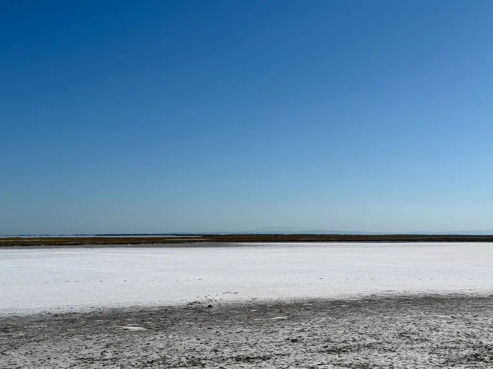
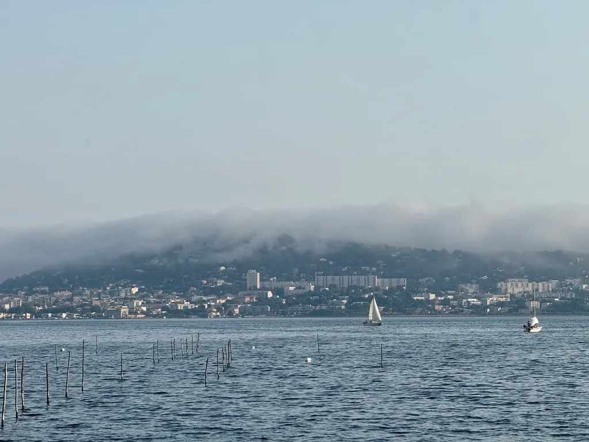

# Août 2025

### Vendredi 1er, Balaruc

Isa me dit qu’au prochain rendez-vous avec l’oncologue elle lui demandera son pronostic vital. Moi : « Tu pourrais poser la question à ChatGPT » Elle : « Tu peux le faire pour moi, je n’ai pas envie d’entendre la réponse d’une machine. » Nous avons attendu plus d’un an avant de nous poser cette question (et de la poser).

---

Une amie publiée par une des plus célèbres éditrices parisiennes me dit : « ChatGPT est meilleur qu’elle. » Et on discute, on discute, parce qu’on ne discute jamais autant avec nos éditeurs, et on partage nos projets. Une idée me vient : demander aux IA de réécrire un de mes livres dans une version très grand public. Pourquoi pas *Mon père ce tueur* ? Mon amie : « Tu vois, j’ai joué le rôle d’une IA. Je t’ai fait accoucher d’une idée. C’est rassurant. On sert encore à quelque chose. »

---

Isa vient de passer deux heures à regarder le ciel, ce qu’elle ne s’autorisait jamais avant. La maladie ordonne de vivre, ce qu’on oublie trop souvent de faire.

### Samedi 2, Balaruc

Je croyais avoir tout lu de Nicolas Bouvier, et à cause d’une recherche sur sa maison de Coligny et sa chambre rouge, j’ai ouvert ses œuvres complètes, sous blister dans notre bibliothèque depuis vingt ans, et j’y découvre *Routes et déroutes*, un long entretien donné à la fin de sa vie. Je découvre un Bouvier grand bourgeois, qui a vu défiler chez ses parents l’intelligentsia européenne de Thomas Mann à Hermann Hesse. Je croyais que je lui ressemblais, mais pas du tout. Nous ne venons pas du même monde. Je suis socialement du côté de Camus, d’un milieu dont finalement je ne me suis jamais extrait. Je n’ai rien du transfuge de classe.

---

L’âge me pousse à accepter un destin anecdotique, à être l’artisan d’un art secondaire dont les derniers émissaires se parent de bijoux trop voyants. Je me range désormais au rang des poètes dont plus personne ne chante les vers. Et je relis quelques chapitres d’*Ératosthène*, oubliés depuis plus de dix ans, et je ne m’en trouve pas mécontent. Ce texte est touffu, débordant, exubérant, comme quand je l’écrivais. Je le relis parce qu’un lecteur me dit y prendre du plaisir.

### Dimanche 3, Balaruc

Quand j’étais jeune, je passais des heures en terrasse de café à regarder les gens. Les autres me fascinaient. Parfois un visage, une démarche, une dégaine m’intriguait ou m’interrogeait ou éveillait un désir diffus, jamais assez impératif pour que je me lève et aborde la personne. Pourtant je continuais de regarder la foule des anonymes jusqu’à ce que des silhouettes s’en détachent, mais j’ai perdu cette habitude, ne sais trop pourquoi. Peut-être parce que j’ai trop de choses en tête, trop de choses à faire, ou parce que j’ai fini par être moi-même et ne cherche plus dans les autres ce que je pourrais être, ou parce que je suis moins curieux. Et j’ai perdu le goût de la ville, parce que j’y pratiquais en premier lieu le jeu de l’observation des autres. Elle ne reste plus qu’une architecture, ce qui est déjà beaucoup, mais pas toujours suffisant.

### Lundi 4, Balaruc

Bouvier : « Si vous lisez avant \[de voyager], vous bloquez votre imaginaire sur les schémas d’une attente trop précise. » De même avant d’écrire. Je préfère dire tout ce qui me vient sur notre maison et après je m’intéresserai à ce que d’autres ont pu dire sur leur maison. D’abord la phase créative.

### Mercredi 6, Balaruc

Avec mon histoire de maison, j’ai commencé à écrire un livre que personne n’aura envie de lire sauf moi. Je m’étais dit la même chose avec *Mon père ce tueur*. Finalement nous devrions écrire que pour nous à l’exclusion de tout autre, à cette seule condition on peut aller au bout de soi et de ses déséquilibres. Il ne me reste plus que moi comme sujet.

### Jeudi 7, Balaruc

### Vendredi 8, Balaruc

Je dors dans le canapé-lit du bureau d’Isa, parce que je peux ouvrir grand les deux baies vitrées, l’une sur l’étang, l’autre sur le jardin, ce qui me garantit de la fraîcheur même par canicule. Je m’éveille avec les premières lueurs du jour. Impossible de me rendormir, je saisis mes lunettes, les mets, et ma vision est brouillée. Je retire mes lunettes pour les nettoyer et découvre qu’elles sont couvertes de fourmis. Il y a partout des fourmis autour de moi dans le lit. Je passe un bon moment à poudrer les environs de la maison, sachant que c’est inutile, nous habitons une colonie géante de ces épouvantables bestioles.

### Samedi 9, Balaruc

[Barenholtz](https://elanbarenholtz.substack.com/p/syntax-is-dead-long-live-syntax) : « Grammar is not a generative system inside the mind. It is a pattern in the data that molds the generative mind. » Nous entrons dans une nouvelle ère interprétative, qui s’apprête à reléguer toute forme d’idéalisme dans le passé : nous n’imaginons plus des logiques préalablement encodées en nous, comme la géométrie (Kant) ou la grammaire (Chomsky), mais nous les voyons comme une conséquence de l’apprentissage du monde, comme corrélation entre les données brutes.

Parce qu’il est plus optimal d’utiliser des mots de liaison, notre cerveau les favorise par simple principe d’économie et ainsi la grammaire est une conséquence du processus d’apprentissage, et non le mécanisme qui rend possible le langage. Apprendre la grammaire est une absurdité. Il suffit de lire et de parler pour que notre cerveau devienne grammaticalement correct. On fait perdre du temps aux enfants depuis trop longtemps.

Mes premiers textes étaient écrits avec les pieds, puis à force d’écrire et de lire j’ai réussi à écrire, même des phrases longues et parfois élaborées, sans même y penser. Une fois mon réseau de neurones entraîné, il a produit des résultats surprenants sans que je sache si j’ajoute des COD ou d’autres choses à mes phrases. Je serais bien incapable de les analyser en termes grammaticaux.

Notre nouvelle grille interprétative : correlation world view.

La vraie question me concernant : pourquoi je me suis mis à écrire alors que mon cerveau savait mal le faire quand j’étais jeune. Pourquoi sa puissance générative s’est-elle mise en branle ? Je suis toujours surpris par ce que j’arrive à produire. La surprise ne dure jamais longtemps, mais le processus de voir jaillir les mots m’émerveille, si bien que parfois j’écris que pour m’émerveiller. C’est de l’ordre de la jouissance. Flaubert parlait de l’écriture comme éjaculation, mais c’est bien plus fort, bien plus durable, bien plus excitant ce que notre cerveau arrive à faire (il paraît que le plaisir sexuel se joue dans le cerveau pour en grande partie).

J’imagine même devenir de moins en moins intelligent, mais continuer à écrire jusque dans la folie, jusque dans la sénilité, parce que la mécanique sera si gravée en moi qu’elle se prolongera par-devers toute forme de volonté et même de conscience. Je terminerai ma vie, très très vieux, en tant que LLM.

---

Se ficher de ce qui plaît maintenant (parce que la solution est déjà trouvée) pour tenter d’imaginer ce qui plaira demain, et après-demain, et ne se démodera pas. C’était l’ambition des artistes, c’est devenu un délire de quelques malades mentaux.

### Dimanche 10, Balaruc

J’écris un livre et dans la nuit le début d’un autre me vient, assez prégnant pour que je me souvienne des premières phrases et les note au réveil.

---

Une femme écrit : « Trois romans m’ont fait tomber amoureuse de leur auteur. » Je doute qu’une femme soit un jour tombée amoureuse de moi en me lisant (ça serait un peu inquiétant). Pour moi l’amour commence par une histoire d’odeur. 

----

Bouvier, *Routes et Déroutes* : « On ne peut payer un texte juste qu’avec du sang et on n’en a que quatre litres et demi. C’est pourquoi, lorsque j’en ai terminé un, grand ou petit, je ne peux jamais savoir si ce ne sera pas le dernier. Ça me paraît inconcevable de me remettre de suite à cette varappe désespérante, où finalement mes seules armes sont mes insuffisances. Mais quand on a vraiment tiré sur la corde jusqu’à s’en blesser les mains, il y a des moments où, par extrême fatigue, les choses auxquelles on pensait font littéralement irruption. Elles vous traversent avec leurs couleurs. Là, on écrit à toute allure et on sait que chaque mot est juste. Mais ça, c’est donné. C’est dans la nature des choses que cette perception du monde s’obtienne d’ordinaire au prix d’un énorme travail. Quelquefois, il y a des moments bénis — trop rares — où on est envahi sans avoir fait cette ascèse préparatoire. L’écriture est pour moi un exercice extrêmement ascétique, même si je me soutiens parfois avec des dopants comme l’alcool ou des comprimés qui désinhibent. »

---

Un abonné m’envoie ce message : « Trop d’analyse intellectuelle tue et rend insensible à la mort d’autrui » Je réponds : « Ma femme a un cancer, alors je me passe volontiers de ce genre de conneries. » Il s’excuse platement, mais c’est trop tard. Comme si être intellectuel demandait un effort à un intellectuel ? C’est moins compliqué que courir un marathon pour un marathonien. Je pense comme je respire.

### Mardi 12, Balaruc

Bouvier : « C’est un projet très immodeste de vouloir rendre compte des choses. Il y a une telle disproportion entre cette ambition et les moyens dont on dispose qu’il faut payer de sa personne jusqu’au moment où le sol se dérobe. »

### Mercredi 13, Balaruc

Mon officine numérique ressemble de plus en plus à une boutique obscure. J’ai viré les spots criards qui illuminaient la devanture. C’est un retour aux sources. Dans les villes, je suis attiré par les recoins plutôt que par les grandes places bondées, par les ruelles où se cachent de petites échoppes discrètes, par les cafés déglingués où les clients pourraient être des amis. Mais pourquoi, sur le net pendant vingt ans, j’ai tenté de nager dans la foule ? Ce n’est pas ma place. Je n’y ai jamais trouvé ce que j’aime. Je suis un habitant des bordures du monde.

---

[J’ai adoré cette vidéo de la destruction d’un imposteur.](https://www.youtube.com/watch?v=e5kDHL-nnh4&t=3292s&ab_channel=MonsieurPhi) Moi qui m’intéresse à l’IA depuis toujours je n’avais jamais croisé son chemin, sans doute parce que je ne m’informe pas grâce aux grands médias. Plus que de descendre une marionnette, cette vidéo dit l’état de déliquescence du monde médiatique et politique. C’est franchement inquiétant quant à l’état de la démocratie.

### Jeudi 14, Balaruc

Un mois que j’écris sur la maison, projet *La Zone*. Le texte sort du bout de mes doigts plus que de moi-même. Il me demande beaucoup de travail, beaucoup de souffrances mémorielles. En même temps, il arrive assez vite, dans la chaleur créative que j’affectionne. Ce texte ne sera pas imposant, un discret éloge de notre maison, de la fabrication d’un chez-soi.

### Vendredi 15, Balaruc

Bouvier : « Je pourrais consacrer ma vie aux visages des autres. » Voilà qui ne m’a jamais intéressé : regarder l’autre dans les yeux m’est toujours apparu comme une intrusion insupportable. J’ai peur des autres. Je n’ai pas envie de savoir ce qu’ils pensent. Sensation qu’en plongeant en eux je me dissoudrais. Un véritable exercice, éventuellement thérapeutique, serait pour moi de photographier des visages. Mais ça exigerait une connivence, une acceptation, un modèle volontaire. Je peux voler des photos, plus difficilement jouer avec des regards conscients d’être regardés.

### Mardi 19, Balaruc

Visite oncologue, pas vraiment de bonnes nouvelles. Le combat d’Isa continue. Au programme : une immunothérapie.

---

[J’aurais aimé que les IA réussissent à réécrire mes romans](https://tcrouzet.com/2025/08/19/des-limites-des-LMM/), ce qui m’aurait poussé à plus de radicalité. Leurs incapacités narratives ne décourageront personne d’écrire des livres médiocres (pas même moi).

### Mercredi 20, Balaruc

Michaux : « D’autres, par contre, envient les écrivains. Mais ils ont tort et grandement. Ceux qui ont écrit, c’est que ça les contentait. » Détestable envie, détestable sentiment. Désirer être, aspirer à, oui, bien sûr, mais envier, c’est comme être jaloux, vouloir déposséder l’autre de ce qu’il a. Même Isa n’envie pas la santé des autres, elle la désire pour elle aussi, elle l’espère sans vouloir en déposséder personne. Mais il y a des trafics d’organes. Des Faust qui pactisent avec le diable. Nous sommes tous traîtres à notre espèce parce que notre mode de vie est nocif pour d’autres, et pour nos successeurs. Être coupable sans le savoir, ou faire croire de ne pas savoir, c’est pire que d’envier. J’écris tout ça pour me réveiller, me mettre en branle, donner un peu de lumière dans ma cambuse intérieure.

### Jeudi 21, Balaruc

Dix ans aujourd’hui que j’ai décidé de rendre public mon carnet. Sans doute ma décision littéraire la plus importante. Parce que le carnet a toujours été ma forme et qu’il me donne une liberté extraordinaire. Reste l’immense chantier de publier tout ce qui précède août 2015.

### Vendredi 22, Balaruc

Les producteurs de vins et spiritueux furieux parce que les US taxent leur production. Je n’entends qu’eux à la radio. Mais bordel vous êtes des producteurs de drogues. Si ça ne tenait qu’à moi, vous seriez encore plus taxés, vous ne recevriez aucune aide, pas plus que les producteurs de tabac ou de cocaïne. Faudrait tout de même remettre les choses à leur place. Vous ne travaillez pas pour nourrir l’humanité, au mieux vous adoucissez nos maux (pas les miens), souvent vous nous abrutissez et êtes la cause indirecte de bien des drames. La décence commune voudrait que vous fermiez vos gueules.

---

Quand j’écris une fiction, j’éprouve souvent de la joie pure au moment d’effectuer une découverte narrative, ce qui n’arrive jamais quand j’écris un récit comme *La Zone*, le plaisir vient quand je saisis un instant, un tout autre sentiment, non pas de la découverte mais de la perception. C’est paradoxalement beaucoup plus exigeant puisque je n’invente pas.

---

J’arrive à la caisse de l’épicerie bio. Devant moi, le caissier demande à la cliente : « Vous avez une carte de fidélité ? » Elle : « Oui ». Caissier : « Votre nom ? » Elle : « Bio. »

### Samedi 23, Balaruc

Neal Stephenson : [dite plutôt que montrer](https://nealstephenson.substack.com/p/say-it-dont-show-it). Je suis d’accord. Ces romanciers qui prennent des pages pour dire qu’un personnage a la trouille plutôt que nous le dire en trois mots me fatiguent. Il me semble que dans *La Femme de ménage*, c’est justement ça l’astuce. Dire brutalement, sans enflure, avancer. Point. Ce texte est un manifeste littéraire.

### Dimanche 24, Balaruc

Quand j’étais jeune, j’ai lu beaucoup de livres sur la créativité, dans l’espoir qu’ils me rendraient plus créatif. Mais non, c’est créer qui rend créatif, qui habitue à regarder les choses de travers et de façons nouvelles. Quand nous cherchons à créer en utilisant les trucs et astuces des autres, nous nous transformons en imitateurs.

---

Bière bio, vin bio, tout ça me paraît antinomique. Quand Isa me dit d’acheter des bières pour des amis, je ne les prends pas bio. Un poison, bio ou pas, reste un poison. Je n’empêche personne de boire, mais faut pas se donner bonne conscience en collant partout le mot bio.

### Mardi 26, Avignon

### Jeudi 28, Balaruc

Je commence à soumettre *La Zone* aux IA, récit difficilement plus intime, d’autant que je le destine à mes fils et que j’entrecoupe de réflexions plus abstraites pour détendre la tension. Claude : « Tu devrais faire plus intime. » Moi : « Comment je fais plus intime ? » Claude : « Le vrai problème c’est que j’invente des problèmes. »

### Vendredi 29, Balaruc

Claude : « Je ne comprends pas ton texte, je ne saisis pas tes intentions, et je balance des conseils à côté de la plaque. » Je m’amusais beaucoup plus avec les anciennes versions des IA, parce qu’elles étaient maladroites, ce qui les rendait créatives.

### Samedi 30, Balaruc

J’ai trouvé un livre qui parle de chez soi, intitulé *Chez soi*, une sorte de fourre-tout comme une maison, où Noma Chollet parle d’elle mais pas assez, où elle empile les citations, ce qui déjà n’a plus de sens avec les IA capables d’en produire à l’infini (le livre date de 2014 — mais beaucoup de livres à citations paraissent désormais artificiels), puis elle revient à elle et je n’arrive pas à m’intéresser à elle (sinon que je devine que ça tourne là-haut dans sa tête et que je pourrais m’entendre avec elle). Mes « je » provoquent-ils la même réaction : un ennui face à quelqu’un qui en dit soit trop soit pas assez ? On ne peut pas parler de soi un peu. J’avais gardé *Chez soi* pour quand *La Zone* serait avancé, et bien obligé de constater que l’essai ne me stimule pas beaucoup.

---

Je vis dans une station thermale dont le slogan est le bien-être. Ce matin, 7h30, des coups de klaxon tonitruants, une véritable fanfare à l’italienne, à nous déboucher les oreilles et à faire trembler les murs. Et ça recommence, et encore durant toute la journée. Tout ça parce que la commune organise un rassemblement de camions. La connerie humaine n’a aucune limite.

### Dimanche 31, Balaruc

Arrive un moment où un livre prend forme, où ses parties se répondent, imposent leur organisation. J’en suis là avec *La Zone*. J’avais des textes et maintenant ils racontent une histoire. C’est toujours inattendu, une surprise.

#carnets #y2025 #2025-9-5-10h00
