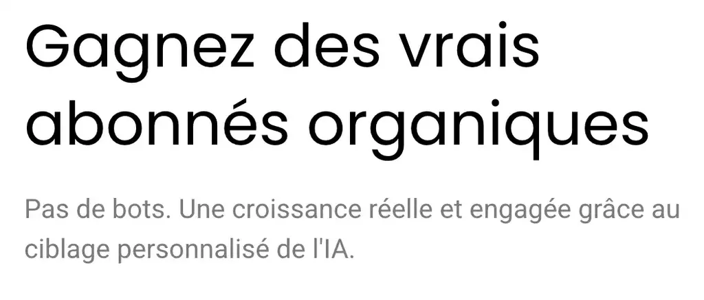
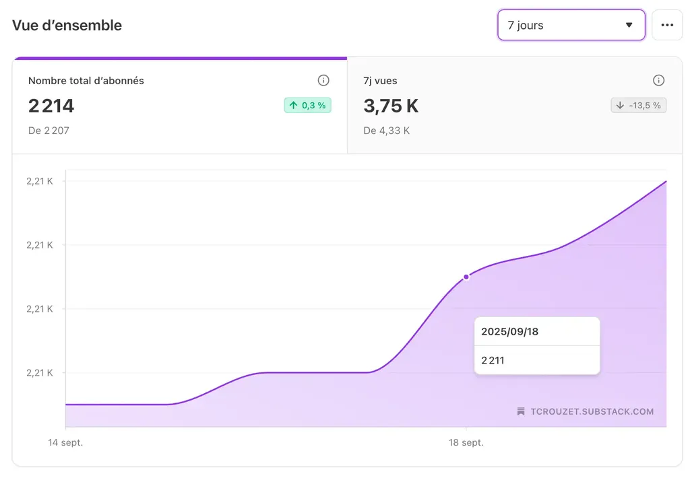
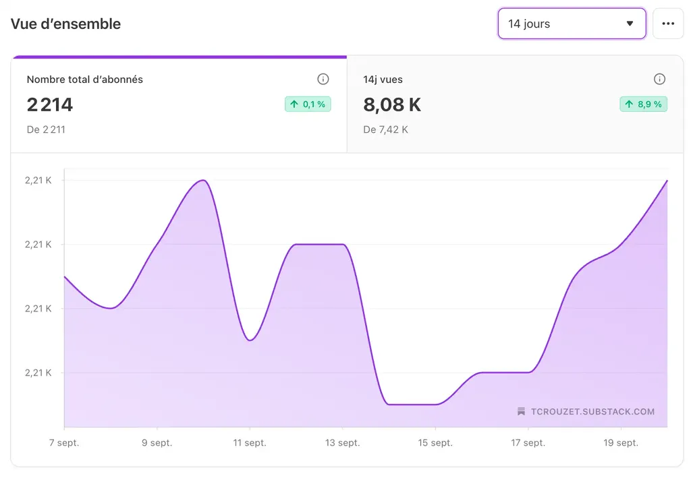
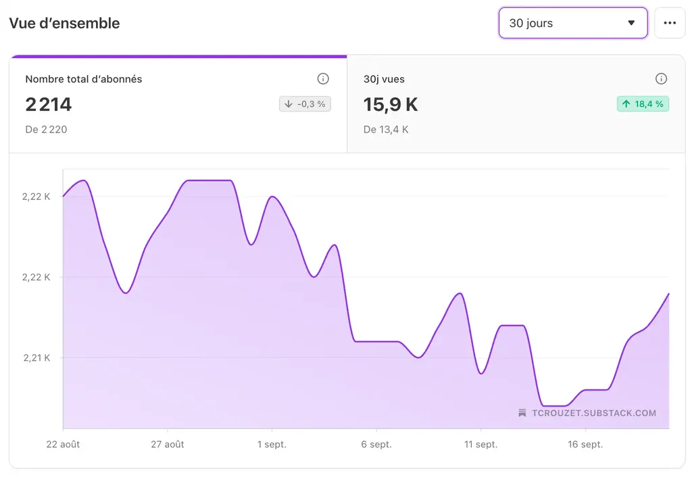

# Les charognards du net

Nous les croisons tous les jours sans le savoir, les lisons, les écoutons, les regardons, croyant qu’ils nous apprécient alors qu’ils ne s’intéressent qu’à nous compter parmi leurs adorateurs. Ils ramassent tout ce qui traîne, s’en nourrissent, prospèrent grâce à nos faiblesses. Mais qui sont-ils ? Pourquoi saccagent-ils l’internet social pour nous le rendre invivable ?

[En 2009, j’ai entrepris de débusquer les charognards sur Twitter](https://tcrouzet.com/2009/09/24/qui-a-la-plus-grosse-quequette-sur-twitter/). Leur technique était primaire (mais en rien démodé aujourd’hui) :

1. Suivre un compte dans l’espoir qu’il suive en retour (puisque généralement les utilisateurs reçoivent une alerte lors d’un nouvel abonnement).
2. Si pas de retour au bout de quelques heures ou jours, ne plus le suivre.
3. Finir par supprimer même ceux qui suivent en retour de façon que le ratio entre comptes suivis et followers ne tende pas vers 1 (ce qui est louche quand on est très suivi — suivre des milliers de comptes étant humainement impossible).

À l’époque, Twitter disposait d’une API publique. Il était facile d’automatiser la procédure avec quelques lignes de code. Depuis, c’est plus compliqué, mais de petits malins ont créé des services payants pour acheter des followers sur les réseaux sociaux. Pas difficile de les trouver sur Google avec des requêtes du type « Win social followers ». La plupart des influenceurs en carton utilisent ces outils et font croire aux marques qu’ils ont de l’influence. Quand cesseront-elles de leur envoyer des produits gratuits ? À quand l’atterrissage ?

Les algorithmes de recrutement de followers sont de plus en plus sophistiqués, dopés à l’IA. Nous sommes ciblés dès que nous avons des comptes sociaux, aucun service n’étant immunisé contre le maraudage.

Si [mon compte Mastodon](https://mamot.fr/@tcrouzet) semble échapper à cet hameçonnage social, parce que Mastodon n’est pas populaire, il n’en va pas de même de mon compte Substack.

Quand je regarde mes statistiques à sept jours de ma newsletter principale, j’observe une lente croissance de mon nombre d’abonnés.

Mais dès que je dézoome, je constate que mon nombre d’abonnés fait des vagues. C’est un phénomène classique avec les newsletters : lors de l’envoi d’un numéro, une perte d’abonnés s’ensuit, parce que des lecteurs finissent par se fatiguer.

Longtemps je me suis arrêté à cette explication, puis j’ai constaté trois choses :

1. Quand j’hébergeais ma newsletter sur Mailchimp, un service d’envoi non social, il n’y avait quasiment pas de vague, mais une lente croissance.
2. Cet été durant mon bikepacking en Bretagne, le nombre d’abonnés a continué de moutonner alors que je ne publiais pas d’article.
3. De nouveaux abonnés n’ouvrent aucune de mes newsletters et se désabonnent très vite.

Trois symptômes qui m’ont fait penser que des charognards hantaient Substacks, ce qui est logique puisque disposer d’une newsletter avec des milliers d’abonnés est devenu le must du moment. On s’abonne dans l’espoir de recevoir un abonnement en retour. Cela dit je n’ai trouvé aucun service public pour doper le nombre d’abonnés Substack, mais rien n’empêche les charognards de travailler à la main ou avec des scripts Python générés par des IA.

Comme je l’ai constaté dans [mon article sur la nécessité de réinventer les réseaux humains](https://tcrouzet.com/2025/09/19/human-networks/), deux phénomènes cohabitent :

1. Les charognards ratissent des followers (nous sommes leur cible).
2. Les plateformes ne font pas grand-chose pour les combattre.

Mais pourquoi ce genre de comportement de part et d’autre ? J’ai ma petite idée. Nous construisons une société qui repose en grande partie sur des mesures quantitatives et une induction foireuse :

>Plus tu scores haut => plus tu produis des contenus de qualité.

C’est comme s’il y avait un lien entre la grandeur des oreilles et la capacité d’écoute, entre la pointure des chaussures et le talent culinaire, entre la taille du sexe et le QI. Il n’y a probablement aucun lien mais nous restons attachés à des valeurs quantitatives grossières.

1. Les charognards dévorent tout ce qui traîne pour améliorer leurs scores.
2. Les plateformes entretiennent la compétition entre eux, mettant en évidence les scores.
3. Les observateurs se satisfont des scores pour décider qui fait la pluie et le beau temps dans notre monde.
4. Nous-mêmes, souvent, ne faisons pas davantage d’effort.

Ce biais quantitatif et compétitif est destructeur de valeur (et d’environnement). Sans virage vers le qualitatif, les charognards continueront leurs maraudes et achèveront de transformer le net en un espace de fausses réputations, un grand mensonge planétaire, nous précipitant dans un factice généralisé. Je connais ces mécanismes depuis longtemps, mais désormais ils m’encolèrent : chaque fois que je me sens visé, comme sur Substack, j’ai l’impression d’être agressé par des escrocs.

Quand nous trouvons une information sur le net, le plus souvent ce n’est pas par hasard mais parce que nous avons été manipulés par les charognards ou les algorithmes. Même quand nos amis nous conseillent, il y a un risque non négligeable qu’eux-mêmes aient été manipulés. Conséquence : nous risquons de ne plus faire confiance à personne si nous ne remettons pas de l’humain dans les rouages sociaux, ainsi qu’une overdose d’esprit critique chaque fois qu’une information nouvelle nous arrive.

Mais pourquoi les plateformes sociales n’agissent-elles pas ? Dans [*Swipe*](https://fr.wikipedia.org/wiki/Swipe), qui raconte la vie de Whitney Wolfe et le lancement de Tinder, on découvre le manque chronique d’éthique des promoteurs de la tech. Obsédés par les scores, ils en oublient les dommages collatéraux, prisonniers de visions à court terme.

Mais existe-t-il des moyens techniques d’empêcher le maraudage ? Par exemple, Substack pourrait repérer les utilisateurs qui s’abonnent sans jamais lire puis se désabonnent. Mais si cette mesure était adoptée, les charognards utiliseraient des robots pour faussement lire des articles. Le problème : toute socialisation numérique peut être simulée. Il suffit de prendre le contrôle d’un navigateur web et d’imiter les comportements humains, ce qui est de plus en plus facile avec les IA. Voilà pourquoi je ne crois plus guère à la socialisation numérique ouverte, publique, aux yeux de tous.

Espérer de l’éthique de la part des charognards est peine perdue dans un monde où priment les quantités. Une solution possible : que les plateformes mettent en avant des qualités plutôt que des quantités. Par exemple, plutôt que le nombre d’abonnés des utilisateurs Substack pourrait afficher leur temps de lecture (je dis bien temps de lecture et pas taux d’ouverture des mails ou articles). C’est toujours une approche quantitative, mais plus instructive. Il reste à inventer une façon d’évaluer les qualités, sans laquelle le règne des charognards n’est pas près de cesser.

Est-ce possible ? Aujourd’hui, très souvent, les IA apprécient mieux les textes produits par d’autres IA que les textes humains, démontrant s’il le fallait que les qualités sont davantage subjectives qu’objectives. Mais cette difficulté de manipuler les qualités n’est pas une raison pour en rester aux quantités sujettes à toute sorte de manipulation.

Que faire à notre échelle ? Être averti est déjà pas si mal, ce qui entraîne la vigilance. [Quand je partage mes lectures de la semaine](https://tcrouzet.com/tag/digest/), j’espère ne pas être un propagateur d’intoxication. La mesure la plus radicale : se tenir à distance des lieux qui mettent en avant les quantités, à commencer par les réseaux sociaux. Le drame : même Mastodon joue le jeu des quantités. Un réseau qui ne le ferait pas n’aurait aucun succès dans un monde piloté par les quantités. Nous avons besoin d’un changement de paradigme. Si nous continuons à privilégier les quantités, des malades mentaux continueront de prendre le pouvoir, au prétexte qu’ils ont le plus de partisans.

Ça pose la question de nos modèles démocratiques qui reposent sur la majorité (celui qui a la plus grosse) plutôt que sur les compromis (ceux qui réussissent à discuter). Les scrutins majoritaires sont coupables en premier lieu. Ils instaurent la règle que toute la société suit, dès les élections locales, une élection étant un système de sélection quantitatif. Quel chantier ! Qui me pousse à m’interroger sur mes pratiques, à mon modèle de diffusion et d’interaction avec vous…

#netculture #y2025 #2025-9-23-10h00
