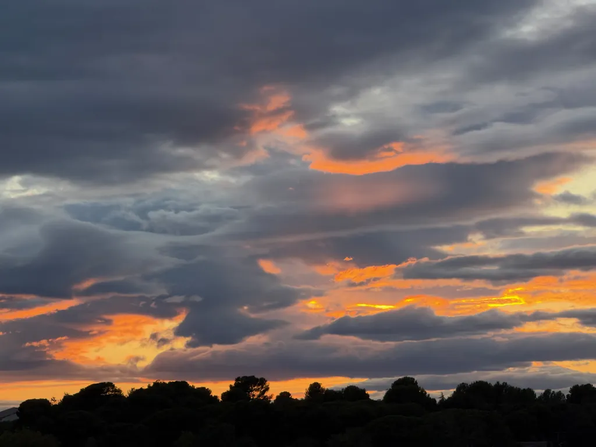

# De ma terrasse #27

_Ma sélection du dimanche : **17** liens et une photo prise depuis ma terrasse._

## Intelligence artificielle

[Comment l’IA est en train de tuer le web sous nos yeux](https://korben.info/prophetie-matthew-prince-ia-tuer-web.html) • FR • 12 min  
Matthew Prince, PDG de Cloudflare, alerte sur l’effondrement du modèle économique du web. Avec l’IA, le ratio pages crawlées/visiteurs envoyés s’effondre : ChatGPT aspire 1500 pages pour renvoyer 1 visiteur, Anthropic 60 000 pour 1. Les créateurs de contenu perdent leur source de revenus tandis que l’IA digère gratuitement leur travail.

[Livres piratés : Anthropic propose 1,5 milliard $ pour sauver son IA](https://actualitte.com/article/125988/legislation/livres-pirates-anthropic-propose-1-5-milliard-pour-sauver-son-ia) • FR • 8 min  
Anthropic accepte de verser 1,5 milliard de dollars pour clore une action collective l’accusant d’avoir utilisé 7 millions de livres piratés pour entraîner Claude. Chaque auteur concerné recevra environ 3 000 dollars. Un précédent historique qui pourrait redéfinir les règles du secteur.

[J’ai créé ma propre équipe médicale IA. Cela a changé la façon dont les médecins traitent mon cancer](https://www.statnews.com/2025/09/10/ai-cancer-treatment-custom-doctors-response/?utm_campaign=rss) • EN • 10 min  
Steve Brown raconte comment il a créé une équipe d’agents IA médicaux pour analyser son cancer du sang. Son IA "Haley" a identifié des signes que ses médecins avaient manqués, permettant un diagnostic précoce et un traitement personnalisé plus efficace que le protocole standard.

[L’homme qui a proposé la théorie de la simulation a un avertissement terrible](https://futurism.com/simulation-theory-ai-warning?utm_source=flipboard&utm_content=other) • EN • 7 min  
Nick Bostrom, créateur de la théorie de simulation, met en garde contre l’arrivée de l’AGI. Il identifie quatre défis majeurs : l’alignement IA-humains, la gouvernance, le statut moral des esprits numériques et les conflits entre superintelligences. La finalité : "le chômage complet" dans un monde post-travail.

## Climat et environnement

[L’action contre le changement climatique fait face à une nouvelle menace : les pessimistes qui pensent qu’il est trop tard pour agir](https://www.livescience.com/planet-earth/climate-change/action-on-climate-change-faces-new-threat-the-doomers-who-think-its-too-late-to-act) • EN • 9 min  
Michael Mann et Peter Hotez analysent la montée du "doomisme climatique", cette nouvelle forme de déni qui prétend qu’il est trop tard pour agir. Ces messages pessimistes, amplifiés par les réseaux sociaux, divisent les militants climatiques et servent paradoxalement les intérêts des pollueurs en décourageant l’action collective.

[Les derniers glaciers stables fondent](https://www.404media.co/they-were-some-of-earths-last-stable-glaciers-now-theyre-melting/) • EN • 6 min  
Les glaciers du "Troisième Pôle" d’Asie centrale, mystérieusement résistants au réchauffement, franchissent un point de basculement. L’anomalie Pamir-Karakoram prend fin : la diminution des chutes de neige depuis 2018 rend ces glaciers vulnérables à la fonte estivale, menaçant l’approvisionnement en eau de millions de personnes.

## Espace et astronomie

[La NASA a trouvé des signes d’ancienne vie extraterrestre sur Mars](https://www.cnet.com/science/space/nasa-found-signs-of-ancient-alien-life-on-mars-heres-how-excited-you-should-be/#ftag=CAD590a51e) • EN • 5 min  
Le rover Perseverance découvre des biosignatures potentielles dans un échantillon nommé Sapphire Canyon, provenant du cratère Jezero. Les signes de vivianite et greigite suggèrent une possible vie microbienne ancienne. Reste à confirmer par des analyses supplémentaires pour éliminer les processus chimiques naturels.

[JWST améliore et surpasse la vue de Hubble sur Pismis 24](https://bigthink.com/starts-with-a-bang/jwst-hubble-pismis-24/) • EN • 8 min  
Le télescope James Webb révèle des détails inédits de l’amas stellaire Pismis 24, abritant les étoiles les plus massives de la Voie lactée. L’infrarouge perce la poussière pour dévoiler des milliers d’étoiles invisibles à Hubble, des nuages de gaz ionisé et des flux de matière s’échappant de la nébuleuse.

[Des scientifiques découvrent un trou noir créé moins d’une seconde après le Big Bang](https://futurism.com/black-hole-big-bang?utm_source=flipboard&utm_content=topic/science) • EN • 6 min  
Des astronomes identifient potentiellement le plus ancien trou noir de l’univers, formé moins d’une seconde après le Big Bang. Cet objet de 50 millions de masses solaires, observé via le JWST, défie les théories actuelles : il existe sans galaxie hôte et pourrait être un trou noir primordial.

## Sciences

[Effets secondaires non intentionnels des vaccins HPV et zona](https://sciencebasedmedicine.org/unintended-side-effects-hpv-and-shingles-vaccines-reason-for-concern/) • EN • 12 min  
Surprise : les vaccins HPV et zona montrent des bénéfices inattendus. Le vaccin HPV protège contre des cancers non sexuellement transmissibles (sang, poumon, système nerveux). Le vaccin zona réduit de 20 % le risque de démence et diminue les crises cardiaques et AVC. Ces découvertes pourraient convaincre les hésitants.

[L’argument contre l’existence d’une Théorie du Tout](https://bigthink.com/starts-with-a-bang/argument-against-theory-of-everything/) • EN • 15 min  
Ethan Siegel conteste la quête d’une théorie du tout unifiée. Les tentatives d’unification (théorie des cordes, supersymétrie) nécessitent des ingrédients supplémentaires non observés et contredisent les données expérimentales. La physique progresse mieux par confrontation directe avec la réalité observable que par élégance mathématique.

[Les scientifiques croient avoir trouvé une nouvelle source d’énergie révolutionnaire — Et elle est virtuellement illimitée](https://apple.news/AKfJTIZtRS-2PwL_jWNwpFw) • EN • 3 min  
Les scientifiques auraient découvert une nouvelle source d’énergie révolutionnaire et virtuellement illimitée. Les détails restent à préciser, mais cette annonce pourrait transformer notre approche énergétique mondiale.

[Des archéologues ont découvert une fresque époustouflante vieille de 4 000 ans contrairement à tout ce qui a jamais été vu au Pérou qui précède les Incas de millénaires](https://www.zmescience.com/science/news-science/peru-4000-year-old-mural-before-inca/?utm_source=flipboard&utm_content=topic/archaeology) • EN • 7 min  
Découverte exceptionnelle à Huaca Yolanda : une fresque polychrome de 6 mètres datant de 3000-4000 ans, antérieure aux Incas. Les motifs représentent des chamans se transformant en oiseaux, des filets de pêche et des créatures mythologiques, témoignant d’une civilisation côtière sophistiquée maîtrisant l’astronomie et les plantes médicinales.

## Cinéma

[11 bides au box-office qui sont devenus des succès cultes](https://nofilmschool.com/box-office-bombs-cult-hits?utm_source=flipboard&utm_content=NoFilmSchool/magazine/MOVIES+%26+TV+@+NO+FILM+SCHOOL) • EN • 14 min  
De Blade Runner à Fight Club, l’analyse de onze films qui ont échoué au box-office mais sont devenus cultes. Ces œuvres trop avant-gardistes, incomprises ou mal marketées ont trouvé leur public via la vidéo domestique. Leçon : l’authenticité artistique survit souvent aux échecs commerciaux initiaux.

#digest #y2025 #2025-9-14-17h00
