# Les affres du traceur - g727 disponible

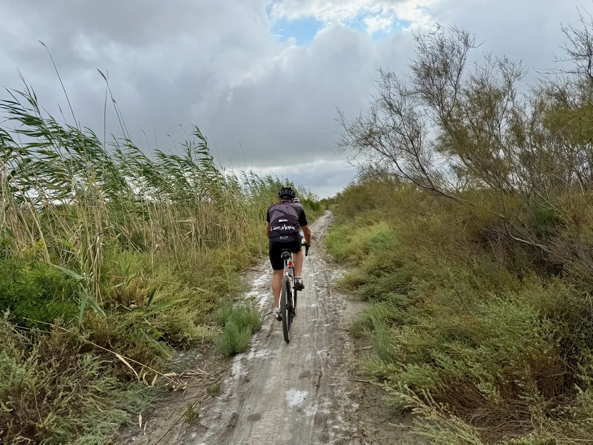

Depuis des mois, nous travaillons [la trace du g727](https://727bikepacking.fr/g727/) pour qu’elle explore la Camargue et passe par les Saintes-Marie-de-la-Mer, suivant la magnifique dune littorale. Mais lors de la dernière reconnaissance patatrac. Un secteur de liaison entre Aigues-Mortes et le petit Rhône s’avère impraticable. Quand on arrive à Sylvéréal en longeant le canal depuis le fort du sel de Peccalis par un magnifique single, on tombe d’abord sur un nouveau panneau interdit puis un portail des plus massifs avec digicode.

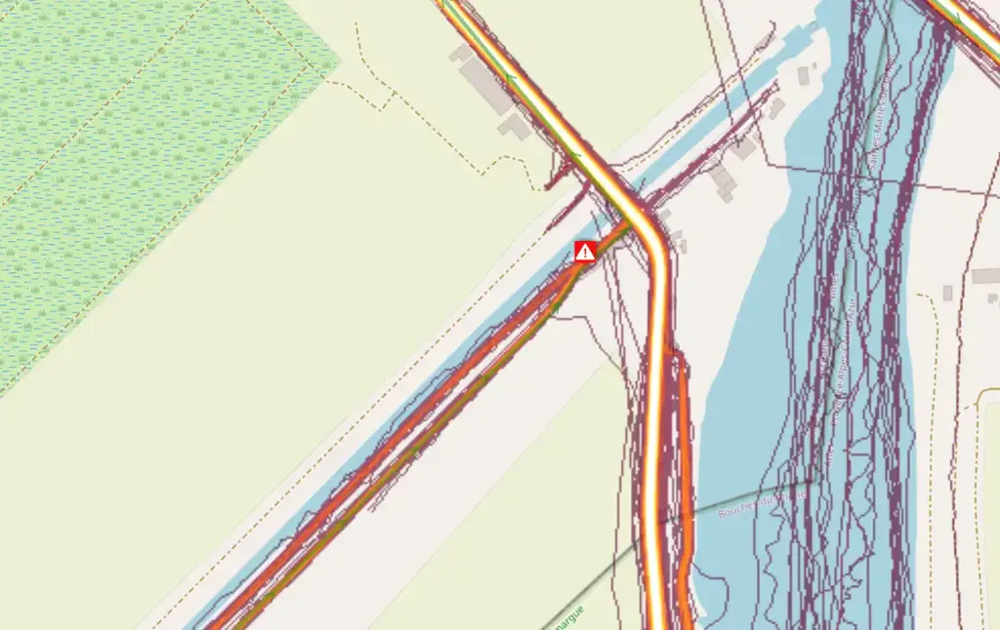

La heatmap Strava est catégorique : ça passait il y a peu de temps, voilà pourquoi nous avons attendu le dernier moment pour cette exploration. Pas d’autre choix que changer de fusil d’épaule. C’est rageant. La Camargue est inaccessible à gravel depuis Aigues-Mortes sans passer par une départementale désagréable. Je trouve ça presque odieux, alors que les chemins sont pour la plupart entretenus par les services publics.

Pour arriver au fameux 727 km, on change quelque peu le programme. On partira par Sète, escaladera le mont Saint-Clair pour se dégourdir les jambes avant de longer le littoral jusqu’à Aigues-Mortes, selon des pistes et sentiers empruntés par les précédentes éditions, mais avec des variantes autant que possible.

Après Aigues-Mortes, on remontera le canal du Rhône à Sète jusqu’à Arles, essayant le plus souvent possible de quitter la piste cyclable. À partir d’Arles, nous retomberons sur la trace prévue, avec traversée de part en part des Alpilles, puis du petit Lubéron. La trace est maintenant définitive. [Vous pouvez la télécharger](https://727bikepacking.fr/g727/).

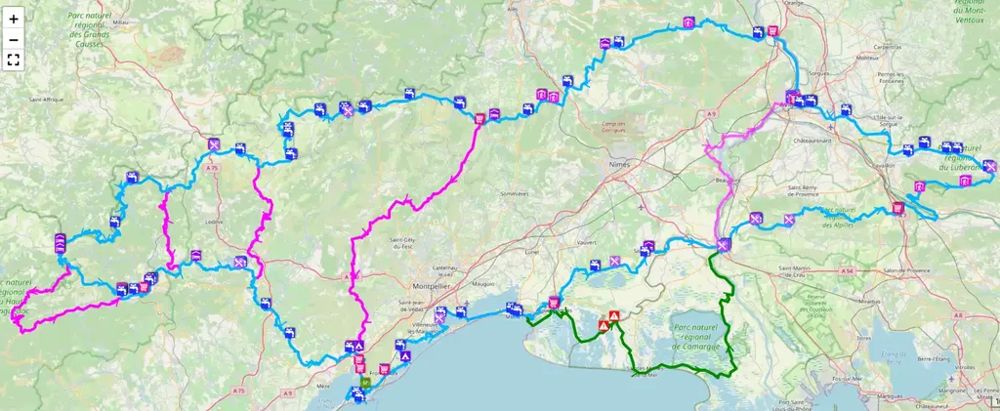

De nombreux shortcuts sont disponibles pour concocter des g727 sur mesure. La plupart des participants, ayant choisi le classique 727 km.

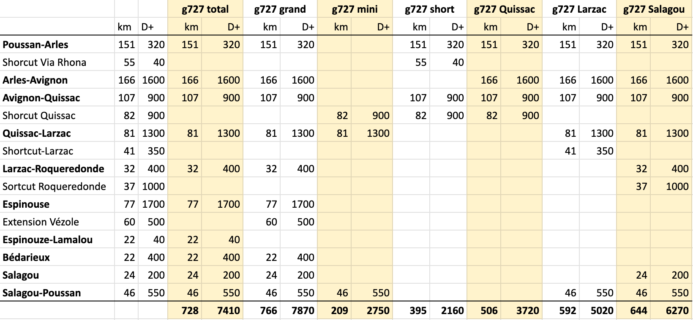

**Attention** : [il reste moins de 20 places pour le Grand Départ du 27 septembre](https://727bikepacking.fr/g727-Grand-Depart/) (au 8/9/2025).

### Ce que vous ne verrez pas

Voici quelques photos des paysages traversés lors de la dernière reco inutile en Camargue.

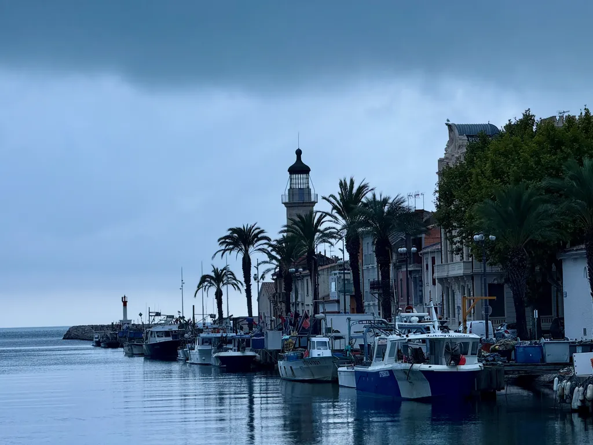

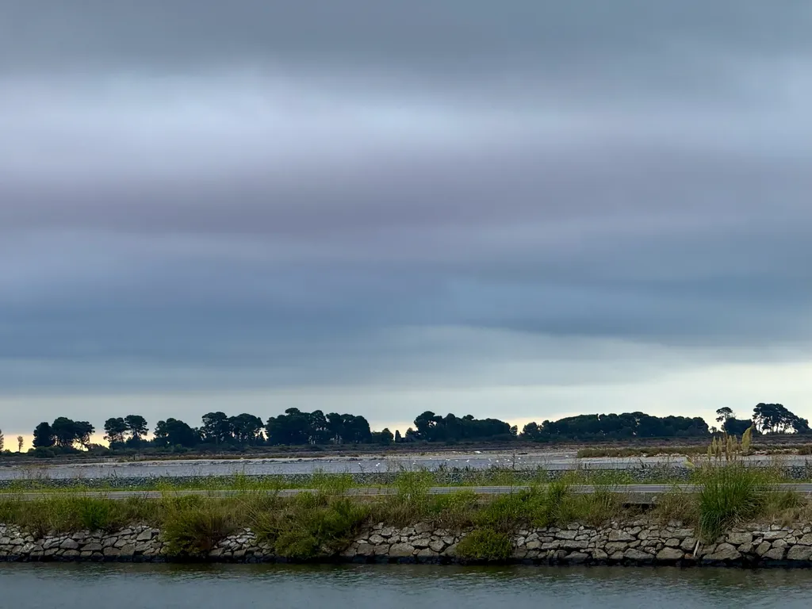

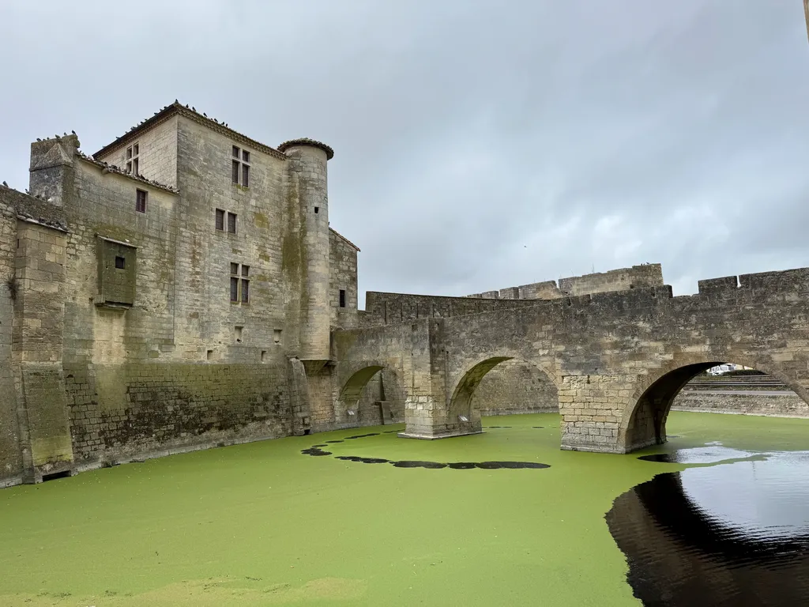

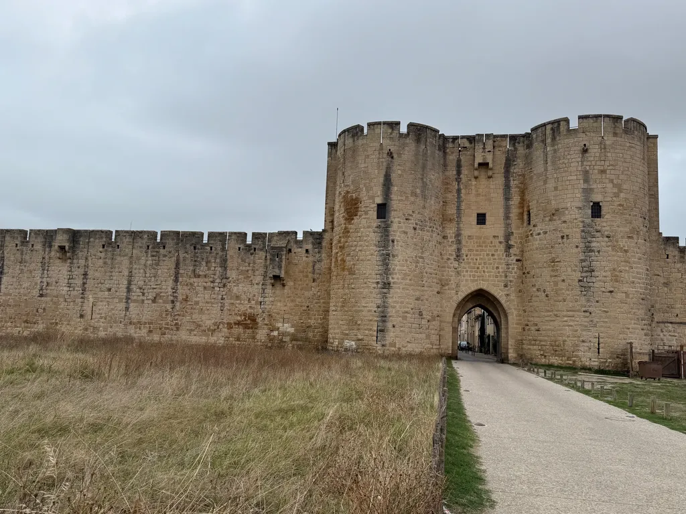

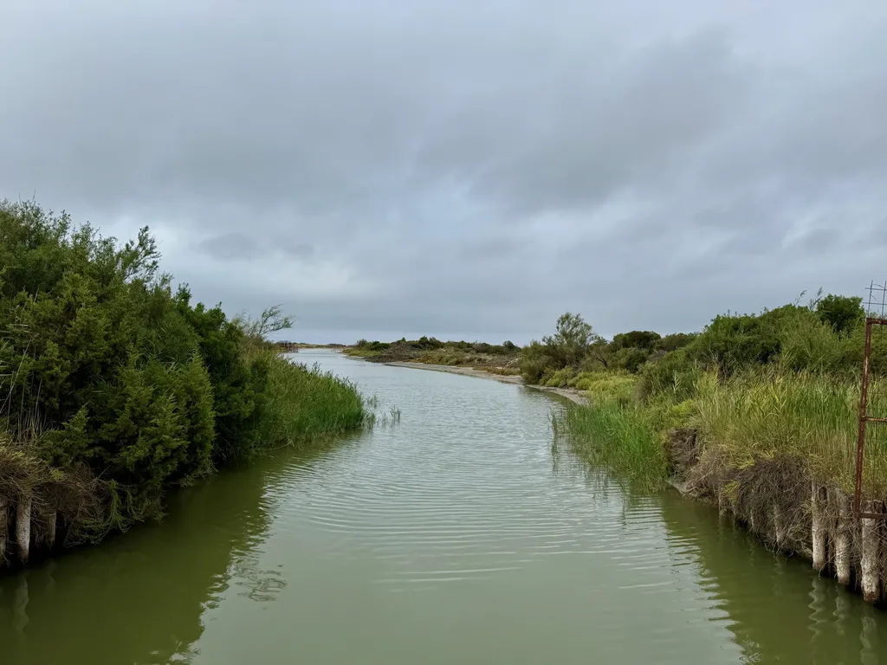

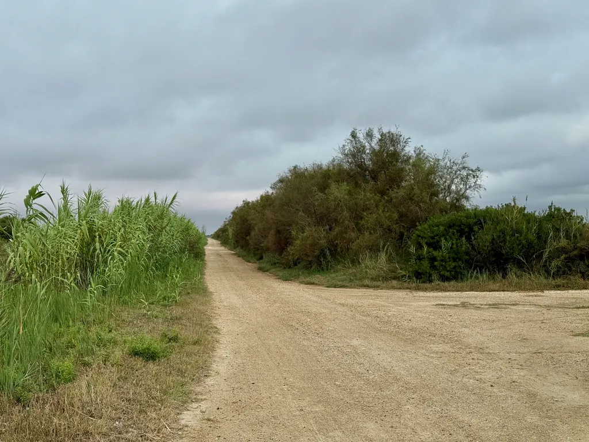

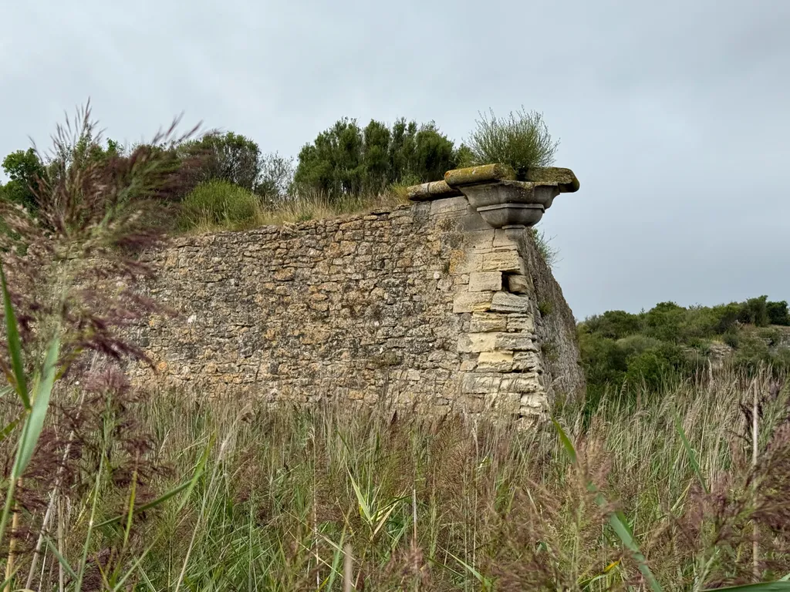

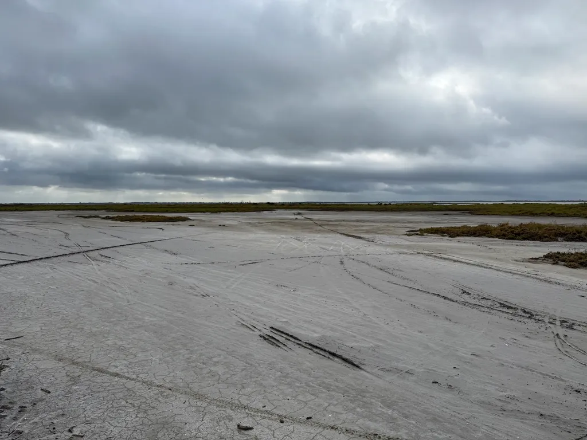

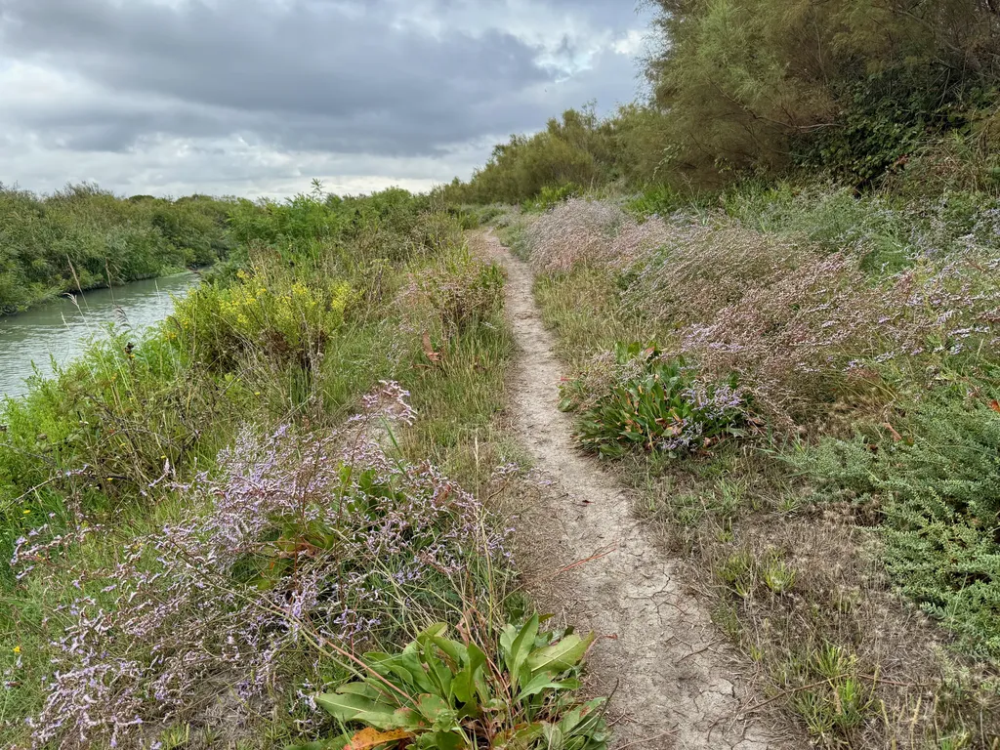

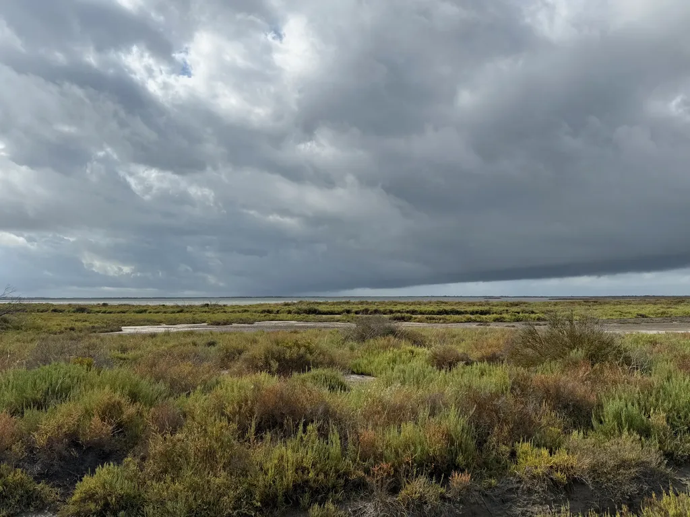

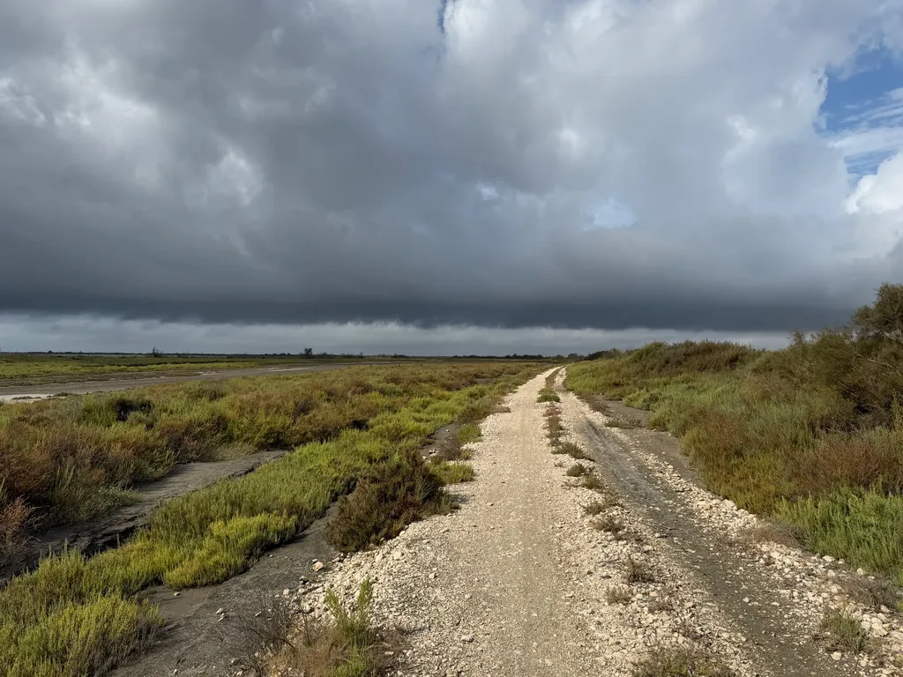

#velo #bikepacking #y2025 #2025-9-8-20h00
