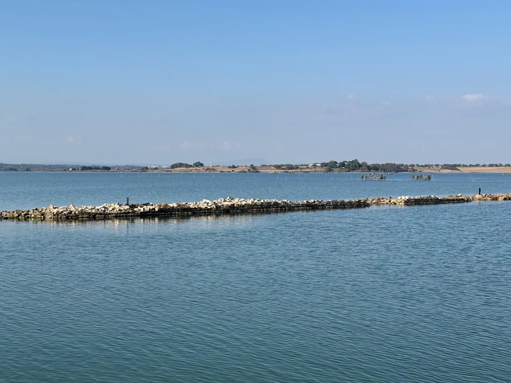

# 727 2026 - le programme

En avril 2021, [nous étions huit à nous élancer pour le premier 727 officiel](https://tcrouzet.com/2021/04/08/tour-de-lherault-bikepacking-agrandir-limaginaire/), le grand départ de 2020 ayant été impossible à cause du covid. En 2025, vous avez été près de 300 à participer aux différents 727, alors même que j’ai quitté les réseaux sociaux et ne compte plus que sur le bouche-à-oreille pour faire la promotion de nos randonnées.

C’est en quelque sorte la démonstration que les réseaux sociaux et les publicités payantes qui y fleurissent ne sont pas des passages obligés. Nous pouvons organiser des évènements en toute discrétion, sans investir dans un marketing délétère, du moins quand notre seul objectif est de partager notre passion pour le vélo et un territoire.

Je déploie la même énergie aujourd’hui qu’en 2020 quand je dessinais les premiers 727. Je crée ces randonnées pour les rouler avec vous et vous rencontrer, et au fil des années nous avons noué de belles amitiés. J’espère que nous nous retrouverons pour des bivouacs au bord des vignes ou au sommet des garrigues. J’attends avec impatience la soirée musicale avec Will et Manu comme danseurs vedettes. J’ai les images mais je n’ose pas les publier. Rendez-vous à Poussan pour rencontrer les artistes.

### 5 et 6 avril : POU100

Fin 2023, nous avons imaginé cette randonnée de 100 km ou 100 miles pour nous forcer au cours de l’hiver à explorer de nouveaux chemins. Quelle surprise de vous y voir 170 en 2024. Une motivation pour renouveler l’expérience les 4 et 5 avril. Comme je reste fan de bikepacking, j’ai même ajouté une boucle de 250 km à effectuer sur deux jours, avec possibilité de se loger dans des gîtes à mi-parcours.

[Infos et lien d’inscription sur la page POU100…](https://727bikepacking.fr/pou100/)

J’ai listé les gîtes sur les hauteurs de l’[Espinouse](https://fr.wikipedia.org/wiki/Caroux-Espinouse), point culminant de l’Hérault, notamment l’incontournable ferme du Deves.

La trace 2026 partira de Poussan, remontera jusqu’au lac du Salagou, avant de redescendre vers le lac de Vaillan, puis de regagner Poussan via Pézenas. Nous la fignolerons au cours de l’hiver.

### 8 mai : 727 VTT et gravel

À l’origine, l’idée était de suivre la frontière du département, puis nous avons tracé une variante à l’intérieur. Je n’ai plus envie de me contraindre. La trace 2026, encore à définir, fera la part belle aux singles, c’est tout ce que je peux vous affirmer. Je n’ai encore aucune idée du tracé, sinon que je tenterai de modérer le D+ et le ramener vers les 8 000 mètres, sur environ 600 km. Mon ambition : rendre le parcours moins exigeant — moins d’exigence physique implique plus de convivialité, la formule n’est guère compliquée. J’ai envie de proposer des traces à l’opposé de celles qui arrachent les tripes.

Comme nous sommes désormais beaucoup moins de vététistes musculaires que de gravellistes et que je connais les chemins de l’Hérault, il me sera possible de doubler la trace VTT d’une variante gravel, sans doute autour des 727 km. Je ferai en sorte que les deux traces se croisent pour faciliter des rencontres et les moments de partage. L’idée encore une fois sera de proposer de nouveaux parcours.

[Infos et lien d’inscription sur la page Grand Départ du 727](https://727bikepacking.fr/727-Grand-Depart/)

### 26 septembre : g727 gravel

La trace de fin septembre partira cette année de Poussan en direction des Pyrénées, basculera en Espagne, pour suivre les merveilleuses pistes au-dessus de Rosas et Cadaqués, avant de rebasculer en France et de suivre la côte. J’aurai bien sûr l’occasion de vous en reparler au fil des reconnaissances. Nous avons de quoi nous occuper. Organiser les 727 est une très bonne façon de ne pas tourner en rond.

[Infos et lien d’inscription sur la page Grand Départ du g727](https://727bikepacking.fr/g727-Grand-Depart/)

Parlez des 727 à vos amis, invitez-les, surtout les débutants en bikepacking. Nous roulons souvent en groupe. Les 727 sont des expériences conviviales loin de tout esprit de compétition, et les rares compétiteurs qui s’y risquent ne trouvent personne pour les féliciter de leurs contre-performances humaines. Notre monde a besoin de coopération pas d’affrontement. Le bikepacking nous projette dans la nature pour nous apprendre à la savourer et à la respecter.

#velo #bikepacking #y2025 #2025-10-20-22h00
