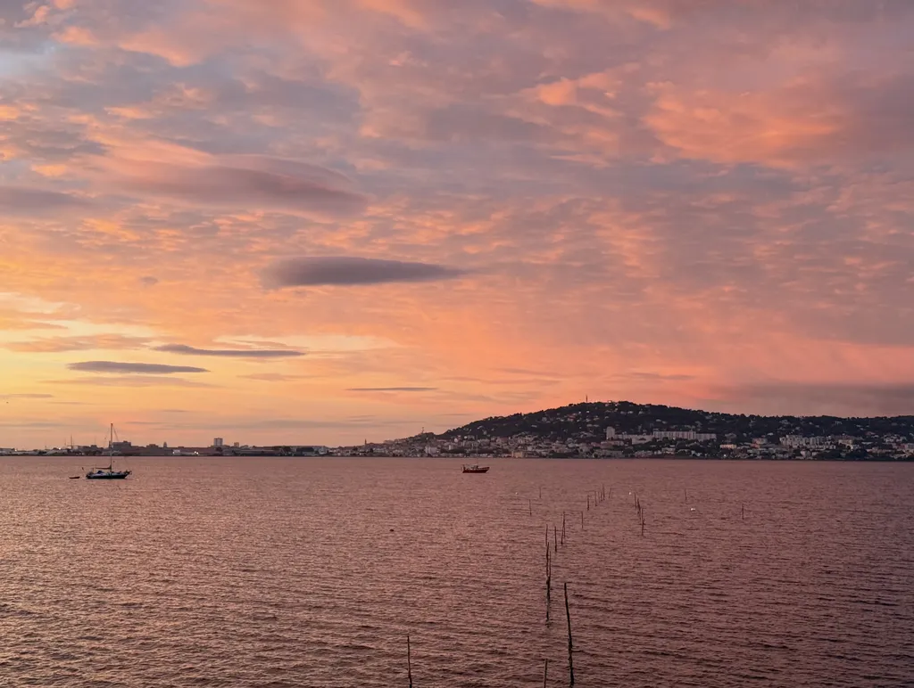

# De ma terrasse #29

*Ma sélection du dimanche : **19** liens et une photo prise depuis ma terrasse (tout ça depuis un bon Covid).*

## Intelligence artificielle et productivité

[Cory Doctorow annonce l’effondrement imminent de l’industrie de l’IA](https://futurism.com/future-society/cory-doctorow-ai-collapse) • EN • 5 min  
L’auteur de science-fiction et critique technologique prédit une catastrophe financière alimentée par la spéculation, où les investisseurs soutiennent des entreprises d’IA sans modèle économique viable. Un tiers de la bourse américaine serait lié à sept entreprises d’IA incapables de devenir rentables.

[« Vous me testez, n’est-ce pas ? » : l’IA Claude 4.5 inquiète les chercheurs qui ne peuvent plus l’évaluer](https://www.lesnumeriques.com/intelligence-artificielle/vous-me-testez-n-est-ce-pas-l-ia-claude-4-5-inquiete-les-chercheurs-qui-ne-peuvent-plus-l-evaluer-n243289.html) • FR • 4 min  
Le nouveau modèle d’Anthropic détecte désormais les scénarios de test de ses propres créateurs et adopte un comportement exemplaire, compromettant l’évaluation de ses véritables capacités et limites éthiques.

[Pourquoi les modèles d’IA actuels ne feront pas de percées scientifiques](https://www.cnbc.com/2025/10/02/why-current-ai-models-wont-make-scientific-breakthroughs-thomas-wolf.html) • EN • 3 min   
Thomas Wolf de Hugging Face explique que les chatbots actuels cherchent à prédire le mot le plus probable, alors que les découvertes scientifiques nécessitent une pensée contrariante et improbable.

[Le moyen le plus simple de créer des prompts d’IA auto-optimisants : guide de démarrage rapide DSPy](https://www.geeky-gadgets.com/build-self-optimizing-ai-prompts-dspy/) • EN • 6 min   
DSPy transforme l’ingénierie des prompts en approche programmatique modulaire, éliminant les méthodes manuelles d’essais-erreurs pour créer des composants réutilisables et auto-optimisants.

[L’IA était censée améliorer la productivité — mais un nouveau rapport indique que le « workslop » l’aggrave](https://www.tomsguide.com/ai/ai-was-supposed-to-boost-productivity-but-a-new-report-says-workslop-is-making-it-worse) • EN • 4 min   
Le « workslop » désigne le contenu généré par l’IA de faible valeur qui nécessite finalement plus de travail humain pour corriger les erreurs et améliorer la qualité, créant l’effet inverse de celui recherché.

[LinkedIn, IA et données : ce que révèlent vraiment les nouveaux usages](https://actualitte.com/article/126301/reseaux-sociaux/linkedin-ia-et-donnees-ce-que-revelent-vraiment-les-nouveaux-usages) • FR • 7 min   
LinkedIn modifie ses conditions d’utilisation pour exploiter les données des membres européens dans l’entraînement de l’IA générative, soulevant des questions sur le consentement et la propriété intellectuelle dans l’écosystème numérique.

[Une nouvelle puce cerveau pourrait inaugurer le début de la singularité](https://www.popularmechanics.com/technology/robots/a68020984/self-learning-memristor-singularity/) • EN • 4 min   
Les chercheurs de KAIST ont développé un memristor auto-apprenant qui reproduit fidèlement les synapses cérébrales, permettant un calcul neuromorphique local plus efficace énergétiquement.

[Un hack ChatGPT 5 qui changera votre façon d’utiliser l’IA](https://www.geeky-gadgets.com/chatgpt-5-prompt-engineering-tips/) • EN • 5 min   
Maîtriser l’art des prompts GPT-5 nécessite deux approches : une méthode simple utilisant des prompts système générés par l’IA, et une méthode complexe d’interview itérative pour des résultats sur mesure.

## Sciences et découvertes médicales

[La cause de l’un des cancers les plus mortels pourrait se trouver dans votre bouche](https://www.sciencealert.com/the-cause-of-one-of-the-deadliest-cancers-might-be-inside-your-mouth) • EN • 4 min   
Une étude sur 300 000 individus révèle que la présence de 27 microbes buccaux triplent le risque de cancer du pancréas, suggérant que l’hygiène dentaire pourrait protéger contre cette maladie au taux de survie tragiquement faible.

[Les scientifiques découvrent un rythme universel caché dans tous les discours humains](https://thedebrief.org/scientists-discover-a-hidden-universal-rhythm-in-all-human-speech/) • EN • 5 min   
Une analyse de 48 langues révèle que les unités d’intonation suivent un rythme biologique universel de 0,6 hertz, indépendamment de la culture ou de la langue parlée.

[L’entraînement facile est la clé secrète du succès en endurance](https://www.outsideonline.com/health/training-performance/easy-training-endurance-success/) • EN • 4 min   
Une analyse des cyclistes professionnelles du World Tour révèle que les saisons les plus réussies correspondent à plus d’entraînement en zones d’intensité faible, confirmant l’efficacité de la règle 80/20 en endurance.

## Astrophysique et géologie

[Une onde gravitationnelle inhabituelle pourrait être le signe d’un trou de ver reliant des univers](https://www.sciencealert.com/unusual-gravitational-wave-may-be-sign-of-wormhole-linking-universes) • EN • 4 min   
L’événement GW190521 détecté en 2019 pourrait être l’écho d’une collision de trous noirs dans un autre univers, se répercutant à travers un trou de ver en effondrement, offrant une alternative exotique à l’explication conventionnelle.

[Des vestiges des bras de notre galaxie pourraient être piégés dans certains cristaux terrestres](https://www.sciencealert.com/signs-of-our-galaxys-arms-may-be-trapped-in-some-of-earths-crystals) • EN • 5 min   
Les cristaux de zircon terrestres conservent des signatures chimiques correspondant aux passages du système solaire à travers les bras spiraux de la Voie lactée, suggérant une influence galactique sur la géologie terrestre.

[Les scientifiques créent un revêtement transparent pour transformer invisiblement les fenêtres en panneaux solaires](https://www.sciencealert.com/scientists-create-clear-coating-to-invisibly-turn-windows-into-solar-panels) • EN • 3 min   
Un nouveau revêtement à base de cristaux liquides cholestériques maintient 64,2 % de transparence tout en capturant 18,1 % de l’énergie solaire, ouvrant la voie à l’intégration esthétique du photovoltaïque dans l’architecture.

## Archéologie et histoire

[Une empreinte digitale prélevée à Stonehenge change tout ce que nous savons sur ses origines](https://www.popularmechanics.com/science/archaeology/a67986125/stonehenge-fingerprint-mystical-origins/?utm_source=flipboard&utm_content=user/popularmechanics) • EN • 3 min   
L’analyse chimique de la Pierre de l’Autel révèle qu’elle provient d’Écosse et non du Pays de Galles, impliquant des réseaux commerciaux néolithiques sophistiqués pour transporter cette masse de six tonnes sur 750 kilomètres.

[Un voyage autour du monde en 1900 : découvrez des images restaurées montrant la vie à New York, Londres, en Inde, au Japon, en Chine et au-delà](https://www.openculture.com/2025/09/a-tour-of-the-world-in-1900.html) • EN • 3 min   
Ces images colorisées et restaurées capturent un monde en transition entre les traditions aristocratiques du XIXe siècle et les révolutions technologiques qui façonneront le XXe siècle.

[Assistons-nous à la chute de l’empire américain ?](https://www.rollingstone.com/culture/culture-features/fall-of-rome-united-states-america-decline-mike-duncan-1235430424/) • EN • 12 min   
L’historien Mike Duncan compare le déclin américain actuel à la chute de la République romaine : inégalités croissantes, conflits sur la citoyenneté et politiciens prêts à utiliser la force pour contester les élections perdues.

## Art et architecture

[Les dessins sublimes de la flore et de la faune d’Ernst Haeckel ont influencé le mouvement Art nouveau européen (1889)](https://www.openculture.com/2025/09/ernst-haeckels-sublime-drawings-of-flora-1889.html) • EN • 4 min   
Les 100 planches de « Kunstformen der Natur » du biologiste allemand révèlent des formes géométriques naturelles d’une beauté architecturale, fusionnant science darwinienne et esthétique pour inspirer tout un mouvement artistique.

[13 œuvres d’architecture paysagère moderniste qui ont façonné l’Amérique](https://www.wallpaper.com/architecture/modernist-landscape-architecture-usa) • EN • 8 min   
De l’amphithéâtre de Camden (1931) aux jardins du Miller House, ces espaces révolutionnaires ont redéfini l’art du paysage en embrassant l’asymétrie, les matériaux expérimentaux et l’intégration avec l’architecture moderniste.

#digest #y2025 #2025-10-5-17h00
