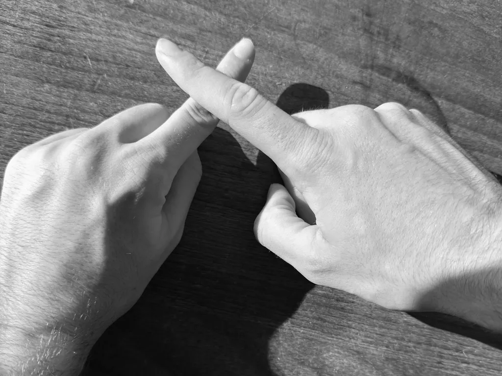
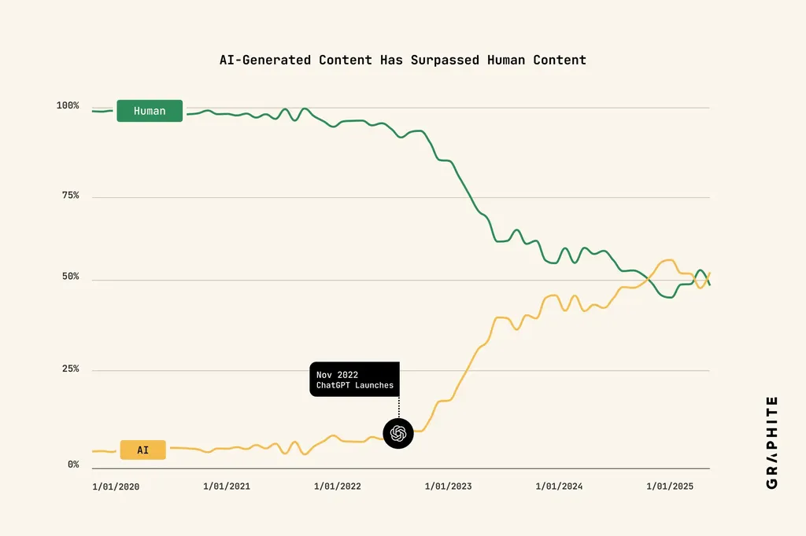

# Se soustraire au monde

Quand un restaurant est bondé, qu’une queue s’allonge dehors, avez-vous la patience d’attendre sous la pluie et le froid pour aller manger dans le brouhaha parmi la foule ? Faites-vous confiance aux goûts de cette foule ? Croyez-vous que son nombre dit quelque chose de la qualité de ce qui sera servi ? Moi, pas. J’ai tendance à préférer les endroits discrets, calmes et feutrés, où on sert des plats peu extravagants composés de mets de qualité.

Quand j’étais jeune, mes contemporains écoutaient du disco, j’écoutais du punk. Ils passaient les nuits en boîte, je jouais à *D&D* ou à *L’Appel de Chtulhu*. Ils regardaient la TV, je préférais lire des romans. Je ne faisais pas moins de choses qu’eux, je faisais d’autres choses. J’ai toujours ressenti le mainstream comme une menace pour mon identité. J’étais en train de me construire. Je désirais me trouver pour expérimenter ma singularité.

À cette époque, la TV c’était le mainstream, c’était le lieu du panurgisme, c’était l’église de l’ultime négation de soi. Au milieu des années 1990, quand apparaît le web, j’ai l’impression qu’un vent nouveau souffle. Quelques hurluberlus se mettent à y exprimer leur singularité, à dire leur anormalité par rapport à la moyenne imposée par la TV. Le web sans nécessité de rentabilité devenait l’underground qui contestait la TV comme le punk avait été l’underground qui contestait le disco.

J’ai toujours éprouvé cette dichotomie d’un underground versus un mainstream jusqu’à ce que l’underground soit avalé. Par exemple, *D&D* est devenu central dans *Stranger Things*, série vedette de Netflix. Les réseaux sociaux, initialement une affaire de geeks et de créatifs, ont dépassé en audience la TV.

Dans la croyance populaire, il y a toujours un lieu où l’innovation artistique est supposée se jouer. Aujourd’hui, les séries, YouTube, Instagram… Et puis il y a les lieux undergrounds où elles se jouent effectivement. Je ne suis pas sûr de tous les connaître, mais je sais que de tels espaces subsistent dans les recoins d’internet ou dans les pages de quelques livres.

Ce n’est pas parce que tout le monde est au même endroit, comme dans un restaurant à la mode, que ça se passe là. C’est même très probablement que ça se passe ailleurs. Idem pour YouTube, Facebook, Instagram, TikTok… Le lieu où la foule se rassemble n’est pas le lieu où l’avenir s’invente, tout simplement parce que pour plaire à la foule, pour attirer son attention, il faut lui donner ce qu’elle a déjà appris à aimer. Dans les zones d’invention, on concocte des goûts nouveaux sans manuel d’utilisation.

Mais attention, si l’appréciation des foules dit le plus souvent une normalité, sa détestation ne pointe pas une radicalité. On peut être invisible et nul, comme invisible et génial. Un invisible ne sait jamais sur quel pied il danse : il doute. Un jour, il se sent médiocre, un autre il se persuade qu’il innove. Je préfère me dire que j’ai une chance d’innover que me gargariser d’un succès qui en toute probabilité dirait ma normalité artistique.

Reste que j’ai la sensation que si on s’exprime sur les plateformes mainstream du moment, on est mécaniquement attiré vers leur normalité, sous l’effet de l’attraction gravitationnelle de leurs algorithmes.

>Équation perverse : normalité = rentabilité

Une normalité qui n’a rien de politiquement correct, qui même serait politiquement incorrecte, mais presque toujours culturellement affligeante. Ce qui compte : que ça rapporte.

Les plateformes de milliardaires qui fabriquent des millionnaires comme têtes de gondole propagent nécessairement une culture normative, ou à tendance normative, quoi qu’en pensent leurs plus modestes contributeurs.

Et puis publier sur YouTube et consort, revient à valider une forme de capitalisme prédateur plutôt désuet conceptuellement même s’il ne cesse de démontrer son efficacité. Je ne peux croire que les novateurs d’aujourd’hui puissent se satisfaire de collaborer à ce système. Un novateur se doit d’être radicalement critique des dérèglements de son temps.

On pourrait me contredire avec des exemples du passé. Louis-Ferdinand Céline raciste. Lovecraft raciste. Je parle de deux auteurs que j’ai beaucoup aimés. De leur temps, le racisme avait le vent en poupe, ou du moins divisait la société. Ils avaient simplement choisi le mauvais camp de l’Histoire ([mauvais camp qui malheureusement redevient le bon puisque les plateformes fascisantes en font la promotion](https://github.com/tcrouzet/TheBookStrikeBack)).

Donc, je me soustrais à ce monde parce que je ne l’accepte pas. Si tous les éditeurs devenaient fascistes, je ne publierais plus de livres. Je refuse d’être demain traité de collabo par mes enfants. Ce retrait volontaire de toute chance d’accéder au mainstream ne me rend pas génial mais m’invisibilise plus que jamais. Je me place dans l’underground parce que la plupart des lieux de lumière m’effraient, et ceux qui s’y expriment ne font que démontrer une légèreté politique qui m’est de plus en plus insupportable.

Dans [un article de développement personnel](https://www.upworthy.com/happiness-researcher-reveals-the-enduring-secret-to-being-happy-in-the-second-half-of-life), un spécialiste du bonheur, spécialité en elle-même ridicule, affirme qu’en vieillissant on soustrait des objectifs à son existence plutôt que d’en rajouter sans cesse. Je n’ai donc plus l’objectif de paraître sur les plateformes fascisantes ni d’y perdre du temps. Résultat : je me sens beaucoup plus léger, plus attentif aux autres, à la lumière, aux paysages, plus disponible pour la vie associative et mon propre travail.

Pour autant, je suis déboussolé : durant une vingtaine d’années, j’ai fait comme tout le monde. Ma prise de conscience, mon retrait, me place dans une position inconfortable. Je ne sais plus comment exister artistiquement. Peut-être la radicalité revient désormais à se taire, à se soustraire au brouhaha, à ne plus y contribuer. Et pourtant je publie encore un article, j’ajoute une pierre à l’édifice, mais j’évite de la jeter avec force dans l’océan pour provoquer des ondes qui en annonceront la publication.

Alors je repense à [la possibilité de faire payer mes articles](https://tcrouzet.com/2025/10/09/faire-payer/). Ce n’est bien sûr pas une solution satisfaisante pour moi, du moins pour la plupart de mes textes. Je reste persuadé qu’un autre monde est possible où la culture serait ouverte, et pas pseudo-ouverte par des plateformes manipulatrices.

Reste la nécessité de me soustraire à la prédation et à la concurrence des IA qui [désormais génèrent plus de la moitié des contenus web](https://graphite.io/five-percent/more-articles-are-now-created-by-ai-than-humans). En discutant avec [Ploum](https://ploum.net/), on s’est dit pourquoi ne pas faire payer les articles publiés sur le web mais pas ceux diffusés par mail, RSS, Gemini… Une façon de jouer dans une autre cour, de ne pas aller dans le restaurant fréquenté par les foules. Ceux qui nous liraient seraient de fait des lecteurs fidèles et attentionnés.

Une autre possibilité : imposer une connexion pour accéder aux articles, ne les offrir qu’à une communauté… Bon, c’est impossible pour un site statique, et je n’ai pas envie de revenir à un serveur qui exige de la maintenance. Parfois je rêve de transformer mon site web en un simple formulaire pour saisir un email.

Je continue à réfléchir. Comment pousser la soustraction, entamée il y a longtemps en n’achetant plus des fringues que quand celles que je porte se déchirent ? J’ai ainsi commencé mon voyage par me soustraire à la mode vestimentaire et à une partie de la mode culinaire, en refusant les boissons alcoolisées et quasiment les produits laitiers. J’ai esquissé un premier retrait total d’internet en 2011 quand j’écrivais [*J’ai débranché*](https://tcrouzet.com/books/jai-debranche/jai-debranche/), un retrait pour me sauver moi, sans encore être conscient qu’il pourrait nous sauver tous. J’ai découvert à cette occasion qu’internet n’était pas le problème, mais les prédateurs qui y prospèrent.

Dans une société de l’attention, où tout le monde tente de voler le temps des autres, j’essaie de me soustraire aux voleurs d’attention et n’ai pas envie de me transformer en voleur à mon tour. Je ne demande pas d’attention, mais des relations, des échanges, des enrichissements mutuels.

Quand je publie un roman, c’est pour partager mes expériences, pour donner le temps que j’ai vécu, le compresser pour que le lecteur l’absorbe et le décompresse en lui. [A Westenberg](https://www.joanwestenberg.com/p/why-stories-make-you-smarter-than-self-help-books) a écrit un bel éloge des romans, qu’il juge beaucoup plus formateurs que toutes les non-fictions. J’ai envie plus que jamais d’écrire des histoires pour répondre à notre besoin narratif. J’ai envie de donner, de recevoir, pas d’attirer l’attention.

J’ai longtemps critiqué les romans — jugés comme une impasse littéraire puisque souvent ils répètent des formes anciennes —, mais qu’importe tant qu’ils racontent, transforment, édifient. Je reste persuadé qu’ils ne peuvent transcender cet objectif ambitieux qu’en étant fidèles aux forces narratrices de leur temps, qu’en adoptant des stratégies actualisées, mais même sans innovation formelle et stylistique je les crois encore capables de nous aider à nous construire.

Le roman devient peut-être un outil de résistance maintenant que nous sommes de moins en moins nombreux à en lire. Écrire des romans deviendrait presque un acte radical de lutte contre la société de l’attention (même si les IA en écrivent déjà, ce qui ne cesse de m’interroger). Être discret sur le web (nouveau champ de bataille des IA), cultiver une communauté dans la discrétion, lui raconter des histoires… C’est un beau programme. Se soustraire des endroits de plus en plus puants pour s’exprimer dans des recoins chaleureux. Perdre des lecteurs en quantité, gagner des lecteurs de qualité.

Quand j’effectue une sortie vélo sans devoir faire demi-tour parce qu’un chemin se termine en cul-de-sac, c’est une mauvaise sortie. Elle ne m’a pas fait poser mes roues sur de nouvelles parcelles du territoire. Par analogie, je ne suis pas sûr artistiquement et intellectuellement de m’engager sur un chemin qui mènera quelque part, mais j’y vais tout de même, par goût de l’incertitude et de l’exploration, aussi parce qu’ailleurs n’est plus vivable pour moi.

Se soustraire au monde ne signifie pas disparaître du monde, bien au contraire. C’est l’habiter, n’en manquer aucune sensation, en évitant de se laisser éblouir par les habitudes et les dictats. Je donne un cours à la fac en ce moment. Quand j’explique aux élèves, futurs chargés de com ou journalistes, de ne pas utiliser les réseaux fascisants, contredisant par là leurs autres professeurs, ils me répondent qu’ils feront comme tout le monde, qu’ils iront là où tout le monde va, parmi la foule dans le restaurant.

Leurs réponses me terrorisent. Je leur répète que ce n’est pas ainsi qu’ils réussiront à être fiers d’eux-mêmes, que ce n’est même pas ainsi qu’ils réussiront à gagner leur vie, que la collaboration à un système totalitaire n’est jamais édifiante *in fine*. Je crois qu’ils s’en fichent. Ils sont si pressés de résoudre leur équation financière qu’ils sont prêts aux pires abjections. Quand la foule en est là, que reste-t-il de la société ? Qu’en reste-t-il quand les intellectuels, les artistes, les politiques et les médias en sont là ?

Se retirer de cette monstruosité ne revient pas à dire non au monde mais oui à un autre monde. Parce que dans la durée, les collabos auront tort, ils auront choisi le mauvais cheval historique, mais en attendant ils réussissent parfois à me faire douter de ma propre route. Jamais très longtemps, par chance. Je leur laisse les autoroutes qui se jettent dans le vide et continue d’explorer les méandres des chemins vicinaux.

Ma soustraction du monde me fera mieux découvrir le monde et moi-même. Elle entraînera des rencontres et provoquera des projets. Je suis sûr que plus je me promènerai loin du bruit des autres, mieux je découvrirai mon silence et le chant des oiseaux. La foule écrase les fleurs, elle les piétine. Prendre le temps de m’agenouiller pour les observer. Alors des expériences nouvelles surviendront qui mériteront d’être partagées. J’ai déjà commencé. Je n’aurais pas écrit ce texte sans avoir entamé ma grande soustraction.

*PS : Alors que je termine d’écrire cet article, [A Westenberg en publie un qui lui ressemble](https://www.joanwestenberg.com/p/you-are-insignificant-that-s-a-good-thing), lui-même sans doute inspiré d’un article de [John Goerzen](https://changelog.complete.org/archives/13519-im-not-very-popular-thankfully-that-makes-the-internet-fun-again), tous deux comme moi de vieux navigateurs de la chose numérique, sensibilisés aux brusques changements de direction du vent, surtout quand ils annoncent une tempête.*

#netculture #y2025 #2025-10-20-17h00
