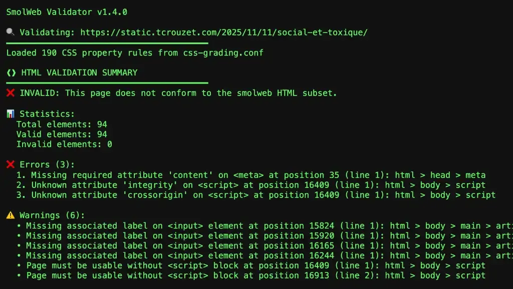

# SmolWeb, SmolNet, numérique à taille humaine

Je croyais en avoir terminé de mon chemin vers le minimalisme numérique mais [les échanges suite à mon article sur le SlowWeb](https://tcrouzet.com/2025/11/10/the-slow-web-is-faster/) m’ont incité à prolonger la réflexion. Qu’est-ce qui est nécessaire ? Je ne cesse de me poser cette question en tant qu’artiste, citoyen, organisateur de randonnées vélo, mais j’ai parfois oublié de me la poser en tant que citoyen du net.

Selon plusieurs lecteurs, l’appellation SlowWeb est de moins en moins utilisée parce que le web minimaliste n’est pas nécessairement lent. On parle désormais de [SmolWeb](https://smolweb.org/), voire de [SmolNet](https://wiki.archiveteam.org/index.php/SmolNet), un web qui nécessite des ressources limitées, tant côté serveur que client.

Pour que mon site se rapproche de ces standards, je dois encore réduire la bande passante nécessaire à sa consultation, voire me limiter à [un jeu d’instructions volontairement restrictif](https://smolweb.org/specs/index.html).

### Polices de caractères

Est-il nécessaire d’utiliser des polices de caractères embarquées ?

- Des polices originales identifient une mise en page.
- Elles permettent de mieux contrôler le rendu sur différentes plateformes.
- En contrepartie, les navigateurs chargent près de 150 Ko de données lors d’une première visite et recommencent à l’expiration de leur cache.
- La plupart de mes lecteurs fidèles me lisent par [mail](https://tcrouzet.com/page/abonnement-par-mail/) ou [RSS](https://tcrouzet.com/page/rss/), les autres sont de passage et consultent rarement plus d’une page, ce qui annule les bénéfices de la mise en cache.

En résumé, au nom du design, on sacrifie la bande passante. Mais pourquoi ne pas se limiter aux polices par défaut et en faire une contrainte esthétique ?

Comme j’aime les contraintes, j’ai commencé à jouer. Pour les titres, j’utilisais [Inter](https://fonts.google.com/specimen/Inter) qui s’avère très proche de la police system-ui, San Francisco sur macOS/iOS. Pour le corps de texte, j’utilisais la très lisible [Bitter](https://fonts.google.com/specimen/Bitter), optimisée pour écran. J’ai tenté de lui substituer des polices système, mais toutes m’apparaissaient moins lisibles (meilleur résultat obtenu avec Georgia).

Autant les OS embarquent des polices sans-sérif optimisées, notamment pour leur interface, autant les polices sérif me semblent moins lisibles. [Après quelques recherches](https://pmc.ncbi.nlm.nih.gov/articles/PMC4612630/), j’ai découvert que la présence d’empattements sur une police ne joue qu’un rôle marginal dans la lisibilité à taille standard (le sérif n’est plus lisible que pour de petites tailles proches de la limite de l’acuité visuelle).

>Nous continuons à utiliser le sérif pour les corps de texte, notamment dans les livres, plus par habitude que par souci d’efficacité.

J’ai basculé mon texte en sans-sérif et les titres en sérif. Et franchement, ça me change. Je valide.

### Images

Au moment de publier article sur [le pacte faustien avec les réseaux sociaux](https://tcrouzet.com/2025/11/11/social-et-toxique/), j’ai dû bricoler une image pour l’illustrer, alors qu’elle n’avait aucune nécessité narrative. Je me suis demandé pourquoi je perdais mon temps ?

Si j’aime publier mes photos, souvent, j’illustre mes billets avec des images sans intérêt, pour la simple raison que c’est une exigence des réseaux sociaux. Il est temps de remettre en cause ce dictat. Je peux maintenir des images de une dans les métadonnées, mais je n’ai aucune raison de les imposer aux yeux des lecteurs.

Cet article qui nécessitait de changer 215 Ko n’en nécessite plus 44 ko. Je ne vais pas me mettre à supprimer toutes les images, au nom d’une logique jusqu’au-boutiste, mais je ne garderai que les indispensables.

### CSS et JS

Une fois compressés, mon CSS et mon JS occupent au total 10 Ko. J’avais deux possibilités.

1. Les placer dans des fichiers externes, ce qui exige une latence de quelques millisecondes avant le premier chargement et la mise en cache.
2. Les intégrer aux HTML, ce qui évite la latence, mais impose de les recharger avec chaque page (cas assez rare comme je l’ai expliqué plus haut).

Les performances sont quasi identiques, un poil favorables à l’intégration, ce que j’ai choisi. Avantage : on peut télécharger mes pages, puis les ouvrir en local. Désavantage : les robots et autres aspirateurs, qui consomment une grande partie de la bande passante, n’ont plus d’autre choix que de changer chaque fois les 10 Ko supplémentaires. L’écart entre les deux versions est de l’ordre du négligeable. Je privilégie donc la portabilité et la vitesse d’affichage.

### Pour vos yeux

Comme je travaille toujours avec [une palette de couleurs solarisées](https://ethanschoonover.com/solarized/), je me suis résolu à publier mon blog dans les mêmes couleurs, parce qu’elles limitent la fatigues visuelles sur écran. J’ai ajouté en prime la gestion du mode clair et du mode sombre en fonction de vos réglages systèmes.

### Standard SmolWeb

L’idée : autoriser seulement les balises qui ne ralentissent pas le navigateur tout en restant compatibles avec des navigateurs anciens. Je me suis pris au jeu, réussissant à me limiter aux balises de niveau A et B sur [mon miroir GitHub](https://static.tcrouzet.com/). Le validateur a fantasmé des erreurs, ce qui l’a empêché de me certifier, mais ce n’est pas le plus important. Si PageSpeed n’a pas détecté d’amélioration avec le passage au SmolWeb, les ressources consommées sont bel et bien inférieures (voir tableau), du moins pour les pages textelles.

La situation est moins favorable avec les pages illustrées : le standard SmolWeb impose de charger toutes les images, même si le lecteur ne les visualise pas toutes. Lors de mes test avec [mon carnet d’octobre](https://tcrouzet.com/2025/11/13/octobre-2025/), la version SmolWeb est plus dispendieuse en bande passante, alors que les images sont de taille moindre. Bien sûr, la situation s’inverse si le lecteur lit l’intégralité du journal.

Je pourrais pousser le jeu plus loin, mais au prix d’une ergonomie dégradée (impossible de maintenir la lisibilité sur des écrans de taille très variable sans adapter dynamiquement la mise en page). J’ai la satisfaction de me dire que ma version SmolWeb conviendra à quelques amoureux du minimalisme.

Il est temps que j’arrête ces bricolages, aussi amusants qu’édifiants, mais j’en arrive à ne plus gratter que des octets et des grammes de CO2. Ce travail m’a poussé à repenser mon site et à remettre en cause quelques-unes de mes idées reçues. Ça fait toujours du bien au cerveau.

#netculture #y2025 #2025-11-16-22h00
