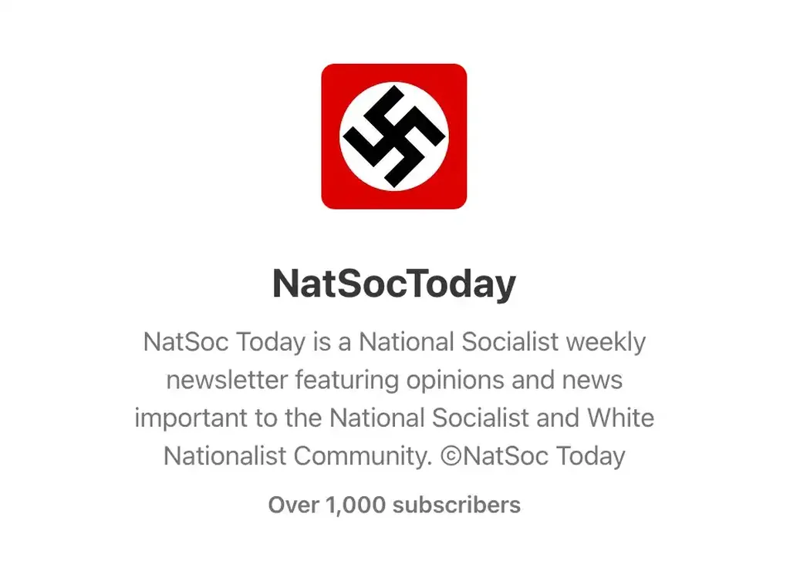
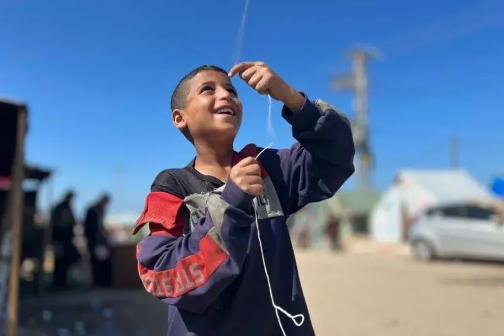

# Substack viole le DSA : contenus nazis tolérés, poésie palestinienne censurée

Au nom de la liberté d’expression absolue, Substack laisse circuler des contenus haineux tout en censurant des contenus qui ne devraient pas l’être (une poète palestinienne). C’est de plus en plus inquiétant.

En mars 2025, [en même temps que je quittais définitivement les réseaux sociaux algorithmiques](https://tcrouzet.com/2025/03/19/quitter-facebook/), j’ai basculé mes newsletters sur Substack parce que techniquement la plateforme est impeccable et dispose d’un système de recommandation performant. J’y ai retrouvé une ambiance blog, avec commentaires et conversations. J’y ai gagné des lecteurs et rencontré des auteurs.

Je savais que Substack s’était transformé en réseau social, avec sa fonction Note et son algorithme de recommandation, ce qui ne peut qu’engendrer les dérives observées ailleurs : stigmatisation des points de vue extrêmes, propagation des fake news et publireportages qui capturent mieux l’attention que des contenus réflexifs, intellos ou artistiques. J’étais vigilant sur ce point, mais acceptais cette situation tant que mes abonnés n’étaient pas contraints de se rendre sur Substack pour recevoir mes articles.

Je connaissais les démêlés de Substack avec des newsletters pronazies, phénomène abondamment commenté de 2020 à début 2024 (*The Atlantic* : [Substack Has a Nazi Problem](https://www.theatlantic.com/ideas/archive/2023/11/substack-extremism-nazi-white-supremacy-newsletters/676156/), *TechPolicy* : [Substack Cofounder Defends Commercial Relationships with Nazis](https://www.techpolicy.press/substack-founder-defends-commercial-relationships-with-nazis/), *Techcrunch* : [Substack won’t commit to proactively removing Nazi content, ensuring further fallout](https://techcrunch.com/2024/01/09/substack-nazi-content-policies-controversy/)…). Selon les créateurs de Substack, c’est aux lecteurs de choisir leurs lectures et de passer leur chemin devant les points de vue déplaisants. Il s’agit donc d’une défense de la liberté d’expression absolue ([défense intenable philosophiquement](https://tcrouzet.com/2013/10/18/quest-ce-que-la-liberte/)).

Début 2024, [notamment après une pétition de Substakers](https://tyburrswatchlist.substack.com/p/substackers-against-nazis), Substack a [supprimé les contenus incriminés](https://next.ink/122964/substack-moderera-les-publications-nazies-sur-sa-plateforme/), ce qui était rassurant. Je me suis dit que Substack devenait raisonnable tout en se transformant [en géant de l’information](https://backlinko.com/substack-users).

Hier, vendredi 21 novembre 2025 à 22h, Ploum m’a alerté sur le cas de [Joy](https://mamot.fr/@joynewacc@mastodon.social), [une Palestinienne censurée par Substack pour avoir posté un poème dans une note ayant attiré des commentaires haineux](https://mamot.fr/@joynewacc@mastodon.social/115589254471245897). Substack n’a pas effacé les commentaires, mais la note avec les commentaires !

Dans la foulée, [Sidoine](https://mamot.fr/@Sidoine@peculiar.florist) me pointe vers une résurgence de contenus nazis sur Substack en juillet 2025 (Gizmodo : [Substack Sends Push Alert for Nazi Newsletter](https://gizmodo.com/substack-sends-push-alert-for-nazi-newsletter-2000636663)). Soit-disant par erreur, Substack a incité certains abonnés de consulter une newsletter pronazie. Cette affaire a poussé de nouveaux auteurs à quitter Substack pour [Ghost](https://ghost.org/). David Farrier explique sa démarche dans [An August AMA!](https://www.webworm.co/august2025ama/) et [Some More Thoughts on Substack](https://www.webworm.co/moresubstackthoughts/).

Dès janvier 2024, [il alerte comme beaucoup d’autres sur les contenus nazis disponibles sur Substack](https://www.webworm.co/when-good-dogs-do-bad-things/) et comme beaucoup d’autres leur suppression le rassurent. [Mais durant l’été 2025](https://www.usermag.co/p/substack-sent-a-push-alert-promoting-nazi-white-supremacist-blog), deux événements le décident à quitter : le push par Substack de la lettre nazie et le blocage d’une photo illustrant le génocide palestinien. 

Cette photo a été publiée par presque nous les médias, notamment [*The Gardian*](https://www.theguardian.com/world/2025/jul/31/the-mathematics-of-starvation-how-israel-caused-a-famine-in-gaza), pour dénoncer la famine à Gaza. Auraient-ils été censurés par Substack ?

C’est plus qu’inquiétant, d’autant que la newsletter pronazie repérée par Gizmodo est toujours en ligne sur Substack (et a gagné des centaines d’abonnés depuis août). Substack ne peut en ignorer l’existence vu les échos médiatiques suscités.

>Il y aurait donc deux poids deux mesures. Substack censure un poème palestinien, mais laisse en ligne des contenus explicitement nazis. La plateforme modère bel et bien - mais selon des critères opaques et discriminatoires.

J’ai parcouru les notes associées à [cette newsletter](https://substack.com/@natsoctoday1). C’est odieux. J’utilise mon droit à citer pour appuyer mon propos.

L’exploration des posts, de ceux qui likent et des Substackers suivis est encore plus édifiante. C’est une véritable galaxie d’extrémistes et de révisionnistes.

[Depuis le 17 février 2024, le règlement européen sur les Services numériques (DSA - Digital Services Act), adopté le 19 octobre 2022, est applicable à toutes les plateformes en ligne.](https://france.representation.ec.europa.eu/informations/le-dsa-integre-le-code-de-conduite-sur-la-lutte-contre-les-discours-haineux-illegaux-en-ligne-2025-01-20_fr) Il leur impose des obligations légales contraignantes, notamment de modérer les contenus contraires à la loi des États membres, avec des sanctions financières pouvant atteindre jusqu’à 6 % du chiffre d’affaires annuel mondial.

>Substack est donc en infraction flagrante en Europe.

Plutôt que quitter immédiatement Substack, j’ai [traduit cet article](https://tcrouzet.com/2025/11/22/substack-dsa-us/) et le leur au envoyé, [leur demandant de se mettre en conformité avec nos législations](https://support.substack.com/hc/en-us/requests), d’autant que Substack se développe à vitesse exponentielle chez nous. Je vais tenter d’agir de l’intérieur. Si rien ne change, j’en tirerai les conséquences, comme de nombreux auteurs et journalistes avant moi.

Si je me résigne à quitter Substack, ce sera avec regret : en quelques mois, j’y ai recréé une communauté sympathique, qui m’a redonné foi dans le web collaboratif comme nous l’avons connu avec les blogs avant l’émergence des réseaux sociaux.

Maintenant Substack doit choisir : respecter la loi européenne ou perdre sa crédibilité. Quant à nous, auteurs, nous avons la liberté de migrer sous d’autres cieux avec nos abonnés. J’avoue que je ne suis guère optimiste. Après les déclarations des créateurs de Substack, je suppose qu’il existe chez eux un biais politique. Il s’agit pour eux de défendre la liberté d’expression tant qu’elle sert leur agenda. Je reste encore un peu, pour voir, comme dans une partie de poker.

En attendant, je publie un des poèmes de Joy, dont vous pouvez [télécharger librement le livre](https://drive.google.com/file/d/1RR5BMFCjmPoTcwLItxVrtrzaf0WJ4n4n/view).

### Joy: Echoes of a Human Dream: Have We Truly Evolved?

This question, despite its silliness, haunts me. It’s not my question, and it’s not even a casual one I saw in a sponsored ad promoting cheap articles that aren’t worth reading a single word from. But it’s the question of my little brother, who is no older than thirteen years old. He asked me with naivety, without paying attention to any answer. He asked it as if venting a buried anger that melts his chest.

I didn’t pay attention to what this little boy said. That’s just how he is - he asks a lot while making his paper kite to forget about time.

Just like the time he asked me:  
"Does Paracetamol relieve the feeling of hunger the same way it relieves pain?"

And when I answered, "No,"  
He responded bitterly, saying that hunger is much worse than pain. It’s another kind of ache that needs anesthetizing - more painful than headaches and bodily pain.

I shut my computer, listened to Frank Sinatra, and my eyelids gently closed, warning my eyes of the countdown into deep sleep…

Minutes passed, reaching the hour.  
I wished to sleep, or for my consciousness to fade.  
But the question of little Yusuf rang inside me like an alarm bell…

Why does this little one ask such a question?  
Isn’t this the kind of question discussed in global newspapers?  
Isn’t it the headline of Al Jazeera English?

Little Yusuf, the brave maker of kites.  
He always amazed me with his precise, neat craftsmanship -  
As if creating a brilliant Babylonian icon.

His kites fly bravely in the sky,  
Piercing through a closed military zone,  
Filled with warplanes and surveillance aircraft,  
And bomb carriers stained with the blood of innocents.

They fly without a sound,  
But they challenge the noise.  
They defy the rockets and the aircraft.  
They soar high, as if shouting into the sky:  
"You will not silence me."

---

And me? I’m drained.

But how does a child who makes all this art   
become an adult who asks a single question  
that has worn me down?

---

Has humanity really evolved?   
Has man changed?

Has the world begun to chant against killing,    
to say "no" to murder?

Has it started to oppose those who starve a people -   
Even if that people made mistakes?

Does the world cry out to stop bombs, missiles, and bullets?

Does it stand against the assassination of journalism,   
Against the suffocation of the voice of truth?

Does it rise to support real freedom, truth, dignity?

Or is this little one babbling nonsense?

Is he setting a trap for my brain, exhausted by questions?

Has humanity really evolved?   
Has the world learned from its sins?  
From its silence during the Nazi Holocaust against the Jews?  
Does it now scream at the top of its lungs,  
Sacrificing its voice so that the tragedy won’t repeat?  
Or was all of that an Illusion?

Is humanity exiled from conscience?  
Or buried alive deep within?

Has man become used to killing it inside himself,  
Again and again,  
Until nothing remains but a faint echo?

Now I understand why this question disturbed me  
And took over my thoughts and imagination.

Now I fully understand why Yusuf asked me  
If there is any painkiller that can extinguish the ache of hunger.

I know full well that he didn’t mean hunger itself -  
He meant the pain of human betrayal, and abandonment.

To be killed without anyone feeling you,  
To have your humanity stolen,  
Without a single reaction from those around you,  
To have your voice muffled   
While they pretend to be deaf.

---

Only now do I understand why this child asks all these questions… Perhaps this bitter reality is more than his innocent heart can bear. 

#netculture #y2025 #2025-11-22-13h00
