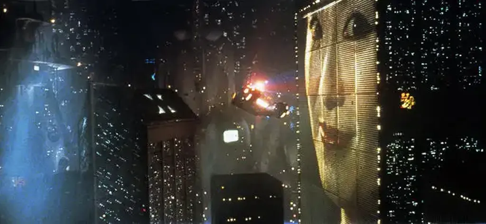

# Le courage de lire

Nous vivons un changement culturel profond, [peut-être le passage au post-alphabétique comme le raconte Hubert Guillaud](https://danslesalgorithmes.net/2025/12/09/vers-un-internet-post-alphabetique/), alors nous pouvons embrasser ce changement ou nous y opposer, ou tout au moins le façonner à notre convenance plutôt que d’être modelé par lui.

Je côtoie beaucoup de quasi non-lecteurs, notamment mes fils. Ils lisent pour leurs études, c’est déjà pas mal, mais presque rien en dehors, rien qui les arrache au flux des sollicitations numériques. D’autres amis n’ouvrent jamais de livre. Ils ignorent l’expérience du retrait intérieur. Ils se privent d’une expérience merveilleuse sans laquelle ma vie serait insipide. J’ai l’impression qu’ils ne mesure pas ce qu’ils manquent. Jeunes ou vieux, ils ont embrassé la culture numérique, parce qu’elle offre des récompenses immédiates (avant c’était la culture télévisuelle).

Beaucoup de mes copains cyclistes ne lisent pas alors qu’ils aiment l’effort physique, sont prêts à souffrir pour atteindre le sommet d’un col, mais lire un livre est au-delà de leur force. J’ai la trouille quand le physique devient plus simple que l’intellectuel, quand effectuer 200 km à vélo devient plus simple que lire un roman. Désormais les véritables champions lisent. Les lecteurs font tous les jours des exploits dont la plupart des prétendus champions sont souvent incapables (pas tous, heureusement).

Ce n’est pas neuf. L’effort intellectuel, cette simple possibilité de s’évader dans sa tête à l’aide de mots, de codes, de formules, de concepts, a toujours été plus exigeante que jouer de ses muscles, reste que je me sens humain parce que je suis capable de cet effort intellectuel et non de celui de pédaler durant des heures.

Paradoxe : quand je pédale, je gagne en endurance, et cette endurance est bénéfique à l’effort intellectuel. Ma machine humaine a besoin du sport pour être opérationnelle intellectuellement. Le sport m’aide à renforcer mon assise, il n’est pas une fin en soi, sauf quand il devient spectacle — c’est une autre affaire, ce dont beaucoup de sportifs du dimanche ne prennent pas conscience, persuadés que leurs performances sont spectaculaires alors qu’elles n’intéressent qu’eux — je serais beaucoup plus impressionné s’ils me parlaient avec enthousiasme de leurs lectures (certains le font).

### Le push et le pull

Vous devez vous demander où je veux en venir. J’avance à tâtons dans cette réflexion. Je devine une différence fondamentale entre la culture alphabétique et la culture numérique aujourd’hui promue. Dans un cas, on entre dans une bibliothèque ou une librairie, on saisit un livre et y plonge. Autrement dit on pêche l’information, on la tire à soi depuis sa source (*pull* en anglais).

Au contraire, la radio, la télévision et désormais les réseaux sociaux projettent vers nous un flot continu d’informations. Ils la poussent vers nous (*push* en anglais), sans que nous ne demandions rien, sans effort ou presque. Si le push entraîne la passivité, une forme de soumission, puisque les contenus sont choisis pour nous, le pull implique un choix, un acte délibéré de chercher l’information.

Le push n’est pas le propre des technologies électroniques. Si on choisit de lire un journal papier, on ne choisit pas quels articles y sont publiés. Ils s’imposent à nous. De même quand on entre dans un café, on ne choisit pas les conversations qui nous parviennent. Le push n’est pas une invention de la tech. Grâce à lui, nous pouvons être surpris et découvrir des choses nouvelles.

De même, le pull existe depuis toujours. Bien avant l’invention de l’écriture, on pouvait consulter les érudits, les prêtres ou les aèdes pour qu’ils partagent leur sagesse. Mais si le push devient le mode de communication majoritaire, si nous oublions d’aller piquer des livres dans les rayonnages des bibliothèques et des librairies, nous nous privons de la profondeur de pensée qui fait de nous des humains. C’est franchement inquiétant. Parce que sans le retrait en soi-même que permet la lecture, on peut prendre pour argent comptant les fables racontées par les imposteurs, les complotistes, les dictateurs en puissance. Sans le recul, nous sommes intellectuellement vulnérables.

J’en reviens à la métaphore sportive. Sans entraînement, un cycliste ne va pas loin. L’intellect est une sorte de muscle. Si nous ne l’entraînons pas, si nous ne l’aiguisons pas, nous sommes vulnérables. Et cette vulnérabilité me fait plus peur que de voir un cycliste essoufflé (pour beaucoup de jeunes, le vélo électrique s’apparente à un refus de l’effort même dans le sport).

Des copains cyclistes me disent parfois que je ne suis pas compétitif. Ils n’ont rien compris. Je suis intellectuellement ultracompétitif. Je pédale pour donner à mon corps la force de mener la bataille intellectuelle. Être lâché dans une montée ne me fait ni chaud ni froid. Je ne cherche même pas à rivaliser, préservant mes forces pour mes travaux intellectuels.

J’ai l’intuition que le sport, le sexe, la bonne bouffe, tous les plaisirs premiers s’apparentent au push. Au commencement, notre biologie nous les offre. Puis nous en cultivons certains, et alors la démarche devient du pull. Il m’arrive souvent de pédaler parce que si je ne pédale pas je serais moins bien durant les jours suivants. J’y vais à reculons même si presque toujours je finis par y trouver du plaisir. C’est comme avec les livres. Ils demandent souvent un effort, il faut y entrer, s’accoutumer à leur musique avant de l’apprécier.

Le push ne pose aucun problème quand il entraîne le pull. Malheureusement, nous inventons une société du push sans la finalité d’engendrer le pull. C’est du push pour le push, ni plus ni moins qu’un nouvel opium. Si je reçois des informations sans qu’elles me donnent envie d’en chercher d’autres ou de déclencher des actions dans ma vie, je n’y vois qu’une distraction. Je n’ai rien contre, mais quand tout le monde se vautre dans la distraction, nous basculons dans l’hédoniste, qui fini souvent en décadence (chute de l’Alexandrie hellénistique, chute de Rome…).

### Comment ne pas subir

En tant que citoyen de cette société du push omniprésent, qui me fait souvent penser à *Blade Runner*, je tente de résister avec trois stratégies menées en parallèle.

* **Aussi souvent que possible je pratique le pull.** Je choisis mes livres comme mes contenus numériques. Dans les deux cas, j’effectue une démarche plus indirecte qu’un simple clic sur un post social. Par exemple, je consulte les sites que j’apprécie, m’abonne à leur flux RSS ou leurs newsletters. 
* **Je me protège du push.** Je fréquente de moins en moins souvent les réseaux sociaux. Il m’arrive encore de me laisser piéger sur Mastodon, Substack ou YouTube, mais ma modération me permet d’être plus attentif aux contenus susceptibles d’éveiller ma curiosité. 
* **Je participe le moins possible au push.** J’alimente Mastodon et Substack à dose homéopathique, avec des signaux faibles. J’en viens à me dire que les créateurs soucieux de ne pas aggraver la société du push doivent poursuivre la discrétion. Publier oui, bien sûr, diffuser, c’est vital, mais sans roulements de tambour.

Je préfère être trouvé que me faire entendre. Mieux : je préfère que mes textes trouvent leur chemin vers mes lecteurs plutôt que parler de mes textes pour dire que je les ai écrits. Depuis que j’ai quitté Facebook, je ne vois plus les copains auteurs annoncer à longueur de journée leurs exploits. C’est un soulagement. Je ne supporte plus cette société où nous sommes devenus nos VRP. Si mes éditeurs, les libraires et mes lecteurs ne parlent pas de mes textes, c’est comme ça, je ne veux rien y changer. Mon travail est d’écrire les prochains textes, pas de me justifier de ceux déjà publiés.

J’aspire à une société de curieux, de chercheurs, de dénicheurs. Qu’un lecteur me trouve par hasard, ou au détour d’une autre lecture, je trouve ça plus formidable que s’il clique sur une publicité sociale, c’est-à-dire presque toujours une autopromotion. J’ai envie de me laisser trouver. J’aimerais que nous devenions des jardins secrets les uns pour les autres plutôt que nous balader à poil dans les rues.

J’en reviens à la métaphore sportive. Nous autres cyclistes, nous enregistrons nos sorties sur Strava. Et que fait Strava ? Du push de nos performances. Jamais celui qui a creusé le territoire pour y dénicher des parcours originaux n’est célébré. C’est toujours le quantitatif qui est mis en avant, jamais le qualitatif, l’original, l’inattendu. Le push d’une manière générale est vecteur de normalisation et pour en sortir il faut explorer, chercher ce qui se cache parfois sous nos yeux.

Mes plus belles explorations, Strava n’en parle pas. Les véritables cols hors catégorie se trouvent dans les livres, là où le pourcentage de la pente intellectuelle nous oblige à tout donner, sans assistance électrique. Là se cachent les sentiers non balisés (où personne n’a créé des segments pour comparer nos performances les uns par rapport aux autres).

Le courage de lire revient à freiner au milieu de la descente pour observer le paysage pendant que le peloton s’éloigne. Oser le silence face au vacarme, la lenteur face à l’immédiateté. Refuser d’être un simple terminal de consommation pour redevenir le souverain de son propre imaginaire. Lire, c’est un acte de dissidence invisible, sans dossard ni ligne d’arrivée. C’est la garantie de rester humains.

#netculture #y2025 #2025-12-18-18h00
