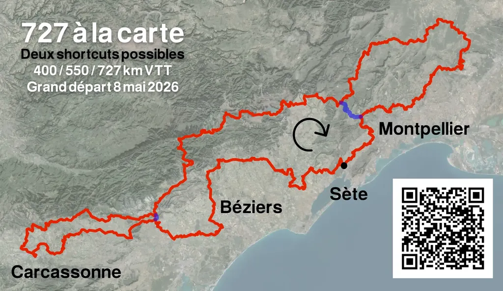
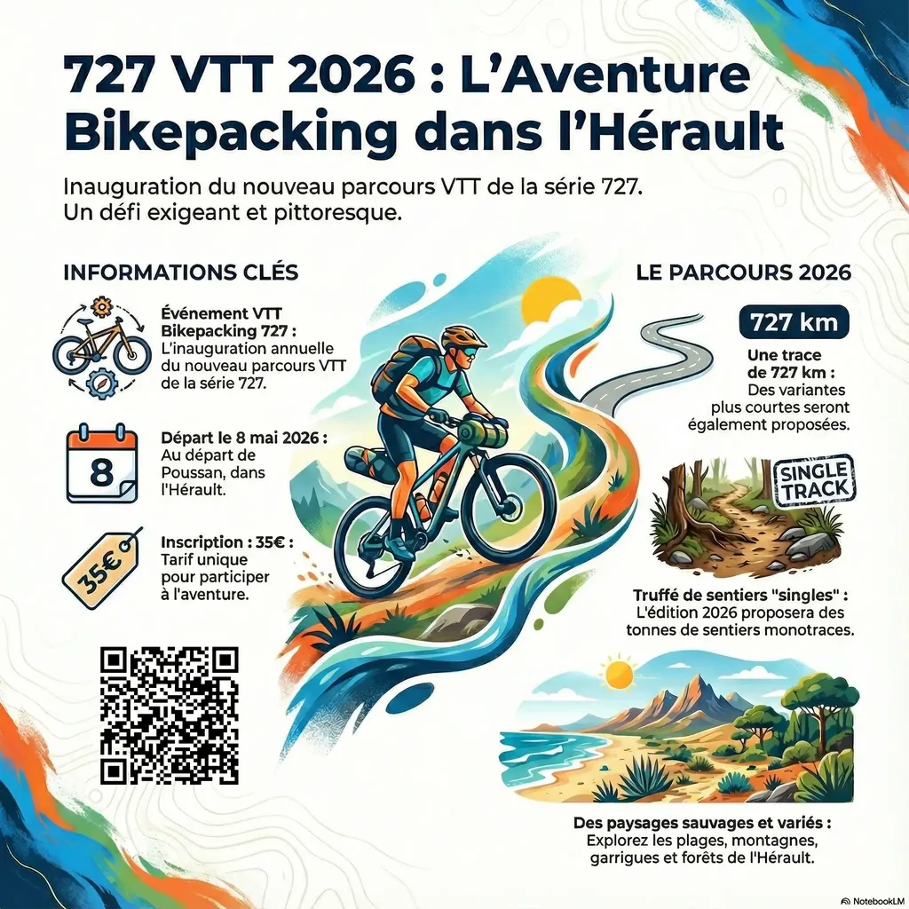
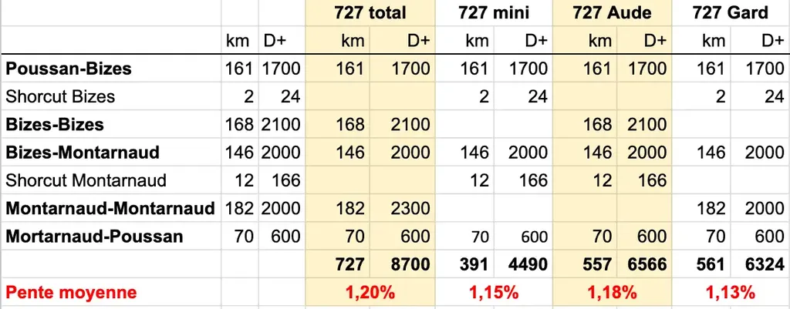

# Pour un bikepacking non masochiste : 727 VTT 2026

Je n’ai jamais été un adepte de la souffrance gratuite chère à beaucoup de cyclistes. J’ai toujours pratiqué le bikepacking pour le plaisir, loin de toute dimension compétitive. Nous avons tant de raisons de souffrir malgré nous pour ne pas nous imposer des souffrances inutiles (bien que certains prennent plaisir à emmerder leurs semblables).

En 1950, Bertrand Russell a supposé que [quatre désirs structuraient les comportements humains](https://www.themarginalian.org/2026/01/30/bertrand-russell-nobel-prize-acceptance-speech/).

- **Avidité** : le désir de posséder toujours plus, né de la peur et du manque, qui se renforce au lieu de s’apaiser quand on accumule des biens (des traces bikepacking extralongues, lontaines, avec dénivelés vertigineux…).

- **Rivalité** : le besoin de battre l’autre, parfois plus fort que l’intérêt matériel, au point que certains acceptent de s’appauvrir si cela ruine leurs rivaux (des événements compétitifs avec trackers, suivis en temps réel, souvent proposés sous couvert de sécurité pour contourner la législation française).

- **Vanité** : le « regardez-moi » de l’enfant comme du chef d’État, qui prend des formes multiples (bouffonnerie, quête de gloire, désir de reconnaissance posthume… KOM et autres couronnes stupides).​

- **Amour du pouvoir** : le plus puissant de tous les désirs selon Russell, proche de la vanité mais davantage tourné vers la capacité de faire faire aux autres ce qu’ils ne voudraient pas faire (le traceur pervers qui imagine des efforts à la limite du supportable pour les concurrents).​

Selon Russell, nous avons besoin d’exutoires non destructeurs pour ces désirs (pas sûr que certains événements bikepacking ne soient pas destructeurs de liens, de fraternité, d’humanité…). En première approximation, cette théorie conforte les masochistes, mais elle est caricaturale, surtout quand on se confronte à la maladie et ouvre les yeux sur le monde. Dans la pratique, [les scientifiques recensent 161 motivations humaines](https://journals.plos.org/plosone/article?id=10.1371%2Fjournal.pone.0172279) (2017), réparties en trois familles.

- Quête de sens, valeurs, moralité, spiritualité…
- Désirs de communion, relations, fraternité, amour…
- Désirs de comprendre, de réussite, de liberté d’action, de pouvoir, d’autonomie…

J’ai passé ma vie à me défaire des quatre désirs de Russell pour désirer passer plus de temps avec les autres, partager avec eux, les aimer, goûter les secondes comme si elles étaient les dernières. Les désirs de Russell sont toujours dans des perspectives lointaines, avec récompenses dues. Je n’imagine pas les 727 pour que vous vous vantiez de les boucler mais pour que vous les viviez avec bonheur dans l’instant.

La plupart des habitués des 727 m’ont dit que le g727 2025 était leur préféré. C’était aussi le moins escarpé. Quand on ne participe à pas à un événement pour en découdre, mais pour échanger, moins de difficultés autorise davantage de croisements et d’interactions. J’ai donc décidé de tracer un 727 2026 avec environ 8 000 m de dénivelé, soit 2 à 3 000 mètres de moins que les éditions précédentes, mais avec jusqu’à 150 km de plus pour le grand parcours. Terminé l’escalade d’une montagne juste pour aller chercher le single qui ramène en bas. On ne montera que quand le voyage l’imposera. Pour autant, dès que des singles joueurs se présenteront nous les enroulerons.

Le circuit de mai 2026 partira de Poussan, direction l’Aude et Carcassonne avant de revenir à traverser l’Hérault par sa latitude médiane jusqu’au Gard, au nord de Nîmes et de rentrer à Poussan via une orgie de singles.

* [Plus d’info sur le 727 2026, départ le 8 mai de Poussan.](https://727bikepacking.fr/727/)
* [Inscription sur Helloasso (35 €).](https://www.helloasso.com/associations/ec-poussan/evenements/727-2026-vtt-et-gravel)
* La trace sera publiée une semaine avant le départ.

*PS : Certains passages seront reconnus par des amis. Si vous voulez nous aider pour les recos les plus éloignées de Poussan, nous vous offrons la participation.*

#velo #727bikepacking #y2026 #2026-01-31-21h00
