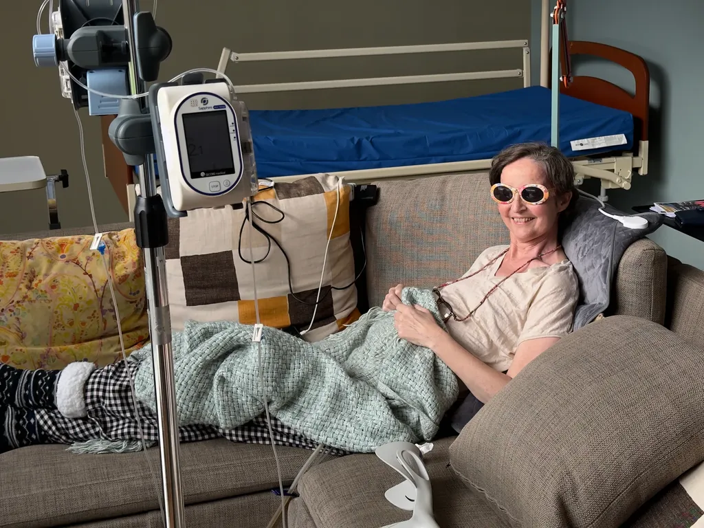

# C’était la vie

À 11 heures ce matin, un vendredi 13, Isa nous a quittés avec douceur et son tact habituel. Depuis samedi, elle s’éloignait peu à peu de nous, tout en restant combattante. Lundi matin, lors d’un de ses derniers moments de conscience, je lui ai dit combien je l’aimais. Elle m’a tendu les bras pour que je la serre dans les miens. Elle m’a chuchoté : « J’espère que tu m’aimeras toujours quand je serai guérie. » Jusqu’au bout elle s’est battue. En même temps, elle regardait la mort avec un flegme de moine bouddhiste. Elle a été admirable de bout en bout de sa maladie, de sa vie, supportant des souffrances inimaginables dans le but de garder l’esprit clair aussi longtemps que possible.

Je me préparais à son départ depuis des semaines, mais pas plus qu’elle je ne voulais y croire. Nous avons continué à vivre comme si nous avions l’éternité devant nous, parce que seule la vie mérite notre attention. Isa a souhaité passer ses derniers moments à la maison, face à l’étang. Durant deux semaines, nous avons cueilli des instants merveilleux, jusqu’aux dernières cuillérées de miel que j’ai réussi à lui donner la nuit dernière.

Isa m’a aidé à grandir en tant qu’homme, que père, qu’écrivain. Elle a fait d’Émile et Timothée des humains merveilleux. Pour nous, elle a été un phare, aussi pour ses proches et même ses simples connaissances. Elle avait un don d’écoute extraordinaire, une empathie rare, un respect de chacun bouleversant. À l’hôpital, les soignants venaient se confier à elle, alors qu’ils la savaient en phase terminale. Elle leur faisait du bien et ça la rendait heureuse. Elle ne manquait aucune occasion de donner du bonheur.

J’ai souvent parlé d’elle dans mes carnets et mes livres, dès *J’ai débranché* et beaucoup plus dans *Rush*. Elle était mon double, mon regard, ma vigie en même temps que ma boussole. J’ai perdu le nord tout en sachant que je continuerai d’honorer la vie pour l’honorer elle. J’ai tenu sa tête à deux mains jusqu’au bout, sa tête si bien faite, sa tête dont je suis tombé amoureux au début de 1999.

Isa sera enterrée mercredi 18, 14h, à [Montagnac-sur-Lède](https://fr.wikipedia.org/wiki/Montagnac-sur-L%C3%A8de), dans le Lot-et-Garonne, tout à côté de la maison de famille de Maillardou. Cérémonie civile en plein air et probablement sous la pluie. Nous nous réfugierons après dans la maison pour une célébrer Isa.

De samedi 14h à lundi 16h, son corps sera visible au funérarium de [Mireval](https://fr.wikipedia.org/wiki/Mireval) . Le cercueil sera ensuite fermé avant d’être transporté dans le Lot-et-Garonne.

Dans les semaines à venir, j’organiserai une fête pour rassembler ses amies et amis à la maison. Nous pourrons lui donner l’hommage qu’elle mérite.

Elle vous aimait.

Elle aimait la vie.

Je vous aime pour lui avoir rendu son amour au centuple.

*PS : Je partage ce texte parce que mes lecteurs fidèles connaissent Isa. Je n’ai pas fini de parler d’elle. Elle continuera de vivre en nous.*

#autobiographie #y2026 #2026-02-13-20h00
