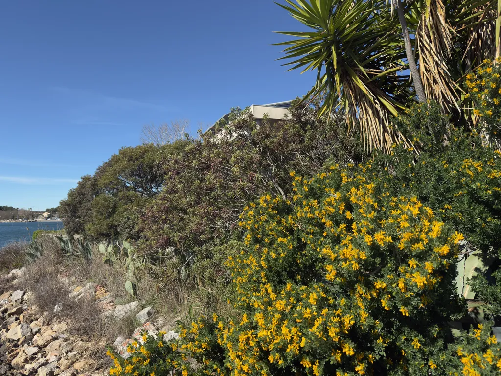

# De ma terrasse #45

_Ma sélection du dimanche : **17** liens et une photo prise depuis ma terrasse._

L’année dernière, un an jour pour jour, Isa me suggérait de publier tous les dimanches cette newsletter. Depuis plus de vingt ans, nous nous partagions nos lectures, et elle trouvait dommage que je ne les partage pas avec vous. Pour elle, je tenterai de poursuivre, même si le cœur ni est pas, même si écrire ces quelques mots me demande un effort surhumain.

## Nature et environnement

[Des milliers d’années de mystère résolu : d’où viennent les anguilles ?](https://www.discoverwildlife.com/animal-facts/fish/eel-reproduction-mystery) • EN • 7 min  
Les anguilles traversent l’Atlantique pour se reproduire dans la mer des Sargasses, une migration enfin confirmée en 2022 grâce à des balises satellites. Cette énigme fascinait Aristote et Freud, qui n’avaient trouvé aucun organe reproducteur chez ces créatures. (Et a bercé mon enfance puisque mon père était pêcheur d’anguilles.)

[Les forêts boréales se déplacent vers le nord, révèlent les images satellites](https://futurism.com/science-energy/forests-shifting-north) • EN • 4 min  
Entre 1985 et 2020, les forêts boréales ont progressé de 0,29 degré de latitude moyenne vers le nord tout en augmentant leur surface de 12 %. Ce phénomène permet de séquestrer davantage de carbone, mais les feux de forêt et les sécheresses pourraient annuler ces bénéfices.

[La Chine transforme le désert du Taklamakan en puits de carbone](https://www.livescience.com/planet-earth/plants/china-has-planted-so-many-trees-around-the-taklamakan-desert-that-its-turned-this-biological-void-into-a-carbon-sink) • EN • 5 min  
Le projet de Grande Muraille verte, lancé en 1978, a permis de planter plus de 66 milliards d’arbres autour du désert. La végétation absorbe désormais plus de dioxyde de carbone qu’elle n’en émet, selon les données satellites.

## Sciences et technologies

[Un minuscule carré de verre pourrait stocker deux millions de livres pendant 10 000 ans](https://www.sciencealert.com/this-tiny-glass-square-could-store-2-million-books-of-data-for-10000-years) • EN • 6 min  
Le système Silica de Microsoft utilise des impulsions laser ultracourtes pour graver des données dans le verre avec une densité de 1,59 gigabit par millimètre cube. Le premier système complet intégrant écriture, lecture et correction d’erreurs promet une durée de conservation exceptionnelle.

[Un médicament contre le diabète lié à une longévité exceptionnelle chez les femmes](https://www.sciencealert.com/common-diabetes-drug-linked-with-exceptional-longevity-in-women) • EN • 4 min  
La metformine réduit de 30 % le risque de décès avant 90 ans comparée à la sulfonylurée, selon une étude portant sur 438 femmes ménopausées. Le médicament cible plusieurs mécanismes du vieillissement et limite les dommages à l’ADN.

[Des scientifiques ont observé des particules dans une autre dimension](https://www.popularmechanics.com/science/a70260118/1d-anyons/) • EN • 5 min  
Les anyons unidimensionnels ont été identifiés dans un système où les particules peuvent être ajustées entre fermions et bosons. Ces quasiparticules ouvrent une nouvelle fenêtre sur la physique quantique fondamentale.

[Des gènes précèdent notre ancêtre commun](https://www.sciencealert.com/all-life-on-earth-shares-an-ancestor-and-some-of-our-genes-predate-it) • EN • 5 min  
Certains gènes de LUCA, notre dernier ancêtre universel, proviennent d’organismes encore plus anciens. Les paralogs universels révèlent une histoire pré-LUCA où les enzymes incorporaient déjà des acides aminés dans les protéines.

[Un coup de chance chimique a rendu la Terre habitable](https://www.space.com/space-exploration/search-for-life/life-on-earth-is-lucky-a-rare-chemical-fluke-may-have-made-our-planet-habitable) • EN • 5 min  
La Terre s’est formée dans une zone Boucle d’Or chimique où l’oxygène était juste assez présent pour retenir le phosphore et l’azote en surface. Mars, par contraste, présente trop de phosphore mais pas assez d’azote.

[Votre cerveau est l’architecte secret de l’univers](https://scienceinhand.com/your-brain-is-the-secret-designer-of-the-universe-and-heres-the-mind-blowing-way-your-consciousness-shapes-reality-2/) • EN • 15 min  
La conscience émerge du traitement sensoriel plutôt que du raisonnement, selon une étude menée dans six laboratoires. Le cerveau construit la réalité par des prédictions continuellement ajustées, créant une hallucination contrôlée.

## Culture

[Treize chansons qui ont créé des genres musicaux entiers](https://www.classical-music.com/rock/songs-created-new-genres) • EN • 8 min  
De ’Rock Around the Clock’ à ’Smells Like Teen Spirit’, certains morceaux ont redessiné la carte musicale. Chacun combine innovation et timing parfait, devenant le Big Bang de mondes sonores entiers.

[Les huit secrets narratifs des écrivains pulp](https://nofilmschool.com/storytelling-secrets-from-pulp-writers) • EN • 6 min  
Les magazines pulp du début du XXe siècle ont donné naissance à des maîtres du page-turner. Dashiell Hammett excellait dans les répliques cinglantes, tandis que Max Brand créait des ouvertures épiques qui rendaient la lecture irrésistible.

[Les réseaux sociaux sont-ils terminés pour les créatifs ?](https://www.creativeboom.com/insight/is-social-media-over-for-creatives-or-are-we-just-waking-up-to-what-it-is/) • EN • 7 min  
Un post réussi atteint désormais 10 % des abonnés, contre 100 % autrefois. Les créatifs abandonnent les plateformes ou réduisent leur engagement, revenant aux relations directes et aux newsletters. (C’est une évidence mais beaucoup ne l’ont pas encore compris.)

## Intelligence artificielle

[De Descartes au deep learning : les mathématiques de la pensée](https://nextbigideaclub.com/magazine/descartes-deep-learning-mathematics-thought-bookbite/59021/) • EN • 6 min  
Les philosophes des Lumières voulaient décrire l’esprit par les mathématiques comme ils l’avaient fait pour le monde physique. Les réseaux neuronaux modernes donnent des réponses à nos questions les plus profondes sur l’intelligence humaine.

[Les modèles d’IA les plus avancés échouent aux tests de logique de base](https://www.popularmechanics.com/science/a70328740/ai-fatal-flaw/) • EN • 8 min  
Une étude de Stanford, Cal Tech et Carleton démontre que les grands modèles de langage accumulent les erreurs de raisonnement. Ils ne possèdent ni les fonctions exécutives ni l’intuition qui aident les humains à réussir.

[Après le battage médiatique, OpenClaw déçoit les experts](https://techcrunch.com/2026/02/16/after-all-the-hype-some-ai-experts-dont-think-openclaw-is-all-that-exciting/) • EN • 7 min  
L’agent OpenClaw n’apporte aucune nouveauté scientifique, juste une organisation astucieuse de composants existants. Les vulnérabilités de sécurité inhérentes aux agents autonomes limitent leur utilisation dans le monde réel.

[L’empire finit toujours par tomber](https://www.joanwestenberg.com/the-empire-always-falls/) • EN • 7 min  
Les entreprises d’IA actuelles sont traitées comme des institutions permanentes, mais l’histoire montre que les systèmes dominants produisent les conditions de leur propre destruction. La confiance dans l’inévitabilité de l’AGI reflète les erreurs des empires passés.

[Une romancière se vante de produire un livre en 45 minutes avec l’IA](https://futurism.com/artificial-intelligence/ai-novelist) • EN • 5 min  
Coral Hart a publié plus de 200 romans sentimentaux l’an dernier sous 21 pseudonymes grâce à Claude. Elle enseigne désormais à 1 600 personnes comment contourner les garde-fous des chatbots, mais refuse d’utiliser son vrai nom.

#digest #y2026 #2026-2-22-17h00
