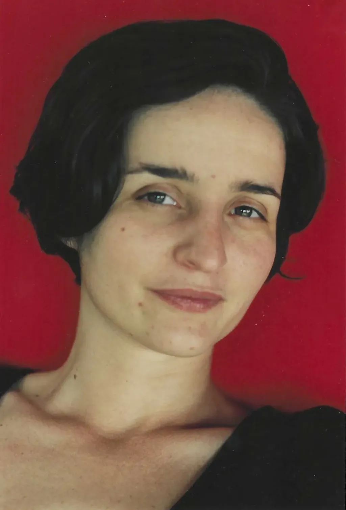
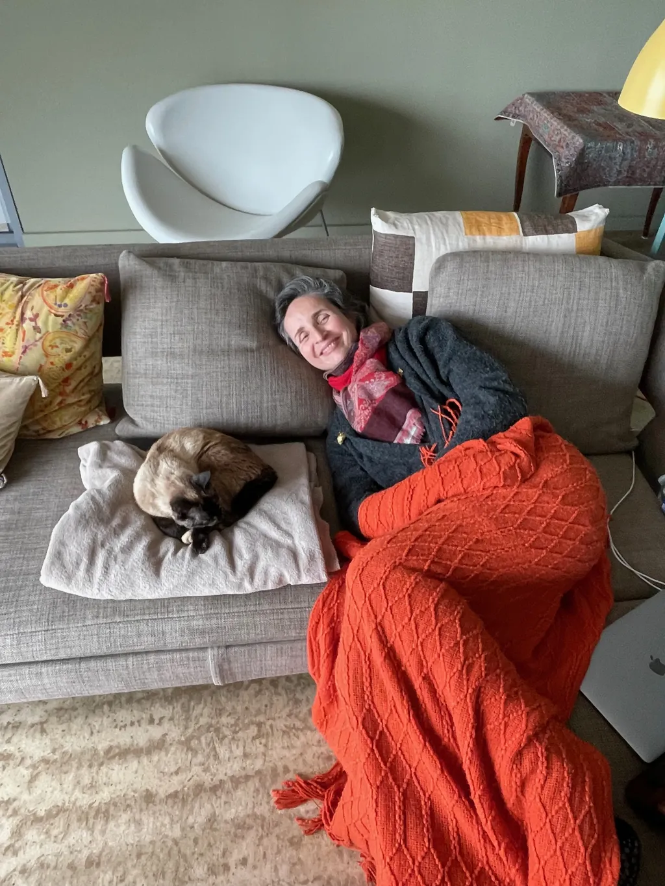
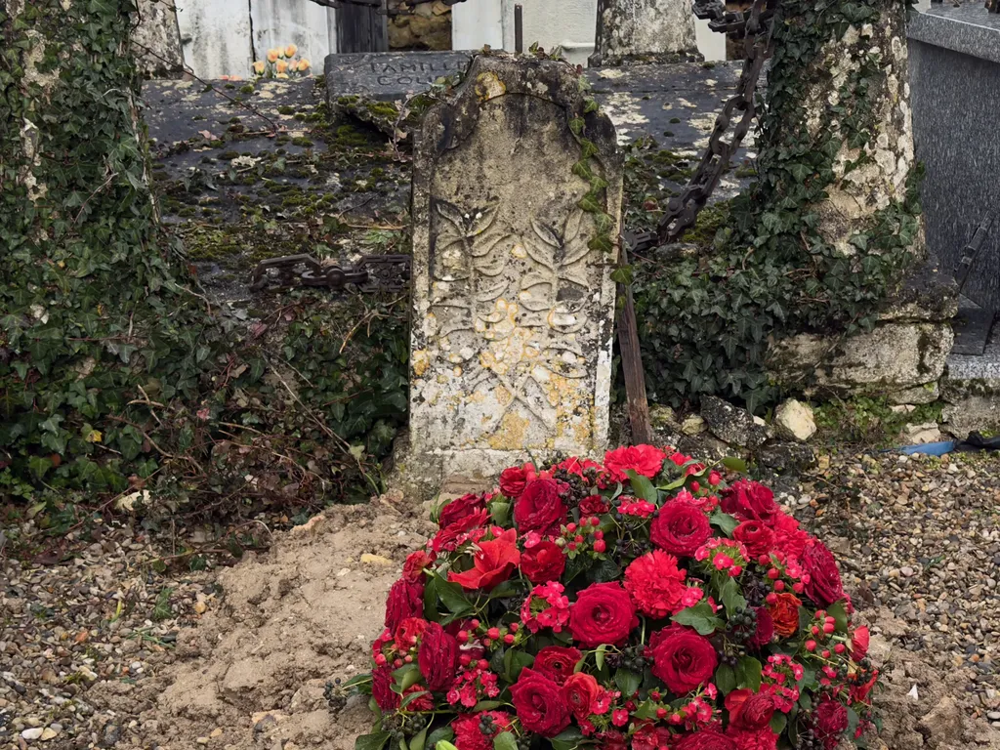
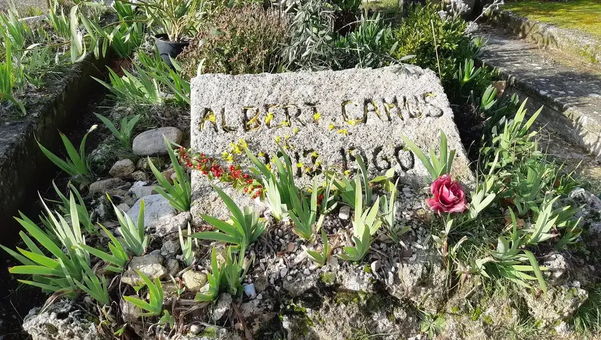

# Isa, d’en elle en nous

Hier soir, seul dans notre grande maison pour la première fois depuis [la mort d’Isa](https://tcrouzet.com/2026/02/13/cetait-la-vie/), après des heures à regarder des photos et me perdre dans les souvenirs, je me suis couché tremblant de froid alors qu’il ne faisait pas froid. J’ai lu quelques lignes de *Sagesse* de Verlaine et un passage m’a semblé parler d’Isa.

>« Je suis le cœur de la vertu,  
Je suis l’âme de la sagesse,  
Mon nom brûle l’Enfer têtu,  
« Je suis la douceur qui redresse,  
J’aime tous et n’accuse aucun,  
Mon nom, seul, se nomme promesse.

Plus loin :

>Je ne me souviens plus que du mal que j’ai fait.

Qu’est-ce que j’ai raté ? Qu’est-ce que j’aurais dû mieux faire ? Pourquoi j’ai dit ça ou ça au lieu de me contenter de la prendre dans mes bras ? Pourquoi trop souvent je me suis énervé ? Pourquoi je ne lui ai pas davantage prouvé mon amour ? Pourquoi je ne lui ai pas crié que je la trouvais belle ? Je ne cesse de me répéter ces questions.

J’aimerais pouvoir me plaindre des occasions confisquées par sa mort prématurée. Quand je vois des salopards comme Trump ou Poutine, du haut de leur vieillesse pourrie, infester le monde, j’ai la démonstration de son absurdité. Isa, qui n’était que douceur et compassion, est morte et ces vieux dégueulasses continuent de clamer leurs horreurs comme s’ils étaient immortels. Je suis révolté ; Isa ne m’aimait pas dans ces moments. Elle m’aurait dit : « Qu’est-ce que nous pouvons faire pour que le monde se porte mieux ? » Je ne sais pas faire grand-chose d’autre que partager mes pensées. J’ai peur qu’elles vous accablent.

Lors de l’enterrement, le 18 février à Montagnac-sur-Lède, il devait pleuvoir et il a fait grand bleu. La famille et les amis s’étaient rassemblés sur le tertre à la proue du village, derrière l’église jaune, dans le petit cimetière en surplomb de la vallée de la Lède. Dans la douceur printanière, nous nous sommes serrés autour du cercueil déposé devant la concession choisie par Isa en octobre 2020, parce qu’une stèle gravée de deux rameaux entrecroisés y évoque un laurier ou un olivier. Je me suis placé entre le cercueil et la concession. J’ai demandé aux enfants de venir près de moi. J’ai bidouillé des mots maladroits, voulus positifs, tendus vers l’avenir comme Isa l’aurait souhaité.

Il n’était pas encore temps pour moi d’honorer la vie d’Isa et son courage. Je n’avais pas préparé une oraison funèbre à la Bossuet ni une phrase emblématique « parce que c’était elle, parce que c’était moi », j’avais simplement tourné des choses à dire qui me paraissaient importantes pour notre avenir, celui des enfants en particulier.

J’entends Isa me dire : « Tu as été très bien, tu as fait ce qu’il fallait comme je le souhaitais, simplement, avec la sobriété à laquelle j’étais attachée. » Je regrette néanmoins de ne pas avoir été assez digne, assez clair, alors je vais tenter d’écrire ce que j’aurais pu mieux dire. Mes mains ne cessaient de toucher le bois verni du cercueil où une plaque indiquait « Isabelle Crouzet, née Polu, 1970-2026 ».

---

Merci d’être là si nombreux par cette belle après-midi après des semaines de tant de pluie. Pour Isa, les liens entre nous comptaient plus que tout, liens du sang ou non. À ses yeux, ils étaient une façon de nous connecter, et je crois de nous immortaliser dans les autres.

Isa croyait à une forme de survivance de l’âme par diffusion à travers ceux auxquels elle était connectée. Voilà pourquoi elle aimait autant lire, consciente de propager des morceaux d’humanité en se baignant dans d’autres vies, réelles ou imaginaires. Voilà aussi pourquoi notre cérémonie, même si elle se déroule près d’une église, ne se revendique d’aucunes. Isa ne goûtait guère les institutions religieuses.

Pour autant, elle attachait beaucoup d’importance aux rituels. En 2023, alors que son cancer la rongeait sans que nous le sachions encore, sa maman a fait une embolie pulmonaire. Isa aimait s’arrêter dans les églises allumer des cierges, non pour implorer Dieu, mais pour convoquer les forces qui nous interconnectent et nous renforcent. Le plus souvent, je l’attendais dehors, mais hier, en route vers ici, nous avons allumé pour elle des bougies dans l’abbatiale de Moissac, comme je l’avais fait avec elle une fois. Sa spiritualité était simple, évidente.

Encore merci d’être là. J’espère que nous réussirons à irriguer les liens qui nous rassemblent. Émile, Timothée et moi venions dans le Lot-et-Garonne aussi souvent que possible et j’espère que nous continuerons de le faire, mais nous ne le ferons que si le réseau des amis et de la famille nous y invite.

Isa était attachée à la région. Hier, après Moissac, en approchant de notre maison de Maillardou, je me suis senti de plus en plus triste. Je revoyais Isa assise dans la voiture près de moi. Son visage se détendait. Elle nous racontait ses souvenirs d’enfance. Elle ouvrait sa fenêtre pour respirer l’air de sa terre de cœur. Elle a toujours voulu y reposer. Elle me l’a toujours dit. Je n’ai jamais pensé que j’assisterais à son enterrement.

Un de ses souhaits de malade était de revenir ici, mais depuis deux ans le moindre trajet en voiture était une torture. Son cancer lui a très vite pourri la vie. Heureusement, elle était aussi bien que possible à la maison, face à l’étang de Thau, avec les Pyrénées enneigées à l’horizon.

Début janvier, quand les oncologues ont décidé d’arrêter les traitements et de ne pas s’acharner, Isa a choisi de rentrer chez nous, non sans que je lui jure que c’était aussi ce que je désirais. Il n’a jamais été question de rentrer pour finir sa vie. Dans ses dernières semaines, elle n’a jamais évoqué la perspective de ne pas guérir. Pour elle, la vie d’après était en nous tous, pas dans une autre réalité : elle a donc vécu jusqu’au bout dans l’idée de partager, et nous avons connu de grands bonheurs durant ses derniers moments de lucidité.

Je la revois manger avec délectation une endive braisée accompagnée d’une bouchée de cabillaud. Une semaine avant sa mort, elle m’a demandé des frites. C’était comme si elle se donnait enfin le droit de jouir de la vie sans plus aucune retenue. Son dernier mardi, elle m’a dit avec une autorité dont elle n’usait jamais quand elle était elle-même : « De la glace ? » Moi : « Tu as chaud ? » Elle : « Mais non, de la glace. » Moi : « Tu veux manger de la glace ? » Elle : « Oui », un oui ferme, péremptoire. J’ai réussi à lui faire déguster trois cuillères de glace à la vanille.

Nous l’avons veillée jusqu’au bout. Elle est morte paisiblement entre nos bras par un matin pluvieux. Je n’ai qu’un souhait, qu’une demande : que nous continuions à la faire vivre à travers nous, et même à travers ceux qui n’ont pas eu la chance de la connaître.

---

J’ai ensuite donné la parole à sa maman, à ses sœurs, à ses proches, et les enfants ont répété l’importance des liens, exprimé combien ceux qui les rattachent au Lot-et-Garonne restent fragiles. J’ai saisi une poignée de glaise, l’ai jetée en premier sur le cercueil déposé au fond de la tombe. Une pierre a cogné sur le couvercle, puis je me suis éloigné. J’aurais pu mieux faire, prolonger le recueillement. Isa me voulait parfait, non qu’elle soit parfaite elle-même, mais pour me faire grandir et grandir avec moi. Il me reste beaucoup de chemin à parcourir pour m’élever à sa hauteur.

Le lendemain, avant de regagner le Midi, nous sommes revenus devant la tombe. Très simple, une petite motte de terre, avec des fleurs trop vives au goût d’Isa. J’avais pensé commander une pierre tombale minimaliste et puis notre amie Ariane m’a montré la tombe de Camus : j’ai compris que c’est exactement ce qu’Isa aurait désiré.

J’aimerais longtemps encore parler d’elle, et je le ferai plus longuement, plus tard. Ces mots sont les premiers articulés que j’écris depuis sa mort. Je ne suis pas redevenu l’écrivain qu’elle critiquait sévèrement. Je ne sais même pas qui sera celui que je deviendrai. Je suis comme les enfants au bord d’une nouvelle vie, chargé d’un lourd passé.

J’en arrive au point où je cherche un titre pour ce texte et prends conscience que « Au revoir Isa » comme « Adieu Isa » ne conviennent pas. Je ne la reverrai pas, aucun dieu ne l’a recueillie. En anglais, ce n’est pas mieux : « goodbye » vient de « God be with ye ». Nos formules présupposent une continuation de l’existence (porte-toi bien, repose en paix…) ou une transcendance divine (adieu, goodbye…). Le vide qui se creuse dans ma vie se creuse aussi dans la langue. Même le « ashes to ashes » des stoïciens ne convient pas, puisqu’Isa continuera de vivre en nous tant que nous vivrons.

Son testament, écrit après sa première chimiothérapie en juin 2024, se termine par : « J’ai cessé de vivre, j’ai cessé de souffrir, mais je ne cesserai jamais de vous aimer. » Émile : « Et si elle croyait à quelque chose ? » Nous en avons beaucoup discuté tous les trois, avant de conclure qu’elle ne cessera jamais de nous aimer en nous et entre nous. Sa présence en nous veillera sur nous, tout en étant une exigence. Libre à chacun d’interpréter ses mots selon ses croyances.

*PS : Isa était blessée quand j’oubliais son anniversaire. Les anniversaires comme les fêtes de fin d’année étaient pour elle des rituels importants. En moi, je l’entends rire aux éclats. J’ai décidé de rassembler ses amies et ses proches, de près ou de loin, le samedi 6 juin prochain à la maison. Isa aurait eu 56 ans. Nous parlerons d’elle, tresserons des liens, partagerons ses vêtements pour que chacun puisse de temps à autre porter un bout d’elle.*

#autobiographie #y2026 #2026-02-28-13h00
