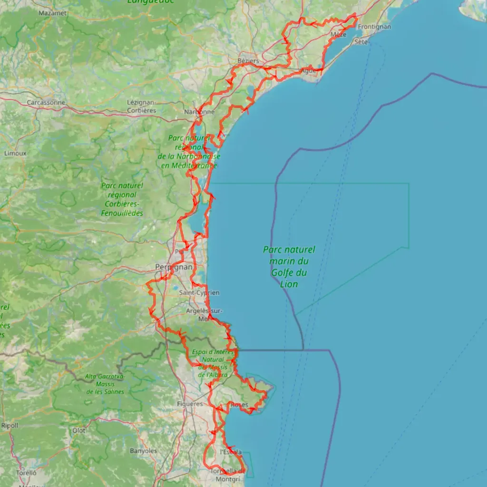
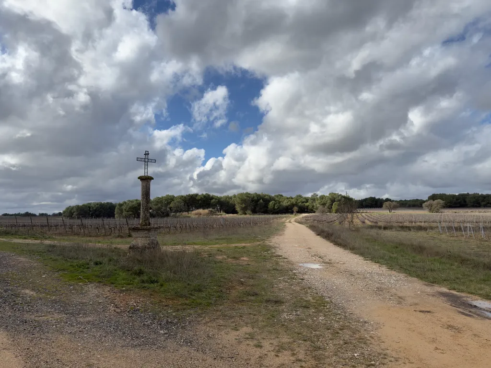
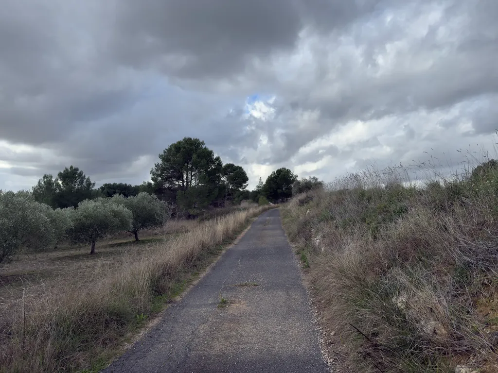
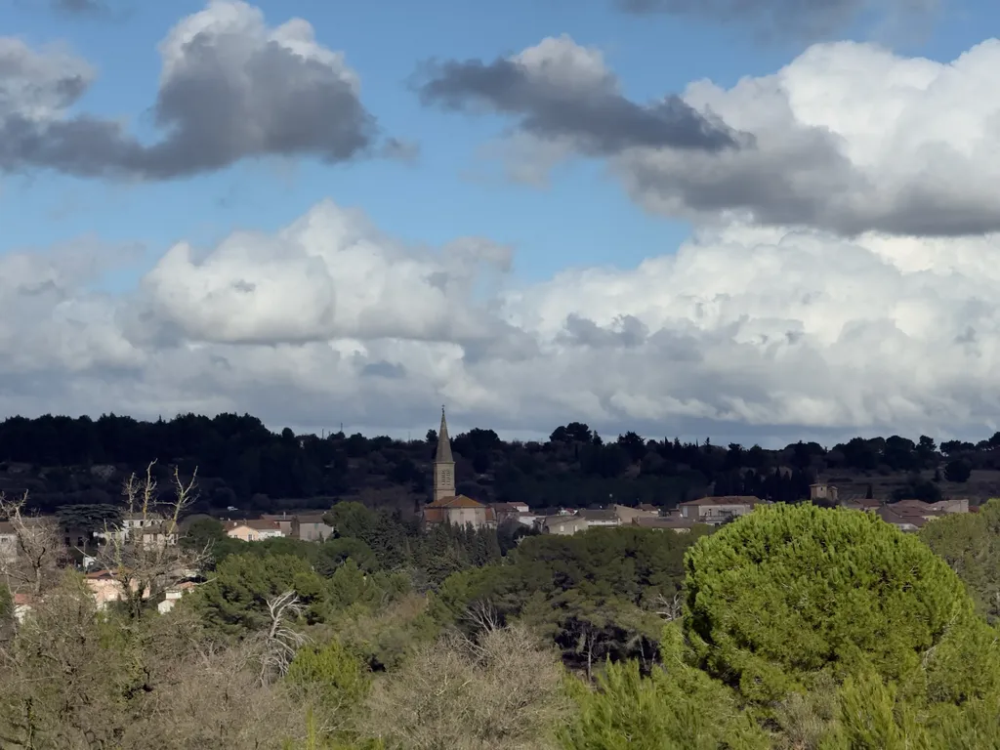
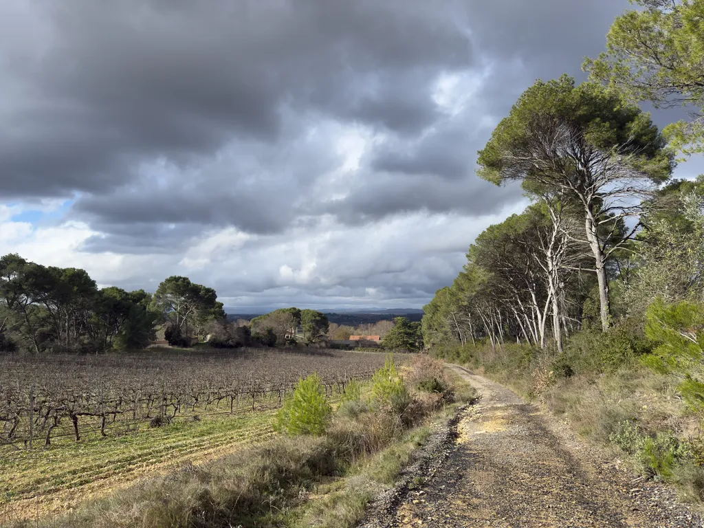
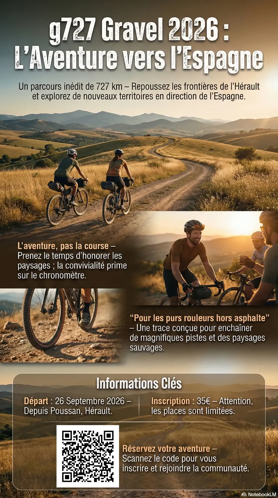
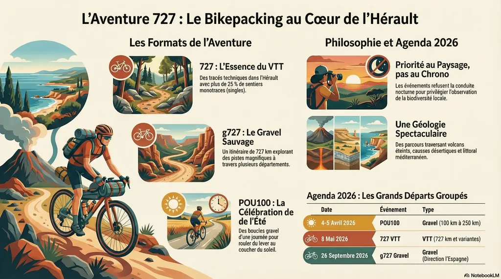

# g727 2026 : direction l’Espagne

Je veille Isa et n’ai la force que de poser des points sur une carte, alors je trace. C’est ma méditation. Les nouveaux segments me font voyager et je pense à vous qui aurez du bonheur à suivre les chemins. [Après avoir esquissé le 727 VTT de mai](https://tcrouzet.com/2026/01/31/727-2026/), voici un aperçu du [g727 de fin septembre](https://727bikepacking.fr/g727-Grand-Depart/).

Quelques recos à prévoir entre Fitou et les Pyrénées. Avec le club, nous connaissons le côté espagnol, où nous retournons quatre jours fin mars. J’ai sinon souvent roulé le retour par le littoral. Je ne proposerai des variantes qu’à la demande. Les traces aller et retour étant proches, il sera facile de réduire les distances, si nécessaire. Au total, pas plus de 7 000 m de dénivelé positif pour 727 km.

J’ai profité d’une douce après-midi pour me dégourdir les jambes sur le départ. Voici quelques photos.

* [Inscription au g727 2026 (35 €).](https://www.helloasso.com/associations/ec-poussan/evenements/g727-2026)
* [Présentation du g727.](https://727bikepacking.fr/g727/)
* [N’oubliez pas le POU100 gravel des 4 et 5 avril.](https://727bikepacking.fr/pou100/). Une centaine d’inscrits pour le moment, beaucoup moins que l’année dernière à la même date, preuve que la promotion sur les réseaux sociaux était efficace (et aussi preuve que nous passons trop de temps dans ces lieux de manipulation de masse — je ne regrette pas d’en être parti).

#velo #727bikepacking #y2026 #2026-02-04-12h00
